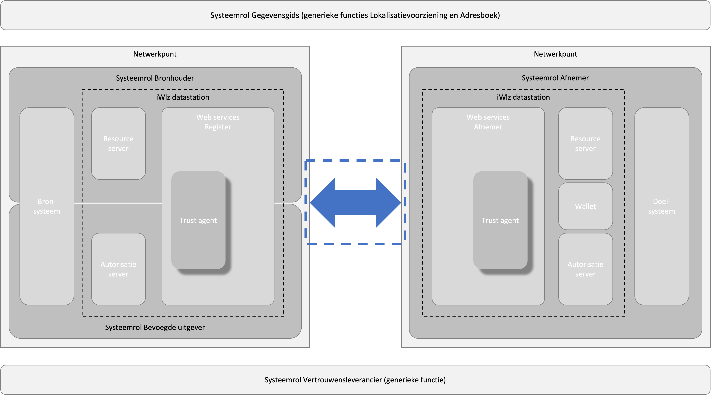

# RFC0001 - Certificaatstructuur veilige verbinging

**SAMENVATTING**

Deze RFC beschrijft welke certificaten binnen het iWlz-netwerkmodel worden gebruikt voor het creëren van een beveiligde verbinding tussen netwerkpunten, door middel van authenticatie en versleuteling.

Naast het gebruik van certificaten voor een veilige verbinding maakt het iWlz-netwerkmodel voor ondertekenings- en validatiebewerkingen gebruik van een combinatie van Decentralized Identifiers, certificaten en Verifiable Credentials.



**Status RFC**

Volg deze [link](https://github.com/iStandaarden/..) om de actuele status van deze RFC te bekijken.

---
**Inhoudsopgave**
- [RFC0001 - Certificaatstructuur veilige verbinging](#rfc0001---certificaatstructuur-veilige-verbinging)
- [1. Inleiding](#1-inleiding)
  - [1.1. Uitgangspunten](#11-uitgangspunten)
- [2. Terminologie](#2-terminologie)
- [3. Certificaatautoriteiten PKIoverheid of VECOZO](#3-certificaatautoriteiten-pkioverheid-of-vecozo)
  - [3.1 Vertrouwensketen van de certificeringsinstantie](#31-vertrouwensketen-van-de-certificeringsinstantie)
    - [3.1.1 PKIoverheid](#311-pkioverheid)
    - [3.1.2 VECOZO](#312-vecozo)
  - [3.2 CRL](#32-crl)
- [4. Testen en ontwikkelen](#4-testen-en-ontwikkelen)
- [5. Beheer van privésleutels](#5-beheer-van-privésleutels)
- [6. Acceptatie van verbindingsaanvragen](#6-acceptatie-van-verbindingsaanvragen)
- [7. TLS-protocollen](#7-tls-protocollen)

---
# 1. Inleiding
In een beveiligd netwerk spelen certificaten een belangrijke rol. Certificaten zijn vereist om een ​​TLS-verbinding tussen de netwerkpunten in het iWlz-netwerkmodel tot stand te brengen en bieden een mechanisme om de authenticiteit en integriteit van gepubliceerde gegevens vast te stellen.

Als het om certificaten gaat, willen we graag een balans vinden tussen bruikbaarheid en veiligheid. Alle administratieve acties met betrekking tot sleutels moeten eenvoudig en logisch zijn voor de beheerder, maar moeten toch voldoen aan de nieuwste beveiligingsstandaarden. Een uitgebreide certificaatboomstructuur kan alle vereisten omvatten, maar is te complex om te begrijpen en kan leiden tot menselijke fouten, wat kan leiden tot beveiligingsproblemen. Naast het ondersteunen van de productie-use-case, willen we het ook makkelijker maken voor ontwikkeling en demonstraties, dus willen we een oplossing kiezen die een breed scala aan tools en/of scripting ondersteunt.


## 1.1. Uitgangspunten
>```uitgangspunten```  

# 2. Terminologie
Opsomming van de in dit document gebruikte termen.

| Terminologie | Omschrijving |
| :-------- | :-------- | 
| CA | Certificaatautoriteit zoals gedefinieerd door [RFC2459](https://tools.ietf.org/html/rfc2459) | 
| CPS | [Certification Practise Statement](https://en.wikipedia.org/wiki/Certification_Practice_Statement) | 
| CRL | [Certificatie Revocation List](https://en.wikipedia.org/wiki/Certificate_revocation_list) | 
| Netwerkpunt-operator | een organisatie die een netwerkpunt beheert. In het iWlz-netwerkmodel een leverancier die software levert aan een deelnemer. | 
| PKI | Public Key Infrastructure.  | 
| PKIoverheid | De door de Nederlandse overheid beheerde PKI-structuur | 
| TSP | Trusted Service Provider. Partij die PKIo-certificaten kan uitgeven | 

# 3. Certificaatautoriteiten PKIoverheid of VECOZO
In deze RFC is gekozen voor PKIoverheid en VECOZO als toegestane certificaatautoriteiten voor het het uitgeven van certificaten ten behoeve van kanaalversleuteling tussen de netwerkpunten in het iWlz-netwerkmodel. 

De CA-boom PKIoverheid wordt algemeen vertrouwd en breed ondersteund. Zo zijn er meerdere leveranciers die een certificaat kunnen uitgeven. Daarnaast is het gebruik van deze CA-boom een generieke oplossing aangezien deze CA-boom al voor verschillende andere zorgtoepassingen wordt gebruikt.

De CA-boom VECOZO wordt vertrouwd en breed ondersteund binnen het iWlz-proces. VECOZO is de enige leveranciers die een certificaat kan uitgeven

Het is verplicht om een PKIoverheid of VECOZO TLS-certificaat te gebruiken om de verbindingen tussen netwerkpunten te beveiligen. Netwerkpunten mogen geen ander certificaat accepteren dan een PKIoverheid-certificaat of VECOZO-certificaat. Dit zorgt voor een veilige communicatie tussen de netwerkpunten en vermindert het risico op beveiligingslekken.

Het PKIoverheid-certificaat of VECOZO-certificaat is verplicht om te gebruiken als zowel een server- als een clientcertificaat in een wederzijdse TLS-verbinding. Dit betekent dat zowel de server als de client een certificaat moeten hebben en dat ze elkaars certificaat moeten valideren tijdens het opzetten van de verbinding via TLS. Dit verhoogt de veiligheid van de communicatie tussen de server en de client.

## 3.1 Vertrouwensketen van de certificeringsinstantie
Een netwerkpunt moet de juiste CA-boom configureren zodat andere netwerkpunten verbinding kunnen maken. 

### 3.1.1 PKIoverheid
Het te configureren certificaat is het **Staat der Nederlanden Private Root CA G1** rootcertificaat en de **Staat der Nederlanden Private Services CA – G1 CA**. Alle certificaten zijn te downloaden van de website van [PKIoverheid](https://cert.pkioverheid.nl/cert-pkioverheid-nl.htm).

Trusted Service Providers (TSP's) zijn verantwoordelijk voor het ondertekenen van certificaten. De TSP's hebben hun eigen CA. Om alle PKIo-certificaten te vertrouwen, MOET alle software die een certificaat en zijn keten valideert, elke tussenliggende CA onder de **Staat der Nederlanden Private Services CA – G1 CA** vertrouwen.

>Nota Bene: De PKIoverheid private services CA wordt niet standaard geaccepteerd door browsers en besturingssystemen.

### 3.1.2 VECOZO
Het te configureren certificaat is het **XXX** rootcertificaat en de **YYY CA**. Alle certificaten zijn te downloaden van de website van ZZZ.

VECOZO is als Trusted Service Provider verantwoordelijk voor het ondertekenen van certificaten. De TSP heeft zijn eigen CA. Om alle VECOZO-certificaten te vertrouwen, MOET alle software die een certificaat en zijn keten valideert, elke tussenliggende CA onder de **YYY CA** vertrouwen.

>Nota Bene: De YYY CA wordt niet standaard geaccepteerd door browsers en besturingssystemen.

## 3.2 CRL
De Certificate Revocation Lists voor PKIoverheid-certificaten worden bijgehouden door de verschillende TSP's. De CRL’s in ieder netwerkpunt MOETEN minimaal 1 keer per uur worden geüpdatet. Hierdoor duurt het verwerken op alle netwerkpunten bij een intrekking van een certificaat maximaal 1 uur.

# 4. Testen en ontwikkelen
Het gebruik van PKIoverheid- of VECOZO-certificaten is mogelijk minder geschikt voor testen en ontwikkelen. De PKIoverheid-certificaten kunnen relatief duur zijn voor kleine organisaties en privésleutels mogen niet worden gedeeld tussen ontwikkelaars of testservers. Daarom MOET een netwerkpunt elke set CA's kunnen ondersteunen. Hierdoor kan iedereen zijn eigen test-/ontwikkelnetwerk opzetten.

# 5. Beheer van privésleutels
Een PKIoverheid-certificaat of VECOZO-certificaat is waardevol omdat het gekoppeld is aan een enkele prrivésleutel, die gebruikt wordt voor beveiligde communicatie en authenticatie. Er MOETEN passende maatregelen worden genomen om het aantal opgeslagen exemplaren van de privésleutel te verminderen, om te voorkomen dat deze privésleutel in verkeerde handen valt. Enkele voorbeelden van maatregelen die hiervoor kunnen worden genomen zijn:

- Gebruik van omgekeerde/doorgestuurde proxy's, die het aantal exemplaren van de privésleutel beperken door deze sleutel alleen toegankelijk te maken voor bevoegde personen.

- Gebruik van gecentraliseerde sleutelarchieven met sterke codering, om te voorkomen dat de privésleutel ongeautoriseerd wordt toegevoegd of toegankelijk is.

- Beperkte toegang tot privésleutel en gebruik van toegangsbeheermechanismen.

Het is van groot belang om de veiligheid van de privésleutel te garanderen en te zorgen dat deze niet in verkeerde handen valt, omdat dit kan leiden tot ongeoorloofde toegang tot gegevens en systemen.

Bij diefstal of verlies van een private sleutel en/of certificaat moet het certificaat z.s.m. worden ingetrokken. Ook dient hiervan z.s.m. een melding te worden gedaan bij de centrale servicedesk conform de serviceafspraken.

# 6. Acceptatie van verbindingsaanvragen
Verbindingen tussen netwerkpunten die voldoen aan deze RFC MOETEN worden geaccepteerd. Een netwerkpunt MAG GEEN verbindingsaanvraag weigeren behalve van netwerkpunten die ingetrokken certificaat gebruiken.

# 7. TLS-protocollen
Verbindingen moeten beveiligd zijn volgens de richtlijnen van het Nationaal Cyber ​​Security Centrum (NCSC). De huidige versie van deze richtlijn is 2.1. Volgens de richtlijn is minimaal TLS v1.2 nodig en adviseren we sterk om ook TLS v1.3 te ondersteunen.