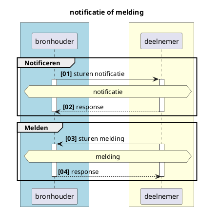
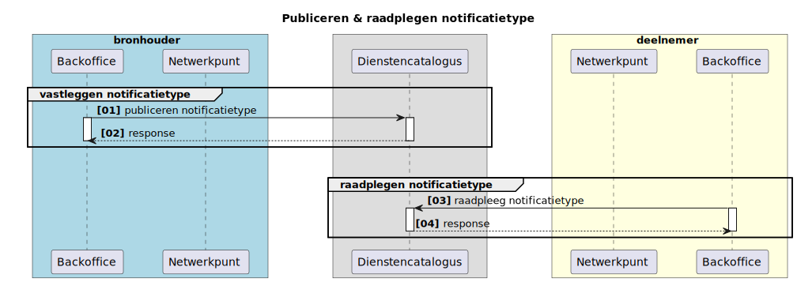
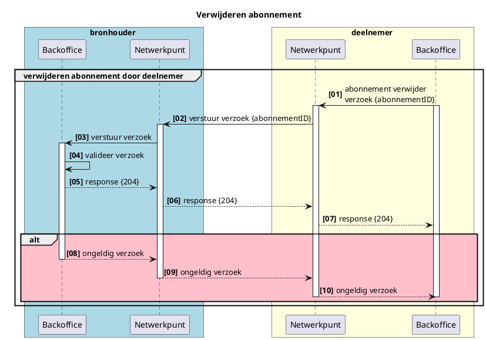

# Functionele uitwerking notificaties abonnementen en meldingen

**SAMENVATTING**

Dit document beschrijft functioneel de generieke werking van notificaties en meldingen in het Netwerkmodel iWlz. Met notificaties of meldingen worden respectievelijke afnemer of bronhouder geattendeerd op nieuwe informatie die relevant is voor die afnemer of bronhouder. 

---
**Inhoudsopgave**
- [Functionele uitwerking notificaties abonnementen en meldingen](#functionele-uitwerking-notificaties-abonnementen-en-meldingen)
- [1. Inleiding](#1-inleiding)
  - [1.1 Uitgangspunten](#11-uitgangspunten)
- [2. Terminologie](#2-terminologie)
- [2. Notificatie of melding wat is het verschil](#2-notificatie-of-melding-wat-is-het-verschil)
- [3. Notificaties](#3-notificaties)
  - [3.1 Doel](#31-doel)
  - [3.2 Typen notificatie](#32-typen-notificatie)
  - [3.3 Inhoud notificatie](#33-inhoud-notificatie)
    - [3.3.1 Voorbeeld notificatie:](#331-voorbeeld-notificatie)
  - [3.4 Notificatie flow](#34-notificatie-flow)
  - [3.5 iWlz-notificaties](#35-iwlz-notificaties)
- [4. Publiceren en raadplegen beschikbare Notificatietype](#4-publiceren-en-raadplegen-beschikbare-notificatietype)
  - [4.1 publiceren en raadplegen notificatie-typen](#41-publiceren-en-raadplegen-notificatie-typen)
  - [4.2 Inhoud notificatietype](#42-inhoud-notificatietype)
    - [3.4.1 Voorbeeld notificatietype-specificatie](#341-voorbeeld-notificatietype-specificatie)
- [5. Abonneren](#5-abonneren)
  - [5.1 Abonnementen binnen de iWlz](#51-abonnementen-binnen-de-iwlz)
  - [5.2 Abonneren op iWlz-Vrijwillige notificatie](#52-abonneren-op-iwlz-vrijwillige-notificatie)
  - [5.3 Inhoud plaatsen abonnement](#53-inhoud-plaatsen-abonnement)
    - [5.3.1 Voorbeeld abonneren](#531-voorbeeld-abonneren)
  - [5.4 Verwijderen iWlz-vrijwillig abonnement](#54-verwijderen-iwlz-vrijwillig-abonnement)
- [Bijlage: iWlz-Notificatie typen](#bijlage-iwlz-notificatie-typen)


---


# 1. Inleiding
Binnen het iWlz netwerkmodel werken we met generieke technische oplossingen en contracten om minimaal afhankelijk te zijn van gezamenlijke releases. Daarom werken we bijvoorbeeld met GraphQL, zodat het uitleveren van extra gegevens via een register geen impact heeft op de overige deelnemers aan het netwerk. 
Het mechanisme voor het aanbieden en afsluiten van abonnementen blijkt in de huidige opzet nog niet voldoende generiek te zijn. Het is namelijk nog niet mogelijk om nieuwe abonnementen op (iWlz-)notificaties toe te voegen zonder dat dit impact heeft voor alle netwerkdeelnemers. De reden hiervoor is dat de notificaties nu in de koppelvlak specificaties zijn vastgelegd. 
Deze notitie beschrijft een oplossingsrichting om dit te corrigeren, door één generiek mechanisme voor het beheren van abonnementen te specificeren in de koppelvlak specificaties en notificatietypen inhoudelijk vast te leggen in de Service Directory. Hierdoor kan een nieuwe notificatie worden geintroduceerd in het netwerk, zonder dat er een aanpassing van de koppelvlakspecificaties hoeft plaats te vinden.

## 1.1 Uitgangspunten
- Er is een **Service Directory** waarin notificatietypen gepubliceerd kunnen worden.
- Er is een **Adresboek** waarin per deelnemer de (notificatie-)endpoints beschikbaar zijn. 
- Netwerkdeelnemers raadplegen de **Service Directory** om op te halen welke abonnementen geplaatst kunnen worden en welke voorwaarden hier aan zitten.
- Een abonnement wordt geplaatst door een deelnemer aan het netwerk (abonnee). 
- Notificaties die randvoorwaardelijk zijn om een wettelijke taak uit te kunnen voeren worden door de bronhouder verzorgd zonder een apart abonnement per deelnemer.
- Om een abonnement te kunnen plaatsen heeft een deelnemer een attest van deelname nodig.
- Een notificatie is dun, en bevat enkel het abonnementId en het objectId waar de notificatie betrekking op heeft. De abonnee weet op basis van het abonnementId om welk abonnement type het gaat en kan dus ook op basis van dit gegeven bepalen welke informatie relevant is om te raadplegen.
- Een abonnement is in de basis permanent. De abonnee is zelf verantwoordelijk voor het intrekken van het abonnement. Bij uittreding uit het netwerk, bijvoorbeeld vanwege fusie of faillissement, kunnen abonnementen in bulk worden opgeruimd of gemuteerd. Dit zal in de praktijk altijd maatwerk zijn.

# 2. Terminologie
|Terminologie|Omschrijving|
|:--- |:--- |
| Backoffice | Omgeving rondom het register voor de afhandeling van netwerk-diensten |
| Bronhouder | Aanbieder van de data, houder van het register |
| Deelnemer | De raadpleger van de bron, het register |
| Register | De feitelijke databron/database |


# 2. Notificatie of melding wat is het verschil


<details>
<summary>plantUML-source</summary>


</details>

||Van|Naar|Omschrijving|
|:--- |:--- |:--- |:--- |
|Notificatie|Bronhouder|Deelnemer|op de hoogte stellen van een deelnemer over dat er nieuwe (of gewijzigde) informatie in een bron beschikbaar is die directe of afgeleide betrekking heeft op die deelnemer.|
|Melding|Deelnemer|Bronhouder|verzoek tot muteren of het beschikbaar stellen van nieuwe informatie naar aanleiding van een gebeurtenis van een deelnemer aan een bron|

# 3. Notificaties

## 3.1 Doel
Het doel van een notificatie is het op de hoogte stellen van een deelnemer door een bron over nieuwe (of gewijzigde) informatie die directe of afgeleide betrekking heeft op die deelnemer en daarmee de deelnemer in staat stellen op basis van die notificatie de nieuwe informatie te raadplegen. Een notificatie verloopt altijd van bronhouder naar deelnemer.

De reden voor notificatie is altijd de registratie of wijziging van gegevens in een bronregister. Dit is de *notificatie-trigger* en beschrijft welk CRUD-event in het register leidt tot een notificatie. 


## 3.2 Typen notificatie
Er zijn twee typen notificatie gedefinieerd, waarbij het onderscheid zit in de vrijwilligheid van het ontvangen van de notificatie door een deelnemer of het noodzakelijk ontvangen van de notificatie door de deelnemer. Wanneer het voor de afgesproken werking van de iWlz noodzakelijk is een deelnemer van een CRUD-event in een register op de hoogte te stellen is er sprake van een **iWlz-verplichte** notificatie. Een bronhouder moet deze notificatie versturen en een deelnemer hoeft zich voor de deze notificatie niet te abonneren. Is voor een goede werking van de iWlz gewenst dat een deelnemer op de hoogte te stellen van een CRUD-event, maar niet noodzakelijk, dan hoeft een bronhouder een notificatie alleen te versturen wanneer de deelnemer zich heeft geabonneerd op deze notificatie.  

Denk bijvoorbeeld aan de registratie van een nieuw indicatiebesluit. Het zorgkantoor dat verantwoordelijk is voor de regio waarin de client van het indicatiebesluit volgens het BRP woont, moet op de hoogte gesteld worden. Het CIZ **moet** daarom een dergelijke notificatie verzenden aan het zorgkantoor en het zorgkantoor **moet** de notificatie volgens iWlz-afspraken afhandelen. Het zorgkantoor hoeft zich niet op deze notificatie *"nieuwe indicatie voor zorgkantoor"* te abonneren.  

De twee typen notificaties zijn daarom: 

|Type notificatie|Deelnemer ontvangt notificatie|Abonneren door|
|:--- |:--- |:--- |
|iWlz-Verplicht|Altijd|niet van toepassing|
|iWlz-Vrijwillig|Wanneer geabonneerd|Deelnemer|


## 3.3 Inhoud notificatie
Op basis van de inhoud van een notificatie moet de ontvanger van de notificatie onder andere kunnen bepalen:
  - wat is de trigger, wat is de reden van de notificatie
  - van welke bronhouder is de notificatie afkomstig
  - wanneer is de notifictie verzonden
  - op welke informatie de notificatie betrekking heeft
  - informatie om een  gerichte raadpleging te doen
  - (autorisatie?)

De notificatie bevat de volgende gegevens:
|Gegeven|Beschrijving|
|--- |--- |
|organisatieID|Identificatie van de abonnee in het netwerk|
|timestamp|Tijdstip waarop de notificatie is aangemaakt|
|abonnementID|Identificatie van het abonnement. (Zie verderop)|
|notificatieTypeID|Identificatie van het abonnement waaruit de notificatie voortvloeit.|
|parentID|Identificatie van het parent-object waarover de autorisatie loopt.|
|objectID|Identificatie van het object waar de notificatie betrekking op heeft en eventueel input voor de raadpleging.|

### 3.3.1 Voorbeeld notificatie: 
Het gaat hier om een notificatie van een ‘Nieuwe indicatie’ voor het zorgkantoor. Op basis van het objectId kan het zorgkantoor een raadpleging doen van de nieuwe indicatie. 

```
{
  "organisatieId": "89e0e41a-13df-4fe2-ad72-d9c32ca5641c",
  "timestamp": "2022-09-27T12:07:07.492Z",
  "abonnementId": "3fa85f64-5717-4562-b3fc-2c963f66afa6",
  "notificatieTypeID": "NIEUWE_INDICATIE_VOOR_ZORGKANTOOR",
  "parentId": "wlzIndicatie/da8ebd42-d29b-4508-8604-ae7d2c6bbddd",
  "objectId": "https://api.ciz.nl/wlzindicatieregister/wlzindicaties/
              da8ebd42-d29b-4508-8604-ae7d2c6bbddd"
}
```

## 3.4 Notificatie flow


<details>
  <summary>plantUML-source</summary>

  ```plantuml
  @startuml rfc008-02-notificatie_sequence
  title notificatie sequence-diagram
  skinparam handwritten false
  skinparam participantpadding 20
  skinparam boxpadding 40
  autonumber "<b>[00]"
  box bronhouder #lightblue
  participant "Backoffice" as bs
  participant "Register \n(data)" as rg
  end box

  box adresboek
  participant "Adresboek" as ab
  end box

  box deelnemer #lightyellow
  participant "Resource" as dnp
  end box

    bs -> rg : registratie data
    activate rg
    activate bs
    rg -> rg: event trigger
    rg -> bs : bepaal notificatietype
    deactivate rg

      alt iWlz-vrijwillige notificatie
      bs -> bs: raadpleeg abonnementenregistratie
      activate bs #grey
      bs -> bs: geef geabonneerde deelnemer
      deactivate bs
      end 

    bs -> ab: zoek endpoint deelnemer op

    activate ab
    ab -> bs: return {endpoint deelnemer}
    deactivate ab
    bs -> bs: genereer notificatie
    bs -> dnp: zend notificatie
    activate dnp
    dnp -> dnp: verwerk notificatie
    dnp --> bs: http-response
    deactivate dnp  
    bs --> bs: verwerk response

  @enduml
  ```
</details>


|#|Beschrijving|Toelichting|
|:--- |:--- |:--- |
|01| registratie data | data vanuit backoffice in register plaatsen |
|02| event trigger | registratie of wijziging data laat een notificatie trigger afgaan |
|03| bepaal notificatietype | bepaal notificatietype en bepaal of het een verplichte of vrijwillige notificatie is |
|ALT| iWlz-vrijwillig | bij een iWlz-vrijwillige notificatie moet de abonnementenregistrate worden geraadpleegd op abonnee's |
|04| raadpleeg abonnementenregistratie | bepaal of er abonnee's zijn voor het vrijwillige notificatietype |
|05| geef geabonneerde deelnemer | geef informatie over geabonneerde deelnemer om de notificatie te versturen |
|06| zoek endpoint deelnemer op | bepaal waar de notificatie moet worden afgeleverd |
|07| return {endpoint deelnemer} | ontvang het afleveradres voor de notificatie |
|08| genereer notificatie | maak de gewenste notificatie aan |
|09| zend notificatie | verstuur de notificatie naar het endpoint van de deelnemer |
|10| verwerk notificatie | verwerk de ontvangen notificatie |
|11| http-response {200} | stuur ontvangst bevestiging |
|12| verwerk response | bevestig ontvangst notificatie |

Zodra een event zich voordoet waarvoor een notificatie-trigger is gedefinieerd verstuurd de bronhouder de bijbehorende notificatie. 

## 3.5 iWlz-notificaties
Alleen de notificaties die afgesproken zijn tussen een of meerdere ketenpartijen van de iWlz worden hier beschreven. Deze notificaties **moet** een bronhouder kunnen vesturen. Of een deelnemer de notificatie ontvangt is afhankelijk van het type. Een iWlz-verplichte notificatie ontvangt een deelnemer **altijd** wanneer die van toepassing is op die deelnemer. Een iWlz-vrijwillige notificatie ontvangt een deelnemer wanneer de notificatie van toepassing is op die deelnemer **EN** als die deelnemer is geabonneerd op die notificatie bij de bronhouder.

Er zijn momenteel twee registers in ontwikkeling, het Indicatieregister van het CIZ en het Bemiddelingsregister van de zorgkantoren. Hiervoor zijn er nu de volgende iWlz notificaties gespecificeerd die gerealiseerd zullen worden. 

||Trigger|Bronhouder|Deelnemer|notificatie-type|
|:--- |:--- |:--- |:--- |:--- |
|1| De registratie van een nieuwe indicatie | CIZ | zorgkantoor|iWlz-verplicht|
|2| Een wijziging van een bestaande indicatie | CIZ | zorgkantoor|iWlz-verplicht|
|3| De registratie van een nieuwe ZorgInNatura | zorgkantoor|zorgaanbieder|iWlz-verplicht|
|4| Een wijziging van een bestaande ZorgInNatura | zorgkantoor|zorgaanbieder|iWlz-verplicht|
|5| Gewijzigde bemiddeling t.g.v nieuwe of gewijzigde ZorgInNatura ander betrokken zorgaanbieder | zorgkantoor | Overig betrokken zorgaanbieder | *iWlz-vrijwillig* |
|6| Gewijzigde Dossierhouder of CZT | zorgkantoor|alle betrokken zorgaanbieders| *iWlz-vrijwillig* |
|7| Dossieroverdracht cliënt | zorgkantoor | zorgkantoor | iWlz-verplicht |

Bekijk voor een uitgebreide lijst van notificatietypen per register het informatiemodel en/of het afsprakenstel iWlz.

# 4. Publiceren en raadplegen beschikbare Notificatietype
## 4.1 publiceren en raadplegen notificatie-typen
De verschillende typen notificaties die een organisatie aanbiedt worden gepubliceerd in de Service Directory. De overige netwerkdeelnemers kunnen vervolgens de Service Directory raadplegen om te ontdekken welke notificaties een organisatie aanbiedt en welk type notificatie worden aangeboden. Minimaal de hierboven beschreven iWlz-notificaties worden in de Service Directory gepubliceerd omdat dit de afgesproken notificaties zijn.  



<details>
  <summary>plantUML-source</summary>

  ```plantuml
  @startuml rfc008-03-publiceren_raadplegen_notificatietype
  title Publiceren & raadplegen notificatietype

  skinparam handwritten false
  skinparam participantpadding 20
  skinparam boxpadding 40
  autonumber "<b>[00]"
  box bronhouder #lightblue
  participant "Backoffice" as bs
  end box

  box 
  participant "ServiceDirectory" as sd
  end box

  box deelnemer #lightyellow
  participant "Backoffice" as dbs
  end box
  group vastleggen notificatietype

    bs -> sd : publiceren notificatietype
    activate bs
    activate sd
    return response
    deactivate bs
  end
  group raadplegen notificatietype
    dbs -> sd: raadpleeg notificatietype
    activate dbs
    activate sd 
    return response
    deactivate dbs
  end
  @enduml
  ```
</details>

|#|Beschrijving|Toelichting|
|--- |--- |--- |
|01|publiceer notificatietype|registreer de gegevens van het notificatietype in de servicedirectory|
|02|response|verwerk response|
|03|raadpleeg notificatietype|raadpleeg de servicedirectory op de beschikbare notificaties|
|4|informatie|beoordeel de informatie over het abonnementtype|

## 4.2 Inhoud notificatietype
Bij het vastleggen van een abonnementtype in de service directory worden de volgende gegevens geregistreerd:

|Gegeven|Beschrijving|
|:--- |:--- |
|organisatieID | Identificatie van de partij die het abonnement verstrekt in het netwerk|
|notificatieTypeID | Identificatie van het abonnement type|
|notificatieType | Aanduiding van de abonnementsvorm|
|notificatieOmschrijving | Beschrijving van het abonnement|
|idTypeAbonnee | Aanduiding van het type Id dat moet worden meegegeven bij het afsluiten van het abonnement. Een abonnement kan werken op basis van meerdere idTypeAbonnee’s|
|eventType | Aanduiding welke register event de notificatie veroorzaakt|
|eventTriggerOmschrijving | Beschrijving van de trigger die de notificatie veroorzaakt|
|objectIDType | Beschrijving welke ObjectID wordt teruggeven in de notificatie, voor gebruik als juiste ID in de GraphQL query|

### 3.4.1 Voorbeeld notificatietype-specificatie

Het voorbeeld beschrijft de json-string voor het verplichte abonnement  van een zorgkantoor, dat een zorgaanbieder notificeert op een nieuwe bemiddeling wanneer de betreffende zorgaanbieder de of een van de bemiddelde aanbieders is. 

```
{
 "organisatieId": "89e0e41a-13df-4fe2-ad72-d9c32ca5641c",
 "notificatieTypeID": "NIEUWE_BEMIDDELING_VOOR_ZORGAANBIEDER",
 "notificatieType": "IWLZ_VERPLICHT",
 "notificatieOmschrijving": "Bij elke registratie van een nieuwe ZorgInNatura voor een instelling, ontvangt die instelling daarvan een notificatie",
 "idTypeAbonnee": "AgbCode",
 "eventType": "CREATE",
 "objectIDType": "zorgInNaturaID"
}
```


# 5. Abonneren
Alleen voor het kunnen ontvangen van een iWlz-vrijwillige notificatie is het noodzakelijk dat een deelnemer zich abonneert. Elke iWlz-verplicht notificatie ontvangt een deelnemer afhankelijk van zijn of haar rol.

In dit hoofdstuk het proces hoe een deelnemer zich kan abonneren op een vrijwillige notificatie. 
## 5.1 Abonnementen binnen de iWlz
Voor het kunnen versturen van een vrijwillige notificatie aan een deelnemer is het nodig om abonnementen te faciliteren. Een abonnement koppelt een deelnemer aan een iWlz-vrijwillige notificatie zodat de bronhouder weet aan wie de notificatie verstuurd moet worden. 


_Het staat een bronhouder en deelnemer vrij om buiten de afgesproken iWlz notificatie een willekeurige notificatie af te spreken en te faciliteren met een deelnemer. Deze ‘ongereguleerde’ notificaties worden verder niet besproken, maar passen in hetzelfde principe van het iWlz-vrijwillige abonnement._


## 5.2 Abonneren op iWlz-Vrijwillige notificatie

Het abonneren van een deelnemer voor een <span style="text-decoration:underline;">iWlz-vrijwillige</span> notificatie is een actie van de deelnemer zelf. De deelnemer mag zelf bepalen of een notificatie wenselijk is en om dan een abonnement te plaatsen. De deelnemer mag zich abonneren op een iWlz-Vrijwillig abonnement mits is voldaan aan de eisen van het abonnement en bijvoorbeeld het bezit van een geldige AgbCode, het identificatie kenmerk past binnen de toegestane van de deelnemer voldoet aan de set aan idTypeAbonnee’s voor dat abonnement. 


<details>
  <summary> plant_uml_source</summary>

  ```plantuml
    @startuml rfc008-04-abonneren_iwlz-vrijwillig
    title Abonneren notificatie

    skinparam handwritten false
    skinparam participantpadding 20
    skinparam boxpadding 40
    autonumber "<b>[00]"
    box bronhouder #lightblue
    participant "Backoffice" as bs
    participant "Netwerkpunt" as bnp 
    end box

    box deelnemer #lightyellow
    participant "Netwerkpunt" as dnp
    participant "Backoffice" as dbs
    end box

    group abonneren op iWlz-vrijwiliig
        dbs -> dnp: abonnement verzoek
        activate dbs
        activate dnp
        dnp -> bnp: verstuur verzoek
        activate bnp
        bnp <- bnp: valideer verzoek
        bnp -> bs: verstuur verzoek
        activate bs
        bs -> bs: registeer abonnement
        bs --> bnp: response {abonnementID}
        deactivate bs
        bnp --> dnp: response {abonnementID}
        dnp --> dbs: response {abonnementID}
        dbs -> dbs: registreer \n{abonnementID}
            alt #Pink
            bnp --> dnp: response: ongeldig verzoek
            deactivate bnp
            dnp --> dbs: response: ongeldig verzoek
            deactivate dnp
            end alt
        deactivate dbs
    end
    @enduml
  ```
</details>

|#|Beschrijving|Toelichting|
|--- |--- |--- |
|01|abonnement verzoek|Stel een abonnementsverzoek op|
|02|verstuur verzoek|Dien een abonnementsverzoek in|
|03|valideer verzoek|Bepaal of de deelnemer abonnee mag worden op het betreffende abonnement|
|04|verstuur verzoek|verstuur het verzoek verder|
|05|registreer abonnement|registreer het abonnement en genereer {abonnementID} voor abonnee|
|06|response {abonnementID}|retourneer het {abonnementID}|
|07|response {abonnementID}|retourneer het {abonnementID}|
|08|response {abonnementID}|retourneer het {abonnementID}|
|09|register {abonnementID}|registreer het {abonnementID}|
|ALT|ongeldig verzoek|Deelnemer is niet gerechtigd voor een abonnement|
|10|response ongeldig verzoek|retourneer ongeldig verzoek|
|11|response ongeldig verzoek|ontvang ongeldig verzoek terug|


Alleen bij het abonneren van een deelnemer zelf ontvangt de deelnemer daar een abonnementID voor terug. Met dit ID kan de deelnemer zelf het abonnement opzeggen. 

## 5.3 Inhoud plaatsen abonnement
Bij het abonneren van een deelnemer moeten de volgende gegevens worden aangeboden: 


|Gegeven|Beschrijving|
|:--- |:--- |
|organisatieId|NetwerkiIdentificatie van de abonnerende partij, identificerend voor het kunnen afleveren van de notificatie.|
|abonnementTypeIdabonnementType|IdentificatieAanduiding van het abonnement waarop deelnemer wil abonneren of geabonneerd moet worden.type|
|idTypeAbonnee|Aanduiding van het type Id dat moet worden meegegeven bij het afsluiten van het abonnement|
|idAbonnee|Daadwerkelijk identificatie conform bij idType geselecteerd id type|

### 5.3.1 Voorbeeld abonneren
Voor het abonneren van een zorgaanbieder op de iWlz-vrijwillige notificatie ‘Gewijzigde Dossierhouder of CZT’ moet het volgende worden aangeboden:

```
{
 "organisatieId": "c40b3669-1b06-4c99-8c84-f4fac1264b39",
 "abonnementTypeId": "GEWIJZIGDE_DOSSIERHOUDER_OF_CZT",
 "idTypeAbonnee": "AgbCode",
 "idAbonnee": "12341234"
}
```

response: 

```
{
  "abonnementId": "3fa85f64-5717-4562-b3fc-2c963f66afa6"
}
```

## 5.4 Verwijderen iWlz-vrijwillig abonnement

Wanneer een deelnemer bij een iWlz-vrijwillig abonnement ervoor kiest geen notificaties meer te ontvangen naar aanleiding van dat abonnement, kan de deelnemer zelf het abonnement opzeggen door het te verwijderen bij de bronhouder. 


<details>
  <summary> plant_uml_source</summary>


</details>

|#|Beschrijving|Toelichting|
|--- |--- |--- |
|01|abonnement verwijder verzoek {abonnementID}| Deelnemer stuurt verzoek om te verwijderen naar bronhouder voor het stoppen van de betreffende iWlz-vrijwillige notificatie |
|02|verstuur verzoek {abonnementID}||
|03|verstuur verzoek||
|04|valideer verzoek| controleer of het abonnementID bekend is en hoort bij de afzender van het verwijder verzoek|
|05|response {204}| verificatie klopt, abonnement is verwijderd, opdracht uitgevoerd |
|06|response {204}||
|07|response {204}||
|ALT|Ongeldig abonnements verzoek| als de verificatie faalt |
|08|ongeldig verzoek||
|09|ongeldig verzoek||
|10|ongeldig verzoek||


# Bijlage: iWlz-Notificatie typen
<scroll naar links -->

|| Organisatie | notificatieTypeID | notificatieType| notificatieOmschrijving | idTypeAbonnee | eventType | objectIDType |
|:--- |:--- |:--- |:--- |:--- |:--- |:--- |:--- |
|1| CIZID | NIEUWE_INDICATIE_ZORGKANTOOR | IWLZ-VERPLICHT | De registratie van een nieuwe indicatie, waarbij de postcode van het BRP-adres van de client valt in de regio van het zorgkantoor dat de notificatie dient te ontvangen | *null* | create | wlzIndicatieID |
| 2 | CIZID | VERVALLEN_INDICATIE | ?? | Bij de update (vullen of verwijderen of aanpassen) van de vervaldatum van een indicatie, ontvangt het zorgkantoor dat @@@@@ een notificatie  | Uzovicode zorgkantoor | update | wlzIndicatieID |
| 3 | ZorgkantoorID | NIEUWE_ZORGINNATURA_VOOR_ZORGAANBIEDER | iWlz-verplicht | Bij de registratie van een nieuwe ZorgInNatura, ontvangt de zorgaanbieder dat in die registratie is geregisteerd onder instelling een notificatie | Agbcode zorgaanbieder | create | zorgInNaturaID |
| 4 | ZorgkantoorID | GEWIJZIGDE_ZORGINNATURA_VOOR_ZORGAANBIEDER | iWlz-verplicht | Bij de update (vullen lege elementen, wijzigen of leegmaken gevulde elementen) van elementen die volgens de regels van de wlz aangepast mogen worden zonder tot een nieuwe ZorgInNatura te moeten leiden, ontvangt de zorgaanbieder die in de bijgewerkte registratie is geregisteerd onder instelling een notificatie  | Agbcode zorgaanbieder | update | zorgInNaturaID |
| 5 | ZorgkantoorID | GEWIJZIGDE_ZORGINNATURA_BIJ_ANDERE_ZORGAANBIEDER | iWlz-vrijwillig | Bij de update (vullen lege elementen, wijzigen of leegmaken gevulde elementen) van elementen die volgens de regels van de wlz aangepast mogen worden zonder tot een nieuwe ZorgInNatura te moeten leiden, ontvangt de zorgaanbieder die bij dezelfde bemiddeling betrokken zijn in de zorglevering (hebben een actuele ZorgInNatura) aan de client als in de bijgewerkte ZorgInNatura een notificatie wanneer die is geabonneerd | Agbcode zorgaanbieder | update | zorgInNaturaID |
| 6 | ZorgkantoorID | GEWIJZIGDE_DOSSIERHOUDER_CZT_VOOR_ZORGAANBIEDER | iWlz-vrijwillig | Bij de registratie van een nieuwe Dossierhouder of Coordinator Zorg Thuis, ontvangt de zorgaanbieder die actief betrokken is bij de zorg aan die client een notificatie wanneer die is geabonneerd | Agbcode zorgaanbieder | create |  |
| 7 | ZorgkantoorID | DOSSIEROVERDRACHT_ZORGKANTOOR | iWlz-verplicht | Bij de registratie van een nieuwe Overdracht, ontvangt het nieuwe verantwoordelijke zorgkantoor een notificatie | Uzovicode zorgkantoor | create | OverdrachtID |


---
---
---

```
Nog te verwerken
#### Afhandelen iWlz-verplicht abonnementstype ZONDER abonnementsregistratie

De bronhouder is verantwoordelijk voor het verzenden van de notificatie bij een iWlz-verplicht abonnementstype. Bij elk abonnementstype is beschreven welke registratie de grondslag voor notificatie is en aan welke deelnemer. Een bronhouder kan op basis daarvan bepalen wanneer en aan wie de notificatie gestuurd moet worden zonder dat die deelnemer een abonnement heeft. 

Door het ontbreken van een abonnementsregistratie moet de bronhouder voor elke deelnemer die nog niet eerder is genotificeerd het organisatieID van die deelnemer opzoeken in het Adresboek. 


|#|Beschrijving|Toelichting|
|--- |--- |--- |
|0||Een deelnemer kan de grondslag voor een iWlz verplicht abonnement verliezen. Bijvoorbeeld als de deelnemer geen iWlz zorgaanbieder meer is.|
|2|verwijder abonnement van deelnemer|De bronhouder verwijderd alle abonnementen op notificaties voor de deelnemer uit d abonnementenregistratie|


### 3.6.1 Verwijderen abonnement iWlz-verplicht abonnement

De bronhouder verwijdert het abonnement van een deelnemer wanneer de partij geen deelnemer  meer is van de iWlz of een andere rol heeft. 


|#|Beschrijving|Toelichting|
|--- |--- |--- |
|1|deelnemer verliest toegang|Een deelnemer kan de grondslag voor een iWlz verplicht abonnement verliezen. Bijvoorbeeld als de deelnemer geen iWlz zorgaanbieder meer is.|
|2|verwijder abonnement van deelnemer|De bronhouder verwijderd alle abonnementen op notificaties voor de deelnemer uit d abonnementenregistratie|

```

