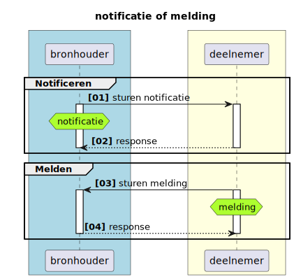
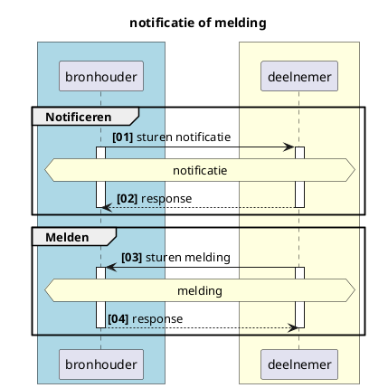
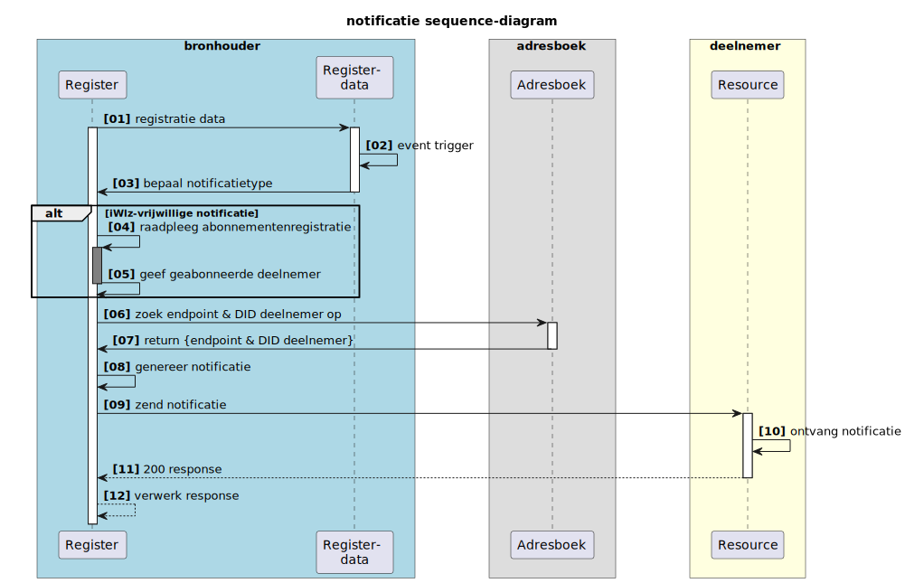
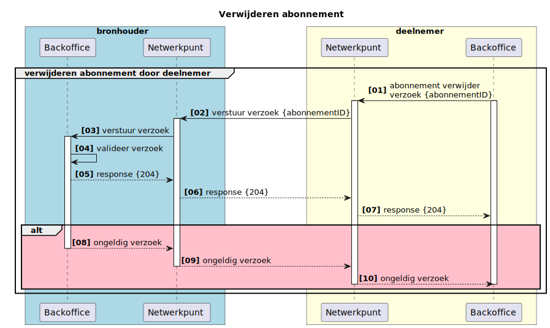
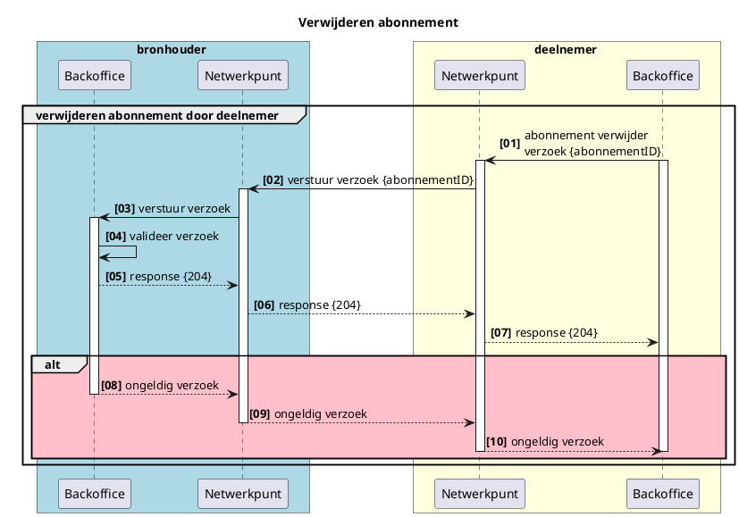

# RFC0008 -  Functionele uitwerking notificaties en abonnementen


---

<font size="4">**SAMENVATTING**</font>

**Huidige situatie:**

Er is alleen nog een notificatie van het CIZ naar het zorgkantoor dat verantwoordelijk is voor de regio waar de postcode uit de BRP van de client in valt. Deze notificatie is nog niet generiek opgezet.

**Beoogde situatie**

Dit document beschrijft functioneel de generieke werking van notificaties en meldingen in het Netwerkmodel iWlz. Met notificaties of meldingen worden respectievelijke afnemer of bronhouder geattendeerd op nieuwe informatie die relevant is voor die afnemer of bronhouder. 

<font size="4">**Status RFC**</font>

Volg deze [link](https://github.com/iStandaarden/iWlz-RFC/issues/24) om de actuele status van deze RFC te bekijken.

---
**Inhoudsopgave**
- [RFC0008 -  Functionele uitwerking notificaties en abonnementen](#rfc0008----functionele-uitwerking-notificaties-en-abonnementen)
- [1. Inleiding](#1-inleiding)
  - [1.1 Uitgangspunten](#11-uitgangspunten)
  - [1.2 Relatie andere RFC](#12-relatie-andere-rfc)
  - [1.3 Code-repository](#13-code-repository)
- [2. Terminologie](#2-terminologie)
- [3. Notificatie of melding wat is het verschil](#3-notificatie-of-melding-wat-is-het-verschil)
- [4. Notificaties](#4-notificaties)
  - [4.1 Doel notificatie](#41-doel-notificatie)
  - [4.2 Typen notificatie](#42-typen-notificatie)
  - [4.3 Inhoud notificatie](#43-inhoud-notificatie)
  - [4.4 Notificeren](#44-notificeren)
    - [4.4.1 Voorbeeld notificeren:](#441-voorbeeld-notificeren)
  - [4.5 iWlz-notificatie-typen](#45-iwlz-notificatie-typen)
  - [4.6 Publiceren en raadplegen beschikbare Notificatietype](#46-publiceren-en-raadplegen-beschikbare-notificatietype)
- [5. Ontvangen iWlz-verplichte notificatie](#5-ontvangen-iwlz-verplichte-notificatie)
- [6. Ontvangen (iWlz-) vrijwillige notificatie dmv abonneren](#6-ontvangen-iwlz--vrijwillige-notificatie-dmv-abonneren)
  - [6.1 Abonnementen binnen de iWlz](#61-abonnementen-binnen-de-iwlz)
  - [6.2 Abonneren op iWlz-Vrijwillige notificatie](#62-abonneren-op-iwlz-vrijwillige-notificatie)
  - [6.3 Plaatsen abonnement](#63-plaatsen-abonnement)
    - [6.3.1 Request CreateAbonnement en inhoud plaatsen abonnement](#631-request-createabonnement-en-inhoud-plaatsen-abonnement)
    - [6.3.2 Validatie](#632-validatie)
    - [6.3.3 Voorbeeld abonneren](#633-voorbeeld-abonneren)
  - [6.4 Verwijderen iWlz-vrijwillig abonnement](#64-verwijderen-iwlz-vrijwillig-abonnement)
    - [6.4.1 request deleteAbonnement en inhoud verwijderen abonnement](#641-request-deleteabonnement-en-inhoud-verwijderen-abonnement)
    - [6.4.2 Validatie](#642-validatie)
    - [6.4.3 Voorbeeld verwijderen abonnement](#643-voorbeeld-verwijderen-abonnement)
- [Bijlage: iWlz-Notificatie typen](#bijlage-iwlz-notificatie-typen)

---


# 1. Inleiding
Binnen het iWlz netwerkmodel werken we met generieke technische oplossingen en contracten om minimaal afhankelijk te zijn van gezamenlijke releases. Daarom werken we bijvoorbeeld met GraphQL, zodat het uitleveren van extra gegevens via een register geen impact heeft op de overige deelnemers aan het netwerk. 

Het mechanisme voor het aanbieden en afsluiten van abonnementen blijkt in de huidige opzet nog niet voldoende generiek te zijn. Het is namelijk nog niet mogelijk om nieuwe abonnementen op (iWlz-)notificaties toe te voegen zonder dat dit impact heeft voor alle netwerkdeelnemers. De reden hiervoor is dat de notificaties nu in de koppelvlak specificaties zijn vastgelegd. 

Deze notitie beschrijft een oplossingsrichting om dit te corrigeren, door één generiek mechanisme voor het beheren van abonnementen te specificeren in de koppelvlak specificaties en notificatietypen inhoudelijk vast te leggen in de *Dienstencatalogus*. Hierdoor kan een nieuwe notificatie worden geintroduceerd in het netwerk, zonder dat er een aanpassing van de koppelvlakspecificaties hoeft plaats te vinden.

## 1.1 Uitgangspunten
- Er is een catalogus voorziening: **Dienstencatalogus** waarin notificatietypen gepubliceerd kunnen worden.
- Er is een **Adresboek** waarin per deelnemer de (notificatie-)endpoints beschikbaar zijn. 
- Netwerkdeelnemers raadplegen de **Dienstencatalogus** om op te halen welke abonnementen geplaatst kunnen worden en welke voorwaarden hier aan zitten.
- Een abonnement wordt geplaatst door een deelnemer van het netwerk (abonnee) bij de partij die het notificatie-type afhandeld (de bronhouder). 
- Notificaties die randvoorwaardelijk zijn om een wettelijke taak uit te kunnen voeren worden door de bronhouder verstuurd zonder een apart abonnement per deelnemer.
- Om een abonnement te kunnen plaatsen heeft een deelnemer een attest van deelname nodig.
- Een notificatie is dun. Dat wil zeggen dat de ontvanger op basis van de notificatie in staat is te bepalen welke informatie relevant is om te raadplegen. 
- Een abonnement is in de basis permanent. De abonnee is zelf verantwoordelijk voor het intrekken van het abonnement. Bij uittreding uit het netwerk, bijvoorbeeld vanwege fusie of faillissement, kunnen abonnementen in bulk worden opgeruimd of gemuteerd. Dit zal in de praktijk altijd maatwerk zijn.
- Silverster abonneert zich niet op de (iWlz-)vrijwillige notificaties.
- Silverster handelt geen (iWlz-)vrijwillige notificaties af.

## 1.2 Relatie andere RFC
Deze RFC heeft een relatie met de volgende andere RFC(s):
| RFC                                               | onderwerp         | relatie<sup>*</sup> | toelichting                             | issue                                                     |
|:--------------------------------------------------|:------------------|:--------------------|:----------------------------------------|:----------------------------------------------------------|
| [RFC0003](/RFC/RFC0003%20-%20Adresboek.md)           | Adresboek         | afhankelijk         | beschrijft realisatie Adresboek         | [#4](https://github.com/iStandaarden/iWlz-RFC/issues/4)   |
| [RFC0020](/RFC/RFC0024%20-%20Opslag%20iWlz%20Notificatietypen%20in%20dienstencatalogus.md) | Opslag en Raadplegen iWlz notificatietypen in dienstencatalogus | afhankelijk | beschrijft functioneel de dienst om notificatie-typen te publiceren en raadplegen | [#20](https://github.com/iStandaarden/iWlz-RFC/issues/24) |
| [RFC0018](/RFC/RFC0018%20-%20Melden%20van%20fouten%20in%20gegevens%20volgens%20iStandaard%20iWlz.md)| Meldingen: Melden van iWlz gegevensfouten | gerelateerd | beschrijft het stroom van raadpleger aan bronhouder | [#16](https://github.com/iStandaarden/iWlz-RFC/issues/16) |

<sup>*</sup>voorwaardelijk,*voor andere RFC* / afhankelijk, *van andere RFC*

## 1.3 Code-repository
De benodigde code staat in [https://github.com/iStandaarden/iWlz-generiek/tree/POC-bemiddeling](https://github.com/iStandaarden/iWlz-generiek/tree/POC-bemiddeling)


# 2. Terminologie
| Terminologie | Omschrijving                                                          |
|:-------------|:----------------------------------------------------------------------|
| Backoffice   | Omgeving rondom het register voor de afhandeling van netwerk-diensten |
| Bronhouder   | Aanbieder van de data, houder van het register                        |
| Deelnemer    | De raadpleger van de bron, het register                               |
| Register     | De feitelijke databron/database                                       |
| DID | Decentralized Identifiers. De W3C-standaard Decentralized Identifiers maakt het verifiëren van  decentrale digitale identiteiten mogelijk. Deze decentrale identificatoren kunnen gebruikt worden bij self-sovereign identity. |


# 3. Notificatie of melding wat is het verschil



<details>
<summary>plantUML-source</summary>


</details>

|             | Van        | Naar       | Omschrijving                                                                                                                                                                |
|:------------|:-----------|:-----------|:----------------------------------------------------------------------------------------------------------------------------------------------------------------------------|
| Notificatie | Bronhouder | Deelnemer  | op de hoogte stellen van een deelnemer over dat er nieuwe (of gewijzigde) informatie in een bron beschikbaar is die directe of afgeleide betrekking heeft op die deelnemer. |
| Melding     | Deelnemer  | Bronhouder | verzoek tot muteren of het beschikbaar stellen van nieuwe informatie naar aanleiding van een gebeurtenis van een deelnemer aan een bron                                     |

Het onderdeel Melding is verder uitgewerkt in **RFC0018 - (Fout-)meldingen iWlz Netwerkmodel**.

# 4. Notificaties

## 4.1 Doel notificatie
Het doel van een notificatie is het op de hoogte stellen van een deelnemer door een bron over nieuwe (of gewijzigde) informatie die directe of afgeleide betrekking heeft op die deelnemer en daarmee de deelnemer in staat stellen op basis van die notificatie de nieuwe informatie te raadplegen. Een notificatie verloopt altijd van bronhouder naar deelnemer.

De reden voor notificatie is altijd de registratie of wijziging van gegevens in een bronregister. Dit is de *notificatie-trigger* en beschrijft welk CRUD-event in het register leidt tot een notificatie. 


## 4.2 Typen notificatie
Er zijn twee typen notificatie gedefinieerd, waarbij het onderscheid zit in de vrijwilligheid van het ontvangen van de notificatie door een deelnemer of het noodzakelijk ontvangen van de notificatie door de deelnemer. Wanneer het voor de afgesproken werking van de iWlz noodzakelijk is een deelnemer van een CRUD-event in een register op de hoogte te stellen is er sprake van een **iWlz-verplichte** notificatie. Een bronhouder moet deze notificatie versturen en een deelnemer hoeft zich voor de deze notificatie niet te abonneren. Is voor een goede werking van de iWlz gewenst dat een deelnemer op de hoogte te stellen van een CRUD-event, maar niet noodzakelijk, dan hoeft een bronhouder een notificatie alleen te versturen wanneer de deelnemer zich heeft geabonneerd op deze notificatie.  

Denk bijvoorbeeld aan de registratie van een nieuw indicatiebesluit. Het zorgkantoor dat verantwoordelijk is voor de regio waarin de client van het indicatiebesluit volgens het BRP woont, moet op de hoogte gesteld worden. Het CIZ **moet** daarom een dergelijke notificatie verzenden aan het zorgkantoor en het zorgkantoor **moet** de notificatie volgens iWlz-afspraken afhandelen. Het zorgkantoor hoeft zich niet apart op deze notificatie *"nieuwe indicatie voor zorgkantoor"* te abonneren.  

De twee typen iWlz notificaties zijn daarom: 

| Type notificatie | Verzenden notificatie | Invloed deelnemer                       |
|:-----------------|:----------------------|:----------------------------------------|
| iWlz-Verplicht   | Altijd                | Geen keuze; ontvangt notificatie altijd |
| iWlz-Vrijwillig  | Alleen naar abonnee's | Keuze ligt bij deelnemer                |


## 4.3 Inhoud notificatie
De notificatie is in structuur gelijk aan de melding (zie [RFC0018](/RFC/RFC0018%20-%20Melden%20van%20fouten%20in%20gegevens%20volgens%20iStandaard%20iWlz.md)). Op basis van de inhoud van een notificatie moet de ontvanger van de notificatie onder andere kunnen bepalen:
  - wat is de trigger, wat is de reden van de notificatie
  - van welke bronhouder is de notificatie afkomstig
  - wanneer is de notifictie verzonden
  - op welke informatie de notificatie betrekking heeft
  - informatie om een gerichte raadpleging te kunnen doen
  - (autorisatie?)

De notificatie bevat de volgende gegevens:
| Gegeven          | Algemene beschrijving                                              | Specifieke beschrijving voor notificeren                               | V/O<sup>*</sup> | Type     |
|------------------|--------------------------------------------------------------------|------------------------------------------------------------------------|:---------------:|----------|
| timestamp        | Tijdstip waarop de notificatie is aangemaakt                       |                                                                        |        V        | Datetime |
| afzenderIDType   | Kenmerk van het type ID van de verzendende partij                  |                                                                        |        V        | Enum     |
| afzenderID       | Identificatie van de verzender van het bericht                     |                                                                        |        V        | DID      |
| ontvangerIDType  | Kenmerk van het type ID van de ontvangende partij                  |                                                                        |        V        | Enum     |
| ontvangerID      | Identifictie van de ontvanger van het bericht                      |                                                                        |        V        | DID      |
| ontvangerKenmerk | Kenmerk van de ontvanger:                                          | Bij iWlz-vrijwillige notificatie gevuld met abonnementsID. Anders leeg |        O        | String   |
| subjectType      | Onderwerptype van het bericht                                      | NotificatieTypeID (zie tabel)                                          |        V        | String   |
| subject          | Onderwerp van het bericht                                          | Identificatie van het parent-object waarover de autorisatie loopt.     |        V        | String   |
| recordID         | Identificatie van het record waar het bericht betrekking op heeft. | Identificatie van het record waar de notificatie betrekking op heeft.  |        V        | String   |
<sup>*</sup> V = verplicht / O = Optioneel


## 4.4 Notificeren



<details>
  <summary>plantUML-source</summary>

  ```plantuml
  @startuml rfc008-02-notificatie_sequence
  title notificatie sequence-diagram
  skinparam handwritten false
  skinparam participantpadding 20
  skinparam boxpadding 40
  autonumber "<b>[00]"
  box bronhouder #lightblue
  participant "Backoffice" as bs
  participant "Register \n(data)" as rg
  end box

  box adresboek
  participant "Adresboek" as ab
  end box

  box deelnemer #lightyellow
  participant "Resource" as dnp
  end box

    bs -> rg : registratie data
    activate rg
    activate bs
    rg -> rg: event trigger
    rg -> bs : bepaal notificatietype
    deactivate rg

      alt iWlz-vrijwillige notificatie
      bs -> bs: raadpleeg abonnementenregistratie
      activate bs #grey
      bs -> bs: geef geabonneerde deelnemer
      deactivate bs
      end 

    bs -> ab: zoek endpoint & DID deelnemer op

    activate ab
    ab -> bs: return {endpoint & DID deelnemer}
    deactivate ab
    bs -> bs: genereer notificatie
    bs -> dnp: zend notificatie
    activate dnp
    dnp -> dnp: ontvang notificatie
    dnp --> bs: 200 response
    deactivate dnp  
    bs --> bs: verwerk response

  @enduml
  ```
</details>


| #   | Beschrijving                      | Toelichting                                                                                            | Voorbeeld: Bemiddeling voor zorgaanbieder                                                                    |
|:----|:----------------------------------|:-------------------------------------------------------------------------------------------------------|:-------------------------------------------------------------------------------------------------------------|
| 01  | registratie data                  | data vanuit backoffice in register plaatsen                                                            | Zorgkantoor bemiddelt client naar een zorgaanbieder en registreert het resultaat in het bemiddelingsregister |
| 02  | event trigger                     | registratie of wijziging data laat een notificatie trigger afgaan                                      | Doordat de agbCode van de zorgaanbieder wordt gevuld in ZorgInNatura, gaat er een trigger af                 |
| 03  | bepaal notificatietype            | bepaal notificatietype en bepaal of het een verplichte of vrijwillige notificatie is                   | Het is de trigger van de iWlz-verplichte notificatie: NIEUWE_ZORGINNATURA_VOOR_ZORGAANBIEDER.                |
| ALT | *iWlz-vrijwillig notificatietype* | *bij een iWlz-vrijwillige notificatie moet de abonnementenregistrate worden geraadpleegd op abonnee's* | nvt.                                                                                                         |
| 04  | raadpleeg abonnementenregistratie | bepaal of er abonnee's zijn voor het vrijwillige notificatietype                                     |
| 05  | geef geabonneerde deelnemer       | geef informatie over geabonneerde deelnemer om de notificatie te versturen                           |
| 06  | zoek endpoint deelnemer op        | bepaal waar de notificatie moet worden afgeleverd                                                    | Met de geregisteerde agbCode kan het endpoint en DID van de zorgaanbieder worden opgezocht |
| 07  | return {endpoint; DID deelnemer}       | ontvang het afleveradres en DID voor de notificatie                                                         |
| 08  | genereer notificatie              | maak de gewenste notificatie aan                                                                     | Gebruik ontvangen DID in notificatie (zie voorbeeld 4.3.1) |
| 09  | zend notificatie                  | verstuur de notificatie naar het endpoint van de deelnemer                                           | Gebruik ontvangen endpoint als afleveradres |
| 10  | verwerk notificatie               | verwerk de ontvangen notificatie                                                                     |
| 11  | http-response {200}               | stuur ontvangst bevestiging                                                                          | De zorgaanbieder bevestigt de ontvangst van de notificatie en kan deze verwerken en gebruiken voor een raadpleging |
| 12  | verwerk response                  | bevestig ontvangst notificatie                                                                       | 

Zodra een event zich voordoet waarvoor een notificatie-trigger is gedefinieerd verstuurd de bronhouder de bijbehorende notificatie. 

### 4.4.1 Voorbeeld notificeren: 
Het gaat hier om een notificatie van een nieuwe ‘Zorg in natura’ voor een zorgaanbieder. Op basis van het recordID kan het zorgaanbieder een raadpleging doen van de nieuwe zorg in natura. 

Notificatie:

```json
{
  "timestamp": "2022-09-27T12:07:07.492Z",
  "afzenderTypeID": "UZOVI",
  "afzenderID": "5505",
  "ontvangerIDType": "Agbcode",
  "ontvangerID": "12341234",
  "ontvangerKenmerk": "3fa85f64-5717-4562-b3fc-2c963f66afa6",
  "subjectType": "NIEUWE_ZORGINNATURA_VOOR_ZORGAANBIEDER",
  "subject": "Bemiddeling/da8ebd42-d29b-4508-8604-ae7d2c6bbddd",
  "recordID": "https://api.zorgkantoor1.nl/bemiddelingsregister/zorginnatura/da8ebd42-d29b-4508-8604-ae7d2c6bbddd"
}
```
Succesvol response: 
```http
HTTP/1.1 204 (No content)
```
Validatie fout response:
```http
HTTP/1.1 400 Bad Request
{"ErrorCode" : "invalid_request", "Error" :"Validation failed"}
```

## 4.5 iWlz-notificatie-typen
Alleen de notificaties die afgesproken zijn tussen een of meerdere ketenpartijen van de iWlz worden hier beschreven. Deze notificaties **moet** een iWlz-bronhouder kunnen vesturen. Of een deelnemer de notificatie ontvangt is afhankelijk van het type. Een ***iWlz-verplichte*** notificatie ontvangt een deelnemer **altijd** wanneer die van toepassing is op die deelnemer. Een ***iWlz-vrijwillige*** notificatie ontvangt een deelnemer wanneer de notificatie van toepassing is op die deelnemer **EN** als die deelnemer is geabonneerd op die notificatie bij de bronhouder.

*Het staat een bronhouder en deelnemer vrij om buiten de afgesproken iWlz notificatie een willekeurige notificatie af te spreken en te faciliteren met een deelnemer. Deze ‘ongereguleerde’ notificaties worden verder niet besproken, maar passen in hetzelfde principe van het iWlz-vrijwillige abonnement.*

Er zijn momenteel twee registers in ontwikkeling, het Indicatieregister van het CIZ en het Bemiddelingsregister van de zorgkantoren. Hiervoor zijn er nu de volgende iWlz notificaties gespecificeerd die gerealiseerd zullen worden. 

|   | Trigger                                                                                      | Bronhouder  | Deelnemer                      | notificatie-type  |
|:--|:---------------------------------------------------------------------------------------------|:------------|:-------------------------------|:------------------|
| 1 | De registratie van een nieuwe indicatie                                                      | CIZ         | zorgkantoor                    | iWlz-verplicht    |
| 2 | Een wijziging van de vervaldatum in een bestaande indicatie                                  | CIZ         | zorgkantoor                    | *iWlz-vrijwillig* |
| 3 | De registratie van een nieuwe ZorgInNatura                                                   | zorgkantoor | zorgaanbieder                  | iWlz-verplicht    |
| 4 | Een wijziging van een bestaande ZorgInNatura                                                 | zorgkantoor | zorgaanbieder                  | iWlz-verplicht    |
| 5 | Gewijzigde bemiddeling t.g.v nieuwe of gewijzigde ZorgInNatura ander betrokken zorgaanbieder | zorgkantoor | overig betrokken zorgaanbieder | *iWlz-vrijwillig* |
| 6 | Gewijzigde Dossierhouder of CZT                                                              | zorgkantoor | alle betrokken zorgaanbieders  | *iWlz-vrijwillig* |
| 7 | Dossieroverdracht cliënt                                                                     | zorgkantoor | zorgkantoor                    | iWlz-verplicht    |
| 8 | De registratie van een nieuwe ZorgInNatura voor een bovenregionaal (uitvoerend) zorgkantoor  | zorgkantoor | zorgkantoor                    | iWlz-verplicht    |

Bekijk voor een uitgebreide lijst van notificatietypen per register het informatiemodel en/of het afsprakenstel iWlz.

## 4.6 Publiceren en raadplegen beschikbare Notificatietype
Dit onderdeel is beschreven in een afzonderlijke RFC: [RFC0024 - Opslag iWlz Notificatietypen in dienstencatalogus](/RFC/RFC0024%20-%20Opslag%20iWlz%20Notificatietypen%20in%20dienstencatalogus.md)

# 5. Ontvangen iWlz-verplichte notificatie
Voor het ontvangen van een iWlz-verplichte notificatie hoeft een deelnemer geen extra handelingen te doen dan het kenbaar maken van een notifictie-endpoint waarop de notificatie op kunnen worden ontvangen. De als iWlz-verplichte notificaties worden namelijk op basis van de verantwoordelijkheid binnen de iWlz verstuurd en ontvangen. Zo moet een zorgkantoor op de hoogte gebracht worden van een nieuw Indicatiebesluit wanneer deze van een client is die volgens het BRP geregisteerd is in de regio van dat zorgkantoor. Het CIZ zorgt er daarom voor dat de notificatie wordt verzonden. Het ontvangende zorgkantoor heeft hierin geen keuze.

Zie de bijlage voor een overzicht van de iWlz notificatietypen voor het Indicatie- en Bemiddelingsregister.


# 6. Ontvangen (iWlz-) vrijwillige notificatie dmv abonneren

Alleen voor het kunnen ontvangen van een iWlz-vrijwillige notificatie is het noodzakelijk dat een deelnemer zich abonneert. Elke iWlz-verplicht notificatie ontvangt een deelnemer altijd en dus onafhankelijk van een abonnement. 

In dit hoofdstuk het proces hoe een deelnemer zich kan abonneren op een vrijwillige notificatie. 

## 6.1 Abonnementen binnen de iWlz

Voor het kunnen versturen van een vrijwillige notificatie aan een deelnemer is het nodig om abonnementen te faciliteren. Het abonnement koppelt een specifieke deelnemer aan een specifieke iWlz-vrijwillige notificatie zodat de bronhouder weet aan wie de notificatie verstuurd moet worden. Het abonneren van een deelnemer op een vrijwillige notificatie is naar de behoefte van de deelnemer zelf. 

## 6.2 Abonneren op iWlz-Vrijwillige notificatie

Het abonneren van een deelnemer voor een <span style="text-decoration:underline;">iWlz-vrijwillige</span> notificatie is een actie van de deelnemer zelf. De deelnemer mag zelf bepalen of een notificatie wenselijk is en om dan een abonnement te plaatsen. De deelnemer mag zich abonneren op een iWlz-Vrijwillig abonnement mits is voldaan aan de eisen van het abonnement en bijvoorbeeld het bezit van een geldige AgbCode, het identificatie kenmerk past binnen de toegestane van de deelnemer voldoet aan de set aan idTypeAbonnee’s voor dat abonnement. 


<details>
  <summary> plant_uml_source</summary>

  ```plantuml
    @startuml rfc008-04-abonneren_iwlz-vrijwillig
    title Abonneren notificatie

    skinparam handwritten false
    skinparam participantpadding 20
    skinparam boxpadding 40
    autonumber "<b>[00]"
    box bronhouder #lightblue
    participant "Backoffice" as bs
    participant "Netwerkpunt" as bnp 
    end box

    box deelnemer #lightyellow
    participant "Netwerkpunt" as dnp
    participant "Backoffice" as dbs
    end box

    group abonneren op iWlz-vrijwiliig
        dbs -> dnp: abonnement verzoek
        activate dbs
        activate dnp
        dnp -> bnp: verstuur verzoek
        activate bnp
        bnp <- bnp: valideer verzoek
        bnp -> bs: verstuur verzoek
        activate bs
        bs -> bs: registeer abonnement
        bs --> bnp: response {abonnementID}
        deactivate bs
        bnp --> dnp: response {abonnementID}
        dnp --> dbs: response {abonnementID}
        dbs -> dbs: registreer \n{abonnementID}
            alt #Pink
            bnp --> dnp: response: ongeldig verzoek
            deactivate bnp
            dnp --> dbs: response: ongeldig verzoek
            deactivate dnp
            end alt
        deactivate dbs
    end
    @enduml
  ```
</details>

| #   | Beschrijving              | Toelichting                                                             |
|-----|---------------------------|-------------------------------------------------------------------------|
| 01  | abonnement verzoek        | Stel een abonnementsverzoek op                                          |
| 02  | verstuur verzoek          | Dien een abonnementsverzoek in                                          |
| 03  | valideer verzoek          | Bepaal of de deelnemer abonnee mag worden op het betreffende abonnement |
| 04  | verstuur verzoek          | verstuur het verzoek verder                                             |
| 05  | registreer abonnement     | registreer het abonnement en genereer {abonnementID} voor abonnee       |
| 06  | response {abonnementID}   | retourneer het {abonnementID}                                           |
| 07  | response {abonnementID}   | retourneer het {abonnementID}                                           |
| 08  | response {abonnementID}   | retourneer het {abonnementID}                                           |
| 09  | register {abonnementID}   | registreer het {abonnementID}                                           |
| ALT | ongeldig verzoek          | Deelnemer is niet gerechtigd voor een abonnement                        |
| 10  | response ongeldig verzoek | retourneer ongeldig verzoek                                             |
| 11  | response ongeldig verzoek | ontvang ongeldig verzoek terug                                          |


## 6.3 Plaatsen abonnement
Het plaatsen van een abonnement op een iWlz-vrijwillige notificatie of elke andere niet iWlz-verplichte notificatie verloopt via GraphQl met een mutation.  De specificatie hiervan staan in [https://github.com/iStandaarden/iWlz-generiek/tree/RFC0008-RFC0018](https://github.com/iStandaarden/iWlz-generiek/tree/RFC0008-RFC0018)]

### 6.3.1 Request CreateAbonnement en inhoud plaatsen abonnement

  - gql-specificatie/backoffice.graphql → Mutation: CreateAbonnement
  - gql-specificatie/netwerkpunt.graphql → Mutation: CreateAbonnement

Bij het abonneren van een deelnemer moeten de volgende gegevens worden aangeboden: 


| Gegeven           | Beschrijving                                                                                                 | Type   |
|:------------------|:-------------------------------------------------------------------------------------------------------------|--------|
| organisatieId     | NetwerkIdentificatie van de abonnerende partij, identificerend voor het kunnen afleveren van de notificatie. | DID    |
| notificatieTypeID | IdentificatieAanduiding van het abonnement waarop deelnemer wil abonneren of geabonneerd moet worden.type    | String |
| idTypeAbonnee     | Aanduiding van het type Id dat moet worden meegegeven bij het afsluiten van het abonnement                   | String |
| idAbonnee         | Daadwerkelijk identificatie conform bij idType geselecteerd id type                                          | String |


### 6.3.2 Validatie
In het netwerpunt van de bronhouder wordt gevalideerd of de abonnee gerechtigd is voor het afsluiten van het abonnement. Controle vindt onderandere plaatst op:
  - komt het organisatieID in de request body overeen met het organisatieID in de JWT
  - hoort het organisatieID bij de meegegeven idAbonnee
  - is het meegegeven idAbonnee van het type idTypeAbonnee zoals gespecificeerd bij het notificatie-type.

Als het abonnementsverzoek wordt afgekeurd ontvangt de abonnee een http code 400 (invalid_request + “Validation failed“) en wordt het abonnement niet gepersisteerd. Zo kan de bronhouder er op vertrouwen dat er uitsluitend legitieme abonnementen worden afgesloten.

### 6.3.3 Voorbeeld abonneren
Voor het abonneren van een zorgaanbieder op de iWlz-vrijwillige notificatie ‘Gewijzigde Dossierhouder of CZT’ moet het volgende worden aangeboden:

```graphql
query createAbonnement{
 "organisatieId": "c40b3669-1b06-4c99-8c84-f4fac1264b39",
 "notificatieTypeID": "GEWIJZIGDE_DOSSIERHOUDER_OF_CZT",
 "idTypeAbonnee": "AgbCode",
 "idAbonnee": "12341234"
}
```

succesvol response: 
```json
{
  "abonnementId": "3fa85f64-5717-4562-b3fc-2c963f66afa6"
}
```
validatie fout response:
```http
HTTP/1.1 400 Bad Request
{"ErrorCode" : "invalid_request", "Error" :"Validation failed"}
```

## 6.4 Verwijderen iWlz-vrijwillig abonnement

Wanneer een deelnemer bij een iWlz-vrijwillig abonnement ervoor kiest geen notificaties meer te ontvangen naar aanleiding van dat abonnement, kan de deelnemer zelf het abonnement opzeggen door het te verwijderen bij de bronhouder. 



<details>
  <summary> plant_uml_source</summary>


</details>

|#|Beschrijving|Toelichting|
|--- |--- |--- |
|01|abonnement verwijder verzoek {abonnementID}| Deelnemer stuurt verzoek om te verwijderen naar bronhouder voor het stoppen van de betreffende iWlz-vrijwillige notificatie |
|02|verstuur verzoek {abonnementID}||
|03|verstuur verzoek||
|04|valideer verzoek| controleer of het abonnementID bekend is en hoort bij de afzender van het verwijder verzoek|
|05|response {204}| verificatie klopt, abonnement is verwijderd, opdracht uitgevoerd |
|06|response {204}||
|07|response {204}||
|ALT|Ongeldig abonnements verzoek| als de verificatie faalt |
|08|ongeldig verzoek||
|09|ongeldig verzoek||
|10|ongeldig verzoek||

### 6.4.1 request deleteAbonnement en inhoud verwijderen abonnement
zie:

  - gql-specificatie/backoffice.graphql → Mutation: deleteAbonnement
  - gql-specificatie/netwerkpunt.graphql → Mutation: deleteAbonnement


Bij het abonneren van een deelnemer moeten de volgende gegevens worden aangeboden: 

| Gegeven      | Beschrijving                                          |
|:-------------|:------------------------------------------------------|
| abonnementID | Het specifieke abonnementID dat beeindigd moet worden |

### 6.4.2 Validatie
In het netwerpunt van de bronhouder wordt gevalideerd of de abonnee gerechtigd voor beeindiging van het abonnement. Controle vindt onderandere plaatst op:
  - komt het organisatieID in de request body overeen met het organisatieID in de JWT
  - hoort het abonementID bij de abonnee

Als het abonnementsverzoek wordt afgekeurd ontvangt de abonnee een http code 400 (invalid_request + “Validation failed“) en wordt het abonnement niet gepersisteerd. Zo kan de bronhouder er op vertrouwen dat er uitsluitend legitieme abonnementen worden afgesloten.

### 6.4.3 Voorbeeld verwijderen abonnement
Voor het beeindigen van het abonnement met id: *"3fa85f64-5717-4562-b3fc-2c963f66afa6"*

```graphql
query deleteAbonnement{
  "abonnementId": "3fa85f64-5717-4562-b3fc-2c963f66afa6"
}
```

succesvol response: 
```http
HTTP/1.1 204 (No content)
```
validatie fout response:
```http
HTTP/1.1 400 Bad Request
{"ErrorCode" : "invalid_request", "Error" :"Validation failed"}
```


---
---

# Bijlage: iWlz-Notificatie typen
<-- scroll naar links voor de volledige inhoud-->

|  | Aanbieder | notificatieTypeID | notificatieType | notificatieOmschrijving | idTypeAbonnee | eventType | recordIDType |
|---|---|---|---|---|---|---|---|
| 1 | CIZ | NIEUWE_INDICATIE_ZORGKANTOOR | IWLZ-VERPLICHT | Bij de registratie van een nieuwe indicatie, waarbij de postcode van het adres volgens de BRP van de geindiceerde client valt in de regio van het zorgkantoor dat de notificatie dient te ontvangen | - | create | wlzIndicatieID |
| 2 | CIZ | VERVALLEN_INDICATIE | IWLZ-VRIJWILLIG | Bij de update (vullen of verwijderen of aanpassen) van de vervaldatum van een indicatie, ontvangt het zorgkantoor dat een abonnement heeft en dat volgens een registratie heeft in [Bemiddeling] het Bemiddelingsregister bij de indicatie van toepassing een notificatie | Uzovicode zorgkantoor / of RegioCode | update | wlzIndicatieID |
| 3 | Zorgkantoor | NIEUWE_ZORGINNATURA_VOOR_ZORGAANBIEDER | IWLZ-VERPLICHT | Bij de registratie van een nieuwe ZorgInNatura, ontvangt de zorgaanbieder die in [ZorgInNatura.instelling] is geregisteerd onder instelling een notificatie | - | create | zorgInNaturaID |
| 4 | Zorgkantoor | GEWIJZIGDE_ZORGINNATURA_VOOR_ZORGAANBIEDER | IWLZ-VERPLICHT | Bij de update (vullen lege elementen, wijzigen of leegmaken gevulde elementen) van elementen die volgens de regels van de wlz aangepast mogen worden zonder tot een nieuwe ZorgInNatura te moeten leiden, ontvangt de zorgaanbieder die in de bijgewerkte registratie is geregisteerd onder instelling een notificatie | - | update | zorgInNaturaID |
| 5 | Zorgkantoor | GEWIJZIGDE_ZORGINNATURA_BIJ_ANDERE_ZORGAANBIEDER | IWLZ-VRIJWILLIG | Bij de update (vullen lege elementen, wijzigen of leegmaken gevulde elementen) van elementen die volgens de regels van de wlz aangepast mogen worden zonder tot een nieuwe ZorgInNatura te moeten leiden, ontvangt de zorgaanbieder die bij dezelfde bemiddeling betrokken zijn in de zorglevering (hebben een actuele ZorgInNatura) aan de client als in de bijgewerkte ZorgInNatura een notificatie wanneer die is geabonneerd | Agbcode zorgaanbieder | update | bemiddelingID |
| 6 | Zorgkantoor | GEWIJZIGDE_DOSSIERHOUDER_CZT_VOOR_ZORGAANBIEDER | IWLZ-VRIJWILLIG | Bij de registratie van een nieuwe Dossierhouder of Coordinator Zorg Thuis, ontvangt de zorgaanbieder die actief betrokken is bij de zorg aan die client een notificatie wanneer die is geabonneerd | Agbcode zorgaanbieder | create | bemiddelingID |
| 7 | Zorgkantoor | DOSSIEROVERDRACHT_ZORGKANTOOR | IWLZ-VERPLICHT | Bij de registratie van een nieuwe Overdracht, ontvangt het nieuwe verantwoordelijke zorgkantoor een notificatie | - | create | OverdrachtID |
| 8 | Zorgkantoor | BOVENREGIONALE_BEMIDDELING_VOOR_ZORGKANTOOR | IWLZ-VERPLICHT | Bij de registratie van een nieuwe ZorgInNatura voor een zorgaanbieder die een contract heeft met een ander uitvoerend zorgkantoor (bovenregionale zorgkantoor) dan het registrerende verantwoordelijke zorgkantoor, ontvangt dat uitvoerende zorgkantoor daar een notificatie van | - | create | zorgInNaturaID |


