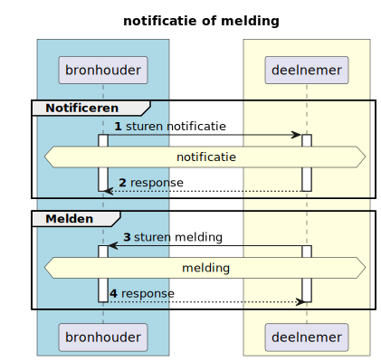
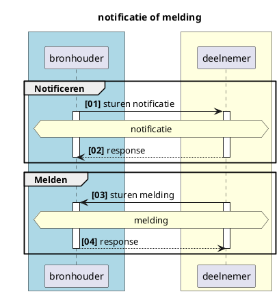
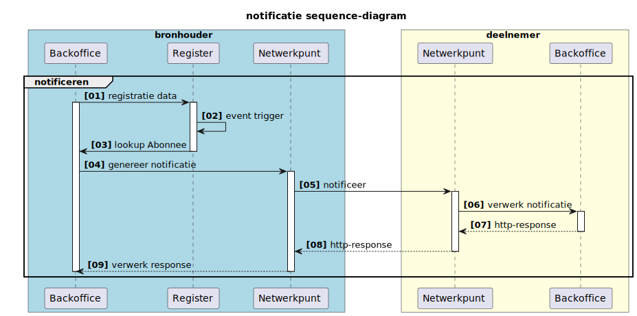
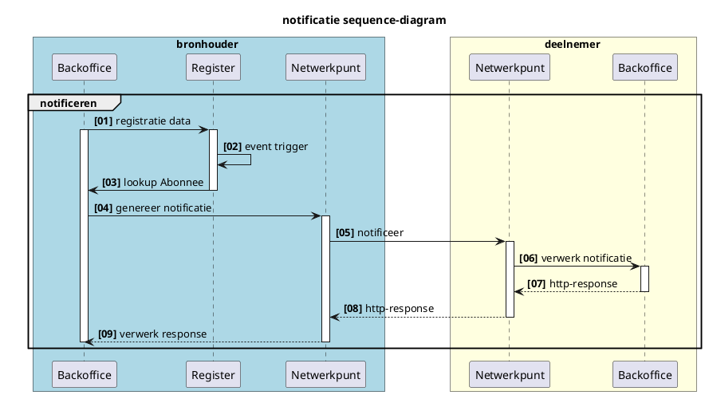

# Functionele uitwerking notificaties abonnementen en meldingen

**SAMENVATTING**

Dit document beschrijft functioneel de generieke werking van notificaties en meldingen in het Netwerkmodel iWlz. Met notificaties of meldingen worden respectievelijke afnemer of bronhouder geattendeerd op nieuwe informatie die relevant is voor die afnemer of bronhouder. 

De technische uitwerking is beschreven in RFC008 Abonneren en notificeren.


```
N.B. RFC008 Abonneren en notificeren - iWlz-netwerkmodel
Deze uitwerking is ook gebaseerd op de RFC008 in het afsprakenstelsel. Deze onderdelen zijn gemarkeerd. 
```


**Inhoudsopgave**
[TOC]
||
|:--|
|[1. Melding of notificatie](#1)|
|[2. Notificatie](#2)|
|&nbsp; [2.1 Doel](#2.1)|

# <a id="1"></a>1. Inleiding
# <a id="2"></a>2. Notificatie of melding wat is het verschil



<details>
<summary>plantUML-source</summary>


</details>

||Van|Naar|Omschrijving|
|:--- |:--- |:--- |:--- |
|Notificatie|Bronhouder|Deelnemer|op de hoogte stellen van een deelnemer over dat er nieuwe (of gewijzigde) informatie in een bron beschikbaar is die directe of afgeleide betrekking heeft op die deelnemer.|
|Melding|Deelnemer|Bronhouder|verzoek tot muteren of het beschikbaar stellen van nieuwe informatie naar aanleiding van een gebeurtenis van een deelnemer aan een bron|

# <a id="3"></a>3. Notificatie

## <a id=3.1></a>3.1 Doel
Het doel van een notificatie is het op de hoogte stellen van een deelnemer door een bron over nieuwe (of gewijzigde) informatie die directe of afgeleide betrekking heeft op die deelnemer en daarmee de deelnemer in staat stellen op basis van die notificatie de nieuwe informatie te raadplegen.

De reden voor notificatie is altijd de registratie of wijziging van gegevens in een bronregister. Dit is de *notificatie-trigger* en beschrijft welk CRUD-event in het register leidt tot een notificatie. 

Een notificatie verloopt altijd van bronhouder naar deelnemer

## <a id=3.2></a>3.2 Typen notificatie
Er zijn twee typen notificatie gedefinieerd, waarbij het onderscheid zit in de vrijwilligheid van het ontvangen van de notificatie door een deelnemer of het noodzakelijk ontvangen van de notificatie door de deelnemer. Wanneer er voor de afgesproken werking van de iWlz **moet** een deelnemer van een CRUD-event in een register op de hoogte gebracht worden is er sprake van een **verplichte** notificatie. Denk bijvoorbeeld aan de registratie van een nieuw indicatiebesluit. Het zorgkantoor dat verantwoordelijk is voor de regio waarin de client van het indicatiebesluit volgens het BRP woont, moet op de hoogte gesteld worden. Het CIZ **moet** daarom een dergelijke notificatie verzenden aan het zorgkantoor en het zorgkantoor **moet** de notificatie volgens iWlz-afspraken afhandelen. 

Wanneer in deelnemer 


De twee typen notificaties zijn daarom: 

|Type notificatie|Deelnemer ontvangt notificatie|Abonneren door|
|:--- |:--- |:--- |
|Verplicht|Altijd|niet van toepassing|
|Vrijwillig|Wanneer geabonneerd|Deelnemer|


Denk bij een **verplichte** notificatie bijvoorbeeld aan het op de hoogte brengen van een zorgkantoor dat er een nieuwe indicatie is geregistreerd voor een cliënt in de regio van dat zorgkantoor. De *notificatie-trigger* is in dit geval de registratie van de nieuwe indicatie. Het CIZ stuurt dan een notificatie ‘Nieuw indicatiebesluit’ naar het betreffende zorgkantoor.

## <a id=3.3></a>3.3 Inhoud notificatie
Op basis van de inhoud van een notificatie moet de ontvanger van de notificatie onder andere kunnen bepalen:
  - wat is de trigger, wat is de reden van de notificatie
  - van welke bronhouder is de notificatie afkomstig
  - wanneer is de notifictie verzonden
  - op welke informatie de notificatie betrekking heeft
  - informatie om een  gerichte raadpleging te doen
  - (autorisatie?)

De notificatie bevat de volgende gegevens:
|Gegeven|Beschrijving|
|--- |--- |
|organisatieID|Identificatie van de abonnee in het netwerk|
|timestamp|Tijdstip waarop de notificatie is aangemaakt|
|abonnementID|Identificatie van het abonnement. (Zie verderop)|
|abonnementTypeID|Identificatie van het abonnement waaruit de notificatie voortvloeit. (Zie hoofdstuk 3 Abonnementen verderop)|
|parentID|Identificatie van het parent-object waarover de autorisatie loopt.|
|objectID|Identificatie van het object waar de notificatie betrekking op heeft en eventueel input voor de raadpleging.|

### <a id=3.3.1></a>3.3.1 Voorbeeld notificatie: 
Het gaat hier om een notificatie van een ‘Nieuwe indicatie’ voor het zorgkantoor. Op basis van het objectId kan het zorgkantoor een raadpleging doen van de nieuwe indicatie. 


```
{
  "organisatieId": "89e0e41a-13df-4fe2-ad72-d9c32ca5641c",
  "timestamp": "2022-09-27T12:07:07.492Z",
  "abonnementId": "3fa85f64-5717-4562-b3fc-2c963f66afa6",
  "abonnement": "NIEUWE_INDICATIE_VOOR_ZORGKANTOOR",
  "parentId": "wlzIndicatie/da8ebd42-d29b-4508-8604-ae7d2c6bbddd",
  "objectId": "https://api.ciz.nl/wlzindicatieregister/wlzindicaties/
              da8ebd42-d29b-4508-8604-ae7d2c6bbddd"
}
```


---
---
---
## <a id=3.4></a>3.4 Notificatie flow


<details>
<summary>plantUML-source</summary>



</details>


||||
|--- |--- |--- |
|#|Beschrijving|Toelichting|
|01|registratie data|data vanuit backoffice in register plaatsen|
|02|event trigger|registratie laat een abonnements trigger afgaan|
|03|lookup abonnee|zoek de abonnees op voor betreffende abonnement|
|04|genereer notificatie|genereer voor elk van de abonnees de notificatie|
|05|notificeer|stuur de notificatie door naar de deelnemer|
|06|verwerk notificatie|verwerk de notificatie in backoffice deelnemer|
|07|(204?) response|genereer ontvangstbevestiging|
|08|(204?) response|stuur ontvangstbevestiging naar verzender|
|09|verwerk response|bevestig ontvangst notificatie|

Zodra een event zich voordoet waarvoor een notificatie-trigger is gedefinieerd verstuurd de bronhouder de bijbehorende notificatie. 

# 3. Abonnementen


## 3.1 Abonnementen binnen de iWlz

Voor het kunnen versturen van een notificatie aan een deelnemer is het nodig om abonnementen te faciliteren. Een abonnement beschrijft wat de reden is voor een notificatie, welke nieuwe gegevens of welke (combinatie van) wijzigingen er toeleiden dat er een notificatie moet worden verstuurd. de trigger. Elke abonnement bevat één specifieke trigger. , zo kan een deelnemer zich abonneren op een trigger en ontvangt daarmee een notificatie wanneer de trigger geactiveerd wordt. 

In de iWlz worden alleen abonnementen beschreven die een bronhouder MOET implementeren en aanbieden. Of een deelnemer een abonnement heeft op een bepaald abonnement hangt af van de abonnementsvorm. 

_Het staat een bronhouder en deelnemer vrij om buiten de afgesproken iWlz abonnementen een willekeurig abonnement af te spreken en te faciliteren. Deze ‘ongereguleerde’ abonnementen worden verder niet besproken, maar passen in hetzelfde principe van het iWlz-vrijwillige abonnement._


## 3.2 iWlz-abonnementsvormen

Er zijn twee iWlz-abonnementsvormen, voor elk type notificatie één. Het onderscheid zit in de noodzaak dat een deelnemer een bepaalde notificatie ontvangt. Voor de iWlz-verplichte abonnementen krijgt de deelnemer altijd een notificatie, voor de iWlz-vrijwillige abonnementen  geldt dat als de deelnemer een bepaalde notificatie wenst te ontvangen, het aan de deelnemer is om een abonnement te nemen.


|||||
|--- |--- |--- |--- |
|Abonnementsvorm|Deelnemer abonnement|Abonneren door|Voor type notificatie|
|iWlz-verplicht|Verplicht|Bronhouder voor deelnemer|Noodzakelijke|
|iWlz-vrijwillig|Vrijwillig|Deelnemer zelf|Vrijwillige|


Wanneer een deelnemer van een gebeurtenis op de hoogte gesteld moet worden, bijvoorbeeld in het geval dat er een nieuwe indicatie is, dan plaatst de bronhouder voor de deelnemer het abonnement zodat gegarandeerd kan worden dat de deelnemer genotificeerd zal worden. De bronhouder is verantwoordelijk voor het plaatsen van het abonnement.


## 3.3 Vastleggen en raadplegen abonnementen


```
Zie ook RFC008 - Hoofdstuk 2
```


De verschillende typen abonnementen die een organisatie aanbiedt worden gepubliceerd in de Service Directory. De overige netwerkdeelnemers kunnen vervolgens de Service Directory raadplegen om te ontdekken welke abonnementen een organisatie aanbiedt en welk type  door de twee bronhouders worden aangeboden. (Minimaal de hierboven beschreven iWlz-abonnementen)


<p id="gdcalert3" ><span style="color: red; font-weight: bold">>>>>>  gd2md-html alert: inline image link here (to images/image3.png). Store image on your image server and adjust path/filename/extension if necessary. </span><br>(<a href="#">Back to top</a>)(<a href="#gdcalert4">Next alert</a>)<br><span style="color: red; font-weight: bold">>>>>> </span></p>


<table>
  <tr>
   <td><a href="https://www.plantuml.com/plantuml/img/XP91JWCn34NtEOLLraW5iUe2LOWr6qxWJDnfr8mJEKvBRu-dTD1CXSecKVn__5-iRAkYQ1kIguV81GK7s2E7aqHLOjXXgZJJRDNOnOAi1KE8tCFpUgRx_3NLNzOEcsPkWoU19sSIUCcyporOuI75Vgy-DNApfh1wm-wGTxlOqGgmWgzB-OFqH78eZVL7vmAEE8p9xfAnz7-I7AtNUnJgDClvSgc6vPL0b9Y6NwepfPHFzuC3bxlWmSYda5voAt34gedwtiQAFlCOoEeSs1lXyTMWO0Eb-MGTPE7HSo6pOQVnY4hZJ6OdUmo0a3PXssh9N4TteBdVIAuKWXYAOVoL42QIpMIZ_iR5y-XmImB_eLoduhQssA_x1W00">#</a>
   </td>
   <td><a href="https://www.plantuml.com/plantuml/img/XP91JWCn34NtEOLLraW5iUe2LOWr6qxWJDnfr8mJEKvBRu-dTD1CXSecKVn__5-iRAkYQ1kIguV81GK7s2E7aqHLOjXXgZJJRDNOnOAi1KE8tCFpUgRx_3NLNzOEcsPkWoU19sSIUCcyporOuI75Vgy-DNApfh1wm-wGTxlOqGgmWgzB-OFqH78eZVL7vmAEE8p9xfAnz7-I7AtNUnJgDClvSgc6vPL0b9Y6NwepfPHFzuC3bxlWmSYda5voAt34gedwtiQAFlCOoEeSs1lXyTMWO0Eb-MGTPE7HSo6pOQVnY4hZJ6OdUmo0a3PXssh9N4TteBdVIAuKWXYAOVoL42QIpMIZ_iR5y-XmImB_eLoduhQssA_x1W00">Beschrijving</a>
   </td>
   <td><a href="https://www.plantuml.com/plantuml/img/XP91JWCn34NtEOLLraW5iUe2LOWr6qxWJDnfr8mJEKvBRu-dTD1CXSecKVn__5-iRAkYQ1kIguV81GK7s2E7aqHLOjXXgZJJRDNOnOAi1KE8tCFpUgRx_3NLNzOEcsPkWoU19sSIUCcyporOuI75Vgy-DNApfh1wm-wGTxlOqGgmWgzB-OFqH78eZVL7vmAEE8p9xfAnz7-I7AtNUnJgDClvSgc6vPL0b9Y6NwepfPHFzuC3bxlWmSYda5voAt34gedwtiQAFlCOoEeSs1lXyTMWO0Eb-MGTPE7HSo6pOQVnY4hZJ6OdUmo0a3PXssh9N4TteBdVIAuKWXYAOVoL42QIpMIZ_iR5y-XmImB_eLoduhQssA_x1W00">Toelichting</a>
   </td>
  </tr>
  <tr>
   <td><a href="https://www.plantuml.com/plantuml/img/XP91JWCn34NtEOLLraW5iUe2LOWr6qxWJDnfr8mJEKvBRu-dTD1CXSecKVn__5-iRAkYQ1kIguV81GK7s2E7aqHLOjXXgZJJRDNOnOAi1KE8tCFpUgRx_3NLNzOEcsPkWoU19sSIUCcyporOuI75Vgy-DNApfh1wm-wGTxlOqGgmWgzB-OFqH78eZVL7vmAEE8p9xfAnz7-I7AtNUnJgDClvSgc6vPL0b9Y6NwepfPHFzuC3bxlWmSYda5voAt34gedwtiQAFlCOoEeSs1lXyTMWO0Eb-MGTPE7HSo6pOQVnY4hZJ6OdUmo0a3PXssh9N4TteBdVIAuKWXYAOVoL42QIpMIZ_iR5y-XmImB_eLoduhQssA_x1W00">1</a>
   </td>
   <td><a href="https://www.plantuml.com/plantuml/img/XP91JWCn34NtEOLLraW5iUe2LOWr6qxWJDnfr8mJEKvBRu-dTD1CXSecKVn__5-iRAkYQ1kIguV81GK7s2E7aqHLOjXXgZJJRDNOnOAi1KE8tCFpUgRx_3NLNzOEcsPkWoU19sSIUCcyporOuI75Vgy-DNApfh1wm-wGTxlOqGgmWgzB-OFqH78eZVL7vmAEE8p9xfAnz7-I7AtNUnJgDClvSgc6vPL0b9Y6NwepfPHFzuC3bxlWmSYda5voAt34gedwtiQAFlCOoEeSs1lXyTMWO0Eb-MGTPE7HSo6pOQVnY4hZJ6OdUmo0a3PXssh9N4TteBdVIAuKWXYAOVoL42QIpMIZ_iR5y-XmImB_eLoduhQssA_x1W00">publiceer abonnementtype</a>
   </td>
   <td><a href="https://www.plantuml.com/plantuml/img/XP91JWCn34NtEOLLraW5iUe2LOWr6qxWJDnfr8mJEKvBRu-dTD1CXSecKVn__5-iRAkYQ1kIguV81GK7s2E7aqHLOjXXgZJJRDNOnOAi1KE8tCFpUgRx_3NLNzOEcsPkWoU19sSIUCcyporOuI75Vgy-DNApfh1wm-wGTxlOqGgmWgzB-OFqH78eZVL7vmAEE8p9xfAnz7-I7AtNUnJgDClvSgc6vPL0b9Y6NwepfPHFzuC3bxlWmSYda5voAt34gedwtiQAFlCOoEeSs1lXyTMWO0Eb-MGTPE7HSo6pOQVnY4hZJ6OdUmo0a3PXssh9N4TteBdVIAuKWXYAOVoL42QIpMIZ_iR5y-XmImB_eLoduhQssA_x1W00">registreer de gegevens van het abonnementtype in de servicedirectory</a>
   </td>
  </tr>
  <tr>
   <td><a href="https://www.plantuml.com/plantuml/img/XP91JWCn34NtEOLLraW5iUe2LOWr6qxWJDnfr8mJEKvBRu-dTD1CXSecKVn__5-iRAkYQ1kIguV81GK7s2E7aqHLOjXXgZJJRDNOnOAi1KE8tCFpUgRx_3NLNzOEcsPkWoU19sSIUCcyporOuI75Vgy-DNApfh1wm-wGTxlOqGgmWgzB-OFqH78eZVL7vmAEE8p9xfAnz7-I7AtNUnJgDClvSgc6vPL0b9Y6NwepfPHFzuC3bxlWmSYda5voAt34gedwtiQAFlCOoEeSs1lXyTMWO0Eb-MGTPE7HSo6pOQVnY4hZJ6OdUmo0a3PXssh9N4TteBdVIAuKWXYAOVoL42QIpMIZ_iR5y-XmImB_eLoduhQssA_x1W00">2</a>
   </td>
   <td><a href="https://www.plantuml.com/plantuml/img/XP91JWCn34NtEOLLraW5iUe2LOWr6qxWJDnfr8mJEKvBRu-dTD1CXSecKVn__5-iRAkYQ1kIguV81GK7s2E7aqHLOjXXgZJJRDNOnOAi1KE8tCFpUgRx_3NLNzOEcsPkWoU19sSIUCcyporOuI75Vgy-DNApfh1wm-wGTxlOqGgmWgzB-OFqH78eZVL7vmAEE8p9xfAnz7-I7AtNUnJgDClvSgc6vPL0b9Y6NwepfPHFzuC3bxlWmSYda5voAt34gedwtiQAFlCOoEeSs1lXyTMWO0Eb-MGTPE7HSo6pOQVnY4hZJ6OdUmo0a3PXssh9N4TteBdVIAuKWXYAOVoL42QIpMIZ_iR5y-XmImB_eLoduhQssA_x1W00">response</a>
   </td>
   <td><a href="https://www.plantuml.com/plantuml/img/XP91JWCn34NtEOLLraW5iUe2LOWr6qxWJDnfr8mJEKvBRu-dTD1CXSecKVn__5-iRAkYQ1kIguV81GK7s2E7aqHLOjXXgZJJRDNOnOAi1KE8tCFpUgRx_3NLNzOEcsPkWoU19sSIUCcyporOuI75Vgy-DNApfh1wm-wGTxlOqGgmWgzB-OFqH78eZVL7vmAEE8p9xfAnz7-I7AtNUnJgDClvSgc6vPL0b9Y6NwepfPHFzuC3bxlWmSYda5voAt34gedwtiQAFlCOoEeSs1lXyTMWO0Eb-MGTPE7HSo6pOQVnY4hZJ6OdUmo0a3PXssh9N4TteBdVIAuKWXYAOVoL42QIpMIZ_iR5y-XmImB_eLoduhQssA_x1W00">verwerk response</a>
   </td>
  </tr>
  <tr>
   <td><a href="https://www.plantuml.com/plantuml/img/XP91JWCn34NtEOLLraW5iUe2LOWr6qxWJDnfr8mJEKvBRu-dTD1CXSecKVn__5-iRAkYQ1kIguV81GK7s2E7aqHLOjXXgZJJRDNOnOAi1KE8tCFpUgRx_3NLNzOEcsPkWoU19sSIUCcyporOuI75Vgy-DNApfh1wm-wGTxlOqGgmWgzB-OFqH78eZVL7vmAEE8p9xfAnz7-I7AtNUnJgDClvSgc6vPL0b9Y6NwepfPHFzuC3bxlWmSYda5voAt34gedwtiQAFlCOoEeSs1lXyTMWO0Eb-MGTPE7HSo6pOQVnY4hZJ6OdUmo0a3PXssh9N4TteBdVIAuKWXYAOVoL42QIpMIZ_iR5y-XmImB_eLoduhQssA_x1W00">3</a>
   </td>
   <td><a href="https://www.plantuml.com/plantuml/img/XP91JWCn34NtEOLLraW5iUe2LOWr6qxWJDnfr8mJEKvBRu-dTD1CXSecKVn__5-iRAkYQ1kIguV81GK7s2E7aqHLOjXXgZJJRDNOnOAi1KE8tCFpUgRx_3NLNzOEcsPkWoU19sSIUCcyporOuI75Vgy-DNApfh1wm-wGTxlOqGgmWgzB-OFqH78eZVL7vmAEE8p9xfAnz7-I7AtNUnJgDClvSgc6vPL0b9Y6NwepfPHFzuC3bxlWmSYda5voAt34gedwtiQAFlCOoEeSs1lXyTMWO0Eb-MGTPE7HSo6pOQVnY4hZJ6OdUmo0a3PXssh9N4TteBdVIAuKWXYAOVoL42QIpMIZ_iR5y-XmImB_eLoduhQssA_x1W00">raadpleeg abonnementtypen</a>
   </td>
   <td><a href="https://www.plantuml.com/plantuml/img/XP91JWCn34NtEOLLraW5iUe2LOWr6qxWJDnfr8mJEKvBRu-dTD1CXSecKVn__5-iRAkYQ1kIguV81GK7s2E7aqHLOjXXgZJJRDNOnOAi1KE8tCFpUgRx_3NLNzOEcsPkWoU19sSIUCcyporOuI75Vgy-DNApfh1wm-wGTxlOqGgmWgzB-OFqH78eZVL7vmAEE8p9xfAnz7-I7AtNUnJgDClvSgc6vPL0b9Y6NwepfPHFzuC3bxlWmSYda5voAt34gedwtiQAFlCOoEeSs1lXyTMWO0Eb-MGTPE7HSo6pOQVnY4hZJ6OdUmo0a3PXssh9N4TteBdVIAuKWXYAOVoL42QIpMIZ_iR5y-XmImB_eLoduhQssA_x1W00">raadpleeg de servicedirectory op de beschikbare abonnementtypen </a>
   </td>
  </tr>
  <tr>
   <td><a href="https://www.plantuml.com/plantuml/img/XP91JWCn34NtEOLLraW5iUe2LOWr6qxWJDnfr8mJEKvBRu-dTD1CXSecKVn__5-iRAkYQ1kIguV81GK7s2E7aqHLOjXXgZJJRDNOnOAi1KE8tCFpUgRx_3NLNzOEcsPkWoU19sSIUCcyporOuI75Vgy-DNApfh1wm-wGTxlOqGgmWgzB-OFqH78eZVL7vmAEE8p9xfAnz7-I7AtNUnJgDClvSgc6vPL0b9Y6NwepfPHFzuC3bxlWmSYda5voAt34gedwtiQAFlCOoEeSs1lXyTMWO0Eb-MGTPE7HSo6pOQVnY4hZJ6OdUmo0a3PXssh9N4TteBdVIAuKWXYAOVoL42QIpMIZ_iR5y-XmImB_eLoduhQssA_x1W00">4</a>
   </td>
   <td><a href="https://www.plantuml.com/plantuml/img/XP91JWCn34NtEOLLraW5iUe2LOWr6qxWJDnfr8mJEKvBRu-dTD1CXSecKVn__5-iRAkYQ1kIguV81GK7s2E7aqHLOjXXgZJJRDNOnOAi1KE8tCFpUgRx_3NLNzOEcsPkWoU19sSIUCcyporOuI75Vgy-DNApfh1wm-wGTxlOqGgmWgzB-OFqH78eZVL7vmAEE8p9xfAnz7-I7AtNUnJgDClvSgc6vPL0b9Y6NwepfPHFzuC3bxlWmSYda5voAt34gedwtiQAFlCOoEeSs1lXyTMWO0Eb-MGTPE7HSo6pOQVnY4hZJ6OdUmo0a3PXssh9N4TteBdVIAuKWXYAOVoL42QIpMIZ_iR5y-XmImB_eLoduhQssA_x1W00">informatie</a>
   </td>
   <td><a href="https://www.plantuml.com/plantuml/img/XP91JWCn34NtEOLLraW5iUe2LOWr6qxWJDnfr8mJEKvBRu-dTD1CXSecKVn__5-iRAkYQ1kIguV81GK7s2E7aqHLOjXXgZJJRDNOnOAi1KE8tCFpUgRx_3NLNzOEcsPkWoU19sSIUCcyporOuI75Vgy-DNApfh1wm-wGTxlOqGgmWgzB-OFqH78eZVL7vmAEE8p9xfAnz7-I7AtNUnJgDClvSgc6vPL0b9Y6NwepfPHFzuC3bxlWmSYda5voAt34gedwtiQAFlCOoEeSs1lXyTMWO0Eb-MGTPE7HSo6pOQVnY4hZJ6OdUmo0a3PXssh9N4TteBdVIAuKWXYAOVoL42QIpMIZ_iR5y-XmImB_eLoduhQssA_x1W00">beoordeel de informatie over het abonnementtype</a>
   </td>
  </tr>
</table>


## 3.4 Inhoud abonnementtype

Bij het vastleggen van een abonnementtype in de service directory worden de volgende gegevens geregistreerd:


<table>
  <tr>
   <td><strong>Gegeven</strong>
   </td>
   <td><strong>Beschrijving</strong>
   </td>
  </tr>
  <tr>
   <td>organisatieID
   </td>
   <td>Identificatie van de partij die het abonnement verstrekt in het netwerk
   </td>
  </tr>
  <tr>
   <td>abonnementTypeID
   </td>
   <td>Identificatie van het abonnement type
   </td>
  </tr>
  <tr>
   <td>abonnementVorm
   </td>
   <td>Aanduiding van de abonnementsvorm
   </td>
  </tr>
  <tr>
   <td>abonnementOmschrijving
   </td>
   <td>Beschrijving van het abonnement
   </td>
  </tr>
  <tr>
   <td>idTypeAbonnee
   </td>
   <td>Aanduiding van het type Id dat moet worden meegegeven bij het afsluiten van het abonnement. Een abonnement kan werken op basis van meerdere idTypeAbonnee’s
   </td>
  </tr>
  <tr>
   <td>eventType
   </td>
   <td>Aanduiding welke register event de notificatie veroorzaakt
   </td>
  </tr>
  <tr>
   <td>eventTriggerOmschrijving
   </td>
   <td>Beschrijving van de trigger die de notificatie veroorzaakt
   </td>
  </tr>
  <tr>
   <td>objectIDType
   </td>
   <td>Beschrijving welke ObjectID wordt teruggeven in de notificatie, voor gebruik als juiste ID in de GraphQL query
   </td>
  </tr>
</table>


### 3.4.1 Voorbeeld abonnementtype-specificatie

Het voorbeeld beschrijft de json-string voor het verplichte abonnement  van een zorgkantoor, dat een zorgaanbieder notificeert op een nieuwe bemiddeling wanneer de betreffende zorgaanbieder de of een van de bemiddelde aanbieders is. 


```
{
 "organisatieId": "89e0e41a-13df-4fe2-ad72-d9c32ca5641c",
 "abonnementTypeID": "NIEUWE_BEMIDDELING_VOOR_ZORGAANBIEDER",
 "abonnementVorm": "IWLZ_VERPLICHT",
 "abonnementOmschrijving": "Elke nieuw betrokken bemiddelde aanbieder ontvangt hiervan een notificatie",
 "idTypeAbonnee": "AgbCode",
 "eventType": "CREATE",
 "eventTriggerOmschrijving": "Bij elke registratie in BemiddeldeInstelling van een zorgaanbieder ontvangt die aanbieder met die AgbCode een notificatie",
 "objectIDType": "bemiddeldeInstellingId"
}
```


## 3.5 Afhandelen abonnemensttypen


```
Zie ook RFC008 - Hoofdstuk 3.1
```


De twee abonnementstypen worden verschillend afgehandeld. Voor het abonnementstype iWlz-vrijwillig moet de deelnemer het abonnement voor zichzelf plaatsen bij de bronhouder, de aanbieder van het abonnement. Voor het abonnementstype iWlz-verplicht zijn er twee mogelijkheden. Een waarbij de bronhouder vergelijkbaar aan de wijze waarop de deelnemer bij het iWlz-vrijwillige abonnement een abonnement plaatst, maar dan namens de deelnemer of een variant waarbij er geen sprake is van een abonnement. Uiteindelijk zal er één variant worden geïmplementeerd. 


### 3.5.1 Afhandelen iWlz-Vrijwillig abonnementstype

Het abonneren van een deelnemer voor een <span style="text-decoration:underline;">iWlz-vrijwillig</span> abonnement is een handeling van de deelnemer zelf. De deelnemer mag zelf bepalen of een abonnement wenselijk is en om een notificatie te ontvangen. De deelnemer mag zich abonneren op een iWlz-Vrijwillig abonnement mits is voldaan aan de eisen van het abonnement en bijvoorbeeld het bezit van een geldige AgbCode. het identificatie kenmerk past binnen de toegestane van de deelnemer voldoet aan de set aan idTypeAbonnee’s voor dat abonnement. 


<p id="gdcalert4" ><span style="color: red; font-weight: bold">>>>>>  gd2md-html alert: inline image link here (to images/image4.png). Store image on your image server and adjust path/filename/extension if necessary. </span><br>(<a href="#">Back to top</a>)(<a href="#gdcalert5">Next alert</a>)<br><span style="color: red; font-weight: bold">>>>>> </span></p>


<table>
  <tr>
   <td><strong>#</strong>
   </td>
   <td><strong>Beschrijving</strong>
   </td>
   <td><strong>Toelichting</strong>
   </td>
  </tr>
  <tr>
   <td>1
   </td>
   <td>abonnement verzoek
   </td>
   <td>Stel een abonnementsverzoek op
   </td>
  </tr>
  <tr>
   <td>2
   </td>
   <td>verstuur verzoek
   </td>
   <td>Dien een abonnementsverzoek in
   </td>
  </tr>
  <tr>
   <td>3
   </td>
   <td>valideer verzoek
   </td>
   <td>Bepaal of de deelnemer abonnee mag worden op het betreffende abonnement 
   </td>
  </tr>
  <tr>
   <td>4
   </td>
   <td>verstuur verzoek
   </td>
   <td>verstuur het verzoek verder
   </td>
  </tr>
  <tr>
   <td>5
   </td>
   <td>registreer abonnement
   </td>
   <td>registreer het abonnement en genereer {abonnementID} voor abonnee
   </td>
  </tr>
  <tr>
   <td>6
   </td>
   <td>response {abonnementID}
   </td>
   <td>retourneer het {abonnementID}
   </td>
  </tr>
  <tr>
   <td>7
   </td>
   <td>response {abonnementID}
   </td>
   <td>retourneer het {abonnementID}
   </td>
  </tr>
  <tr>
   <td>8
   </td>
   <td>response {abonnementID}
   </td>
   <td>retourneer het {abonnementID}
   </td>
  </tr>
  <tr>
   <td>9
   </td>
   <td>register {abonnementID}
   </td>
   <td>registreer het {abonnementID}
   </td>
  </tr>
  <tr>
   <td>ALT
   </td>
   <td>ongeldig verzoek
   </td>
   <td>Deelnemer is niet gerechtigd voor een abonnement
   </td>
  </tr>
  <tr>
   <td>10
   </td>
   <td>response ongeldig verzoek
   </td>
   <td>retourneer ongeldig verzoek
   </td>
  </tr>
  <tr>
   <td>11
   </td>
   <td>response ongeldig verzoek
   </td>
   <td>ontvang ongeldig verzoek terug
   </td>
  </tr>
</table>


Alleen bij het abonneren van een deelnemer zelf ontvangt de deelnemer daar een abonnementID voor terug. Met dit ID kan de deelnemer zelf het abonnement opzeggen. 


### 3.5.2. Afhandelen iWlz-Verplicht abonnementstype

Voor het afhandelen van de iWlz-verplichte abonnementen zijn er twee mogelijkheden. Een met abonnementsregistratie en een zonder. 


#### Afhandelen iWlz-verplicht abonnement met abonnementsregistratie. 

Het abonneren van een deelnemer voor een <span style="text-decoration:underline;">iWlz-verplicht</span> abonnement is een handeling van de bronhouder, omdat de verantwoordelijkheid van het notificeren bij de bronhouder ligt. De bronhouder doet dit volgens een vaste afspraak. 


<table>
  <tr>
   <td><strong>Bronhouder</strong>
   </td>
   <td><strong>Deelnemer</strong>
   </td>
   <td><strong>BasisAfspraak voor abonneren</strong>
   </td>
  </tr>
  <tr>
   <td>CIZ
   </td>
   <td>Zorgkantoor
   </td>
   <td>Postcode regio tabel
   </td>
  </tr>
  <tr>
   <td>Zorgkantoor
   </td>
   <td>Zorgaanbieder
   </td>
   <td>Actieve AgbCode volgens de iWlz AGBcode tabel
   </td>
  </tr>
  <tr>
   <td>Zorgkantoor
   </td>
   <td>Zorgkantoor
   </td>
   <td>Zorgkantoorcode, 
   </td>
  </tr>
</table>


<p id="gdcalert5" ><span style="color: red; font-weight: bold">>>>>>  gd2md-html alert: inline image link here (to images/image5.png). Store image on your image server and adjust path/filename/extension if necessary. </span><br>(<a href="#">Back to top</a>)(<a href="#gdcalert6">Next alert</a>)<br><span style="color: red; font-weight: bold">>>>>> </span></p>


<p id="gdcalert6" ><span style="color: red; font-weight: bold">>>>>>  gd2md-html alert: inline image link here (to images/image6.png). Store image on your image server and adjust path/filename/extension if necessary. </span><br>(<a href="#">Back to top</a>)(<a href="#gdcalert7">Next alert</a>)<br><span style="color: red; font-weight: bold">>>>>> </span></p>


<table>
  <tr>
   <td><a href="https://www.plantuml.com/plantuml/img/LOr1QWCn34NtFeL8ru4qT1LAwKMwa6nDHiGZ6LkUwV7hAJHCDqBy__JqsHohzoM7zX0jM7616JLjLTnPOSBS-D2DwHAbe7h1b4JlSBqSUhBll_pj4h2xQL-8Axo6KG5Lqzbw6i5Bbllib3k7WnHEXF5XqoIHJu0Dg0NMj7l3RlZF9kQil73zHPDj-eIflP-_Rg32VMDuWW6ZouhEkvWQd3_6SeEI4Rt1ohLaYRC3akb-CBwiPlKW-040">#</a>
   </td>
   <td><a href="https://www.plantuml.com/plantuml/img/LOr1QWCn34NtFeL8ru4qT1LAwKMwa6nDHiGZ6LkUwV7hAJHCDqBy__JqsHohzoM7zX0jM7616JLjLTnPOSBS-D2DwHAbe7h1b4JlSBqSUhBll_pj4h2xQL-8Axo6KG5Lqzbw6i5Bbllib3k7WnHEXF5XqoIHJu0Dg0NMj7l3RlZF9kQil73zHPDj-eIflP-_Rg32VMDuWW6ZouhEkvWQd3_6SeEI4Rt1ohLaYRC3akb-CBwiPlKW-040">Beschrijving</a>
   </td>
   <td><a href="https://www.plantuml.com/plantuml/img/LOr1QWCn34NtFeL8ru4qT1LAwKMwa6nDHiGZ6LkUwV7hAJHCDqBy__JqsHohzoM7zX0jM7616JLjLTnPOSBS-D2DwHAbe7h1b4JlSBqSUhBll_pj4h2xQL-8Axo6KG5Lqzbw6i5Bbllib3k7WnHEXF5XqoIHJu0Dg0NMj7l3RlZF9kQil73zHPDj-eIflP-_Rg32VMDuWW6ZouhEkvWQd3_6SeEI4Rt1ohLaYRC3akb-CBwiPlKW-040">Toelichting</a>
   </td>
  </tr>
  <tr>
   <td><a href="https://www.plantuml.com/plantuml/img/LOr1QWCn34NtFeL8ru4qT1LAwKMwa6nDHiGZ6LkUwV7hAJHCDqBy__JqsHohzoM7zX0jM7616JLjLTnPOSBS-D2DwHAbe7h1b4JlSBqSUhBll_pj4h2xQL-8Axo6KG5Lqzbw6i5Bbllib3k7WnHEXF5XqoIHJu0Dg0NMj7l3RlZF9kQil73zHPDj-eIflP-_Rg32VMDuWW6ZouhEkvWQd3_6SeEI4Rt1ohLaYRC3akb-CBwiPlKW-040">1</a>
   </td>
   <td><a href="https://www.plantuml.com/plantuml/img/LOr1QWCn34NtFeL8ru4qT1LAwKMwa6nDHiGZ6LkUwV7hAJHCDqBy__JqsHohzoM7zX0jM7616JLjLTnPOSBS-D2DwHAbe7h1b4JlSBqSUhBll_pj4h2xQL-8Axo6KG5Lqzbw6i5Bbllib3k7WnHEXF5XqoIHJu0Dg0NMj7l3RlZF9kQil73zHPDj-eIflP-_Rg32VMDuWW6ZouhEkvWQd3_6SeEI4Rt1ohLaYRC3akb-CBwiPlKW-040">nieuwe deelnemer</a>
   </td>
   <td><a href="https://www.plantuml.com/plantuml/img/LOr1QWCn34NtFeL8ru4qT1LAwKMwa6nDHiGZ6LkUwV7hAJHCDqBy__JqsHohzoM7zX0jM7616JLjLTnPOSBS-D2DwHAbe7h1b4JlSBqSUhBll_pj4h2xQL-8Axo6KG5Lqzbw6i5Bbllib3k7WnHEXF5XqoIHJu0Dg0NMj7l3RlZF9kQil73zHPDj-eIflP-_Rg32VMDuWW6ZouhEkvWQd3_6SeEI4Rt1ohLaYRC3akb-CBwiPlKW-040">nieuwe deelnemer treedt toe aan iWlz-netwerk</a>
   </td>
  </tr>
  <tr>
   <td><a href="https://www.plantuml.com/plantuml/img/LOr1QWCn34NtFeL8ru4qT1LAwKMwa6nDHiGZ6LkUwV7hAJHCDqBy__JqsHohzoM7zX0jM7616JLjLTnPOSBS-D2DwHAbe7h1b4JlSBqSUhBll_pj4h2xQL-8Axo6KG5Lqzbw6i5Bbllib3k7WnHEXF5XqoIHJu0Dg0NMj7l3RlZF9kQil73zHPDj-eIflP-_Rg32VMDuWW6ZouhEkvWQd3_6SeEI4Rt1ohLaYRC3akb-CBwiPlKW-040">2</a>
   </td>
   <td><a href="https://www.plantuml.com/plantuml/img/LOr1QWCn34NtFeL8ru4qT1LAwKMwa6nDHiGZ6LkUwV7hAJHCDqBy__JqsHohzoM7zX0jM7616JLjLTnPOSBS-D2DwHAbe7h1b4JlSBqSUhBll_pj4h2xQL-8Axo6KG5Lqzbw6i5Bbllib3k7WnHEXF5XqoIHJu0Dg0NMj7l3RlZF9kQil73zHPDj-eIflP-_Rg32VMDuWW6ZouhEkvWQd3_6SeEI4Rt1ohLaYRC3akb-CBwiPlKW-040">plaats verplicht abonnement voor deelnemer</a>
   </td>
   <td><a href="https://www.plantuml.com/plantuml/img/LOr1QWCn34NtFeL8ru4qT1LAwKMwa6nDHiGZ6LkUwV7hAJHCDqBy__JqsHohzoM7zX0jM7616JLjLTnPOSBS-D2DwHAbe7h1b4JlSBqSUhBll_pj4h2xQL-8Axo6KG5Lqzbw6i5Bbllib3k7WnHEXF5XqoIHJu0Dg0NMj7l3RlZF9kQil73zHPDj-eIflP-_Rg32VMDuWW6ZouhEkvWQd3_6SeEI4Rt1ohLaYRC3akb-CBwiPlKW-040">Voor elke (nieuwe) deelnemer maakt de bronhouder een abonnement aan voor de iWlz-verplichte abonnementen die bij de rol van die deelnemer horen.</a>
   </td>
  </tr>
</table>


[Bijvoorbeeld wanneer er een nieuw gecontracteerde iWlz zorgaanbieder is, abonneert het zorgkantoor met wie het contract is afgesloten die zorgaanbieder op de iWlz-Verplichte abonnementen voor zorgaaanbieders. ](https://www.plantuml.com/plantuml/img/LOr1QWCn34NtFeL8ru4qT1LAwKMwa6nDHiGZ6LkUwV7hAJHCDqBy__JqsHohzoM7zX0jM7616JLjLTnPOSBS-D2DwHAbe7h1b4JlSBqSUhBll_pj4h2xQL-8Axo6KG5Lqzbw6i5Bbllib3k7WnHEXF5XqoIHJu0Dg0NMj7l3RlZF9kQil73zHPDj-eIflP-_Rg32VMDuWW6ZouhEkvWQd3_6SeEI4Rt1ohLaYRC3akb-CBwiPlKW-040)


#### Afhandelen iWlz-verplicht abonnementstype ZONDER abonnementsregistratie

De bronhouder is verantwoordelijk voor het verzenden van de notificatie bij een iWlz-verplicht abonnementstype. Bij elk abonnementstype is beschreven welke registratie de grondslag voor notificatie is en aan welke deelnemer. Een bronhouder kan op basis daarvan bepalen wanneer en aan wie de notificatie gestuurd moet worden zonder dat die deelnemer een abonnement heeft. 

Door het ontbreken van een abonnementsregistratie moet de bronhouder voor elke deelnemer die nog niet eerder is genotificeerd het organisatieID van die deelnemer opzoeken in het Adresboek. 


<p id="gdcalert7" ><span style="color: red; font-weight: bold">>>>>>  gd2md-html alert: inline image link here (to images/image7.png). Store image on your image server and adjust path/filename/extension if necessary. </span><br>(<a href="#">Back to top</a>)(<a href="#gdcalert8">Next alert</a>)<br><span style="color: red; font-weight: bold">>>>>> </span></p>


<table>
  <tr>
   <td><strong>#</strong>
   </td>
   <td><strong>Beschrijving</strong>
   </td>
   <td><strong>Toelichting</strong>
   </td>
  </tr>
  <tr>
   <td>0
   </td>
   <td>
   </td>
   <td>Een deelnemer kan de grondslag voor een iWlz verplicht abonnement verliezen. Bijvoorbeeld als de deelnemer geen iWlz zorgaanbieder meer is. 
   </td>
  </tr>
  <tr>
   <td>2
   </td>
   <td>verwijder abonnement van deelnemer
   </td>
   <td>De bronhouder verwijderd alle abonnementen op notificaties voor de deelnemer uit d abonnementenregistratie
   </td>
  </tr>
</table>


```
Zie ook RFC008 - Hoofdstuk 3.12
```


### 3.5.3 Inhoud plaatsen abonnement

De inhoud voor het plaatsen van een abonnement, abonneren, is gelijk voor het iWlz-verplicht abonnement door de bronhouder en het iWlz-vrijwillig abonnement door de deelnemer. 

Bij het abonneren van een deelnemer moeten de volgende gegevens worden aangeboden: 


<table>
  <tr>
   <td><strong>Gegeven</strong>
   </td>
   <td><strong>Beschrijving</strong>
   </td>
  </tr>
  <tr>
   <td>organisatieId
   </td>
   <td>NetwerkiIdentificatie van de abonnerende partij, identificerend voor het kunnen afleveren van de notificatie. 
   </td>
  </tr>
  <tr>
   <td>abonnementTypeIdabonnementType
   </td>
   <td>IdentificatieAanduiding van het abonnement waarop deelnemer wil abonneren of geabonneerd moet worden.type
   </td>
  </tr>
  <tr>
   <td>idTypeAbonnee
   </td>
   <td>Aanduiding van het type Id dat moet worden meegegeven bij het afsluiten van het abonnement
   </td>
  </tr>
  <tr>
   <td>idAbonnee
   </td>
   <td>Daadwerkelijk identificatie conform bij idType geselecteerd id type
   </td>
  </tr>
</table>


#### 3.5.3.1 Voorbeeld abonneren

Voor het abonneren van een zorgaanbieder op het  iWlz-verplicht abonnement ‘Nieuwe bemiddeling voor zorgaanbieder’ moet het volgende worden aangeboden:


```
{
 "organisatieId": "c40b3669-1b06-4c99-8c84-f4fac1264b39",
 "abonnementTypeId": "NIEUWE_BEMIDDELING_VOOR_ZORGAANBIEDER",
 "idTypeAbonnee": "AgbCode",
 "idAbonnee": "12341234"
}
```


response: 


```
{
  "abonnementId": "3fa85f64-5717-4562-b3fc-2c963f66afa6"
}
```


## 3.6 Verwijderen abonnement


```
Zie ook RFC008 - Hoofdstuk 3.2
```


### 3.6.1 Verwijderen abonnement iWlz-verplicht abonnement

De bronhouder verwijdert het abonnement van een deelnemer wanneer de partij geen deelnemer  meer is van de iWlz of een andere rol heeft. 


<p id="gdcalert8" ><span style="color: red; font-weight: bold">>>>>>  gd2md-html alert: inline image link here (to images/image8.png). Store image on your image server and adjust path/filename/extension if necessary. </span><br>(<a href="#">Back to top</a>)(<a href="#gdcalert9">Next alert</a>)<br><span style="color: red; font-weight: bold">>>>>> </span></p>


<table>
  <tr>
   <td><strong>#</strong>
   </td>
   <td><strong>Beschrijving</strong>
   </td>
   <td><strong>Toelichting</strong>
   </td>
  </tr>
  <tr>
   <td>1
   </td>
   <td>deelnemer verliest toegang
   </td>
   <td>Een deelnemer kan de grondslag voor een iWlz verplicht abonnement verliezen. Bijvoorbeeld als de deelnemer geen iWlz zorgaanbieder meer is. 
   </td>
  </tr>
  <tr>
   <td>2
   </td>
   <td>verwijder abonnement van deelnemer
   </td>
   <td>De bronhouder verwijderd alle abonnementen op notificaties voor de deelnemer uit d abonnementenregistratie
   </td>
  </tr>
</table>


### 3.6.2 Verwijderen abonnement iWlz-vrijwillig abonnement

Wanneer een deelnemer bij een iWlz-vrijwillig abonnement ervoor kiest geen notificaties meer te ontvangen naar aanleiding van dat abonnement, kan de deelnemer zelf het abonnement opzeggen door het te verwijderen bij de bronhouder. 


<p id="gdcalert9" ><span style="color: red; font-weight: bold">>>>>>  gd2md-html alert: inline image link here (to images/image9.png). Store image on your image server and adjust path/filename/extension if necessary. </span><br>(<a href="#">Back to top</a>)(<a href="#gdcalert10">Next alert</a>)<br><span style="color: red; font-weight: bold">>>>>> </span></p>


<table>
  <tr>
   <td><strong>#</strong>
   </td>
   <td><strong>Beschrijving</strong>
   </td>
   <td><strong>Toelichting</strong>
   </td>
  </tr>
  <tr>
   <td>1
   </td>
   <td>abonnement verwijder verzoek {abonnementID}
   </td>
   <td>
   </td>
  </tr>
  <tr>
   <td>2
   </td>
   <td>verstuur verzoek {abonnementID}
   </td>
   <td>
   </td>
  </tr>
  <tr>
   <td>3
   </td>
   <td>verstuur verzoek
   </td>
   <td>
   </td>
  </tr>
  <tr>
   <td>4
   </td>
   <td>valideer verzoek
   </td>
   <td>
   </td>
  </tr>
  <tr>
   <td>5
   </td>
   <td>response {204}
   </td>
   <td>
   </td>
  </tr>
  <tr>
   <td>6
   </td>
   <td>response {204}
   </td>
   <td>
   </td>
  </tr>
  <tr>
   <td>7
   </td>
   <td>response {204}
   </td>
   <td>
   </td>
  </tr>
  <tr>
   <td>ALT
   </td>
   <td>Ongeldig abonnements verzoek
   </td>
   <td>
   </td>
  </tr>
  <tr>
   <td>8
   </td>
   <td>ongeldig verzoek
   </td>
   <td>
   </td>
  </tr>
  <tr>
   <td>9
   </td>
   <td>ongeldig verzoek
   </td>
   <td>
   </td>
  </tr>
  <tr>
   <td>10 
   </td>
   <td>ongeldig verzoek
   </td>
   <td>
   </td>
  </tr>
</table>


## 3.7 Huidige iWlz-abonnementtypen

Momenteel zijn er twee registers in ontwikkeling, het Indicatieregister van het CIZ en het Bemiddelingsregister van de zorgkantoren. 

Er zijn op dit moment voor de deelnemers voor het Indicatieregister en het Bemiddelingsregister de volgende iWlz-abonnementen gespecificeerd:


<table>
  <tr>
   <td>
   </td>
   <td><strong>Trigger</strong>
   </td>
   <td><strong>Bronhouder</strong>
   </td>
   <td><strong>Deelnemer</strong>
   </td>
   <td><strong>Abo-vorm</strong>
   </td>
  </tr>
  <tr>
   <td>1
   </td>
   <td>De registratie van een nieuwe indicatie
   </td>
   <td>CIZ
   </td>
   <td>zorgkantoor
   </td>
   <td>iWlz-verplicht
   </td>
  </tr>
  <tr>
   <td>2
   </td>
   <td>Een wijziging van een bestaande indicatie[^1]
   </td>
   <td>CIZ
   </td>
   <td>zorgkantoor
   </td>
   <td>iWlz-verplicht
   </td>
  </tr>
  <tr>
   <td>3
   </td>
   <td>De registratie van een nieuwe ZorgInNatura
   </td>
   <td>zorgkantoor
   </td>
   <td>zorgaanbieder
   </td>
   <td>iWlz-verplicht
   </td>
  </tr>
  <tr>
   <td>4
   </td>
   <td>Een wijziging van een bestaande ZorgInNatura
   </td>
   <td>zorgkantoor
   </td>
   <td>zorgaanbieder
   </td>
   <td>iWlz-verplicht
   </td>
  </tr>
  <tr>
   <td>5
   </td>
   <td>Gewijzigde bemiddeling t.g.v nieuwe of gewijzigde ZorgInNatura ander betrokken zorgaanbieder
   </td>
   <td>zorgkantoor
   </td>
   <td>Overig betrokken zorgaanbieder
   </td>
   <td>iWlz-vrijwillig
   </td>
  </tr>
  <tr>
   <td>6
   </td>
   <td>Gewijzigde Dossierhouder of CZT
   </td>
   <td>zorgkantoor
   </td>
   <td>alle betrokken zorgaanbieders
   </td>
   <td>iWlz-vrijwillig
   </td>
  </tr>
  <tr>
   <td>7
   </td>
   <td>Dossieroverdracht cliënt
   </td>
   <td>zorgkantoor
   </td>
   <td>zorgkantoor
   </td>
   <td>iWlz-verplicht
   </td>
  </tr>
</table>


In de toekomst kan het zijn dat er van iWlz-verplichte abonnementen een iWlz-vrijwillige variant bijkomt voor een andere type deelnemer. Het iWlz-verplichte abonnement “Wijziging van een nieuwe indicatie” voor het zorgkantoor, kan voor een zorgaanbieder zorgkantoor een iWlz-vrijwillige variant worden.

Er zullen er nieuwe iWlz-abonnementen worden toegevoegd bij het ontwerp en ontwikkeling van nieuwe registers. 


# 4. Meldingen


## 4.1 Doel

Wanneer een deelnemer andere of nieuwe informatie heeft over gegevens in een register waar de deelnemer zelf geen bronhouder van is, kan die deelnemer dit melden aan de bronhouder via een melding. 

 

**Melding**: verzoek tot muteren of het beschikbaar stellen van nieuwe informatie naar aanleiding van een gebeurtenis van een afnemer aan een bron.


<p id="gdcalert10" ><span style="color: red; font-weight: bold">>>>>>  gd2md-html alert: inline image link here (to images/image10.png). Store image on your image server and adjust path/filename/extension if necessary. </span><br>(<a href="#">Back to top</a>)(<a href="#gdcalert11">Next alert</a>)<br><span style="color: red; font-weight: bold">>>>>> </span></p>


<p id="gdcalert11" ><span style="color: red; font-weight: bold">>>>>>  gd2md-html alert: inline image link here (to images/image11.png). Store image on your image server and adjust path/filename/extension if necessary. </span><br>(<a href="#">Back to top</a>)(<a href="#gdcalert12">Next alert</a>)<br><span style="color: red; font-weight: bold">>>>>> </span></p>


<table>
  <tr>
   <td>#
   </td>
   <td>Beschrijving
   </td>
   <td>Toelichting
   </td>
  </tr>
  <tr>
   <td>1
   </td>
   <td>melding aanmaken
   </td>
   <td>
   </td>
  </tr>
  <tr>
   <td>2
   </td>
   <td>melding verzenden
   </td>
   <td>
   </td>
  </tr>
  <tr>
   <td>3
   </td>
   <td>melding naar bronhouder
   </td>
   <td>
   </td>
  </tr>
  <tr>
   <td>4
   </td>
   <td>doorzetten melding
   </td>
   <td>
   </td>
  </tr>
  <tr>
   <td>5
   </td>
   <td>response {204}
   </td>
   <td>
   </td>
  </tr>
  <tr>
   <td>6
   </td>
   <td>response {204}
   </td>
   <td>
   </td>
  </tr>
  <tr>
   <td>7
   </td>
   <td>response {204}
   </td>
   <td>
   </td>
  </tr>
</table>


Voor meldingen zijn verschillende toepassingen te bedenken. De eerste toepassing is het melden van fouten op een bronregister wanneer de gegevens niet voldoen aan de regels van het informatiemodel iWlz. 


## 4.2 iWlz foutmeldingen

iWlz foutmeldingen zijn nodig om een bronhouder te attenderen op overtredingen van een regel in het informatiemodel iWlz. Wanneer een deelnemer een dergelijke situatie detecteert stuurt deze een (fout-)melding aan de bronhouder. 


<p id="gdcalert12" ><span style="color: red; font-weight: bold">>>>>>  gd2md-html alert: inline image link here (to images/image12.png). Store image on your image server and adjust path/filename/extension if necessary. </span><br>(<a href="#">Back to top</a>)(<a href="#gdcalert13">Next alert</a>)<br><span style="color: red; font-weight: bold">>>>>> </span></p>


<table>
  <tr>
   <td><strong>#</strong>
   </td>
   <td><strong>Beschrijving</strong>
   </td>
   <td><strong>Toelichting</strong>
   </td>
  </tr>
  <tr>
   <td>0
   </td>
   <td>raadpleging
   </td>
   <td>
   </td>
  </tr>
  <tr>
   <td>1
   </td>
   <td>fout geconstateerd
   </td>
   <td>Na raadpleging van gegevens in een bronregister constateert de raadpleger een fout volgens de regels in het informatiemodel iWlz. De deelnemer maakt hiervoor een foutmelding aan met daarin het corresponderende foutcode van de regel die is overtreden
   </td>
  </tr>
  <tr>
   <td>2
   </td>
   <td>foutmelding verzenden
   </td>
   <td>
   </td>
  </tr>
  <tr>
   <td>3
   </td>
   <td>foutmelding naar bronhouder
   </td>
   <td>
   </td>
  </tr>
  <tr>
   <td>4
   </td>
   <td>doorzetten foutmelding
   </td>
   <td>
   </td>
  </tr>
  <tr>
   <td>5
   </td>
   <td>response {204}
   </td>
   <td>
   </td>
  </tr>
  <tr>
   <td>6
   </td>
   <td>response {204}
   </td>
   <td>
   </td>
  </tr>
  <tr>
   <td>7
   </td>
   <td>response {204}
   </td>
   <td>
   </td>
  </tr>
</table>


### 4.2.1 Inhoud iWlz Foutmelding

De inhoud is in structuur vergelijkbaar met de notificatie met vergelijkbare gegevens:


<table>
  <tr>
   <td><strong>Gegeven</strong>
   </td>
   <td><strong>Beschrijving</strong>
   </td>
  </tr>
  <tr>
   <td>afzenderID
   </td>
   <td>Identificatie van de afzender in het netwerk
   </td>
  </tr>
  <tr>
   <td>timestamp
   </td>
   <td>Tijdstip waarop de melding is aangemaakt
   </td>
  </tr>
  <tr>
   <td>meldingType
   </td>
   <td>Identificatie van het type melding. 
<p>
<em>(nu alleen iWlzFoutmelding)</em>
   </td>
  </tr>
  <tr>
   <td>melding
   </td>
   <td>inhoud van de melding (<em>nu alleen een retourcode of regelcode, maar kan in de toekomst ook een tekstuele suggestie voor verbetering zijn</em>)
   </td>
  </tr>
  <tr>
   <td>objectID
   </td>
   <td>Identificatie van het object waar de melding betrekking op heeft en eventueel input voor de raadpleging.
   </td>
  </tr>
</table>


#### 4.2.1.1 Voorbeeld iWlz Foutmelditng

Bij een indicatie voldoet in de klasse Stoornis de waarde van element DiagnoseSubcodelijst niet aan de gestelde regel IRG0012: DiagnoseSubcodelijst vullen conform opgegeven DiagnoseCodelijst. 


```
{
  "afzenderID": "89e0e41a-13df-4fe2-ad72-d9c32ca5641c",
  "timestamp": "2022-09-27T12:07:07.492Z",
  "meldingType": "IWLZ_FOUTMELDING",
  "melding": "IRG0012",
  "objectId": "https://api.ciz.nl/wlzindicatieregister/wlzindicaties/Stoornis/
              da8ebd42-d29b-4508-8604-ae7d2c6bbddd"
}
```


n.b. omdat het element niet afzonderlijk is te duiden, bevat het objectId de verwijzing naar het record in de klasse Stoornis.


<!-- Footnotes themselves at the bottom. -->
## Notes

[^1]:
<p>
     Dit abonnement is afhankelijk van de wijziging in het Indicatieregister zoals beschreven in <<nummer RFC referentiegroep>>