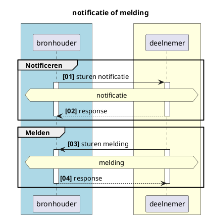
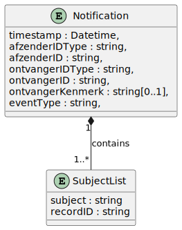
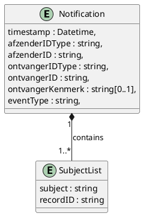

# RFC0008 -  Functionele uitwerking notificaties

> [!IMPORTANT]
> Op dit moment wordt deze RFC geactualiseerd met het voorbeeld volgens de afgesproken graphql-mutation


---

<font size="4">**SAMENVATTING**</font>

**Huidige situatie:**

Er is alleen nog een notificatie van het CIZ naar het zorgkantoor dat verantwoordelijk is voor de regio waar de postcode uit de BRP van de client in valt. Deze notificatie is nog niet generiek opgezet.

**Beoogde situatie**

Dit document beschrijft functioneel de generieke werking van notificaties en meldingen in het Netwerkmodel iWlz. Met notificaties of meldingen worden respectievelijke afnemer of bronhouder geattendeerd op nieuwe informatie die relevant is voor die afnemer of bronhouder. 

> **NB. De in deze RFC beschreven *VRIJWILLIGE* notificaties worden NIET in de eerste implementatie van notificaties gerealiseerd. Een aantal afhankelijkheden zijn daardoor nog niet noodzakelijk. Het gaat om:**
> - De Dienstencatalogus, beschreven in RFC0020;
> - Abonnementenvoorziening, beschreven in RFC0025;
>

<font size="4">**Status RFC**</font>

Volg deze [link](https://github.com/iStandaarden/iWlz-RFC/issues/2) om de actuele status van deze RFC te bekijken.

---
**Inhoudsopgave**
- [RFC0008 -  Functionele uitwerking notificaties](#rfc0008----functionele-uitwerking-notificaties)
- [1. Inleiding](#1-inleiding)
  - [1.1 Uitgangspunten](#11-uitgangspunten)
  - [1.2 Relatie andere RFC](#12-relatie-andere-rfc)
  - [1.3 Code-repository](#13-code-repository)
- [2. Terminologie](#2-terminologie)
- [3. Notificatie of melding wat is het verschil](#3-notificatie-of-melding-wat-is-het-verschil)
- [4. Notificaties](#4-notificaties)
  - [4.1 Doel notificatie](#41-doel-notificatie)
  - [4.2 Typen notificatie](#42-typen-notificatie)
  - [4.3 Inhoud notificatie](#43-inhoud-notificatie)
    - [4.3.1 Afzender en Ontvanger lijst](#431-afzender-en-ontvanger-lijst)
  - [4.4 Notificeren](#44-notificeren)
    - [4.4.1 Voorbeeld notificatie:](#441-voorbeeld-notificatie)
  - [4.5 iWlz-notificatie-typen](#45-iwlz-notificatie-typen)
    - [4.5.1 iWlz VERPLICHTE notificaties](#451-iwlz-verplichte-notificaties)
    - [4.5.1 iWlz VRIJWILLIGE notificaties](#451-iwlz-vrijwillige-notificaties)
  - [4.6 Publiceren en raadplegen beschikbare Notificatietype](#46-publiceren-en-raadplegen-beschikbare-notificatietype)
- [5. Ontvangen iWlz-verplichte notificatie](#5-ontvangen-iwlz-verplichte-notificatie)
- [6. Ontvangen (iWlz-) vrijwillige notificatie dmv abonneren](#6-ontvangen-iwlz--vrijwillige-notificatie-dmv-abonneren)

---


# 1. Inleiding
Binnen het iWlz netwerkmodel werken we met generieke technische oplossingen en contracten om minimaal afhankelijk te zijn van gezamenlijke releases. Daarom werken we bijvoorbeeld met GraphQL, zodat het uitleveren van extra gegevens via een register geen impact heeft op de overige deelnemers aan het netwerk. 

Het netwerkmodel moet in zijn geheel wel ondersteuning bieden aan het gehele iWlz ketenproces. Daarvoor is het in bepaalde situaties nodig om als ketenpartij op de hoogte gebracht te worden van relevante informatie om de voortgang in het proces van zorglevering aan een client te waarborgen. Een deelnemer moet daarom genotificeerd worden dat er relevante informatie beschikbaar is. 

Deze RFC beschrijft de werking van notificeren in het iWlz Netwerkmodel.

## 1.1 Uitgangspunten

| **Uitgangspunt** | **Voor eerste implementatie?** |
|---|---|
| - Er is een catalogus voorziening: **Dienstencatalogus** waarin notificatietypen gepubliceerd kunnen worden. | nee |
| - Er is een **Adresboek** waarin per deelnemer de (notificatie-)endpoints beschikbaar zijn. | ja |
| - Netwerkdeelnemers raadplegen de **Dienstencatalogus** om op te halen welke abonnementen geplaatst kunnen worden en welke voorwaarden hier aan zitten. | nee |
| - Een abonnement wordt geplaatst door een deelnemer van het netwerk (abonnee) bij de partij die het notificatie-type afhandeld (de bronhouder). | nee |
| - Notificaties die randvoorwaardelijk zijn om een wettelijke taak uit te kunnen voeren worden door de bronhouder verstuurd zonder een apart abonnement per deelnemer. | ja |
| - Om een abonnement te kunnen plaatsen heeft een deelnemer een attest van deelname nodig. | nee |
| - Een notificatie is dun. Dat wil zeggen dat de ontvanger op basis van de notificatie in staat is te bepalen welke informatie relevant is om te raadplegen. | ja |
| - Een abonnement is in de basis permanent. De abonnee is zelf verantwoordelijk voor het intrekken van het abonnement. Bij uittreding uit het netwerk, bijvoorbeeld vanwege fusie of faillissement, kunnen abonnementen in bulk worden opgeruimd of gemuteerd. Dit zal in de praktijk altijd maatwerk zijn. | nee |
| - Silverster abonneert zich niet op de (iWlz-)vrijwillige notificaties. | ja |
| - Silverster handelt geen (iWlz-)vrijwillige notificaties af. | ja |

## 1.2 Relatie andere RFC
Deze RFC heeft een relatie met de volgende andere RFC(s):
| RFC | onderwerp | relatie<sup>*</sup> | toelichting | issue | 
|---|---|---|---|---:|
| [RFC0003](/RFC/RFC0003%20-%20Adresboek.md) | Adresboek | afhankelijk | beschrijft realisatie Adresboek | [#4](https://github.com/iStandaarden/iWlz-RFC/issues/4) |
| [RFC0020](/RFC/RFC0024%20-%20Opslag%20iWlz%20Notificatietypen%20in%20dienstencatalogus.md) | Opslag en Raadplegen iWlz notificatietypen in dienstencatalogus | afhankelijk | beschrijft functioneel de dienst om notificatie-typen te publiceren en raadplegen | [#20](https://github.com/iStandaarden/iWlz-RFC/issues/24) | 
| [RFC0018](/RFC/RFC0018%20-%20Melden%20van%20fouten%20in%20gegevens%20volgens%20iStandaard%20iWlz.md) | Meldingen: Melden van iWlz gegevensfouten | gerelateerd | beschrijft het stroom van raadpleger aan bronhouder | [#16](https://github.com/iStandaarden/iWlz-RFC/issues/16) |
| [RFC0025](/RFC/RFC0025%20-%20Abonnementenvoorziening%20voor%20(iWlz)%20vrijwillige%20notificaties.md) | Abonnementenvoorziening | afhankelijk | beschrijft de abonnementenvoorziening noodzakelijk voor het ondersteunen van (iWlz) vrijwillige notificaties | [#36](https://github.com/iStandaarden/iWlz-RFC/issues/36) | 

<sup>*</sup>voorwaardelijk,*voor andere RFC* / afhankelijk, *van andere RFC*

## 1.3 Code-repository
De benodigde code staat in [https://github.com/iStandaarden/iWlz-generiek/tree/master](https://github.com/iStandaarden/iWlz-generiek/tree/master)


# 2. Terminologie
| Terminologie | Omschrijving                                                          |
| :----------- | :-------------------------------------------------------------------- |
| Backoffice   | Omgeving rondom het register voor de afhandeling van netwerk-diensten |
| Bronhouder   | Aanbieder van de data, houder van het register                        |
| Deelnemer    | De raadpleger van de bron, het register                               |
| Register     | De feitelijke databron/database                                       |


# 3. Notificatie of melding wat is het verschil


<details>
<summary>plantUML-source</summary>


</details>

|             | Van        | Naar       | Omschrijving                                                                                                                                                                |
| :---------- | :--------- | :--------- | :-------------------------------------------------------------------------------------------------------------------------------------------------------------------------- |
| Notificatie | Bronhouder | Deelnemer  | op de hoogte stellen van een deelnemer over dat er nieuwe (of gewijzigde) informatie in een bron beschikbaar is die directe of afgeleide betrekking heeft op die deelnemer. |
| Melding     | Deelnemer  | Bronhouder | verzoek tot muteren of het beschikbaar stellen van nieuwe informatie naar aanleiding van een gebeurtenis van een deelnemer aan een bron                                     |

Het onderdeel Melding is verder uitgewerkt in [**RFC0018 - (Fout-)meldingen iWlz Netwerkmodel**](/RFC/RFC0018%20-%20Melden%20van%20fouten%20in%20gegevens%20volgens%20iStandaard%20iWlz.md).


# 4. Notificaties

## 4.1 Doel notificatie
Het doel van een notificatie is het op de hoogte stellen van een deelnemer door een bron over nieuwe (of gewijzigde) informatie die directe of afgeleide betrekking heeft op die deelnemer en daarmee de deelnemer in staat stellen op basis van die notificatie de nieuwe informatie te raadplegen. Een notificatie verloopt altijd van bronhouder naar deelnemer.

De reden voor notificatie is altijd de registratie of wijziging van gegevens in een bronregister. Dit is de *notificatie-trigger* en beschrijft welk CRUD-event in het register leidt tot een notificatie. 


## 4.2 Typen notificatie
Er zijn twee typen notificatie gedefinieerd, waarbij het onderscheid zit in de vrijwilligheid van het ontvangen van de notificatie door een deelnemer of het noodzakelijk ontvangen van de notificatie door de deelnemer. Wanneer het voor de afgesproken werking van de iWlz noodzakelijk is een deelnemer van een CRUD-event in een register op de hoogte te stellen is er sprake van een **iWlz-verplichte** notificatie. Een bronhouder moet deze notificatie versturen en een deelnemer hoeft zich voor de deze notificatie niet te abonneren. Is voor een goede werking van de iWlz gewenst dat een deelnemer op de hoogte wordt gesteld van een CRUD-event, maar niet noodzakelijk, dan hoeft een bronhouder een notificatie alleen te versturen wanneer de deelnemer zich heeft geabonneerd op deze notificatie.  

Denk bijvoorbeeld aan de registratie van een nieuw indicatiebesluit. Het zorgkantoor dat verantwoordelijk is voor de regio waarin de client van het indicatiebesluit volgens het BRP woont, moet op de hoogte gesteld worden. Het CIZ **moet** daarom een dergelijke notificatie verzenden aan het zorgkantoor en het zorgkantoor **moet** de notificatie volgens iWlz-afspraken afhandelen. Het zorgkantoor hoeft zich niet apart op deze notificatie *"nieuwe indicatie voor zorgkantoor"* te abonneren.  

De twee typen iWlz notificaties zijn daarom: 

| Type notificatie | Verzenden notificatie | Invloed deelnemer                       | Onderdeel eerste implementatie? |
| :--------------- | :-------------------- | :-------------------------------------- | :--- |
| iWlz-Verplicht   | Altijd                | Geen keuze; ontvangt notificatie altijd | Ja |
| iWlz-Vrijwillig  | Alleen naar abonnee's | Keuze ligt bij deelnemer                | Nee |


## 4.3 Inhoud notificatie
De notificatie is in structuur gelijk aan de melding (zie [RFC0018](/RFC/RFC0018%20-%20Melden%20van%20fouten%20in%20gegevens%20volgens%20iStandaard%20iWlz.md)). Op basis van de inhoud van een notificatie moet de ontvanger van de notificatie onder andere kunnen bepalen:
  - wat is de trigger, wat is de reden van de notificatie
  - van welke bronhouder is de notificatie afkomstig
  - wanneer is de notifictie verzonden
  - op welke informatie de notificatie betrekking heeft
  - informatie om een gerichte raadpleging te kunnen doen
  - autorisatievoorziening moet voldoende informatie hebben om te kunnen bepalen dat de notificatie terecht is. (Bijvoorbeeld: Notificatietype mag verzonden worden door verzender en stuurt naar juiste type ontvanger)

De notificatie bevat de volgende gegevens:
| Gegeven          | Algemene beschrijving                                              | Specifieke beschrijving voor notificeren                               | V/O<sup>*</sup> | Type     |
| ---------------- | ------------------------------------------------------------------ | ---------------------------------------------------------------------- | :-------------: | -------- |
| timestamp        | Tijdstip waarop de notificatie is aangemaakt                       |                                                                        |        V        | Datetime |
| afzenderIDType   | Kenmerk van het type ID van de verzendende partij                  |                                                                        |        V        | String   |
| afzenderID       | Identificatie van de verzender van het bericht                     |                                                                        |        V        | String   |
| ontvangerIDType  | Kenmerk van het type ID van de ontvangende partij                  |                                                                        |        V        | String   |
| ontvangerID      | Identifictie van de ontvanger van het bericht                      |                                                                        |        V        | String   |
| ontvangerKenmerk | Kenmerk van de ontvanger:                                          | Bij iWlz-vrijwillige notificatie gevuld met abonnementsID. Anders leeg |        O        | String   |
| eventType        | Onderwerptype van het bericht; wat is de reden van het bericht     | NotificatieTypeID (zie tabel)                                          |        V        | String   |
| subjectList      | Lijst met onderwerpen van het bericht                              | ...                                                                    |        V        | Array    |
| ../subject       | Onderwerp van het bericht                                          | Identificatie van het parent-object waarover de autorisatie loopt.     |        V        | String   |
| ../recordID      | Identificatie van het record waar het bericht betrekking op heeft. | Identificatie van het record waar de notificatie betrekking op heeft.  |        V        | String   |

<sup>*</sup> V = verplicht / O = Optioneel



<details>
  <summary>plantUML-source</summary>


</details>

<details>
  <summary>open json-schema</summary>

```json
{
  "title": "notification-definition",
  "description": "json-schema definitie voor iWlz-notificatie en iWlz-melding",
  "type": "object",
  "properties": {
    "timestamp": {
      "type": "string"
    },
    "afzenderIDType": {
      "type": "string"
    },
    "afzenderID": {
      "type": "string"
    },
    "ontvangerIDType": {
      "type": "string"
    },
    "ontvangerID": {
      "type": "string"
    },
    "ontvangerKenmerk": {
      "type": "string"
    },
    "eventType": {
      "type": "string"
    },
    "subjectList": {
      "type": "array",
      "items": {
        "type": "object",
        "properties": {
          "subject": {
            "type": "string"
          },
          "recordID": {
            "type": "string"
          }
        },
        "required": [
          "subject",
          "recordID"
        ]
      }
    }
  },
  "required": [
    "timestamp",
    "afzenderIDType",
    "afzenderID",
    "ontvangerIDType",
    "ontvangerID",
    "eventType",
    "subjectList"
  ]
}
```
</details>

### 4.3.1 Afzender en Ontvanger lijst
| Code | Omschrijving | Referentie | Toepassing |
| :-- | :-- | :-- | :-- |
|  AGB | AGB-code | [AGB-register](https://www.vektis.nl/agb-register/zoeken) | identificatie Zorgaanbieder |
|  BSN | Burgerservicenummer | | identificatie Burger (nog geen toepassing) |
|  KVK | Kamer van Koophandel | [KVK-register](https://www.kvk.nl/zoeken/) | identificatie Ondernemer (CIZ bij eerste implementatie<sup>*</sup>) |
|  OIN | Organisatie Identificatienummer | [OIN-register](https://www.vektis.nl/agb-register/zoeken) | identificatie CIZ (toekomstig<sup>*</sup>) |
|  UZOVI | Unieke ZorgVerzekeraarsIdentificatie | [UZOVI-register](https://www.vektis.nl/uzovi-register) | identificatie Zorgkantoren |

<sup>*</sup> Op dit moment is het voor VECOZO niet mogelijk om een OIN te verifieren waardoor er geen claim kan worden afgegeven op basis van OIN. Bij de eerste implementatie van notificaties zal voor de identificatie van het CIZ  het KVK-nummer (62253778) worden gebruikt. 
## 4.4 Notificeren


<details>
  <summary>plantUML-source</summary>

  ```plantuml
  @startuml rfc008-02-notificatie_sequence
  title notificatie sequence-diagram
  skinparam handwritten false
  skinparam participantpadding 20
  skinparam boxpadding 40
  autonumber "<b>[00]"
  box bronhouder #lightblue
  participant "Register" as bs
  participant "Register- \ndata" as rg
  end box

  box adresboek
  participant "Adresboek" as ab
  end box

  box deelnemer #lightyellow
  participant "Resource" as dnp
  end box

    bs -> rg : registratie data
    activate rg
    activate bs
    rg -> rg: event trigger
    rg -> bs : bepaal notificatietype
    deactivate rg

      alt iWlz-vrijwillige notificatie
      bs -> bs: raadpleeg abonnementenregistratie
      activate bs #grey
      bs -> bs: geef geabonneerde deelnemer
      deactivate bs
      end 

    bs -> ab: zoek endpoint & ID deelnemer op

    activate ab
    ab -> bs: return {endpoint & ID deelnemer}
    deactivate ab
    bs -> bs: genereer notificatie
    bs -> dnp: zend notificatie
    activate dnp
    dnp -> dnp: ontvang notificatie
    dnp --> bs: 200 response
    deactivate dnp  
    bs --> bs: verwerk response

  @enduml
  ```
</details>


| #    | Beschrijving                      | Toelichting                                                                                            | Voorbeeld: Bemiddeling voor zorgaanbieder                                                                          |
| :--- | :-------------------------------- | :----------------------------------------------------------------------------------------------------- | :----------------------------------------------------------------------------------------------------------------- |
| 01   | registratie data                  | data vanuit backoffice in register plaatsen                                                            | Zorgkantoor bemiddelt client naar een zorgaanbieder en registreert het resultaat in het bemiddelingsregister       |
| 02   | event trigger                     | registratie of wijziging data laat een notificatie trigger afgaan                                      | Doordat de agbCode van de zorgaanbieder onder Instelling wordt gevuld in Bemiddelingspecificatie, gaat er een trigger af                       |
| 03   | bepaal notificatietype            | bepaal notificatietype en bepaal of het een verplichte of vrijwillige notificatie is                   | Het is de trigger van de iWlz-verplichte notificatie: NIEUWE_BEMIDDELINGSPECIFICATIE_ZORGAANBIEDER.                      |
| ALT  | *iWlz-vrijwillig notificatietype* | *bij een iWlz-vrijwillige notificatie moet de abonnementenregistrate worden geraadpleegd op abonnee's* | nvt.                                                                                                               |
| 04   | raadpleeg abonnementenregistratie | bepaal of er abonnee's zijn voor het vrijwillige notificatietype                                       |
| 05   | geef geabonneerde deelnemer       | geef informatie over geabonneerde deelnemer om de notificatie te versturen                             |
| 06   | zoek endpoint deelnemer op        | bepaal waar de notificatie moet worden afgeleverd                                                      | Met de geregisteerde agbCode kan het endpoint en ID van de zorgaanbieder worden opgezocht                          |
| 07   | return {endpoint; ID deelnemer}   | ontvang het afleveradres en ID voor de notificatie                                                     |
| 08   | genereer notificatie              | maak de gewenste notificatie aan                                                                       | Gebruik ontvangen ID in notificatie (zie voorbeeld 4.4.1)                                                          |
| 09   | zend notificatie                  | verstuur de notificatie naar het endpoint van de deelnemer                                             | Gebruik ontvangen endpoint als afleveradres                                                                        |
| 10   | verwerk notificatie               | verwerk de ontvangen notificatie                                                                       |
| 11   | http-response {200}               | stuur ontvangst bevestiging                                                                            | De zorgaanbieder bevestigt de ontvangst van de notificatie en kan deze verwerken en gebruiken voor een raadpleging |
| 12   | verwerk response                  | bevestig ontvangst notificatie                                                                         |

Zodra een event zich voordoet waarvoor een notificatie-trigger is gedefinieerd verstuurd de bronhouder de bijbehorende notificatie. 

### 4.4.1 Voorbeeld notificatie: 
Het gaat hier om een notificatie als gevolg van een nieuwe registratie in ‘Bemiddelingspecficatie’ voor een zorgaanbieder. Met deze registratie ontstaat er een nieuw record waarvan de zorgaanbieder op de hoogte moet worden gesteld. Hiervoor is de verplichte notificatie: NIEUWE_BEMIDDELINGSPECIFICATIE_ZORGAANBIEDER die naar de zorgaanbieder genoemd onder Instelling in het record moet worden verstuurd. Op basis van het recordID kan die zorgaanbieder een raadpleging doen. 

Notificatie:

```json
{
  "timestamp": "2022-09-27T12:07:07.492+1",
  "afzenderIDType": "UZOVI",
  "afzenderID": "5505",
  "ontvangerIDType": "Agbcode",
  "ontvangerID": "12341234",
  "ontvangerKenmerk": "3fa85f64-5717-4562-b3fc-2c963f66afa6",
  "eventType": "NIEUWE_BEMIDDELINGSPECIFICATIE_ZORGAANBIEDER",
  "subjectList": [
    {
      "subject": "Bemiddeling/da8ebd42-d29b-4508-8604-ae7d2c6bbddd",
      "recordID": "Bemiddelingspecificatie/da8ebd42-d29b-4508-8604-ae7d2c6bbddd"
    }
  ]

}
```
Succesvol response: 
```http
HTTP/1.1 204 (No content)
```
Validatie fout response:
```http
HTTP/1.1 400 Bad Request
{"ErrorCode" : "invalid_request", "Error" :"Validation failed"}
```

## 4.5 iWlz-notificatie-typen
Alleen de notificaties die afgesproken zijn tussen een of meerdere ketenpartijen van de iWlz worden hier beschreven. Deze notificaties **moet** een iWlz-bronhouder kunnen vesturen. Of een deelnemer de notificatie ontvangt is afhankelijk van het type. Een ***iWlz-verplichte*** notificatie ontvangt een deelnemer **altijd** wanneer die van toepassing is op die deelnemer. Een ***iWlz-vrijwillige*** notificatie ontvangt een deelnemer wanneer de notificatie van toepassing is op die deelnemer **EN** als die deelnemer is geabonneerd op die notificatie bij de bronhouder.

*Het staat een bronhouder en deelnemer vrij om buiten de afgesproken iWlz notificatie een willekeurige notificatie af te spreken en te faciliteren met een deelnemer. Deze ‘ongereguleerde’ notificaties worden verder niet besproken, maar passen in hetzelfde principe van het iWlz-vrijwillige abonnement.*

Er zijn momenteel twee registers in ontwikkeling, het Indicatieregister van het CIZ en het Bemiddelingsregister van de zorgkantoren. Hiervoor zijn er nu de volgende iWlz notificaties gespecificeerd die gerealiseerd zullen worden. 

### 4.5.1 iWlz VERPLICHTE notificaties

Zie voor de actuele lijst het [Informatiemodel iWlz](https://informatiemodel.istandaarden.nl/Landing/) bij de registers onder het kopje Notificaties.


### 4.5.1 iWlz VRIJWILLIGE notificaties
Zie voor de actuele lijst het [Informatiemodel iWlz](https://informatiemodel.istandaarden.nl/Landing/) bij de registers onder het kopje notificaties.

> N.B. In de eerste implementatie van notificaties zijn iWlz-VRIJWILLIGE notificaties nog niet beschikbaar, waardoor een abonnementenregistratie voorziening ook niet nodig is. 

## 4.6 Publiceren en raadplegen beschikbare Notificatietype
Dit onderdeel is beschreven in een afzonderlijke RFC: [RFC0024 - Opslag iWlz Notificatietypen in dienstencatalogus](/RFC/RFC0024%20-%20Opslag%20iWlz%20Notificatietypen%20in%20dienstencatalogus.md)

# 5. Ontvangen iWlz-verplichte notificatie
Voor het ontvangen van een iWlz-verplichte notificatie hoeft een deelnemer geen extra handelingen te doen dan het kenbaar maken van een notifictie-endpoint waarop de notificatie op kunnen worden ontvangen. De als iWlz-verplichte notificaties worden namelijk op basis van de verantwoordelijkheid binnen de iWlz verstuurd en ontvangen. Zo moet een zorgkantoor op de hoogte gebracht worden van een nieuw Indicatiebesluit wanneer deze van een client is die volgens het BRP geregisteerd is in de regio van dat zorgkantoor. Het CIZ zorgt er daarom voor dat de notificatie wordt verzonden. Het ontvangende zorgkantoor heeft hierin geen keuze.

Zie de bijlage voor een overzicht van de iWlz notificatietypen voor het Indicatie- en Bemiddelingsregister.


# 6. Ontvangen (iWlz-) vrijwillige notificatie dmv abonneren
De beschrijving van de abonnenementenvoorziening is verplaatst naar [RFC0025 - Abonnementenvoorziening](/RFC/RFC0025%20-%20Abonnementenvoorziening%20voor%20(iWlz)%20vrijwillige%20notificaties.md).


