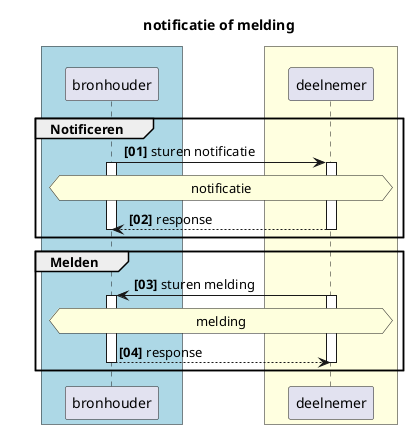
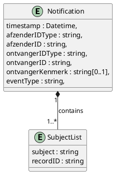
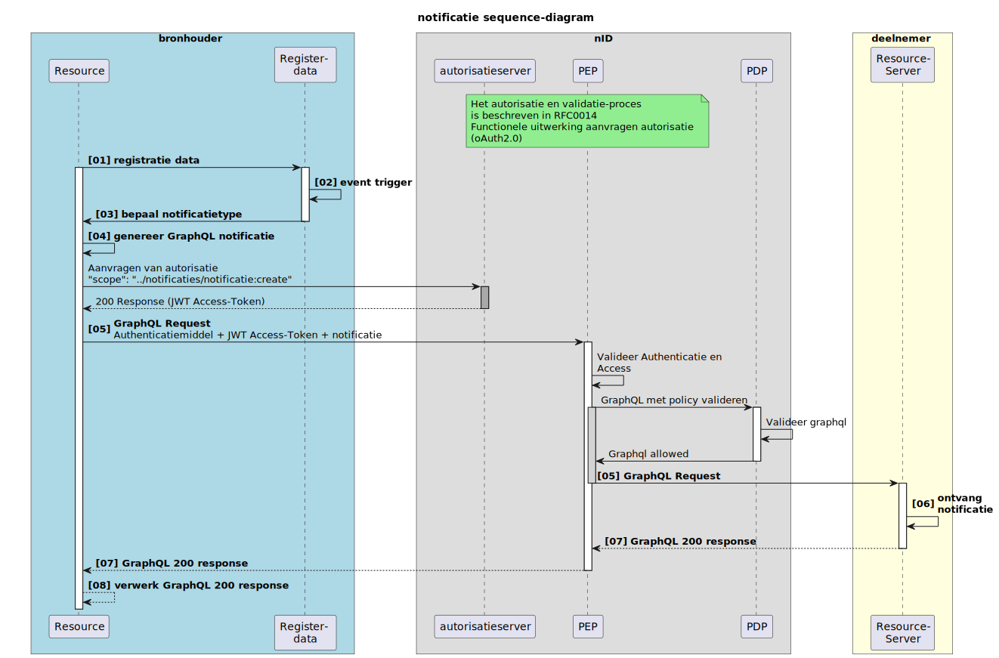
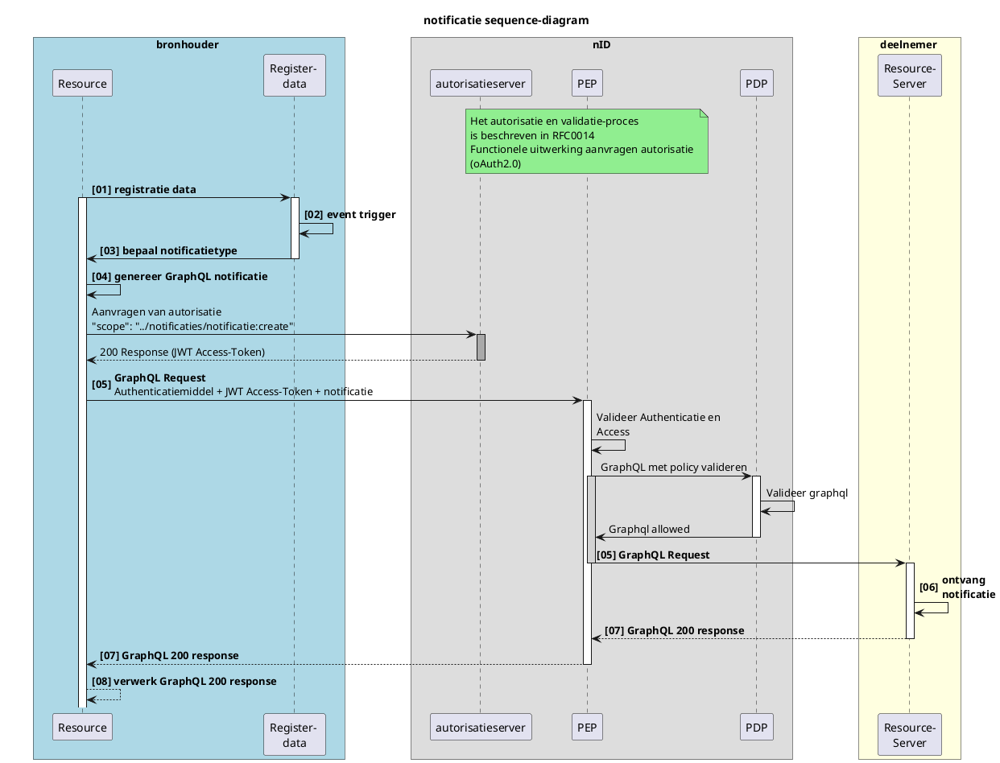
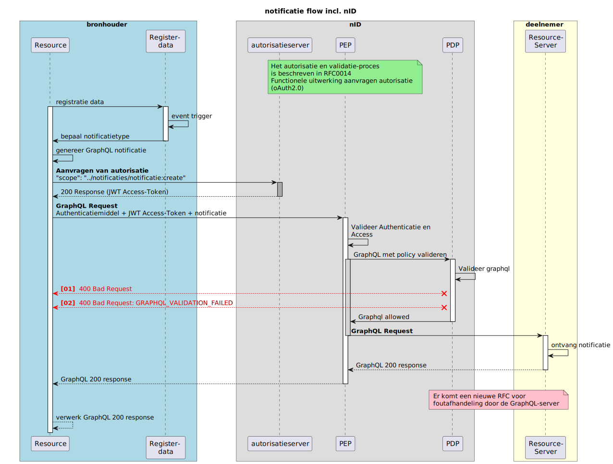
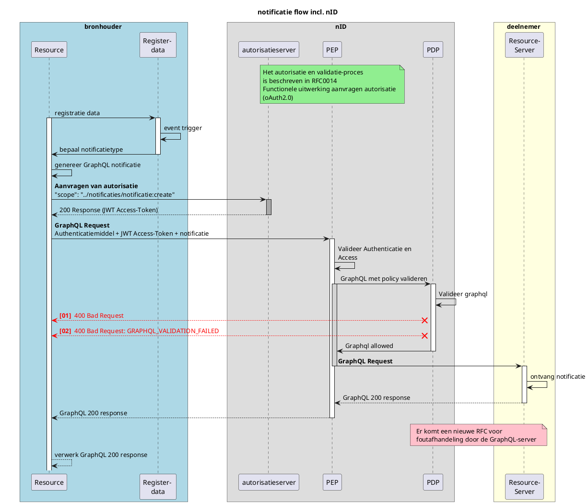

# RFC0008 - Functionele uitwerking notificaties

> versie 1.0 d.d. 05-12-2024

---

<font size="4">**SAMENVATTING**</font>

**Huidige situatie:**

Er is alleen nog een notificatie van het CIZ naar het zorgkantoor dat verantwoordelijk is voor de regio waar de postcode uit de BRP van de client in valt. Deze notificatie is nog niet generiek opgezet.

**Beoogde situatie**

Dit document beschrijft functioneel de generieke werking van notificaties en meldingen in het Netwerkmodel iWlz. Met notificaties of meldingen worden respectievelijke afnemer of bronhouder geattendeerd op nieuwe informatie die relevant is voor die afnemer of bronhouder.

> [!NOTE]
> De in deze RFC beschreven VRIJWILLIGE notificaties worden NIET in de eerste implementatie van notificaties gerealiseerd.

<font size="4">**Status RFC**</font>

Volg deze [link](https://github.com/iStandaarden/iWlz-RFC/issues/2) om de actuele status van deze RFC te bekijken.

---

**Inhoudsopgave**
- [RFC0008 - Functionele uitwerking notificaties](#rfc0008---functionele-uitwerking-notificaties)
- [1. Inleiding](#1-inleiding)
  - [1.1 Uitgangspunten](#11-uitgangspunten)
  - [1.2 Relatie andere RFC](#12-relatie-andere-rfc)
  - [1.3 Code-repository](#13-code-repository)
- [2. Notificatie of melding wat is het verschil](#2-notificatie-of-melding-wat-is-het-verschil)
- [3. Notificaties](#3-notificaties)
  - [3.1 Doel notificatie](#31-doel-notificatie)
  - [3.2 Typen notificatie](#32-typen-notificatie)
    - [3.2.1 iWlz VERPLICHTE notificaties](#321-iwlz-verplichte-notificaties)
  - [3.3 Inhoud notificatie](#33-inhoud-notificatie)
    - [3.3.1 Afzender en Ontvanger lijst](#331-afzender-en-ontvanger-lijst)
  - [3.4 Notificatie-flow](#34-notificatie-flow)
  - [3.5 Voorbeeld notificatie:](#35-voorbeeld-notificatie)
  - [3.6 Notificatie Responses vanuit OPA](#36-notificatie-responses-vanuit-opa)
- [4 Referenties](#4-referenties)

---

# 1. Inleiding

Binnen het iWlz netwerkmodel werken we met generieke technische oplossingen en contracten om minimaal afhankelijk te zijn van gezamenlijke releases. Daarom werken we bijvoorbeeld met GraphQL, zodat het uitleveren van extra gegevens via een register geen impact heeft op de overige deelnemers aan het netwerk.

Het netwerkmodel moet in zijn geheel wel ondersteuning bieden aan het gehele iWlz ketenproces. Daarvoor is het in bepaalde situaties nodig om als ketenpartij op de hoogte gebracht te worden van relevante informatie om de voortgang in het proces van zorglevering aan een client te waarborgen. Een deelnemer moet daarom genotificeerd worden dat er relevante informatie beschikbaar is.

Deze RFC beschrijft de werking van notificeren in het iWlz Netwerkmodel.

## 1.1 Uitgangspunten

- Notificaties die randvoorwaardelijk zijn om een wettelijke taak uit te kunnen voeren worden door de bronhouder verstuurd zonder een apart abonnement per deelnemer.
- Er is een lijst beschikbaar met notificatie end-points
- De notificatie stelt de ontvanger in staat te bepalen welke informatie opgevraagd kan worden.

## 1.2 Relatie andere RFC

Deze RFC heeft een relatie met de volgende andere RFC(s):
| RFC | onderwerp | relatie<sup>\*</sup> | toelichting | issue |
|---|---|---|---|---:|
| [RFC0003](/RFC/RFC0003%20-%20Adresboek.md) | Adresboek | afhankelijk | beschrijft realisatie Adresboek | [#4](https://github.com/iStandaarden/iWlz-RFC/issues/4) |
| [RFC0018](/RFC/RFC0018%20-%20Melden%20van%20fouten%20in%20gegevens%20volgens%20iStandaard%20iWlz.md) | Meldingen: Melden van iWlz gegevensfouten | gerelateerd | beschrijft het stroom van raadpleger aan bronhouder | [#16](https://github.com/iStandaarden/iWlz-RFC/issues/16) |
| [RFC0014](/RFC/RFC0014%20-%20Functionele%20uitwerking%20aanvragen%20van%20autorisatie.md) | Functionele uitwerking aanvragen autorisatie | afhankelijk |Toegang en autorisatie voor verzenden notificatie | [#9](https://github.com/iStandaarden/iWlz-RFC/issues/9) |

## 1.3 Code-repository

De benodigde code staat in [https://github.com/iStandaarden/iWlz-generiek/tree/master](https://github.com/iStandaarden/iWlz-generiek/tree/master)

# 2. Notificatie of melding wat is het verschil


<details>
<summary>plantUML-source</summary>



</details>

|             | Van        | Naar       | Omschrijving                                                                                                                                                                |
| :---------- | :--------- | :--------- | :-------------------------------------------------------------------------------------------------------------------------------------------------------------------------- |
| Notificatie | Bronhouder | Deelnemer  | op de hoogte stellen van een deelnemer over dat er nieuwe (of gewijzigde) informatie in een bron beschikbaar is die directe of afgeleide betrekking heeft op die deelnemer. |
| Melding     | Deelnemer  | Bronhouder | verzoek tot muteren of het beschikbaar stellen van nieuwe informatie naar aanleiding van een gebeurtenis van een deelnemer aan een bron                                     |

Het onderdeel Melding is verder uitgewerkt in [**RFC0018 - (Fout-)meldingen iWlz Netwerkmodel**](/RFC/RFC0018%20-%20Melden%20van%20fouten%20in%20gegevens%20volgens%20iStandaard%20iWlz.md).

# 3. Notificaties

## 3.1 Doel notificatie

Het doel van een notificatie is het op de hoogte stellen van een deelnemer door een bron over nieuwe (of gewijzigde) informatie die directe of afgeleide betrekking heeft op die deelnemer en daarmee de deelnemer in staat stelt op basis van die notificatie de nieuwe informatie te raadplegen. Een notificatie verloopt altijd van bronhouder naar deelnemer.

De reden voor notificatie is altijd de registratie of wijziging van gegevens in een bronregister. Dit is de notificatie-trigger en beschrijft welk CRUD-event in het register leidt tot een notificatie.

## 3.2 Typen notificatie

Er zijn twee typen notificatie gedefinieerd, waarbij het onderscheid zit in de vrijwilligheid van het ontvangen van de notificatie door een deelnemer of het noodzakelijk ontvangen van de notificatie door de deelnemer. Wanneer het voor de afgesproken werking van de iWlz noodzakelijk is een deelnemer van een CRUD-event in een register op de hoogte te stellen is er sprake van een **iWlz-verplichte** notificatie. Een bronhouder moet deze notificatie versturen en een deelnemer hoeft zich voor de deze notificatie niet te abonneren. Is voor een goede werking van de iWlz gewenst dat een deelnemer op de hoogte wordt gesteld van een CRUD-event, maar niet noodzakelijk, dan hoeft een bronhouder een notificatie alleen te versturen wanneer de deelnemer zich heeft geabonneerd op deze notificatie.

Denk bijvoorbeeld aan de registratie van een nieuw indicatiebesluit. Het zorgkantoor dat verantwoordelijk is voor de regio waarin de client van het indicatiebesluit volgens het BRP woont, moet op de hoogte gesteld worden. Het CIZ **moet** daarom een dergelijke notificatie verzenden aan het zorgkantoor en het zorgkantoor **moet** de notificatie volgens iWlz-afspraken afhandelen. Het zorgkantoor hoeft zich niet apart op deze notificatie _"nieuwe indicatie voor zorgkantoor"_ te abonneren.

De twee typen iWlz notificaties zijn daarom:

| Type notificatie | Verzenden notificatie | Invloed deelnemer                       |
| :--------------- | :-------------------- | :-------------------------------------- |
| iWlz-Verplicht   | Altijd                | Geen keuze; ontvangt notificatie altijd |
| iWlz-Vrijwillig  | Alleen naar abonnee's | Keuze ligt bij deelnemer                |

> [!NOTE]
> In de eerste implementatie zal er alleen sprake zijn van iWlz-verplichte notificaties. Er zal geen functionaliteit worden ondersteund voor de iWlz-vrijwillige notificatie en er zal verder in deze RFC niet worden besproken.

### 3.2.1 iWlz VERPLICHTE notificaties

Zie voor de actuele lijst het [Informatiemodel iWlz](https://informatiemodel.istandaarden.nl/iWlz-Indicatie-2/) bij de Registers onder het kopje Notificaties.
| ObjectID | Omschrijving | Afzender | Type |
|---|---|---|---|
| GEWIJZIGDE_BEMIDDELINGSPECIFICATIE_ZORGAANBIEDER | Notificatie aan de zorgaanbieder als het verantwoordelijke zorgkantoor een Bemiddelingspecificatie van deze zorgaanbieder heeft gewijzigd. | Bemiddelingsregister | VERPLICHT |
| GEWIJZIGDE_BEMIDDELINGSPECIFICATIE_ZORGKANTOOR | Notificatie aan het uitvoerende zorgkantoor als het verantwoordelijke zorgkantoor een Bemiddelingspecificatie van een gecontracteerde zorgaanbieder (van dit uitvoerende zorgkantoor) heeft gewijzigd. | Bemiddelingsregister | VERPLICHT |
| GEWIJZIGDE_OVERDRACHT_ZORGKANTOOR | Notificatie aan het nieuwe verantwoordelijke zorgkantoor als het huidige (oude) verantwoordelijke zorgkantoor een Overdracht heeft gewijzigd. | Bemiddelingsregister | VERPLICHT |
| GEWIJZIGDE_REGIEHOUDER_ZORGAANBIEDER | Notificatie aan de zorgaanbieder als het verantwoordelijke zorgkantoor de regieperiode van deze zorgaanbieder heeft gewijzigd. | Bemiddelingsregister | VERPLICHT |
| NIEUWE_BEMIDDELINGSPECIFICATIE_ZORGAANBIEDER | Notificatie aan de zorgaanbieder als het verantwoordelijke zorgkantoor een nieuwe Bemiddelingspecificatie voor deze zorgaanbieder heeft geregistreerd. | Bemiddelingsregister | VERPLICHT |
| NIEUWE_BEMIDDELINGSPECIFICATIE_ZORGKANTOOR | Notificatie aan het uitvoerende zorgkantoor als het verantwoordelijke zorgkantoor een nieuwe Bemiddelingspecificatie voor een gecontracteerde zorgaanbieder (van dit uitvoerende zorgkantoor) heeft geregistreerd. | Bemiddelingsregister | VERPLICHT |
| NIEUWE_INDICATIE_ZORGKANTOOR | Notificatie aan het zorgkantoor als het CIZ een nieuwe Wlz-indicatie heeft geregistreerd voor een cliënt die in de regio van dit zorgkantoor woont. | Indicatieregister | VERPLICHT |
| NIEUWE_OVERDRACHT_ZORGKANTOOR | Notificatie aan het nieuwe verantwoordelijke zorgkantoor als het huidige (oude) verantwoordelijke zorgkantoor een Overdracht heeft geregistreerd. | Bemiddelingsregister | VERPLICHT |
| NIEUWE_REGIEHOUDER_ZORGAANBIEDER | Notificatie aan de zorgaanbieder als het verantwoordelijke zorgkantoor deze zorgaanbieder als Regiehouder heeft geregistreerd. | Bemiddelingsregister | VERPLICHT |
| VERVALLEN_INDICATIE_ZORGKANTOOR | Notificatie aan het zorgkantoor als het CIZ een nieuwe vervaldatum heeft geregistreerd, of een vervaldatum heeft gewijzigd of verwijderd, bij een Wlz-indicatie waarvoor dit zorgkantoor verantwoordelijk is, was of wordt. | Indicatieregister | VERPLICHT |
| VERWIJDERDE_BEMIDDELINGSPECIFICATIE_ZORGAANBIEDER | Notificatie aan de zorgaanbieder als het verantwoordelijke zorgkantoor een Bemiddelingspecificatie van deze zorgaanbieder heeft verwijderd. | Bemiddelingsregister | VERPLICHT |
| VERWIJDERDE_BEMIDDELINGSPECIFICATIE_ZORGKANTOOR | Notificatie aan het uitvoerende zorgkantoor als het verantwoordelijke zorgkantoor een Bemiddelingspecificatie van een gecontracteerde zorgaanbieder (van dit uitvoerende zorgkantoor) heeft verwijderd. | Bemiddelingsregister | VERPLICHT |
| VERWIJDERDE_OVERDRACHT_ZORGKANTOOR | Notificatie aan het nieuwe verantwoordelijke zorgkantoor als het huidige (oude) verantwoordelijke zorgkantoor een Overdracht heeft verwijderd. | Bemiddelingsregister | VERPLICHT |
| VERWIJDERDE_REGIEHOUDER_ZORGAANBIEDER | Notificatie aan de zorgaanbieder als het verantwoordelijke zorgkantoor deze zorgaanbieder als Regiehouder heeft verwijderd. | Bemiddelingsregister | VERPLICHT |

## 3.3 Inhoud notificatie

De notificatie is in structuur gelijk aan de melding (zie [RFC0018](/RFC/RFC0018%20-%20Melden%20van%20fouten%20in%20gegevens%20volgens%20iStandaard%20iWlz.md)). Op basis van de inhoud van een notificatie moet de ontvanger van de notificatie onder andere kunnen bepalen:

- wat is de trigger, wat is de reden van de notificatie
- van welke bronhouder is de notificatie afkomstig
- wanneer is de notificatie verzonden
- op welke informatie de notificatie betrekking heeft
- informatie om een gerichte raadpleging te kunnen doen
- autorisatievoorziening moet voldoende informatie hebben om te kunnen bepalen dat de notificatie terecht is. (Bijvoorbeeld: Notificatietype mag verzonden worden door verzender en stuurt naar juiste type ontvanger)

De notificatie bevat de volgende gegevens:
| Gegeven | Algemene beschrijving | Specifieke beschrijving voor notificeren | V/O<sup>\*</sup> | Type |
| ---------------- | ------------------------------------------------------------------ | ---------------------------------------------------------------------- | :-------------: | -------- |
| timestamp | Tijdstip waarop de notificatie is aangemaakt | | V | Datetime [^1] |
| afzenderIDType | Kenmerk van het type ID van de verzendende partij | | V | String |
| afzenderID | Identificatie van de verzender van het bericht | | V | String |
| ontvangerIDType | Kenmerk van het type ID van de ontvangende partij | | V | String |
| ontvangerID | Identifictie van de ontvanger van het bericht | | V | String |
| ontvangerKenmerk | Kenmerk van de ontvanger: | Bij iWlz-vrijwillige notificatie gevuld met abonnementsID. Anders leeg | O | String |
| eventType | Onderwerptype van het bericht; wat is de reden van het bericht | Notificatie Object ID[^2] | V | String |
| subjectList | Lijst met onderwerpen van het bericht | ... | V | Array |
| ../subject | Onderwerp van het bericht | Identificatie van het parent-object waarover de autorisatie loopt. | V | String |
| ../recordID | Identificatie van het record waar het bericht betrekking op heeft. | Identificatie van het record waar de notificatie betrekking op heeft. | V | String |

<sup>\*</sup> V = verplicht / O = Optioneel

[^1]: Datetime volgens ISO-8601 zie https://en.wikipedia.org/wiki/ISO_8601 en https://scalars.graphql.org/andimarek/date-time. Formaat is bijvoorbeeld: 2016-07-20T17:30:15Z, 2016-07-20T17:30:15+05:30, 2016-07-20T17:30:15.234890+05:30

[^2]: Zie Informatiemodel iWlz onder het kopje Notificaties https://informatiemodel.istandaarden.nl/iWlz-Bemiddeling-1/ of https://informatiemodel.istandaarden.nl/iWlz-Indicatie-2/


<details>
  <summary>plantUML-source</summary>



</details>

### 3.3.1 Afzender en Ontvanger lijst

| Code  | Omschrijving                         | Referentie                                                | Toepassing                                                           |
| :---- | :----------------------------------- | :-------------------------------------------------------- | :------------------------------------------------------------------- |
| AGB   | AGB-code                             | [AGB-register](https://www.vektis.nl/agb-register/zoeken) | identificatie Zorgaanbieder                                          |
| BSN   | Burgerservicenummer                  |                                                           | identificatie Burger (nog geen toepassing)                           |
| KVK   | Kamer van Koophandel                 | [KVK-register](https://www.kvk.nl/zoeken/)                | identificatie Ondernemer (CIZ bij eerste implementatie<sup>\*</sup>) |
| OIN   | Organisatie Identificatienummer      | [OIN-register](https://www.vektis.nl/agb-register/zoeken) | identificatie CIZ (toekomstig[^3])                                   |
| UZOVI | Unieke ZorgVerzekeraarsIdentificatie | [UZOVI-register](https://www.vektis.nl/uzovi-register)    | identificatie Zorgkantoren                                           |

[^3]: Op dit moment is het voor VECOZO niet mogelijk om een OIN te verifieren waardoor er geen claim kan worden afgegeven op basis van OIN. Bij de eerste implementatie van notificaties zal voor de identificatie van het CIZ het KVK-nummer (62253778) worden gebruikt.

## 3.4 Notificatie-flow

> [!NOTE]
> De hier beschreven flow beschrijft alleen het notificeren zelf.Voor het notificeren is autorisatie nodig. Het aanvragen van autorisatie en de bijbehorende flow is beschreven in [RFC0014 - Functionele uitwerking aanvragen autorisatie](https://github.com/iStandaarden/iWlz-RFC/blob/main/RFC/RFC0014%20-%20Functionele%20uitwerking%20aanvragen%20van%20autorisatie.md) .



<details>
  <summary>plantUML-source</summary>



</details>

| #   | Beschrijving                 | Toelichting                                                                          | Voorbeeld: Bemiddeling voor zorgaanbieder                                                                                                                        |
| --- | ---------------------------- | ------------------------------------------------------------------------------------ | ---------------------------------------------------------------------------------------------------------------------------------------------------------------- |
| 01  | registratie data             | data vanuit backoffice in register plaatsen                                          | Het CIZ registreert een nieuwe Wlz Indicatie voor een cliënt                                                                                                     |
| 02  | event trigger                | registratie of wijziging data laat een notificatie trigger afgaan                    | Het zorgkantoor dat verantwoordelijk is voor de regio waar de cliënt volgens het BRP woonachtig is, moet van deze nieuwe indicatie op de hoogte gebracht worden. |
| 03  | bepaal notificatietype       | bepaal notificatietype en bepaal of het een verplichte of vrijwillige notificatie is | Het is de trigger van de iWlz-verplichte notificatie: NIEUWE_INDICATIE_ZORGKANTOOR                                                                               |
| 04  | genereer GraphQL notificatie | maak de benodigde notificatie aan                                                    | Gebruik wlzIndictieID en uzovi-code uit ‘initieelVerantwoordelijkZorgkantoor’ in de notificatie.                                                                 |
| 05  | zend GraphQL notificatie     | verstuur de notificatie naar het endpoint van de deelnemer                           |                                                                                                                                                                  |
| 06  | verwerk notificatie          | verwerk de ontvangen notificatie                                                     |                                                                                                                                                                  |
| 07  | GraphQL 200 response         | stuur ontvangst bevestiging                                                          | De zorgaanbieder bevestigt de ontvangst van de notificatie en kan deze verwerken en gebruiken voor een raadpleging                                               |
| 08  | Verwerk GraphQL 200 response | Verwerk de ontvangstbevestiging                                                      |                                                                                                                                                                  |

Zodra een event zich voordoet waarvoor een notificatie-trigger is gedefinieerd verstuurd de bronhouder de bijbehorende notificatie.

## 3.5 Voorbeeld notificatie:

Het gaat hier om een notificatie als gevolg van een nieuwe registratie in het Indicatieregister van een nieuwe Indicatie. Met deze registratie ontstaat er een nieuwe Indicatie waarvan het zorgkantoor op de hoogte moet worden gesteld. Hiervoor is er de verplichte notificatie: NIEUWE_INDICATIE_ZORGKANTOOR die naar het zorgkantoor onder initieelVerantwoordelijkZorgkantoor in WlzIndicatie gestuurd moet worden. Op basis van het wlzIndicatieID kan dat zorgkantoor een raadpleging doen.

Voorbeeld Notificatie Query:

```gql
mutation zendNotificatie(
  $afzenderID: String!
  $afzenderIDType: IDTypeEnum!
  $eventType: String!
  $ontvangerID: String!
  $ontvangerIDType: IDTypeEnum!
  $timestamp: DateTime!
  $subjectList: [SubjectEntity!]!
) {
  zendNotificatie(
    notificatieInput: {
      afzenderID: $afzenderID
      afzenderIDType: $afzenderIDType
      eventType: $eventType
      ontvangerID: $ontvangerID
      ontvangerIDType: $ontvangerIDType
      timestamp: $timestamp
      subjectList: $subjectList
    }
  ) {
    notificatieID
  }
}
```

GrapQL Variabelen:

```json
{
  "afzenderID": "62253778",
  "afzenderIDType": "KVK",
  "eventType": "NIEUWE_INDICATIE_ZORGKANTOOR",
  "ontvangerID": "5151",
  "ontvangerIDType": "UZOVI",
  "timestamp": "2024-07-02T00:00:00Z",
  "subjectList": [
    {
      "recordID": "WlzIndicatie/ef88ce35-58fa-4e6d-ac7a-6e298dd211d6",
      "subject": "WlzIndicatie/ef88ce35-58fa-4e6d-ac7a-6e298dd211d6"
    }
  ]
}
```

Succesvol response:

```http
HTTP/1.1 200
{
  "data": {
    "zendNotificatie": {
      "notificatieID": "e2d8c3c2-7453-4948-95c8-de86688461e5"
    }
  }
}
```

Validatie fout response:

```http
HTTP/1.1 400 Bad Request
{
  "errors": [
    {
      "message": "ZendNotificatie mutation: afzender_id is not valid",
      "extensions": {
        "code": "GRAPHQL_VALIDATION_FAILED"
      }
    }
  ]
}

```

## 3.6 Notificatie Responses vanuit OPA

Het notificatiesysteem binnen nID is ontworpen om meldingen en notificaties op een consistente en betrouwbare manier te verzenden naar geautoriseerde partijen binnen de iWlz-keten. Dit proces wordt ondersteund door de GraphQL-operaties zendMelding en zendNotificatie, die verantwoordelijk zijn voor het initiëren van respectievelijk meldingen en notificaties.

De responses van deze GraphQL-operaties bieden een gestandaardiseerde manier om de uitkomst van het verzoek te communiceren. Ze bevatten zowel statusinformatie als foutmeldingen, die essentieel zijn voor het begrijpen en diagnosticeren van het notificatieproces. Dit maakt het mogelijk om problemen in de keten snel te identificeren en te verhelpen.

De response codes zijn gebaseerd op gestandaardiseerde HTTP-statuscodes, uitgebreid met specifieke foutberichten en contextuele informatie om de aard van de uitkomst of fout te verduidelijken. Zowel technische als functionele foutscenario's worden behandeld, zodat ontwikkelaars en operators een volledig inzicht krijgen in de verwerking van notificaties.

Hieronder wordt een tabel weergegeven met de mogelijke response codes, foutberichten en oorzaken die kunnen optreden bij de uitvoering van de GraphQL-verzoeken zendMelding en zendNotificatie. Deze tabel dient als leidraad voor een correcte interpretatie van de responses en het oplossen van eventuele problemen.

De hieronder beschreven foutcodes ontstaan bij het valideren van de ingezonden GraphQL in nID, onderdeel PDP (zie [4 Referenties](#4-referenties) onderdeel van RFC0014)

Schematisch:


<details>
  <summary>plantUML-source</summary>



</details>

| Response Code | Foutbericht                                                          | Oorzaak                                                                               |
| ------------- | -------------------------------------------------------------------- | ------------------------------------------------------------------------------------- |
| 400           | Bad Request                                                          | Het notificatieverzoek bevatte ongeldige of ontbrekende parameters.                   |
| 400           | Bad Request GRAPHQL_VALIDATION_FAILED instantie_type claim not found | De JWT token bevat geen instantie_type claim                                          |
| 400           | Bad Request GRAPHQL_VALIDATION_FAILED afzender_type is not valid     | De afzenderIDType komt niet overeen met de instantie_type claim of is niet toegestaan |
| 400           | Bad Request GRAPHQL_VALIDATION_FAILED event_type is not valid        | Het opgegeven event type komt niet voor in de lijst met toegestane types              |
| 400           | Bad Request GRAPHQL_VALIDATION_FAILED ontvanger is not valid         | De combinatie van ontvangerIDType en eventType is niet toegestaan                     |

Met deze informatie kunnen deelnemers snel vaststellen wat er gebeurt binnen het notificatieproces en waar mogelijke knelpunten zich bevinden.

# 4 Referenties

| Onderwerp                                   | Verwijzing                                                                                                                                     |
| ------------------------------------------- | ---------------------------------------------------------------------------------------------------------------------------------------------- |
| RFC 0014 - autorisatie oAuth2.0             | https://github.com/iStandaarden/iWlz-RequestForComment/blob/main/RFC/RFC0014%20-%20Functionele%20uitwerking%20aanvragen%20van%20autorisatie.md |
| Informatiemodel iWlz - Indicatieregister 2  | https://informatiemodel.istandaarden.nl/iWlz-Indicatie-2/                                                                                      |
| Informatiemodel iWlz - Bemiddelingsregister | https://informatiemodel.istandaarden.nl/iWlz-Bemiddeling-1/                                                                                    |
| Koppelvlakspecificatie notificeren          | https://github.com/iStandaarden/iWlz-generiek                                                                                                  |
