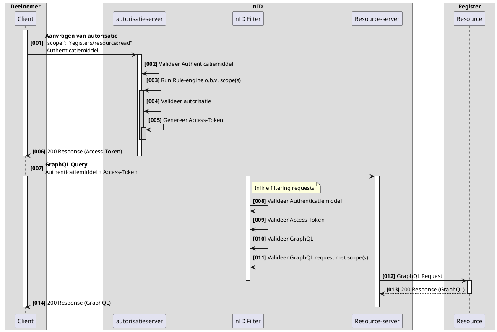
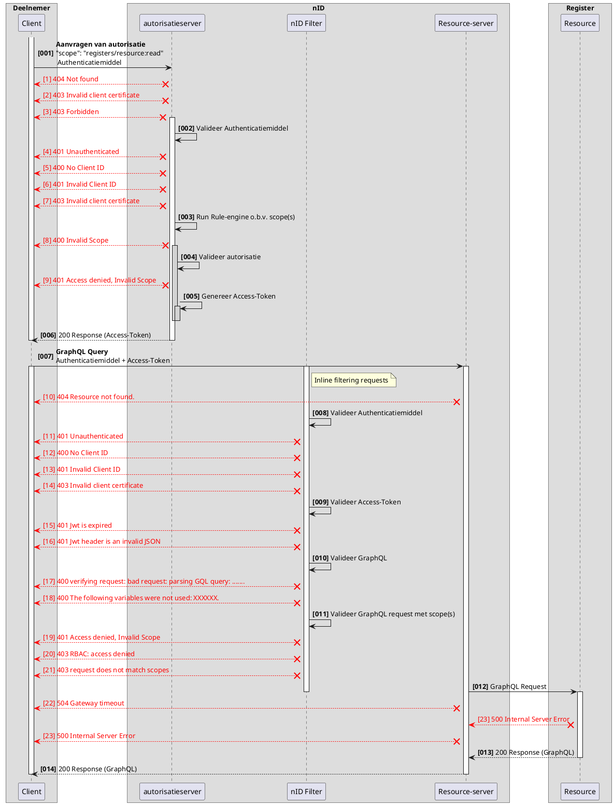

# RFC0014 - Functionele uitwerking aanvragen van autorisatie

<font size="4">**SAMENVATTING**</font>

**Huidige situatie:**

>```nog invullen```

**Beoogde situatie**

Dit document beschrijft functioneel de generieke wijze van autoriseren in het Netwerkmodel iWlz. Met de juiste autorisatie kunnen bronhouders en deelnemers acties uitvoeren zoals notificaties versturen, registers bevragen en sturen van meldingen. 

<font size="4">**Status RFC**</font>

Volg deze [link](https://github.com/iStandaarden/iWlz-RFC/issues/9) om de actuele status van deze RFC te bekijken.

---
**Inhoudsopgave**
- [RFC0014 - Functionele uitwerking aanvragen van autorisatie](#rfc0014---functionele-uitwerking-aanvragen-van-autorisatie)
- [1. Inleiding](#1-inleiding)
  - [1.1 Uitgangspunten](#11-uitgangspunten)
- [2. Terminologie](#2-terminologie)
- [3. Schematische weergave](#3-schematische-weergave)
- [4. Autorisatieserver](#4-autorisatieserver)
  - [4.1 Rule engine](#41-rule-engine)
  - [4.2 Scopes](#42-scopes)
- [5 Resource-server](#5-resource-server)
  - [5.1 Timeout (verder uitwerken)](#51-timeout-verder-uitwerken)
- [6 Foutmeldingen](#6-foutmeldingen)
  - [\[1\] 404 Not found](#1-404-not-found)
  - [\[2\] 403 Invalid client certificate](#2-403-invalid-client-certificate)
  - [\[3\] 403 Forbidden](#3-403-forbidden)
  - [\[4\] 401 Unauthenticated](#4-401-unauthenticated)
  - [\[5\] 400 No Client ID](#5-400-no-client-id)
  - [\[6\] 401 Invalid Client ID](#6-401-invalid-client-id)
  - [\[07\] 400 Invalid Scope](#07-400-invalid-scope)
  - [\[07\] 400 verifying request: bad request: parsing GQL query: .......](#07-400-verifying-request-bad-request-parsing-gql-query-)
  - [\[07\] 400 The following variables were not used: XXXXXX.](#07-400-the-following-variables-were-not-used-xxxxxx)
  - [\[08\] 401 Access denied, Invalid Scope](#08-401-access-denied-invalid-scope)
  - [\[08\] 401 Access denied, Invalid Scope](#08-401-access-denied-invalid-scope-1)
  - [\[10\] 403 RBAC: access denied](#10-403-rbac-access-denied)
  - [\[11\] 403 request does not match scopes](#11-403-request-does-not-match-scopes)
  - [\[12\] 504 Gateway timeout](#12-504-gateway-timeout)
  - [\[13\] 500 Internal Server Error](#13-500-internal-server-error)

---


# 1. Inleiding
Binnen het iWlz netwerkmodel werken we met generieke technische oplossingen en contracten om minimaal afhankelijk te zijn van gezamenlijke releases. Daarom werken we bijvoorbeeld met GraphQL, zodat het uitleveren van extra gegevens via een register geen impact heeft op de overige deelnemers aan het netwerk. 
Het mechanisme voor autoriseren blijkt in de huidige opzet nog niet voldoende generiek te zijn. Het is namelijk nog niet mogelijk om een open bevragingen te doen op een (iWlz-)register. De reden hiervoor is dat autorisaties nu alleen worden uitgedeeld op initiatief van een register door het toesturen van een notificatie. hierdoor is notificeren en autoriseren met elkaar verweven. 
Deze notitie beschrijft een oplossingsrichting om deze verwevenheid te corrigeren, door één generiek mechanisme voor autoriseren te specificeren in de koppelvlak specificaties los van notificaties. Hierdoor kan naast bevragen ook autorisatie plaatsvinden op andere berichtstromen, zoals het versturen van notificaties, meldingen of het rechtstreeks kunnen/mogen muteren van bronregisters.

## 1.1 Uitgangspunten
- Elke deelnemer heeft een authenticatiemiddel van een vertrouwde uitgever. Waar momenteel een VECOZO systeemcertificaat (i.c.m. een clientId en ClientSecret) wordt gebruikt, zal t.z.t. ook PKIOverheid worden vertrouwd of het gebruik van DiD en Verifiable Credentials mogelijk zijn.
- Elke deelnemer heeft een API endpoint beschikbaar waarnaar andere deelnemers kunnen communiceren. Momenteel is alleen een GraphQL endpoint ondersteund.
- ~Er is een **Service directory** waarin per bronregister het GraphQL endpoints beschikbaar is.~
- Elke deelnemer moet in het **Adresboek** zijn eindpoints registreren.
- Er is een **Service directory** waarin per deelnemer zijn **rol** in het netwerkmodel is beschreven. 
- Om autorisatie aan te vragen heeft een deelnemer een attest van deelname nodig.

# 2. Terminologie

Opsomming van de in dit document gebruikte termen.


|Terminologie|Omschrijving|
|:--- |:--- 
|Claims|Een claim is een kwalificatie, een behaalde prestatie of een stukje informatie over de achtergrond van een entiteit, zoals een naam, id, huisadres of afgeronde opleiding. Een claim zegt iets over de entiteit (deelnemer)  |
|Scopes|Een scope geeft de limieten van autorisatie tot een resource aan. Een scope kan een deelnemer bij de autorisatieserver aanvragen. 
|autorisatieserver|Een autorisatieserver deelt Access-Tokens uit om te kunnen communiceren met een Resouce Server.
|Access-Token|Een access-token wordt uitgegeven aan een deelnemer door de autorisatieserver. Een Access-Token heeft een korte levensduur en bevat informatie over de deelnemer, de scopes(permissies) en diverse tijdsaspecten.|
|Resource Server|Een resource server beschermd de resource, valideerd het Access-Token en geeft op basis van de beschreven scopes toegang tot de resource.| 
|nID-Filter|Het nID-Filter is onderdeel van de Resource Server en heeft als taak het verzoek tot de resource te valideren tegen de uitgedeelde scope(s).

# 3. Schematische weergave 
 
 Voor alle activiteiten in het Netwerkstelstel is autorisatie noodzakelijk, deze autorasaties kunnen worden aangevraagd bij de autorisatieserver. Voorbeelden van activiteiten zijn: lezen, schrijven, aanpassen en verwijderen van data uit registers, maar ook het versturen van notificaties en meldingen. 

 In het onderstaande schema wordt de basis uitgelegd voor het aanvragen van autorisatie.


<details>
<summary>plantUML-source</summary>


</details>

|#|Beschrijving|Toelichting|
|:--- |:--- |:--- |
|01| Aanvraag van autorisatie       | client wil een actie uitvoeren op een register en vraagt hiervoor autorisatie aan bij het token endpoint van de autorisatieserver  |
|02| Valideer Authenticatiemiddel  | autorisatieserver valideert de client o.b.v. het aangeboden authenticatiemiddel |
|03| Run rule-engine o.b.v. scope(s)| de autorisatieserver doorloopt voor elke vraag (scope) de rule-engine |
|04| Valideer autorisatie           | in de rule-engine wordt de scope gevalideerd m.b.v. de ingestelde regels voor de scope |
|05| Genereer Access-Token          | een access-token wordt gegenereerd, hierin zijn de scopes en de resources verwerkt.|
|06| Response (Access-Token)        | indien succesvol doorlopen wordt een access-token uitgedeeld aan de client |
|07| GraphQL Query | een client kan met het access-token een verzoek uitzetten bij de resource-server |
|08| Valideer Authenticatiemiddel   | valideren van de client o.b.v. het aangeboden authenticatiemiddel |
|09| Valideer Access-Token          | de resource-server valideert de access-token o.a. op eigenaar en geldigheid |
|10| Valideer GraphQL               | parse en valideer het graphQL verzoek
|11| Valideer GraphQL request met scope(s) | De resource-server valideert ook of het verzoek overeenkomt met de autorisaties in het access-token |
|12| GraphQL Query | De resource-server routeert het graphQL verzoek aan de juiste resource |
|13| Response (GraphQL) | De resource stuurt het GraphQL resultaat terug |
|14| Response (GraphQL) | De resource-server routeert het resultaat terug aan de client |


# 4. Autorisatieserver

In de kern is de autorisatieserver een engine om OAuth2 tokens uit te geven, een autorisatieserver past Access-policies toe. Een Access-Policy definieert permissies en de duur van toegang tot een entiteit.

Op dit moment kan de autorisatieserver alleen autorisaties voor GraphQL API's uitdelen, de standaard in het iWlz Netwerkmodel.

De autorisatieserver is voor netwerkdeelnemers alleen toegangkelijk op het token-endpoint. Op dit endpoint is een vertrouwd authenticatiemiddel vereist.  
|Omgeving|URL|
|:--- |:--- |
|TST|https://tst-api.vecozo.nl/tst/netwerkmodel/v2/oauth2/token|
|PRD|https://api.vecozo.nl/netwerkmodel/v2/oauth2/token|


Het token-endpoint van de autorisatieserver staat toe dat een client in het autorisatieverzoek een "scope" request parameter specificeert. De autorisatieserver zal deze parameter gebruiken om het access-token als antwoord op het verzoek te voorzien van de scopes. De waarde van de scope parameter in het verzoek is uitgedrukt als een spatie-gescheiden lijst van case-sensitive strings. De mogelijke strings zijn gespecificeerd in de autorisatieserver en zijn gedocumenteerd. Als de lijst meerdere spatie-gescheiden strings bevat, dan is de volgorde hiervan onbelangrijk. De autorisatieserver zal elke string verwerken als extra scope in het access-token.

**Voorbeeld:** van een scope request parameter waar meerdere scopes worden aangevraagd:  
*"scope":"organisaties\zorgkantoren\[UZOVICode]\notificaties\notificatie:indicatie.create organisaties\zorgaanbieders\[AGBCode]\notificaties\notificatie:indicatie.create"*


Als de client een scope aanvraagt waarvoor hij geen autorisatie heeft, dan zal de autorisatieserver een foutmelding retourneren "Access denied, invalid scope", ongeacht of er in dezelfde aanvraag scopes zitten waarvoor wel is geautoriseerd. Als de client geen scope parameter meegeeft in zijn request aan de autorisatieserver, dan MOET de autorisatieserver het verzoek verwerken door een voorgedefinieerde standaard scope toe te passen of een "Invalid scope" foutmelding retourneren. Als de autorisatieserver een verzoek ontvangt waar 1 of meerdere scopes incorrect zijn MOET de autorisatieserver een "Access denied, invalid scope" retourneren.

Een standaard scope zou kunnen zijn:  
*organisaties\zorgkantoren\[UZOVICode]:profiel.read*

**Opmerking:** Een request header MOET het Content-Type: application/json bevatten om aan te geven dat de body in JSON formaat is.
```
POST https://api.vecozo.nl/netwerkmodel/v2/oauth2/token

Header: Authorization Basic <Client ID:Client Secret (Base64 encoded)>

{
    "grant_type":"client_credentials",
    "scope":"myscope"
}
```
Response is een JWT 

```
{
    "aud": [http://ciz.vecozo/netwerkmodel/v1/graphql],
    "exp": 1677513301,
    "jti": "fbd64991-e625-4a22-86ce-b705385574a0",
    "iat": 1676908501,
    "iss": "authz-nid",
    "nbf": 1676908381,
    "sub": "a5d99af1-111c-4a17-ae6f-e117efad0b31",
    "client_id": "144feaa7-74f3-4c5d-8a89-215ea527fdec",
    "subjects": {
        "nid": ""
    },
    "scopes": {
        <<LIJST VAN UITGEWERKTE SCOPES>>
    },
    "consent_id": "6d101f9a-b535-4fa8-bf73-b1f92d4499cf",
    "client_metadata": {}
}
```
## 4.1 Rule engine
Onderdeel van de autorisatieserver is een rule-engine (Voorheen LUARunner genoemd). Op basis van gevraagde scope(s) en beschikbare variabelen worden policy-regels toegepast welke resulteren in rechten(scopes) of een afwijzing. 

## 4.2 Scopes
Scopes worden toegepast op verschillende entiteiten binnen het netwerkmodel. Een client kan een of meerdere Scopes (autorisaties) aanvragen bij de autorisatieserver.

Hieronder zijn alle scope(s) gedocumenteerd die mogelijk zijn in het iWlz Netwerkmodel. Afhankelijk van de definitie in de access-policy kan een deelnemer deze aanvragen.

|Resource|Scope|Omschrijving|
|:--- |:--- |:--- 
| |(no scope)| Geeft read toegang tot het eigen organisatieprofiel info. | 
| Service directory |servicedirectory\organisaties:profiel.create| Geeft de rechten tot het maken van een nieuw organisatieprofiel.  |
| Service directory |servicedirectory\organisaties:profiel.read| Geeft read toegang tot de informatie van alle organisatieprofielen.  |
| Service directory |servicedirectory\organisaties:profiel.update| Geeft update toegang tot alle organisatieprofielen.  |
| servicedirectory |servicedirectory\organisaties\\*[id-type]\\[organisatie-id]*:profiel.read| Geeft read toegang tot specifiek organisatieprofiel.(eigen profiel)|
| Service directory |servicedirectory\organisaties\\*[id-type]\\[organisatie-id]*:profiel.update| Geeft  update rechten op een specifiek organisatieprofiel.(eigen profiel)|
| Service directory |servicedirectory\organisaties\\*[id-type]\\[organisatie-id]*:profiel.delete| Geeft delete rechten, verwijderen van een specifiek organisatieprofiel.|
| Service directory |servicedirectory\organisaties\\*[id-type]\\[organisatie-id]*\notificaties\notificatie:Create.create| Geeft het recht om een notificatie te sturen aan organisatie [organisatie-id] naar aanleiding van een CREATE event.|
| Service directory |servicedirectory\organisaties\\*[id-type]\\[organisatie-id]*\meldingen\melding:create| Geeft het recht om een melding te sturen aan organisatie [organisatie-id] |
| servicedirectory |Service directory\organisaties\organisatierol:create| Geeft create rechten om een niewe organisatierol  toe te voegen. |
| Service directory |servicedirectory\organisaties\organisatierol:read| Geeft read toegang tot de lijst van organisatierollen |
| | | |
| Verwijsindex | registers\verwijsindex\[bsn]:profiel.read | Geeft read rechten tot het volledige profiel van deze BSN.|
| | | |
| Cliëntregister | registers\wlzcliëntregister\cliënten\\*[bsn]*:profiel.create| Geeft create rechten tot een specifiek cliënt profiel|
| Cliëntregister | registers\wlzcliëntregister\cliënten\\*[bsn]*:profiel.read| Geeft read rechten tot een specifiek cliënt profiel|
| Cliëntregister | registers\wlzcliëntregister\cliënten\\*[bsn]*:profiel.update| Geeft update rechten tot een specifiek cliënt profiel|
| | | |
| wlz Bemiddelingsregister |registers\wlzbemiddelingsregister\bemiddelingen:read|Geeft read rechten tot bemiddelingen uit het wlzbemiddelingsregister.|
| wlz Bemiddelingsregister |registers\wlzbemiddelingsregister\bemiddelingen\\*[bemiddeling-id]*:read|Geeft read rechten tot een specifieke bemiddelingen uit het wlzbemiddelingsregister.|
| wlz Bemiddelingsregister |registers\wlzbemiddelingsregister\bemiddelingen\bemiddeling:create|Geeft create rechten om nieuwe bemiddelingen aan te maken in het bemiddelingsregister. |
| | | | 
| wlz Indicatieregister |registers\wlzindicatieregister\indicaties:read|Geeft read rechten tot indicaties uit het wlzindicatieregister.|
| wlz Indicatieregister |registers\wlzindicatieregister\indicaties\\*[indicatie-id]*:read|Geeft read rechten tot een specifieke indicatie uit het wlzindicatieregister.|

- ## registers\wlzbemiddelingsregister\bemiddelingen:read

Deze scope staat toe WlzBemiddelingen op te vragen, maar verplicht de query te beperken tot de instelling waarvoor deze is gemachtigd.

**Voorbeeld:**
```graphql
Query{
	WlzBemiddelingen(filter: { instelling: "1234567890" }, first: 2) 
	{
		totalcount
		edges {
			cursor
			node {
				bemiddelingID
				wlzIndicatieID
				verantwoordelijkZorgkantoor
				.........
				.........
			}
		}
		WlzBemiddeling {
				bemiddelingID
				wlzIndicatieID
				verantwoordelijkZorgkantoor
		}
		pageInfo {
			endCursor
			hasNextPage
		}
	}
}
```
- ## registers\wlzindicatieregister\indicaties\\[indicatie-id]:read

Deze scope staat toe een specifieke indicatie op te vragen uit het wlzIndicatieregister, de rule-engine heeft bij het aanvragen van de autorisatie gecontroleerd of de deelnemer hiertoe is gemachtigd.

**Voorbeeld:**
```grapql
Query{
	WlzIndicaties(wlzindicatieID: "[indicatie-id]") {
    afgiftedatum        
    besluitnummer
    bsn
    commentaar
    einddatum
    ingangsdatum
    .........
    ......
  }
}
```

# 5 Resource-server
Een resource-server beschermt achterliggende resources tegen ongeautoriseerde toegang.  
- De resource-server is voor netwerkdeelnemers alleen toegangkelijk op het GraphQL-endpoint. 
- De resource-server vereist een vertrouwd authenticatiemiddel en een geldig Access-Token. 
- Alle bronnen worden beschermd door één resource-server(redundant). In de toekomst zijn meerdere zelfstandige resource-servers voorstelbaar. 
- De registratie van autorisatieservers vindt plaats in de organisatieprofielen binnen de servicesdirectory.  
- De registratie van de resource maakt ook onderdeel uit van organisatieprofielen binnen de servicesdirectory. De access-policy past deze toe tijdens de autorisatie door de autorisatieserver.


|Omgeving|URL|
|:--- |:--- 
|TST|https://tst-api.vecozo.nl/tst/netwerkmodel/v2/GraphQL|
|PRD|https://api.vecozo.nl/netwerkmodel/v2/GraphQL|

Na de autorisatievalidatie routeert de resource-server het verzoek naar de resource.

## 5.1 Timeout (verder uitwerken)
Voor verschillende toepassingen en acties is een timeouts van enkele 100 milliseconden wenselijk, denk hierbij aan online transacties. Daarentegen is voor andere acties een timeout van 15 seconden voorsterlbaar, acties voor complexe zoekacties.
Om dit te ondersteunen moet een client een request-timeout in de header meesturen.

indien de request-timeout in de header niet wordt opgegeven, hanteert de resource-server een time-out van 5000 milliseconden.

Bij het verstrijken van de time-out MOET de resource-server een http Error code 504 Gateway Timeout retourneren.


# 6 Foutmeldingen
OAuth HTTP error responses

In onderstaand schema worden de mogelijke fouten weergegeven die kunnen optreden bij het ophalen van autorisaties of het uitvoeren van een graphQL verzoek.

<font color=red>LET OP: Onderstaand schema moet nog worden gevalideerd/aangepast en aangevult.</font>


<details>
<summary>plantUML-source</summary>


</details>


HTTP error responses. Let op: foutmeldingen kunnen door gebruik van een client anders worden gepresenteerd.

<details>
<summary>[1] 404 Not found</summary>

---
## [1] 404 Not found
```json
HTTP/1.1 404 Not found
{}
```
Mogelijke oorzaak:
- Het endpoint van de autorisatieserver is niet correct. Het juiste endpoint van de autorisatieserver is beschreven in dit document bij de autorisatieserver.
---
</details>

<details>
<summary>[2] 403 Invalid client certificate</summary>

---
## [2] 403 Invalid client certificate
```json
HTTP/1.1 403 Invalid client certificate
{}
```
Mogelijke oorzaak:
- Ontbrekend, ongeldig of verlopen certificaat (Bij gebruik van een VECOZO systeemcertificaat als auhtenticatiemiddel)
- Het gebruikte authenticatiemiddel is bedoeld voor een andere omgeving 
---
</details>

<details>
<summary>[3] 403 Forbidden</summary>

---
## [3] 403 Forbidden
```json
HTTP/1.1 403 Forbidden
{}
```
Mogelijke oorzaak:
- IP adres niet geregistreerd bij authenticatiemiddel (Bij gebruik van een VECOZO systeemcertificaat als auhtenticatiemiddel)
- Authenticatiemiddel geblokkeerd
---
</details>


<details>
<summary>[4] 401 Unauthenticated</summary>

---
## [4] 401 Unauthenticated
```json
HTTP/1.1 401 Unauthenticated
{}
```
Mogelijke oorzaak:
- Bij het ophalen van de access token (JWT) is authenticatie verplicht, authenticatie vindt plaats met "Basic Authentication" i.c.m. een geldig authenticatiemiddel.
---
</details>


<details>
<summary>[5] 400 No Client ID</summary>

---
## [5] 400 No Client ID
```json
HTTP/1.1 400 Bad Request
{"ErrorCode" : "invalid_request", "Error" :"The request is missing a required parameter : client_id"}
```
Mogelijke oorzaak:
- Bij het ophalen van de access token (JWT) is een Client ID verplicht, deze client ID is uitgegeven door nID bij het onboarden van de deelnemer op het netwerk.
---
</details>

<details>
<summary>[6] 401 Invalid Client ID</summary>

---
## [6] 401 Invalid Client ID
```json
HTTP/1.1 401 Unauthorized
{"ErrorCode" : "invalid_request", "Error" :"Invalid client id : AVD7ztXReEYyjpLFkkPiZpLEjeF2aYAz. ClientId is Invalid"}
```
Mogelijke oorzaak:
- Het gebruikte client ID komt niet overeen met het geregistreerde client ID op de omgeving waarmee wordt verbonden
- Onjuiste combinatie van client ID en authenticatiemiddel.
---
</details>


<details>
<summary>[07] 400 Invalid Scope</summary>

---
## [07] 400 Invalid Scope
```json
HTTP/1.1 400 Bad Request
{"ErrorCode" : "invalid_request", "Error" :"Invalid Scope"}
```
Mogelijke oorzaak:
- Er is een scope aangevraagd welke niet bestaat. controleer de opgevraagde scope aan de documentatie.
---
</details>

<details>
<summary>[07] 400 verifying request: bad request: parsing GQL query: .......</summary>

---
## [07] 400 verifying request: bad request: parsing GQL query: .......
```json
HTTP/1.1 400 verifying request: bad request: parsing GQL query: .......
{}
```
Mogelijke oorzaak:
- Bij het controleren van de GraphQL zijn afwijkingen gevonden. Controleer de graphQL of deze voldoet aan de specificaties.
---
</details>

<details>
<summary>[07] 400 The following variables were not used: XXXXXX.</summary>

---
## [07] 400 The following variables were not used: XXXXXX.
```json
HTTP/1.1 400 The following variables were not used: XXXXXX.
{}
```
Mogelijke oorzaak:
- Het graphQL verwacht een niet optionele variable. Controleer de graphQL of deze voldoet aan de specificaties.
---
</details>


<details>
<summary>[08] 401 Access denied, Invalid Scope</summary>

---
## [08] 401 Access denied, Invalid Scope
```json
HTTP/1.1 401 Unauthorized
{"ErrorCode" : "invalid_request", "Error" :"Access denied, Invalid Scope"}
```
Mogelijke oorzaak:
- Het gestelde graphQL verzoek komt niet overeen met de aangevraagde/meegstuurde scope.
- GraphQL verzoek komt niet overeen met de reikwijte in de scoop
- GraphQL verzoek wordt uitgevoerd met een verkeerde ID (ClientID/Secret/Authentictiemiddel)
---
</details>


<details>
<summary>[08] 401 Access denied, Invalid Scope</summary>

---
## [08] 401 Access denied, Invalid Scope
```json
HTTP/1.1 401 Unauthorized
{"ErrorCode" : "invalid_request", "Error" :"Access denied, Invalid Scope"}
```
Mogelijke oorzaak:
- Het gestelde graphQL verzoek komt niet overeen met de aangevraagde/meegstuurde scope.
- GraphQL verzoek komt niet overeen met de reikwijte in de scoop
- GraphQL verzoek wordt uitgevoerd met een verkeerde ID (ClientID/Secret/Authentictiemiddel)
---
</details>


<details>
<summary>[10] 403 RBAC: access denied</summary>

---
## [10] 403 RBAC: access denied
```json
HTTP/1.1 403 RBAC: access denied
{}
```
Mogelijke oorzaak:
- De meegestuurde access token komt niet overeen met de identiteit van de indiener. 
- Authenticatiemiddel/ClientID is anders dan gebruikt bij het aanvragen van de autorisatie.

---
</details>

<details>
<summary>[11] 403 request does not match scopes</summary>

---
## [11] 403 request does not match scopes
```json
HTTP/1.1 403 request does not match scopes
{}
```
Mogelijke oorzaak:
- Het verzoek aan de resource-server voldoet niet aan de scopes in de access-token.
- Bij het verzoek aan de autorisatie-server zijn niet de juiste scopes aangevraagd.
---
</details>


<details>
<summary>[12] 504 Gateway timeout</summary>

---
## [12] 504 Gateway timeout
```json
HTTP/1.1 504 Gateway timeout
{}
```
Mogelijke oorzaak:
- Het register reageerd niet binnen de verwachte tijd. Treed dit vaker op, volg dan het incident management proces volgens het afsprakenstelsel.

---
</details>

<details>
<summary>[13] 500 Internal Server Error</summary>

---
## [13] 500 Internal Server Error
```json
HTTP/1.1 500 Internal Server Error
{}
```
Mogelijke oorzaak:
- Bij het Register is een onverwachte fout opgetreden, probeer het later nog eens. Volg het incident management proces volgens het afsprakenstelsel.
---
</details>


    

