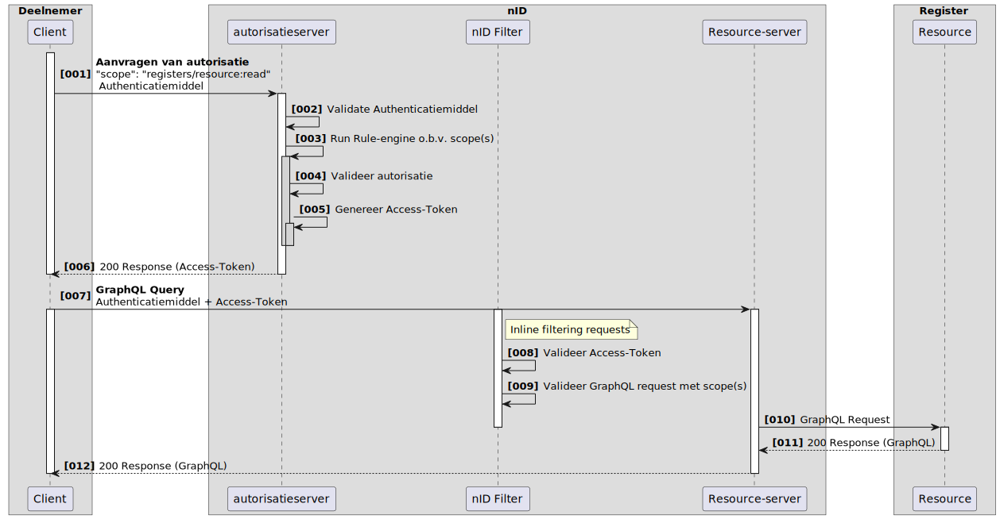
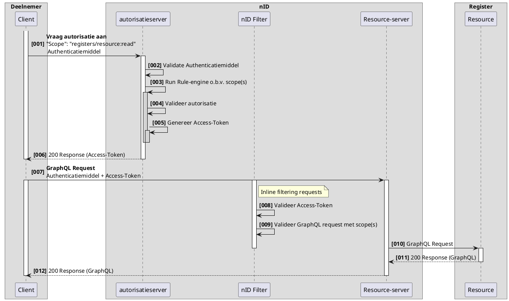

# Functionele uitwerking aanvragen van autorisatie

**SAMENVATTING**

Dit document beschrijft functioneel de generieke wijze van autoriseren in het Netwerkmodel iWlz. Met de juiste autorisatie kunnen bronhouders en deelnemers acties uitvoeren zoals notificaties versturen, registers bevragen en sturen van meldingen. 

---
**Inhoudsopgave**
[TOC]
- [Functionele uitwerking aanvragen van autorisatie](#functionele-uitwerking-aanvragen-van-autorisatie)
- [1. Inleiding](#1-inleiding)
  - [1.1 Uitgangspunten](#11-uitgangspunten)
- [2. Terminologie](#2-terminologie)
- [2. Schematische weergave](#2-schematische-weergave)
- [3. Autorisatieserver](#3-autorisatieserver)
  - [3.1 Rule engine](#31-rule-engine)
  - [3.2 Scopes](#32-scopes)
- [4 Resource-server](#4-resource-server)
- [5 Foutmeldingen](#5-foutmeldingen)
  - [Invalid Client ID](#invalid-client-id)
  - [No Client ID](#no-client-id)
  - [Invalid Scope](#invalid-scope)
  - [Access denied, Invalid Scope](#access-denied-invalid-scope)

---

# 1. Inleiding
Binnen het iWlz netwerkmodel werken we met generieke technische oplossingen en contracten om minimaal afhankelijk te zijn van gezamenlijke releases. Daarom werken we bijvoorbeeld met GraphQL, zodat het uitleveren van extra gegevens via een register geen impact heeft op de overige deelnemers aan het netwerk. 
Het mechanisme voor autoriseren blijkt in de huidige opzet nog niet voldoende generiek te zijn. Het is namelijk nog niet mogelijk om een open bevragingen te doen op een (iWlz-)register. De reden hiervoor is dat autorisaties nu alleen worden uitgedeeld op initiatief van een register door het toesturen van een notificatie. hierdoor is notificeren en autoriseren met elkaar verweven. 
Deze notitie beschrijft een oplossingsrichting om deze verwevenheid te corrigeren, door één generiek mechanisme voor autoriseren te specificeren in de koppelvlak specificaties los van notificaties. Hierdoor kan naast bevragen ook autorisatie plaatsvinden op andere berichtstromen, zoals het versturen van notificaties, meldingen of het rechtstreeks kunnen/mogen muteren van bronregisters.

## 1.1 Uitgangspunten
- Elke deelnemer heeft een authenticatiemiddel van een vertrouwde uitgever. Waar momenteel een VECOZO systeemcertificaat (i.c.m. een clientId en ClientSecret) wordt gebruikt, zal t.z.t. ook PKIOverheid worden vertrouwd of het gebruik van DiD en Verifiable Credentials mogelijk zijn.
- Elke deelnemer heeft een API endpoint beschikbaar waarnaar andere deelnemers kunnen communiceren. Momenteel is alleen een GraphQL endpoint ondersteund.
- Er is een **Service directory** waarin per bronregister het GraphQL endpoints beschikbaar is.
- Er is een **Service directory** waarin per deelnemer zijn **rol** in het netwerkmodel is beschreven. 
- Om autorisatie aan te vragen heeft een deelnemer een attest van deelname nodig.

# 2. Terminologie

Opsomming van de in dit document gebruikte termen.


|Terminologie|Omschrijving|
|:--- |:--- 
|Claims|Een claim is een kwalificatie, een behaalde prestatie of een stukje informatie over de achtergrond van een entiteit, zoals een naam, id, huisadres of afgeronde opleiding. Een claim zegt iets over de entiteit (deelnemer)  |
|Scopes|Een scope geeft de limieten van autorisatie tot een resource aan. Een scope kan een deelnemer bij de autorisatieserver aanvragen. 
|autorisatieserver|Een autorisatieserver deelt Access-Tokens uit om te kunnen communiceren met een Resouce Server.
|Access-Token|Een access-token wordt uitgegeven aan een deelnemer door de autorisatieserver. Een Access-Token heeft een korte levensduur en bevat informatie over de deelnemer, de scopes(permissies) en diverse tijdsaspecten.|
|Resource Server|Een resource server beschermd de resource, valideerd het Access-Token en geeft op basis van de beschreven scopes toegang tot de resource.| 
|nID-Filter|Het nID-Filter is onderdeel van de Resource Server en heeft als taak het verzoek tot de resource te valideren tegen de uitgedeelde scope(s).

# 2. Schematische weergave 
 
 Voor alle activiteiten in het Netwerkstelstel is autorisatie noodzakelijk, deze autorasaties kunnen worden aangevraagd bij de autorisatieserver. Voorbeelden van activiteiten zijn: lezen, schrijven, aanpassen en verwijderen van data uit registers, maar ook het versturen van notificaties en meldingen. 

 In het onderstaande schema wordt de basis uitgelegd voor het aanvragen van autorisatie.




|#|Beschrijving|Toelichting|
|:--- |:--- |:--- |
|01| Aanvraag van autorisatie       | client wil een actie uitvoeren op een register en vraagt hiervoor autorisatie aan bij het token endpoint van de autorisatieserver  |
|02| Valideren Authenticatiemiddel  | autorisatieserver valideerd de client o.b.v. het aangeboden authenticatiemiddel |
|03| Run rule-engine o.b.v. scope(s)| de autorisatieserver doorloopt voor elke vraag (scope) de rule-engine |
|04| Valideer autorisatie           | in de rule-engine wordt de scope gevalideerd tegen het access-model |
|05| Genereer Access-Token          | een access-token wordt gegenereerd, hierin zijn de scopes en de resources verwerkt.|
|06| Response (Access-Token)        | indien succesvol doorlopen wordt een access-token uitgedeeld aan de client |
|07| GraphQL Query | een client kan met het access-token een verzoek uitzetten bij de resource-server |
|08| Valideer Access-Token          | de resource-server valideerd de access-token o.a. op eigenaar en geldigheid |
|09| Valideer GraphQL request met scope(s) | De resource-server valideerd ook of het verzoek overeenkomt met de autorisaties in het access-token |
|10| GraphQL Query | De resource-server routeert het graphQL verzoek aan de juiste resource |
|11| Response (GraphQL) | De resource stuurt het GraphQL resultaat terug |
|12| Response (GraphQL) | De resource-server routeert het resultaat terug aan de client |


# 3. Autorisatieserver

In de kern is de autorisatieserver een engine om OAuth2 tokens uit te geven, een autorisatieserver past Access-policies toe. Een Access-Policy definieerd permissies en de duur van toegang tot een entiteit.

Op dit moment kan de autorisatieserver alleen autorisaties voor GraphQL API's uitdelen, de standaard in het iWlz Netwerkmodel.

De autorisatieserver is voor netwerkdeelnemers alleen toegangkelijk op het token-endpoint. Op dit endpoint is een vertrouwd authenticatiemiddel vereist.  
|Omgeving|URL|
|:--- |:--- 
|TST|https://tst-api.vecozo.nl/tst/netwerkmodel/v2/oauth2/token|
|PRD|https://api.vecozo.nl/netwerkmodel/v2/oauth2/token|


Het token-endpoint van de autorisatieserver staat toe dat een client in het autorisatieverzoek een "scope" request parameter specificeerd. De autorisatieserver zal deze parameter gebruiken om het access-token als antwoord op het verzoek te voorzien van de scopes. De waarde van de scope parameter in het verzoek is uitgedrukt als een spatie-gescheiden lijst van case-sensitive strings. De mogelijke strings zijn gespecificeerd in de autorisatieserver en zijn gedocumenteerd. Als de lijst meerdere spatie-gescheiden strings bevatten, dan is de volgorde hiervan onbelangrijk. De autorisatieserver zal elke string verwerken als extra scope in het access-token.

**Voorbeeld:** van een scope request parameter waar meerdere scopes worden aangevraagd:  
*"scope":"organisaties\zorgkantoren\[UZOVICode]\notificaties\notificatie:indicatie.create organisaties\zorgaanbieders\[AGBCode]\notificaties\notificatie:indicatie.create"*


Als de client een scope aanvraagt waarvoor hij geen autorisatie heeft, dan zal de autorisatieserver een foutmelding retourneren "Access denied, invalid scope", ongeacht of er in dezelfde aanvraag scopes zitten waarvoor wel is geautoriseerd. Als de client geen scope parameter meegeeft in zijn request aan de autorisatieserver, dan MOET de autorisatieserver het verzoek verwerken door een voorgedefinieerde standaard scope toe te passen of een "Invalid scope" foutmelding retourneren. Als de autorisatieserver een verzoek ontvangt waar 1 of meerdere scopes incorrect zijn MOET de autorisatieserver een "Access denied, invalid scope" retourneren.

Een standaard scope zou kunnen zijn:  
*organisaties\zorgkantoren\[UZOVICode]:profiel.read*

**Opmerking:** Een request header MOET het Content-Type: application/json bevatten om aan te geven dat de body in JSON formaat is.
```
POST https://api.vecozo.nl/netwerkmodel/v2/oauth2/token

Header: Authorization Basic <Client ID:Client Secret (Base64 encoded)>

{
    "grant_type":"client_credentials",
    "scope":"myscope"
}
```
Response is een JWT 

```
{
    "aud": [http://ciz.vecozo/netwerkmodel/v1/graphql],
    "exp": 1677513301,
    "jti": "fbd64991-e625-4a22-86ce-b705385574a0",
    "iat": 1676908501,
    "iss": "authz-nid",
    "nbf": 1676908381,
    "sub": "a5d99af1-111c-4a17-ae6f-e117efad0b31",
    "client_id": "144feaa7-74f3-4c5d-8a89-215ea527fdec",
    "subjects": {
        "nid": ""
    },
    "scopes": {
        <<LIJST VAN UITGEWERKTE SCOPES>>
    },
    "consent_id": "6d101f9a-b535-4fa8-bf73-b1f92d4499cf",
    "client_metadata": {}
}
```
## 3.1 Rule engine
Onderdeel van de autorisatieserver is een rule-engine (Voorheen LUARunner genoemd). Op basis van gevraagde scope(s) en beschikbare variabelen worden policy-regels toegepast welke resulteren in rechten(scopes) of een afwijzing. 

## 3.2 Scopes
Scopes worden toegepast op verschillende entiteiten binnen het netwerkmodel. Een client kan een of meerdere Scopes (autorisaties) aanvragen bij de autorisatieserver.

Hieronder zijn alle scope(s) gedocumenteerd die mogelijk zijn in het iWlz Netwerkmodel. Afhankelijk van gedefinieerde access-policies kan een deelnemer deze aanvragen.

|Resource|Scope|Omschrijving|
|:--- |:--- |:--- 
| |(no scope)| Geeft read toegang tot het eigen organisatieprofiel info. | 
| Service directory |servicedirectory\organisaties:profiel.create| Geeft de rechten tot het maken van een nieuw organisatieprofiel.  |
| Service directory |servicedirectory\organisaties:profiel.read| Geeft read toegang tot de informatie van alle organisatieprofielen.  |
| Service directory |servicedirectory\organisaties:profiel.update| Geeft update toegang tot alle organisatieprofielen.  |
| servicedirectory |servicedirectory\organisaties\\*[id-type]\\[organisatie-id]*:profiel.read| Geeft read toegang tot specifiek organisatieprofiel.(eigen profiel)|
| Service directory |servicedirectory\organisaties\\*[id-type]\\[organisatie-id]*:profiel.update| Geeft  update rechten op een specifiek organisatieprofiel.(eigen profiel)|
| Service directory |servicedirectory\organisaties\\*[id-type]\\[organisatie-id]*:profiel.delete| Geeft delete rechten, verwijderen van een specifiek organisatieprofiel.|
| Service directory |servicedirectory\organisaties\\*[id-type]\\[organisatie-id]*\notificaties\notificatie:Create.create| Geeft het recht om een notificatie te sturen aan organisatie [organisatie-id] naar aanleiding van een CREATE event.|
| Service directory |servicedirectory\organisaties\\*[id-type]\\[organisatie-id]*\meldingen\melding:create| Geeft het recht om een melding te sturen aan organisatie [organisatie-id] |
| servicedirectory |Service directory\organisaties\organisatierol:create| Geeft create rechten om een niewe organisatierol  toe te voegen. |
| Service directory |servicedirectory\organisaties\organisatierol:read| Geeft read toegang tot de lijst van organisatierollen |
| | | |
| Verwijsindex | registers\verwijsindex\[bsn]:profiel.read | Geeft read rechten tot het volledige profiel van deze BSN.|
| | | |
| Cliëntregister | registers\wlzcliëntregister\cliënten\\*[bsn]*:profiel.create| Geeft create rechten tot een specifiek cliënt profiel|
| Cliëntregister | registers\wlzcliëntregister\cliënten\\*[bsn]*:profiel.read| Geeft read rechten tot een specifiek cliënt profiel|
| Cliëntregister | registers\wlzcliëntregister\cliënten\\*[bsn]*:profiel.update| Geeft update rechten tot een specifiek cliënt profiel|
| | | |
| wlz Bemiddelingsregister |registers\wlzbemiddelingsregister\bemiddelingen:read|Geeft read rechten tot bemiddelingen uit het wlzbemiddelingsregister.|
| wlz Bemiddelingsregister |registers\wlzbemiddelingsregister\bemiddelingen\\*[bemiddeling-id]*:read|Geeft read rechten tot een specifieke bemiddelingen uit het wlzbemiddelingsregister.|
| wlz Bemiddelingsregister |registers\wlzbemiddelingsregister\bemiddelingen\bemiddeling:create|Geeft create rechten om nieuwe bemiddelingen aan te maken in het bemiddelingsregister. |
| | | | 
| wlz Indicatieregister |registers\wlzindicatieregister\indicaties:read|Geeft read rechten tot indicaties uit het wlzindicatieregister.|
| wlz Indicatieregister |registers\wlzindicatieregister\indicaties\\*[indicatie-id]*:read|Geeft read rechten tot een specifieke indicatie uit het wlzindicatieregister.|

- ## registers\wlzbemiddelingsregister\bemiddelingen:read

Deze scope staat toe WlzBemiddelingen op te vragen, maar verplicht de query te beperken tot de instelling waarvoor deze is gemachtigd.

**Voorbeeld:**
```json
Query{
	WlzBemiddelingen(filter: { instelling: "1234567890" }, first: 2) 
	{
		totalcount
		edges {
			cursor
			node {
				bemiddelingID
				wlzIndicatieID
				verantwoordelijkZorgkantoor
				.........
				.........
			}
		}
		WlzBemiddeling {
				bemiddelingID
				wlzIndicatieID
				verantwoordelijkZorgkantoor
		}
		pageInfo {
			endCursor
			hasNextPage
		}
	}
}
```
- ## registers\wlzindicatieregister\indicaties\\[indicatie-id]:read

Deze scope staat toe een specifieke indicatie op te vragen uit het wlzIndicatieregister, de rule-engine heeft bij het aanvragen van de autorisatie gecontroleerd of de deelnemer hiertoe is gemachtigd.

**Voorbeeld:**
```json
Query{
	WlzIndicaties(wlzindicatieID: "[indicatie-id]") {
    afgiftedatum        
    besluitnummer
    bsn
    commentaar
    einddatum
    ingangsdatum
    .........
    ......
  }
}
```

# 4 Resource-server
Een resource-server beschermd achterliggende resources op ongeautoriseerder toegang.  
- De resource-server is voor netwerkdeelnemers alleen toegangkelijk op het GraphQL-endpoint. 
- De resource-server vereist een vertrouwd authenticatiemiddel en een geldig Access-Token. 
- Momenteel is er één resource-server(redundant) actief in het iWlz-netwerkstelsel voor alle bronhouders. In de toekomst zijn meerdere resource-servers voorstelbaar. 
- De registratie van autorisatieservers vindt plaats in de organisatieprofielen binnen de servicesdirectory.  
- De registratie van de resource maakt ook onderdeel uit van organisatieprofielen binnen de servicesdirectory. De access-policy past deze toe tijdens de autorisatie door de autorisatieserver.


|Omgeving|URL|
|:--- |:--- 
|TST|https://tst-api.vecozo.nl/tst/netwerkmodel/v2/GraphQL|
|PRD|https://api.vecozo.nl/netwerkmodel/v2/oauth2/GraphQL|

Na de autorisatievalidatie routeet de resource-server het verzoek naar de resource.


# 5 Foutmeldingen
OAuth HTTP error responses

## Invalid Client ID
```json
HTTP/1.1 401 Unauthorized
{"ErrorCode" : "invalid_request", "Error" :"Invalid client id : AVD7ztXReEYyjpLFkkPiZpLEjeF2aYAz. ClientId is Invalid"}
```
## No Client ID
```json
HTTP/1.1 400 Bad Request
{"ErrorCode" : "invalid_request", "Error" :"The request is missing a required parameter : client_id"}
```
## Invalid Scope
```json
HTTP/1.1 400 Bad Request
{"ErrorCode" : "invalid_request", "Error" :"Invalid Scope"}
```

## Access denied, Invalid Scope
```json
HTTP/1.1 401 Unauthorized
{"ErrorCode" : "invalid_request", "Error" :"Access denied, Invalid Scope"}
```


<details>
<summary>plantUML-source</summary>


</details>


