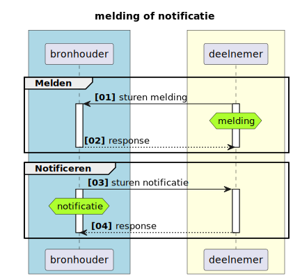
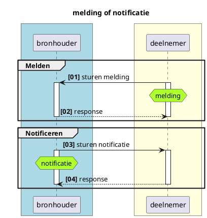
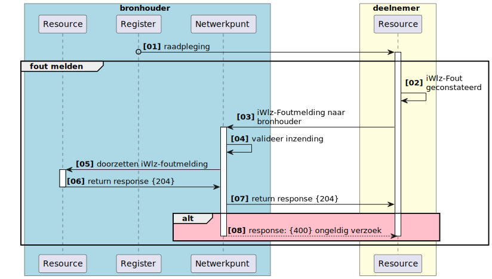
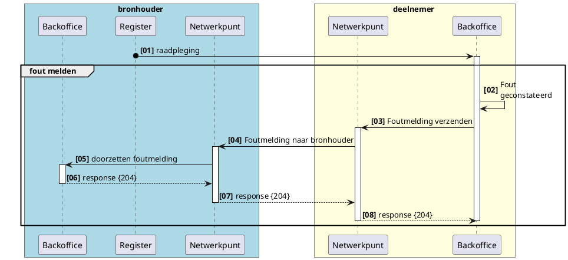

# RFC0018 - (Fout-)meldingen
- [ ]  Verwijzing opnemen naar generiek GraphQL KV

**SAMENVATTING**

Dit document beschrijft functioneel de generieke werking meldingen in het Netwerkmodel iWlz. Met notificaties of meldingen worden respectievelijke afnemer of bronhouder geattendeerd op nieuwe informatie die relevant is voor die afnemer of bronhouder.

**Inhoudsopgave**
- [RFC0018 - (Fout-)meldingen](#rfc0018---fout-meldingen)
- [1. Inleiding](#1-inleiding)
  - [1.1. Uitgangspunten](#11-uitgangspunten)
- [2. Terminologie](#2-terminologie)
- [3. Meldingen](#3-meldingen)
  - [3.1 Melding of notificatie](#31-melding-of-notificatie)
  - [3.2 Meldingsvormen](#32-meldingsvormen)
  - [3.3 Foutmelden](#33-foutmelden)
  - [3.4 Inhoud iWlz Foutmelding](#34-inhoud-iwlz-foutmelding)
    - [3.4.1 Voorbeeld iWlz Foutmelding](#341-voorbeeld-iwlz-foutmelding)


---
# 1. Inleiding
Binnen het iWlz netwerkmodel werken we met generieke technische oplossingen en contracten om minimaal afhankelijk te zijn van gezamenlijke releases. Daarom werken we bijvoorbeeld met GraphQL, zodat het uitleveren van extra gegevens via een register geen impact heeft op de overige deelnemers aan het netwerk. Daarnaast spelen register een centrale rol in het beschikbaarstellen van informatie aan ketenpartijen. Een bronhouder is verantwoordelijk voor de integriteit van de data in haar register. De afspraken met betrekking tot deze integriteit zijn beschreven in het Informatiemodel iWlz, te vinden op [iStandaarden](https://istandaarden.nl).

Binnen het estafettemodel wordt gewerkt met heenberichten en retourberichten. Het heenbericht is vergelijkbaar met het raadplegen van gegevens in een register. Hierop volgt het retourbericht waarin het mogelijk is om door middel van retourcodes te melden waar de inhoud van het bericht niet volstaat  volgens de regels van het informatiemodel. 

In het netwerkmodel zal deze functionaliteit vervangen worden door **foutmeldingen**. Deze RFC beschrijft de gewenste functionaliteit


## 1.1. Uitgangspunten
  - Er zijn meerdere vormen voor meldingen. De eerste vorm die geimplementeerd zal worden is de 'foutmelding'. 
  - 

# 2. Terminologie
Opsomming van de in dit document gebruikte termen.

| Terminologie | Omschrijving |
| :-------- | :-------- | 
| *term* | *beschrijving/uitleg* | 


# 3. Meldingen

## 3.1 Melding of notificatie
Wanneer een deelnemer andere of nieuwe informatie heeft over gegevens in een register waar de deelnemer zelf geen bronhouder van is, kan die deelnemer dit kenbaar maken bij de bronhouder via een melding.


<details>
<summary>plantUML-source</summary>


</details>

|             | Van        | Naar       | Omschrijving                                                                                                                                                                |
|:------------|:-----------|:-----------|:----------------------------------------------------------------------------------------------------------------------------------------------------------------------------|
| Melding     | Deelnemer  | Bronhouder | verzoek tot muteren of het beschikbaar stellen van nieuwe informatie naar aanleiding van een gebeurtenis van een deelnemer aan een bron                                     |
| Notificatie | Bronhouder | Deelnemer  | op de hoogte stellen van een deelnemer over dat er nieuwe (of gewijzigde) informatie in een bron beschikbaar is die directe of afgeleide betrekking heeft op die deelnemer. |

Het onderdeel Notificatie is verder uitgewerkt in **RFC0008 - Functionele uitwerking notificaties en abonnementen**.

## 3.2 Meldingsvormen
Er zijn drie vormen van meldingen gedefinieerd aan de hand van de gestructueerdheid van de informatie in de melding en of die informatie direct betrekking heeft op gegevens in het register. 

|#| vorm | omschrijving | gestructureerdheid/relateerbaarheid |
|:--:| :-- | :-- | :-- |
| 1 | Foutmelding | Voor het melden van afwijking/overtreding van regels beschreven in de iWlz iStandaard | Zeer, direct te relateren aan een gegeven en afgesproken inhoud dmv (fout-)code |
| 2 | Terugmelding | Voor het aandragen van een voorstel voor verbetering aandragen aan de bron;  bijvoorbeeld wijziging coördinator zorg thuis | minder, wel te relateren, maar vrije (tekstuele) inhoud |
| 3 | Aanvraagmelding | Voor het indienen van nieuwe gegevens, ongerelateerd aan bestaande informatie |

Deze RFC gaat vooral over de **Foutmelding**, waarbij er zoveel mogelijk rekeninggehouden wordt met het mogelijk maken van de overige twee vormen. 

## 3.3 Foutmelden

iWlz foutmeldingen zijn nodig om een bronhouder te attenderen op overtredingen van een regel in het informatiemodel iWlz. Wanneer een deelnemer een dergelijke situatie detecteert stuurt deze een (fout-)melding aan de bronhouder. 



<details>
<summary>plantUML-source</summary>


</details>

| # | Beschrijving | Toelichting |
|:---:|---|---|
| 01 | raadpleging | Raadplegen van gegevens door de deelnemer |
| 02 | fout geconstateerd | Na raadpleging van gegevens in het register constateert de deelnemer een fout volgens de regels in het informatiemodel iWlz. De deelnemer maakt hiervoor een foutmelding aan met daarin het corresponderende foutcode van de regel die is overtreden |
| 03 | foutmelding verzenden | foutmelding aanmaken en verzenden |
| 04 | foutmelding naar bronhouder | routeren naar juiste bronhouder |
| 05 | doorzetten foutmelding | doorzetten foutmelding |
| 06 | http-response {204} | ontvangstbevestiging verzenden aan deelnemer |
| 07 | http-response {204} | routeren ontvangstbevestiging |
| 08 | http-response {204} | ontvangen ontvangstbevestiging |

## 3.4 Inhoud iWlz Foutmelding

De inhoud is in structuur vergelijkbaar met de notificatie met vergelijkbare gegevens:

| Gegeven     | Beschrijving     |  V/O<sup>*</sup> | Datatype
| --- | --- | :--: | :-- |
| afzenderID     | Identificatie van de afzender in het netwerk | V | String |
| timestamp     | Tijdstip waarop de melding is aangemaakt | V | Datetime |
| meldingType     | Identificatie van het type melding. (nu alleen iWlzFoutmelding) | V | Enum[Foutmelding] |
| melding     | inhoud van de melding (nu alleen een retourcode of regelcode, maar kan in de toekomst ook een tekstuele suggestie voor verbetering zijn) | V | String |
| objectID     | Identificatie van het object waar de melding betrekking op heeft en eventueel input voor de raadpleging. | V | String |

<sup>*</sup> V = verplicht / O = Optioneel

### 3.4.1 Voorbeeld iWlz Foutmelding

Situatie: bij een indicatie voldoet in de klasse Stoornis de waarde van element DiagnoseSubcodelijst niet aan de gestelde regel IRG0012: DiagnoseSubcodelijst vullen conform opgegeven DiagnoseCodelijst. 


```json
{
  "afzenderID": "89e0e41a-13df-4fe2-ad72-d9c32ca5641c",
  "timestamp": "2022-09-27T12:07:07.492Z",
  "meldingType": "IWLZ_FOUTMELDING",
  "melding": "IRG0012",
  "objectId": "https://api.ciz.nl/wlzindicatieregister/wlzindicaties/Stoornis/
              da8ebd42-d29b-4508-8604-ae7d2c6bbddd"
}
```

n.b. omdat het element niet afzonderlijk is te duiden, bevat het objectId de verwijzing naar het record in de klasse Stoornis.


