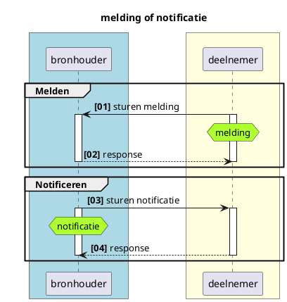
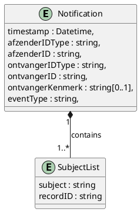
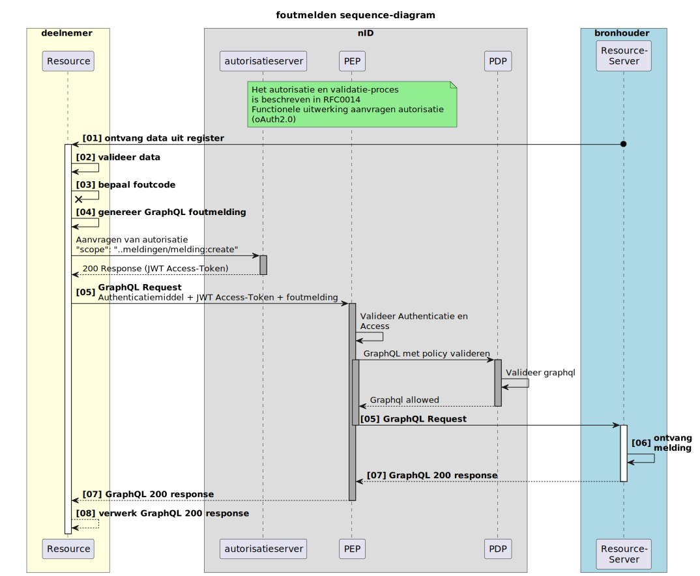
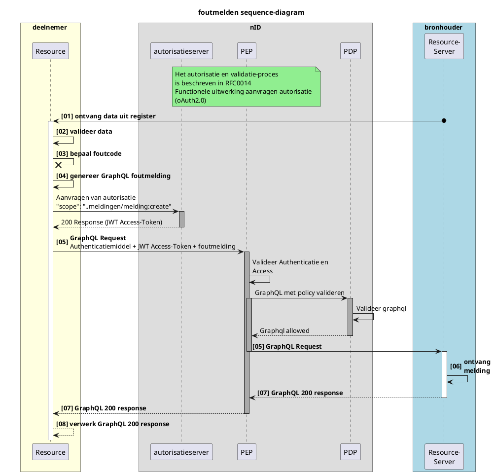
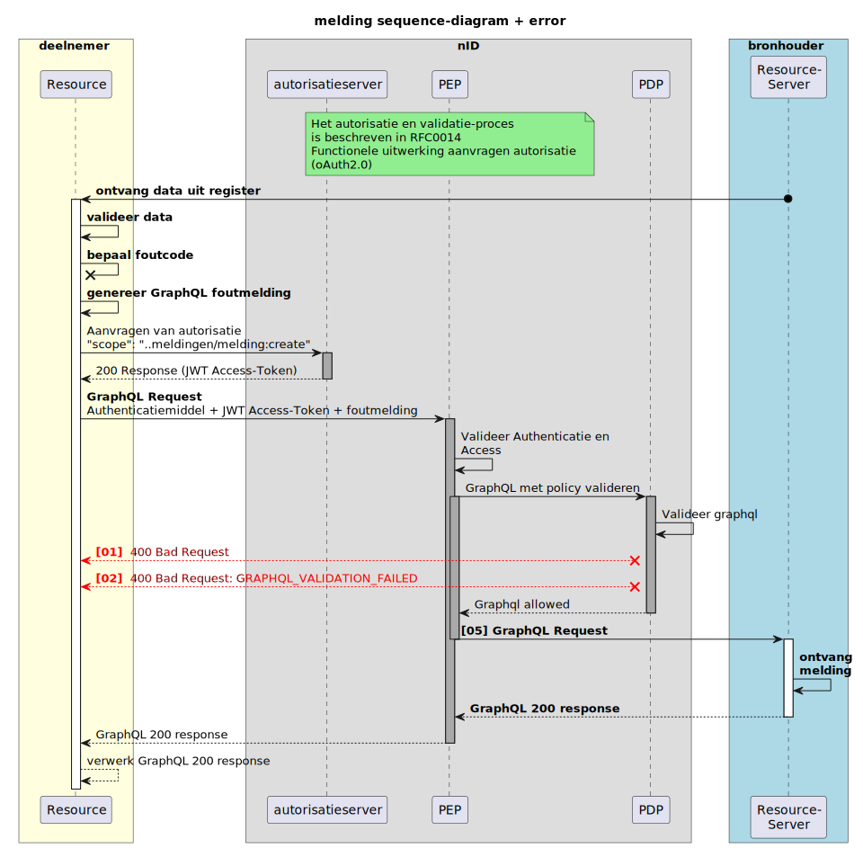
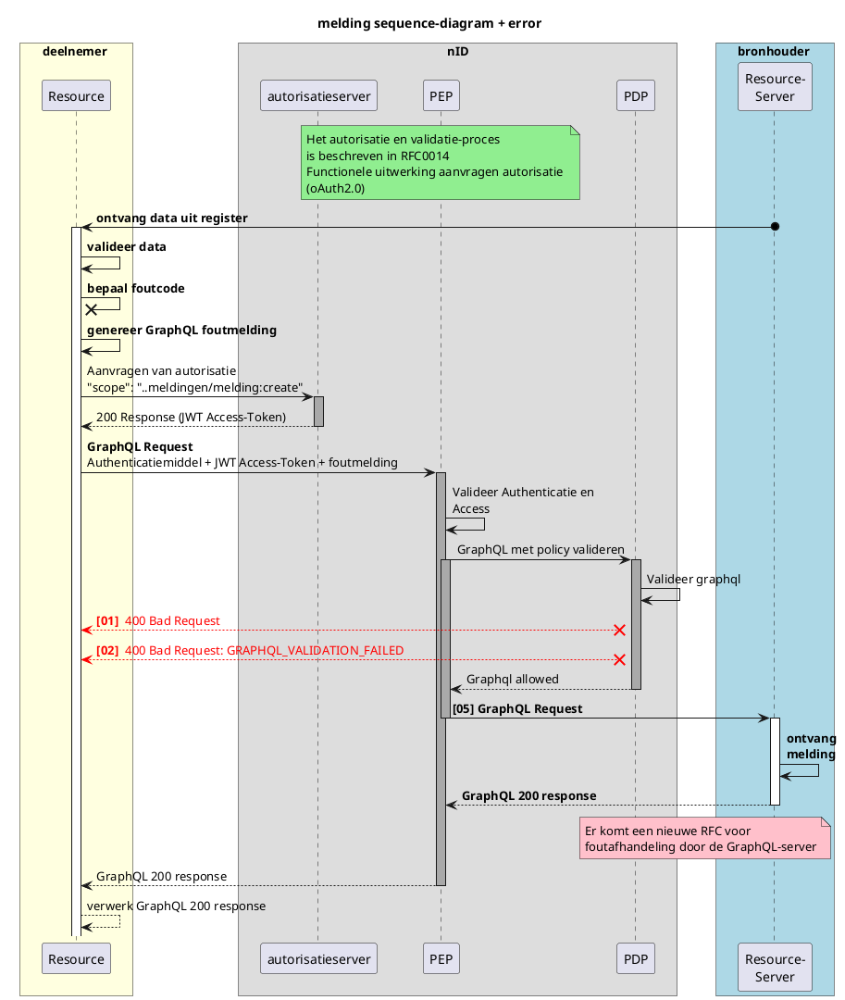

# RFC0018 - Melden van fouten in gegevens volgens iStandaard iWlz


> versie 0.9 d.d. 12-12-2024
 

<font size="4">**SAMENVATTING**</font>

**Huidige situatie:**

`Nieuwe functionaliteit`

**Beoogde situatie**

Dit document beschrijft functioneel de generieke werking van regelfout meldingen in het Netwerkmodel iWlz. Het gaat om het melden van geconstateerde afwijking(en) op regels die voorgeschreven zijn in de iStandaard iWlz. Met notificaties of meldingen worden respectievelijke afnemer of bronhouder geattendeerd op nieuwe informatie die relevant is voor die afnemer of bronhouder.

<font size="4">**Status RFC**</font>

Volg deze [link](https://github.com/iStandaarden/iWlz-RFC/issues/16) om de actuele status van deze RFC te bekijken.

---

**Inhoudsopgave**

- [RFC0018 - Melden van fouten in gegevens volgens iStandaard iWlz](#rfc0018---melden-van-fouten-in-gegevens-volgens-istandaard-iwlz)
- [1. Inleiding](#1-inleiding)
  - [1.1. Uitgangspunten](#11-uitgangspunten)
  - [1.2 Relatie andere RFC's](#12-relatie-andere-rfcs)
  - [1.3 Code](#13-code)
- [2. Melding of notificatie; wat is het verschil?](#2-melding-of-notificatie-wat-is-het-verschil)
- [3. Meldingen](#3-meldingen)
  - [3.1 Doel melding](#31-doel-melding)
  - [3.2 Typen melding](#32-typen-melding)
  - [3.3 Inhoud iWlz Foutmelding](#33-inhoud-iwlz-foutmelding)
    - [3.3.1 Afzender en Ontvanger lijst](#331-afzender-en-ontvanger-lijst)
  - [3.4 Foutmelden](#34-foutmelden)
  - [3.5 Voorbeeld iWlz Foutmelding](#35-voorbeeld-iwlz-foutmelding)
  - [3.6 Response op inzenden Foutmelding vanuit OPA](#36-response-op-inzenden-foutmelding-vanuit-opa)
- [4. Referenties](#4-referenties)


---

# 1. Inleiding

Binnen het iWlz netwerkmodel werken we met generieke technische oplossingen en contracten om minimaal afhankelijk te zijn van gezamenlijke releases. Daarom werken we bijvoorbeeld met GraphQL, zodat het uitleveren van extra gegevens via een register geen impact heeft op de overige deelnemers aan het netwerk. Daarnaast spelen register een centrale rol in het beschikbaarstellen van informatie aan ketenpartijen. Een bronhouder is verantwoordelijk voor de integriteit van de data in haar register. De afspraken met betrekking tot deze integriteit zijn beschreven in het Informatiemodel iWlz, te vinden op [iStandaarden](https://istandaarden.nl) en [Informatiemodel iWlz](https://informatiemodel.istandaarden.nl).

Binnen het estafettemodel wordt gewerkt met heenberichten en retourberichten. Op het heenbericht volgt het retourbericht waarin het mogelijk is om door middel van retourcodes te melden waar de inhoud van het bericht niet voldoet aan de regels van de iWlz.

Het heenbericht is vergelijkbaar met een raadpleging van gegevens in een register. Daar kan ook op gereageerd worden wanneer er situaties aangetroffen worden die niet voldoen aan de regels van de iWlz. Dat gaat in het netwerk model met een **foutmelding**.

Deze RFC beschrijft de gewenste functionaliteit voor de **foutmelding**.

## 1.1. Uitgangspunten

- Deze request for comments beschrijft het proces van meldingen en verschillende vormen. In de eerste implementatie zal alleen de foutmelding worden geïmplementeerd.
- Er is een lijst beschikbaar met end-points voor meldingen.

## 1.2 Relatie andere RFC's

Deze RFC heeft de volgende relatie met andere RFCs:
| RFC | onderwerp | relatie<sup>\*</sup> | toelichting | issue |
|:------------------------------------------------------------------|:-----------------------------|:--------------------|:--------------------------------------------------------------|:--------------------------------------------------------|
| [RFC0008](/RFC/RFC0008%20-%20Notificaties.md) | Functionele uitwerking notificaties | gerelateerd | Notificaties is de berichtgeving van bronhouder aan deelnemer | [#2](https://github.com/iStandaarden/iWlz-RFC/issues/2) |
| [RFC0003](/RFC/RFC0003%20-%20Adresboek.md) | Adresboek | afhankelijk | beschrijft realisatie Adresboek | [#4](https://github.com/iStandaarden/iWlz-RFC/issues/4) |
| [RFC0014](/RFC/RFC0014%20-%20Functionele%20uitwerking%20aanvragen%20van%20autorisatie.md) | Functionele uitwerking aanvragen autorisatie | afhankelijk |Toegang en autorisatie voor verzenden notificatie | [#9](https://github.com/iStandaarden/iWlz-RFC/issues/9) |

## 1.3 Code

De bijbehorende koppelvlakspecificaties zijn te vinden in [https://github.com/iStandaarden/iWlz-generiek/tree/master](https://github.com/iStandaarden/iWlz-generiek/tree/master).

# 2. Melding of notificatie; wat is het verschil?


<details>
<summary>plantUML-source</summary>



</details>

|             | Van        | Naar       | Omschrijving                                                                                                                                                                |
| :---------- | :--------- | :--------- | :-------------------------------------------------------------------------------------------------------------------------------------------------------------------------- |
| Melding     | Deelnemer  | Bronhouder | verzoek tot muteren of het beschikbaar stellen van nieuwe informatie naar aanleiding van een gebeurtenis van een deelnemer aan een bron                                     |
| Notificatie | Bronhouder | Deelnemer  | op de hoogte stellen van een deelnemer over dat er nieuwe (of gewijzigde) informatie in een bron beschikbaar is die directe of afgeleide betrekking heeft op die deelnemer. |

Het onderdeel Notificatie is verder uitgewerkt in [**RFC0008 - Functionele uitwerking notificaties en abonnementen**](/RFC/RFC0008%20-%20Notificaties.md).


# 3. Meldingen

## 3.1 Doel melding

Door middel van een melding kan een raadpleger van een bron de bronhouder voorzien van nieuwe informatie die direct betrekking heeft op data in die bron. Een melding loopt altijd van deelnemer (raadpleger) naar een bronhouder.


## 3.2 Typen melding

Er zijn drie vormen van meldingen gedefinieerd aan de hand van de gestructueerdheid van de informatie in de melding en of die informatie direct betrekking heeft op gegevens in het register.

|  #  | Type melding    | omschrijving                                                                                                              | gestructureerdheid/relateerbaarheid                                             |
| :-: | :-------------- | :------------------------------------------------------------------------------------------------------------------------ | :------------------------------------------------------------------------------ |
|  1  | **Foutmelding** | Voor het melden van afwijking/overtreding van regels beschreven in de iWlz iStandaard                                     | Zeer, direct te relateren aan een gegeven en afgesproken inhoud dmv (fout-)code |
|  2  | Terugmelding    | Voor het aandragen van een voorstel voor verbetering aandragen aan de bron; bijvoorbeeld wijziging coördinator zorg thuis | minder, wel te relateren, maar vrije (tekstuele) inhoud                         |
|  3  | Aanvraagmelding | Voor het indienen van nieuwe gegevens, ongerelateerd aan bestaande informatie                                             | ongestructureerd                                                                |

> [!NOTE]
> Deze RFC gaat vooral over de **Foutmelding**, waarbij er zoveel mogelijk rekeninggehouden wordt met het mogelijk maken van de overige twee vormen.


## 3.3 Inhoud iWlz Foutmelding

De inhoud is in structuur gelijk aan de notificatie. Op basis van de inhoud van een melding moet de ontvanger van de melding onder andere kunnen bepalen:
- wat is de fout, wat is de reden van de foutmelding.
- wie de afzender is van de foutmelding
- van welke raadpleger is de foutmelding afkomstig
- wanneer is de foutmelding verzonden
- op welke informatie de foutmelding betrekking heeft
- autorisatievoorziening moet voldoende informatie hebben om te kunnen bepalen dat de foutmelding valide is. (Bijvoorbeeld: melder mag de foutmelding insturen naar de bron)

De foutmelding bevat de volgende gegevens:

| Gegeven | Algemene beschrijving | Aanvullende specificatie Foutmelding | V/O* | Datatype |
|---|---|---|---|---|
| timestamp | Tijdstip waarop de notificatie is aangemaakt |  | V | Datetime[^1] |
| afzenderIDType | Kenmerk van het type ID van de verzendende partij |  | V | String |
| afzenderID | Identificatie van de verzender van het bericht |  | V | String |
| ontvangerIDType | Kenmerk van het type ID van de ontvangende partij |  | V | String |
| ontvangerID | Identifictie van de ontvanger van het bericht |  | V | String |
| ontvangerKenmerk | Kenmerk voor de ontvanger: | Identificatie van de melder,wanneer dit niet de afzender is. Format: **\<Afzendercode>: ID** | O | String |
| eventType | Onderwerptype van het bericht | Identificatie van het type melding. (nu alleen **iWlzFoutmelding**) | V | String |
| subjectList | Lijst met meldingen |  | V | Array |
| .. / subject | Onderwerp van het bericht | Foutcode overtreden regel. | V | String |
| .. / recordID | Identificatie van het record waar het bericht betrekking op heeft. | Identificatie van het record waar de melding betrekking op heeft. | V | String |

<sup>\*</sup> V = verplicht / O = Optioneel

[^1]: Datetime volgens ISO-8601 zie https://en.wikipedia.org/wiki/ISO_8601 en https://scalars.graphql.org/andimarek/date-time. Formaat is bijvoorbeeld: 2016-07-20T17:30:15Z, 2016-07-20T17:30:15+05:30, 2016-07-20T17:30:15.234890+05:30 


<details>
  <summary>plantUML-source</summary>



</details>


### 3.3.1 Afzender en Ontvanger lijst

| Code  | Omschrijving                         | Referentie                                                | Toepassing                                                           |
| :---- | :----------------------------------- | :-------------------------------------------------------- | :------------------------------------------------------------------- |
| AGB   | AGB-code                             | [AGB-register](https://www.vektis.nl/agb-register/zoeken) | identificatie Zorgaanbieder                                          |
| BSN   | Burgerservicenummer                  |                                                           | identificatie Burger (nog geen toepassing)                           |
| KVK   | Kamer van Koophandel                 | [KVK-register](https://www.kvk.nl/zoeken/)                | identificatie Ondernemer (CIZ bij eerste implementatie<sup>\*</sup>) |
| OIN   | Organisatie Identificatienummer      | [OIN-register](https://www.vektis.nl/agb-register/zoeken) | identificatie CIZ [^2]                          |
| UZOVI | Unieke ZorgVerzekeraarsIdentificatie | [UZOVI-register](https://www.vektis.nl/uzovi-register)    | identificatie Zorgkantoren                                           |

[^2]: Op dit moment is het voor VECOZO niet mogelijk om een OIN te verifieren waardoor er geen claim kan worden afgegeven op basis van OIN. Bij de eerste implementatie van meldingen zal voor de identificatie van het CIZ het KVK-nummer (62253778) worden gebruikt.


## 3.4 Foutmelden

iWlz foutmeldingen zijn nodig om een bronhouder te attenderen op overtredingen van een regel in het informatiemodel iWlz. Wanneer een deelnemer een dergelijke situatie detecteert, stuurt deze een foutmelding aan de bronhouder.

> [!NOTE]
> De hier beschreven flow beschrijft alleen het melden zelf. Voor het melden is autorisatie nodig. Het aanvragen van autorisatie en de bijbehorende flow is beschreven in [RFC0014 - Functionele uitwerking aanvragen autorisatie](/RFC/RFC0014%20-%20Functionele%20uitwerking%20aanvragen%20van%20autorisatie.md) .



<details>
<summary>plantUML-source</summary>



</details>

| # | Beschrijving | Toelichting |
|---|---|---|
| 01 | Ontvang gegevens | Raadplegen van gegevens door de deelnemer |
| 02 | Valideer data | Valideer de ontvangen gegevens met de regels van de iWlz |
| 03 | Bepaal foutcode | Als er een iWlz-fout geconstateerd is, neem de foutcode daarvan |
| 04 | Genereer foutmelding | Stel een foutmelding op volgens de specificaties |
| 05 | Stuur het complete GraphQL-request naar de bron | Stuur het volledige GraphQL request (autorisatiemiddel, token en foutmelding) via de autorisatievoorziening naar de bronhouder. |
| 06 | Ontvang foutmelding | Ontvang en verwerk foutmelding |
| 07 | GraphQL 200 response  | ontvangstbevestiging verzenden aan deelnemer (via autorisatievoorziening) |
| 08 | Verwerk response |  |


## 3.5 Voorbeeld iWlz Foutmelding

Situatie: bij een indicatie voldoet in de klasse Stoornis de waarde van element DiagnoseSubcodelijst niet aan de bijbehorende regel IRG0012: DiagnoseSubcodelijst vullen conform opgegeven DiagnoseCodelijst. Deze fout wordt op de volgende manier worden teruggegeven. Omdat het element niet afzonderlijk is te duiden, bevat het objectId de verwijzing naar het record in de klasse Stoornis, waar het element DiagnoseSubcodelijst onderdeel van is. De tweede fout die is geconstateerd is het overlappen van periodes voor GeindiceerdeZorgzwaartepakketten. Dit is een overtreding van de regel IRG0028.

Voorbeeld van een mutation zendMelding:

```gql
mutation zendMelding(
  $timestamp: DateTime!
  $afzenderIDType: String!
  $afzenderID: String!
  $ontvangerIDType: String!
  $ontvangerID: String!
  $ontvangerKenmerk: String
  $eventType: String!
  $subjectList: [SubjectEntity!]!
) {
  zendMelding(
    meldingInput: {
      timestamp: $timestamp
      afzenderIDType: $afzenderIDType
      afzenderID: $afzenderID
      ontvangerIDType: $ontvangerIDType
      ontvangerID: $ontvangerID
      ontvangerKenmerk: $ontvangerKenmerk
      eventType: $eventType
      subjectList: $subjectList
    }
  ) {
    meldingID
  }
}
```

Voorbeeld Input variabelen afzender in de (fout-)melder zelf:

```json
{
  "timestamp": "2024-07-02T00:00:00Z",
  "afzenderIDType": "UZOVI",
  "afzenderID": "5151",
  "ontvangerIDType": "KVK",
  "ontvangerID": "12345678",
  "eventType": "IWLZFOUTMELDING",
  "subjectList": [
    {
      "subject": "IRG0012",
      "recordID": "wlzindicatie/Stoornis/da8ebd42-d29b-4508-8604-ae7d2c6bbddd"
    },
    {
      "subject": "IRG0028",
      "recordID": "wlzindicatie/GeindiceerdZorgzwaartepakket/5850ad49-7cf4-4711-8215-e160715900e7"
    }
  ]
}
```

Voorbeeld: Input variabelen als de afzender stuurt namens een melder:

```json
{
  "timestamp": "2024-07-02T00:00:00Z",
  "afzenderIDType": "UZOVI",
  "afzenderID": "2121",
  "ontvangerIDType": "KVK",
  "ontvangerID": "12345678",
  "ontvangerKenmerk": "UZOVI:5151",
  "eventType": "IWLZFOUTMELDING",
  "subjectList": [
    {
      "subject": "IRG0012",
      "recordID": "wlzindicatie/Stoornis/da8ebd42-d29b-4508-8604-ae7d2c6bbddd"
    },
    {
      "subject": "IRG0028",
      "recordID": "wlzindicatie/GeindiceerdZorgzwaartepakket/5850ad49-7cf4-4711-8215-e160715900e7"
    }
  ]
}
```


Voorbeeld response:

```http
HTTP/1.1 200
{
  "data": {
    "zendMelding": {
      "meldingID": "86978bf6-f1b6-4c5c-aeac-f0b436fa3d3e"
    }
  }
}
```

## 3.6 Response op inzenden Foutmelding vanuit OPA

Het notificatiesysteem binnen nID is ontworpen om meldingen en notificaties op een consistente en betrouwbare manier te verzenden naar geautoriseerde partijen binnen de iWlz-keten. Dit proces wordt ondersteund door de GraphQL-operaties zendMelding en zendNotificatie, die verantwoordelijk zijn voor het initiëren van respectievelijk (fout)meldingen en notificaties.

De responses van deze GraphQL-operaties bieden een gestandaardiseerde manier om de uitkomst van het verzoek te communiceren. Ze bevatten zowel statusinformatie als foutmeldingen, die essentieel zijn voor het begrijpen en diagnosticeren van het notificatieproces. Dit maakt het mogelijk om problemen in de keten snel te identificeren en te verhelpen.

De response codes zijn gebaseerd op gestandaardiseerde HTTP-statuscodes, uitgebreid met specifieke foutberichten en contextuele informatie om de aard van de uitkomst of fout te verduidelijken. Zowel technische als functionele foutscenario's worden behandeld, zodat ontwikkelaars en operators een volledig inzicht krijgen in de verwerking van notificaties.

Hieronder wordt een tabel weergegeven met de mogelijke response codes, foutberichten en oorzaken die kunnen optreden bij de uitvoering van de GraphQL-verzoeken zendMelding en zendNotificatie. Deze tabel dient als leidraad voor een correcte interpretatie van de responses en het oplossen van eventuele problemen.

De hieronder beschreven foutcodes ontstaan bij het valideren van de ingezonden GraphQL in nID, onderdeel PDP, waar wordt beoordeelt of de ingezonden mutatie 

Schematisch:



<details>
<summary>plantUML-source</summary>


  </details>

  | Response Code | Foutbericht | Oorzaak |
|---|---|---|
| 400 | Bad Request | Het foutmelding bevatte ongeldige of ontbrekende parameters. |
| 400 | Bad Request GRAPHQL_VALIDATION_FAILED instantie_type claim not found | De JWT token bevat geen instantie_type claim |
| 400 | Bad Request GRAPHQL_VALIDATION_FAILED afzender_type is not valid | De afzenderIDType komt niet overeen met de instantie_type claim of is niet toegestaan |
| 400 | Bad Request GRAPHQL_VALIDATION_FAILED event_type is not valid | Het opgegeven event type komt niet voor in de lijst met toegestane types |
| 400 | Bad Request GRAPHQL_VALIDATION_FAILED ontvanger is not valid | De combinatie van ontvangerIDType en eventType is niet toegestaan |

Met deze informatie kunnen deelnemers snel vaststellen wat er gebeurt binnen het foutmeldingproces en waar mogelijke knelpunten zich bevinden.


# 4. Referenties
| Onderwerp | Verwijzing |
|---|---|
| RFC 0014 - autorisatie oAuth2.0 | https://github.com/iStandaarden/iWlz-RequestForComment/blob/main/RFC/RFC0014%20-%20Functionele%20uitwerking%20aanvragen%20van%20autorisatie.md |
| Informatiemodel iWlz - Indicatieregister 2 | https://informatiemodel.istandaarden.nl/iWlz-Indicatie-2/ |
| Informatiemodel iWlz - Bemiddelingsregister | https://informatiemodel.istandaarden.nl/iWlz-Bemiddeling-1/ |
| Koppelvlakspecificatie notificeren | https://github.com/iStandaarden/iWlz-generiek |