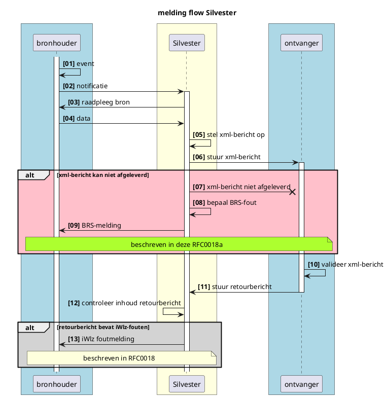

# CONCEPT - RFC0018a - Addendum A: Integratie foutmeldingen VECOZO

> [!IMPORTANT]
> Deze Request for Comment is een aanvulling op [RFC0018 - Melden van fouten in gegevens volgens iStandaard iWlz](/RFC/RFC0018%20-%20Melden%20van%20fouten%20in%20gegevens%20volgens%20iStandaard%20iWlz.md) 

<font size="4">**SAMENVATTING**</font>

**Huidige situatie:**

De [RFC0018 - Melden van fouten in gegevens volgens iStandaard iWlz](/RFC/RFC0018%20-%20Melden%20van%20fouten%20in%20gegevens%20volgens%20iStandaard%20iWlz.md) beschrijft de basis voor het doen van meldingen in het Netwerkmodel iWlz. In de basis RFC is beschreven hoe geconstateerde fouten in gegevens volgens de iStandaard iWlz gemeld kunnen worden aan de bronhouder. Dit principe is generiek van opzet waardoor er meerdere functionele toepassingen mogelijk zijn op dezelfde basis.

**Beoogde situatie**

Dit document beschrijft functioneel hoe meldingen en welke meldingen door VECOZO worden teruggegeven wanneer VECOZO de Silvester functie uitvoert. 

<font size="4">**Status RFC**</font>

@@@ Volg deze [link](https://github.com/iStandaarden/iWlz-RFC/issues/16) om de actuele status van deze RFC te bekijken.

**Inhoudsopgave**
- [CONCEPT - RFC0018a - Addendum A: Integratie foutmeldingen VECOZO](#concept---rfc0018a---addendum-a-integratie-foutmeldingen-vecozo)
- [1. Inleiding](#1-inleiding)
  - [1.1. Uitgangspunten](#11-uitgangspunten)
  - [1.2 Relatie andere RFC's](#12-relatie-andere-rfcs)
  - [1.3 Code](#13-code)
- [2. Terminologie](#2-terminologie)
- [3. Meldingen](#3-meldingen)
- [4. Melden van berichtfouten door VECOZO](#4-melden-van-berichtfouten-door-vecozo)
  - [4.1 Voorbeeld BRS Foutmelding](#41-voorbeeld-brs-foutmelding)
  - [5 BRS foutmeldingen](#5-brs-foutmeldingen)


---
# 1. Inleiding
De [RFC0018 - Melden van fouten in gegevens volgens iStandaard iWlz](/RFC/RFC0018%20-%20Melden%20van%20fouten%20in%20gegevens%20volgens%20iStandaard%20iWlz.md) beschrijft de basis voor het doen van meldingen in het Netwerkmodel iWlz. In de basis RFC is ook beschreven hoe geconstateerde fouten in gegevens volgens de iStandaard iWlz gemeld kunnen worden aan de bronhouder. Dit principe is generiek van opzet waardoor er meerdere functionele toepassingen mogelijk zijn op dezelfde basis.

Bij de overgang naar het netwermodel iWlz is de voorziening Silvester de brug tussen een register en het estafettemodel dat werkt op basis van xml-berichten. VECOZO faciliteert deze voorziening. Bij de verzending van uit de registers samengestelde xml-berichten kunnen fouten ontstaan die niet door de ontvanger van een bericht worden geconstateerd, maar door VECOZO (bijvoorbeeld bericht kan niet worden afgeleverd). 

Dit moet VECOZO kunnen terugmelden aan de bronhouder. Deze RFC beschrijft hoe dit moet. 


## 1.1. Uitgangspunten
  - Het meldingen principe beschreven in [RFC0018 - Melden van fouten in gegevens volgens iStandaard iWlz](/RFC/RFC0018%20-%20Melden%20van%20fouten%20in%20gegevens%20volgens%20iStandaard%20iWlz.md) is geimplementeerd.
  - VECOZO foutmeldingen gaan uit van de foutcodes in het Berichtenloket van VECOZO: zie [Lijst met foutcodes](https://www.vecozo.nl/berichtloket/lijst-met-foutcodes/)

## 1.2 Relatie andere RFC's
Deze RFC heeft de volgende relatie met andere RFCs:
| RFC                                                               | onderwerp                    | relatie<sup>*</sup> | toelichting                                                   | issue                                                   |
|:------------------------------------------------------------------|:-----------------------------|:--------------------|:--------------------------------------------------------------|:--------------------------------------------------------|
| [RFC0008](/RFC/RFC0008%20-%20Notificaties%20en%20Abonnementen.md) | Notificaties en abonnementen | gerelateerd         | Notificaties is de berichtgeving van bronhouder aan deelnemer | [#2](https://github.com/iStandaarden/iWlz-RFC/issues/2) |
| [RFC0018](/RFC/RFC0018%20-%20Melden%20van%20fouten%20in%20gegevens%20volgens%20iStandaard%20iWlz.md) | Meldingen: Melden van iWlz gegevensfouten | afhankelijk | beschrijft het stroom van raadpleger aan bronhouder | [#16](https://github.com/iStandaarden/iWlz-RFC/issues/16) |

<sup>*</sup>voorwaardelijk,*voor andere RFC* / afhankelijk, *van andere RFC*

## 1.3 Code
De bijbehorende koppelvlakspecificaties zijn te vinden in [https://github.com/iStandaarden/iWlz-generiek/tree/master](https://github.com/iStandaarden/iWlz-generiek/tree/master).

# 2. Terminologie
Opsomming van de in dit document gebruikte termen.

| Terminologie | Omschrijving |
| :-------- | :-------- | 
| Bronhouder | Aanbieder van de data, houder van het register |
| Deelnemer | De raadpleger van de bron, het register | 
| Register | Omgeving rondom register, o.a. voor afhandelen van netwerk-diensten |
| Register-data | De feitelijke databron / database | 
| Silvester | Voorziening die registerdata omzet naar iWlz berichten |


# 3. Meldingen

De algemene werking van *Meldingen*, de structuur, voorbeelden etc is beschreven in [RFC0018 - Melden van fouten in gegevens volgens iStandaard iWlz](/RFC/RFC0018%20-%20Melden%20van%20fouten%20in%20gegevens%20volgens%20iStandaard%20iWlz.md)


# 4. Melden van berichtfouten door VECOZO

De flow is gebaseerd op de algemene beschrijving zoals beschreven in [RFC0018 - Melden van fouten in gegevens volgens iStandaard iWlz](/RFC/RFC0018%20-%20Melden%20van%20fouten%20in%20gegevens%20volgens%20iStandaard%20iWlz.md)


<details>
<summary>plantUML-source</summary>


</details>

| # | Beschrijving | Toelichting |
|:---:|---|---|
| 01 | event | Registratie van data triggert notificatie event |
| 02 | notificatie | Bronhouder stuurt notificatie naar Silvester voor xml-bericht |
| 03 | raadpleeg bron(nen) | Silvester raadpleegt bron(nen) om iWlz bericht samen te stellen |
| 04 | data | Data voor xml-bericht |
| 05 | stel xml-bericht op | Xml-bericht opstellen |
| 06 | stuur xml-bericht | Silvester stuurt het xml-bericht naar de ontvanger |
| *ALT* | xml-bericht kan niet worden afgeleverd |  |
| 07 | xml-bericht niet afgeleverd | Ontvanger kan het xml-bericht niet ontvangen |
| 08 | bepaal BRS-fout | bepaal de BRS-foutcode |
| 09 | BRS-melding | Stuur de BRS-melding naar de notificatie bron. Dit is de aanleiding van het osptellen en verzenden van een xml-bericht. Eventuele fouten die hier ontstaan zijn veroorzaakt door die bronhouder. |
| | |
| 10 | valideer xml-bericht | Ontvanger controleert ontvangen xml-bericht op iWlz fouten |
| 11 | stuur retourbericht | Stuur retourbericht naar Silvester |
| 12 | controleer inhoud retourbericht | Bepaal of er foutmeldingen nodig zijn |
| *ALT* | retourbericht bevat iWlz-fouten | |
| 13 | iWlz foutmelding | Stuur iWlz-foutmelding naar bronhouder | 


## 4.1 Voorbeeld BRS Foutmelding

```json
{
  "timestamp": "2022-09-27T12:07:07.492Z",
  "afzenderTypeID": "KVK",
  "afzenderID": "12341234",
  "ontvangerIDType": "Uzovi",
  "ontvangerID": "1234",
  "ontvangerKenmerk": null,
  "eventType": "IWLZFOUTMELDING",
  "subjectList": [
    {
      "subject": "BRS13 The 'http://www.istandaarden.nl/iwlz/2_4/aw33/schema:Soort' element is invalid - The value '4' is invalid according to its datatype",
      "recordID": "bemiddeling/bemiddelingspecificatie/5850ad49-7cf4-4711-8215-e160715900e7"     
    }
  ]
}
```

Toelichting:
- afzenderID: KVK nummer van VECOZO
- eventType: "IWLZFOUTMELDING"
- recordID: verwijzing naar bron-type
- subject: BRS-foutcode inclusief aanvullende toelichting. 


# 5 BRS Foutcodes

De onderstaande lijst met BRS-foutcodes is afkomstig van [VECOZO](https://www.vecozo.nl/berichtloket/lijst-met-foutcodes/). In de tabel is per BRS-foutcode aangegeven of deze door VECOZO wordt teruggemeld als BRS-foutmelding naar de bron van de notificatie. 

|    Code                   | **Omschrijving**                                                                                       | **Naar   Notificatiebron** | **reden**                                                                                |
|-------------------------------|------------------------------------------------------------------------------------------------------------------|--------------------------------------|----------------------------------------------------------------------------------------------------|
| **BRS01**           |    Afzender is niet bekend bij VECOZO                                                                        |    nee                           |    kan niet voorkomen                                                                          |
| **BRS02**           |    Indiener beschikt niet over de juiste rol om   voor dit berichttype berichten in te dienen                |    nee                           |    oorzaak Silvester                                                                           |
| **BRS03**           |    Indiener is niet gemachtigd om namens de   afzender het bericht in te dienen                              |    nee                           |    oorzaak Silvester                                                                           |
| **BRS04**           |    Geadresseerde partij is niet aangesloten bij   VECOZO                                                     |    ja                            |    notificatie naar onbekende ontvanger op basis   van data                                    |
| **BRS05**           |    Geadresseerde partij beschikt niet over de   juiste rol om voor dit berichttype berichten te ontvangen    |    ja                            |    notificatie voor onterechte ontvanger op basis   van data                                   |
| **BRS06**           |    Payload is groter dan toegestaan                                                                          |    ja                            |    Teveel data in bericht                                                                      |
| **BRS07 t/m BRS11** |    Verschillende meldingen mbt deelberichten                                                                 |    nee                           |    Nvt: Silvester dient geen deelberichten in                                                  |
| **BRS12**           |    Virus gedetecteerd in payload                                                                             |    nee                           |    oorzaak Silvester                                                                           |
| **BRS13**           |    Berichtinhoud voldoet niet aan XSD                                                                        |    ja                            |    foutieve data aangeleverd                                                                   |
| **BRS14**           |    Payload bevat geen well-formed XML                                                                        |    nee                           |    oorzaak Silvester                                                                           |
| **BRS15**           |    Geen geldig ZIP-bestand aangeleverd                                                                       |    nee                           |    oorzaak Silvester                                                                           |
| **BRS16**           |    ZIP-bestand bevat meer bestanden dan   toegestaan                                                         |    nee                           |    oorzaak Silvester                                                                           |
| **BRS17**           |    ZIP-bestand bevat wachtwoordbeveiliging                                                                   |    nee                           |    oorzaak Silvester                                                                           |
| **BRS18**           |    Bericht bevat persoonsgegevens die niet zijn   toegestaan op deze omgeving                                |    ja                            |    Er is getest met clienten die niet op de   whitelist staan (komt niet voor op productie)    |
| **BRS19**           |    Bestand in ZIP-bestand is groter dan   toegestaan                                                         |    nee                           |    oorzaak Silvester                                                                           |
| **BRS20**           |    Identificatie moet per berichtsoort uniek zijn   voor de verzendende partij                               |    nee                           |    oorzaak Silvester                                                                           |
| **BRS21**           |    ZIP-bestand bevat minder bestanden dan   toegestaan                                                       |    nee                           |    oorzaak Silvester                                                                           |
| **BRS22**           |    Bericht afgekeurd o.b.v. bedrijfs- en   controleregels                                                    |    ja                            |    foutieve data aangeleverd                                                                   |
| **BRS23**           |    Het ingediende bestand is geen EI-bestand                                                                 |    nee                           |    oorzaak Silvester                                                                           |
| **BRS24**           |    Retourbericht is niet van de verwachtte   berichtstroom                                                   |    nee                           |    Nvt: Silvester dient geen retourberichten in                                                |
| **BRS25**           |    Bestand bevat geen ondersteunde EI-standaard                                                              |    nee                           |    oorzaak Silvester                                                                           |
| **BRS26**           |    Afzender in payload is niet gelijk aan   afzender in routeringgegevens                                    |    nee                           |    oorzaak Silvester                                                                           |
| **BRS27**           |    Bestand voldoet niet aan CSV-standaard                                                                    |    nee                           |    Nvt: silvester dient geen csv bestanden in                                                  |
| **BRS28**           |    Het bericht is afgekeurd op basis van   XSLT-controles                                                    |    nee                           |    oorzaak Silvester of gaat via retourbericht                                                 |
| **BRS29**           |    ZIP-bestand bevat mappenstructuur                                                                         |    nee                           |    oorzaak Silvester                                                                           |
| **BRS30**           |    Geadresseerde ontbreekt                                                                                   |    nee                           |    oorzaak Silvester                                                                           |
| **BRS31**           |    De bestandsnaam in het ZIP-bestand heeft meer   karakters dan toegestaan                                  |    nee                           |    oorzaak Silvester                                                                           |
| **BRS32**           |    De bestandsnaam in het ZIP-bestand bevat   ongeldige karakters                                            |    nee                           |    oorzaak Silvester                                                                           |
| **BRS33**           |    Bericht kan niet afgeleverd worden                                                                        |    ja                            |    notificatie naar onbekende ontvanger op basis   van data                                    |
| **BRS34**           |    De bestandsnaam in het ZIP-bestand voldoet   niet aan de naamconventie                                    |    nee                           |    oorzaak Silvester                                                                           |
| **BRS35**           |    Bestand voldoet niet aan JSON-standaard                                                                   |    nee                           |    Nvt: Silvester dient geen json bestanden in                                                 |
| **BRS36**           |    Bestand is niet opgesteld met de juiste   karaktercodering                                                |    nee                           |    oorzaak Silvester                                                                           |
| **BRS114**          |    TraceerID is niet uniek                                                                                   |    nee                           |    oorzaak Silvester                                                                           |