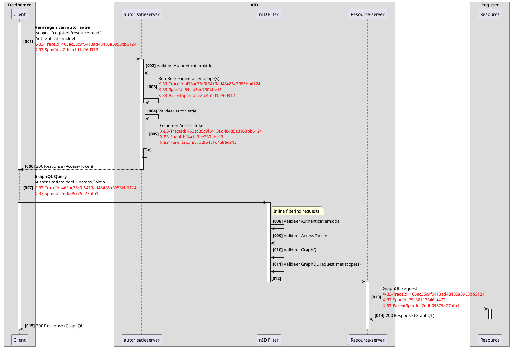
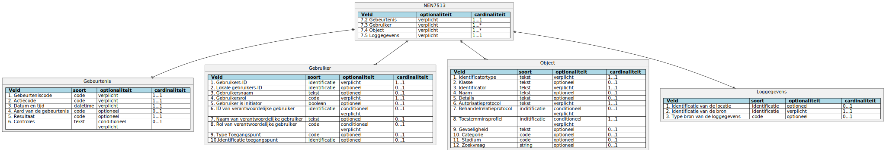

# RFC0019 - Logging

<font size="4">**SAMENVATTING**</font>

**Huidige situatie:**

>```nog invullen```

**Beoogde situatie**

Dit document beschrijft de wijze van geautomatiseerde registratie van gebeurtenissen in het netwerkmodel en is beschrijft de practische invulling van de norm in het netwerkmodel.Deze RFC is zeker geen vervanging van de NEN7513 richtlijnen.

<font size="4">**Status RFC**</font>

Volg deze [link](https://github.com/iStandaarden/iWlz-RFC/issues/17) om de actuele status van deze RFC te bekijken.

---
**Inhoudsopgave**
- [RFC0019 - Logging](#rfc0019---logging)
- [1. Inleiding](#1-inleiding)
  - [1.1. Uitgangspunten](#11-uitgangspunten)
  - [1.2 Relatie andere RFC](#12-relatie-andere-rfc)
- [2. Terminologie](#2-terminologie)
- [3 Zekerheidseisen](#3-zekerheidseisen)
  - [3.1 Algemeen](#31-algemeen)
  - [3.2 De verantwoordelijkheid voor de logging](#32-de-verantwoordelijkheid-voor-de-logging)
  - [3.5 De bewaartermijn van loggegevens](#35-de-bewaartermijn-van-loggegevens)
  - [3.6 Voorwaarden voor interoperabiliteit](#36-voorwaarden-voor-interoperabiliteit)
- [4 Traceerbaarheid](#4-traceerbaarheid)
  - [4.1 TraceContext](#41-tracecontext)
  - [4.2 X-B3-TraceId](#42-x-b3-traceid)
  - [4.3 X-B3-SpanId](#43-x-b3-spanid)
  - [4.4 X-B3-ParentSpanId](#44-x-b3-parentspanid)
  - [4.3 Voorbeeld van een flow](#43-voorbeeld-van-een-flow)
- [7. Gegevensvelden in de logging](#7-gegevensvelden-in-de-logging)
  - [7.1 Algemeen](#71-algemeen)
  - [7.2 Gebeurtenis](#72-gebeurtenis)
    - [7.2.1 Gebeurteniscode](#721-gebeurteniscode)
    - [7.2.2 Actiecode](#722-actiecode)
    - [7.2.3 Datum en tijd](#723-datum-en-tijd)
    - [7.2.4 Aard van de gebeurtenis](#724-aard-van-de-gebeurtenis)
    - [7.2.5 Resultaat](#725-resultaat)
    - [7.2.6 Controles](#726-controles)
  - [7.3 Gebruiker](#73-gebruiker)
    - [7.3.1 Gebruikers-ID](#731-gebruikers-id)
    - [7.3.2 Lokale gebruikers-ID](#732-lokale-gebruikers-id)
    - [7.3.3 Gebruikersnaam optioneel](#733-gebruikersnaam-optioneel)
    - [7.3.4 Gebruikersrol](#734-gebruikersrol)
    - [7.3.5 Gebruiker is de initiator](#735-gebruiker-is-de-initiator)
    - [7.3.9 Type toegangspunt](#739-type-toegangspunt)
    - [7.3.10 Identificatie toegangspunt](#7310-identificatie-toegangspunt)
  - [7.4 Object](#74-object)
    - [7.4.1 Identificatortype](#741-identificatortype)
    - [7.4.3 Identificator](#743-identificator)
    - [7.4.6 Autorisatieprotocol](#746-autorisatieprotocol)
    - [7.4.12 Zoekvraag](#7412-zoekvraag)
  - [7.5 Loggegevens](#75-loggegevens)
    - [7.5.1 Identificatie van de locatie](#751-identificatie-van-de-locatie)
    - [7.5.2 Identificatie van de bron](#752-identificatie-van-de-bron)
    - [7.5.3 Type bron van de loggegevens](#753-type-bron-van-de-loggegevens)
- [5. Export](#5-export)

---
# 1. Inleiding


Om de privacy van burgers te waarborgen is het meer dan ooit noodzakelijk om heldere afspraken te maken over de bescherming van (medische) gegevens tegen onbevoegde inzage en onbevoegd gebruik. De in deze RFC voorgeschreven wijze van logging heeft als doel een transparant beeld te geven van de gebeurtenissen in het netwerkmodel m.b.t. alle elektronische gegevensuitwisselingen en de toegang tot (zorg)informatiesystemen.

Logging is de stelselmatige geautomatiseerde registratie van gegevens rond de toegang tot die systemen met als primaire doel de controle van de rechtmatigheid ervan mogelijk te maken. De logging levert een betrouwbaar overzicht van de gebeurtenissen waarbij (persoonlijke) (gezondheids)informatie is verwerkt. Met de logging kan door verwerkingsverantwoordelijken controle worden uitgeoefend op (on)rechtmatige toegang tot informatie en
verantwoording worden afgelegd aan cliënten/burgers (die recht hebben op inzage van deze gegevens), collega’s en toezichthouders over de zorgvuldige en juiste omgang met de (gezondheids)gegevens. Cliënten kunnen de loggegevens gebruiken bij een klacht over (vermeende) onrechtmatige toegang tot persoonlijke informatie. De zorgaanbieder en verwerkingsverantwoordelijken kunnen
de logging gebruiken voor het verbeteren van het proces van de toegangscontrole tot (patiënt)gegevens en zo nodig om zich te verdedigen bij aansprakelijkheidsstellingen door cliënten of anderen betrokkenen.

Het complete inzicht in de gegevensstromen biedt de mogelijkheid om snel verdachte patronen te signaleren en kan worden gebruikt om verantwoording af te leggen over onder meer privacy en informatieveiligheid.


## 1.1. Uitgangspunten


| Uitgangspunt | Omschrijving |
| :-------- | :-------- | 
| *Normering* | *Elke netwerkdeelnemer diendt aantoonbaar te beschikken over een juiste informatiebeveiliging conform NEN 7510-norm. <br>Elke organisatie waar persoonlijke gezondheidsinformatie wordt verwerkt moet voldoen aan NEN 7513.* |
| *Standaardisatie* | *Alle ketendeelnemers voldoen aan de norm in het afsprakenstelsel iWlz, waaronder eenduidige logging en de mogelijkheid tot exporteren.*
| *Onweerlegbaarheid* | *Volgens NEN 7513 moet de logging kunnen voorzien in informatie waardoor achteraf onweerlegbaar kan worden vastgesteld welke gebeurtenissen hebben plaatsgevonden op een patiëntendossier of op een elektronisch uitwisselingssysteem.* |

## 1.2 Relatie andere RFC
Deze RFC heeft een relatie met de volgende RFC(s)
|RFC | onderwerp | relatie<sup>*</sup> | toelichting |issue |
|:--|:--|:--| :--|:--|
|[0008](RFC/RFC0008%20-%20Notificaties%20en%20Abonnementen.md) | Notificaties en abonnement | voorwaardelijk | <ul><li>Er is een **Service Directory** waarin notificatietypen gepubliceerd kunnen worden.</li> <li>Netwerkdeelnemers raadplegen de **Service Directory** om op te halen welke abonnementen geplaatst kunnen worden en welke voorwaarden hier aan zitten. </li></ul>|[#2](https://github.com/iStandaarden/iWlz-RFC/issues/2) |

<sup>*</sup>voorwaardelijk, *voor andere RFC* / afhankelijk, *van andere RFC*


# 2. Terminologie
Opsomming van de in dit document gebruikte termen.

| Terminologie | Omschrijving |
| :-------- | :-------- | 
| Logging | Stelselmatige geautomatiseerde registratie van gegevens rondom events op systemen | 
| Logverantwoordelijke | Directie van zorginstelling of andere organisatie die (persoonlijke)(gezondheids)informatie verwerkt, delen, bevragen of muteren met of via het netwerkmodel.

# 3 Zekerheidseisen
## 3.1 Algemeen
De logging moet een getrouw beeld geven van de gebeurtenissen waarop de logging betrekking heeft. Daartoe moet zekerheid worden geboden dat alle gebeurtenissen waarvoor dit geldt op de voorgeschreven wijze worden gelogd en dat de beschikbaarheid, integriteit en vertrouwelijkheid van de loging is gewaarborgd.

De volgende zekerheidseisen zijn een aanvulling op de eisen uit 12.4 van NEN 7510-2017 en betreffen:
- de verantwoodelijkheid voor de logging (3.2)
- de beschikbaarheid van de logging (3.3)
- de toegang tot de logging (3.4)
- de bewaartermijn van loggegevens (3.5)
- voorwaarden voor interoperabiliteit (3.6)

## 3.2 De verantwoordelijkheid voor de logging
Elke netwerkdeelnemer en elke deelnemende organisatie, diendt zich te kunnen verantwoorden en is gebaat bij een betrouwbare logging. Elke organisatie die faciliteerd in de elektronische gegevensuitwisselingen of een informatiesysteem heeft aangesloten op het netwerkmodel, is dan ook zelf logverantwoordelijke zoals beschreven in deze RFC.

## 3.5 De bewaartermijn van loggegevens
Bij het bepalen van de bewaartermijn van logging is het van belang een zorgvuldige afweging te maken tussen de belangen van de cliënt/patiënt/burger enerzijds en de belangen van de medewerker van de netwerkdeelnemers en het elektronisch uitwisselingssysteem anderzijds.

De bewaartermijn is vastgesteld op **5** jaar

https://zoek.officielebekendmakingen.nl/stcrt-2019-38007.html

## 3.6 Voorwaarden voor interoperabiliteit
In het netwerkmodel vindt veel informatiedomein overstijgende communicatie plaats. Logging uit verschillende bronnen moeten vergelijkbaar zijn. Hiertoe moet een exportfaciliteit aanwezig zijn. Hierbij moeten de syntax en semantiek van de export vastliggen volgens het gestelde in hoofdstuk 7 van de NEN7513.

# 4 Traceerbaarheid
Traceerbaarheid is de mogelijkheid om gebeurtenissen in de hele of gedeeltelijke keten te traceren. Het traceren geeft:
- Inzicht in de herkomst en bestemmingen van events.
- Inzicht in de stadia van verwerking.
- Inzicht in de opeenvolging van gebeurtenissen.
- Inzicht in de performance en efficiëntie van de keten.
- Inzicht in afwijkingen in de keten.
- Transparantie over informatiedomeinen heen.

## 4.1 TraceContext

Om over informatiedomeinen heen events en gebeurtenissen te kunnen traceren is het nodig om met elkaar afspraken te maken waarop informatie met elkaar kan worden gerelateerd. Deze afspraken worden distributed tracing genoemd. In het netwerkmodel gebruiken we de standaard "B3 Propagation", deze is breed toepasbaar en wordt ondersteund vanuit vele programmeertalen en frameworks.

In het netwerkmodel moet voor alle communicatie deze zogenaamde “B Propagation headers” worden gebruikt. In de gehele keten is het verplicht om de volgende ID headers mee te geven: 
- X-B3-TraceId 
- X-B3-SpanId
- X-B3-ParentSpanId

Notitie: Deze Headers zijn niet case-sensitive

## 4.2 X-B3-TraceId

De X-B3-TraceId is het ID wat door de gehele trace/keten wordt gebruikt om gerelateerde acties/gebeurtenissen en events met elkaar te relateren.

De X-B3-TraceId header wordt gecodeerd als 32 of 16 hexadecimale tekens in kleine letters 

Bijvoorbeeld, een TraceId-header van 128 bits kan er zo uitzien: X-B3-TraceId: 463ac35c9f6413ad48485a3953bb6124

Indien de X-B3-TraceId Header bij een binnenkomende verbinding niet aanwezeg of leeg is, moet het verzoek worden geweigerd en resulteren in:
```json
HTTP/1.1 400 Bad Request
{"ErrorCode" : "invalid_request", "Error" :"The request is missing header X-B3-TraceId"}
```

## 4.3 X-B3-SpanId

De X-B3-SpanId geeft samen met de X-B3-ParentSpanID de positie van de operatie in de trace/keten weer.

De X-B3-SpanId header wordt gecodeerd als 16 hexadecimale tekens in kleine letters.

Bijvoorbeeld: X-B3-SpanId: a2fb4a1d1a96d312.

## 4.4 X-B3-ParentSpanId

De ParentSpanId is het ID van de operatie die de oorzaak is van het verzoek, Dit is de X-B3-SpanId van een voorgaand verzoek of een scheduled job. ParentSpanId geeft de mogelijkheid om decentrale gebeurtenissen juist op de tijdlijn te plaatsen.

De X-B3-ParentSpanId header is aanwezig bij een child span en moet leeg zijn indien het om de root span gaat. De X-B3-ParentSpanId header wordt gecodeerd als 16 hexadecimale tekens in kleine letters.

Bijvoorbeeld: X-B3-ParentSpanId: 0020000000000001


## 4.3 Voorbeeld van een flow
De X-B3-TraceId header wordt hergebruikt in elke request binnen één trace. Zodra er een nieuwe flow ontstaat, moet er een nieuwe X-B3-TraceId worden gebruikt.

Een flow kan bijvoorbeeld een raadpleging zijn naar aanleiding van een notificatie. De ontvangen notificatie heeft een X-B3-TraceId, X-B3-SpanId en eventueel een X-B3-ParentSpanId in de header. In elke opvolgende gerelateerde actie wordt het ontvangen X-B3-TraceId header doorgegeven. Ook bijvoorbeeld bij het opvragen van autorisatie als het onderdeel uitmaakt van deze flow. 


<font color=red>LET OP: Onderstaande schema moet nog correct  worden aangepast.</font>


<details>
<summary>plantUML-source</summary>


</details>


# 7. Gegevensvelden in de logging

## 7.1 Algemeen

```plantuml
@startuml rfc0019-02-gegevensvelden

object NEN7513 {
  <#lightblue,#black>|=  Veld           |=  optionaliteit           |=  cardinaliteit  |
  <#white>|  7.2 Gebeurtenis             | verplicht                 | 1...1 |
  <#white>|  7.3 Gebruiker               | verplicht                 | 1...* |
  <#white>|  7.4 Object                  | verplicht                 | 1...* |
  <#white>|  7.5 Loggegevens             | verplicht                 | 1...1 |
}

object Gebeurtenis {
  <#lightblue,#black>|=  Veld           |= soort    |=  optionaliteit           |=  cardinaliteit  |
  <#white>|  1. Gebeurteniscode         |  code     | verplicht                 | 1...1 |
  <#white>|  2. Actiecode               |  code     | verplicht                 | 1...1 |
  <#white>|  3. Datum en tijd           |  datetime | verplicht                 | 1...1 |
  <#white>|  4. Aard van de gebeurtenis |  code     | optioneel                 | 0...1 |
  <#white>|  5. Resultaat               |  code     | optioneel                 | 1...1 |
  <#white>|  6. Controles               |  tekst    | conditioneel\n verplicht  | 0...1 |
}


object Gebruiker {
  <#lightblue,#black>|=  Veld                       |= soort          |=  optionaliteit           |=  cardinaliteit  |
  <#white>|  1. Gebruikers-ID                       |  identificatie  | verplicht                 | 1...1 |
  <#white>|  2. Lokale gebruikers-ID                |  identificatie  | optioneel                 | 0...1 |
  <#white>|  3. Gebruikersnaam                      |  tekst          | optioneel                 | 0...1 |
  <#white>|  4. Gebruikersrol                       |  code           | verplicht                 | 1...1 |
  <#white>|  5. Gebruiker is initiator              |  boolean        | optioneel                 | 0...1 |
  <#white>|  6. ID van verantwoordelijke gebruiker  |  identificatie  | conditioneel\n verplicht  | 0...1 |
  <#white>|  7. Naam van verantwoordelijke gebruiker|  tekst          | optioneel                 | 0...1 |
  <#white>|  8. Rol van verantwoordelijke gebruiker |  code           | conditioneel\n verplicht  | 0...1 |
  <#white>|  9. Type Toegangspunt                   |  code           | optioneel                 | 0...1 |
  <#white>|  10.Identificatie toegangspunt          |  identificatie  | optioneel                 | 0...1 |
}

object Object {
  <#lightblue,#black>|=  Veld           |= soort            |=  optionaliteit           |=  cardinaliteit  |
  <#white>|  1. Identificatortype       |  tekst            | verplicht                 | 1...1 |
  <#white>|  2. Klasse                  |  tekst            | optioneel                 | 0...1 |
  <#white>|  3. Identificator           |  tekst            | verplicht                 | 1...1 |
  <#white>|  4. Naam                    |  tekst            | optioneel                 | 0...1 |
  <#white>|  5. Details                 |  tekst            | optioneel                 | 0...1 |
  <#white>|  6. Autorisatieprotocol     |  tekst            | verplicht                 | 1...1 |
  <#white>|  7. Behandelrelatieprotocol |  inditificatie    | conditioneel\n verplicht  | 0...1 |
  <#white>|  8. Toestemminsprofiel      |  inditificatie    | conditioneel\n verplicht  | 1...1 |
  <#white>|  9. Gevoeligheid            |  tekst            | optioneel                 | 0...1 |
  <#white>|  10. Categorie               |  code             | optioneel                 | 0...1 |
  <#white>|  11. Stadium                 |  code             | optioneel                 | 0...1 |
  <#white>|  12. Zoekvraag              |  string           | optioneel                 | 0...1 |
}

object Loggegevens {
  <#lightblue,#black>|=  Veld                    |= soort            |=  optionaliteit            |=  cardinaliteit  |
  <#white>|  1. Identificatie van de locatie     |  identificatie    | optioneel                  | 0...1 |
  <#white>|  2. Identificatie van de bron        |  identificatie    | verplicht                  | 1...1 |
  <#white>|  3. Type bron van de loggegevens     |  code             | optioneel                  | 0...1 |
}


NEN7513 ||--|| Gebeurtenis
NEN7513 ||--{ Gebruiker
NEN7513 ||--{ Object
NEN7513 ||--|| Loggegevens

@enduml
```

<font color=red>LET OP: In onderstaande schema moet nog de trace informatie worden toegevoegd.</font>



<details>
<summary>plantUML-source</summary>


</details>

## 7.2 Gebeurtenis
### 7.2.1 Gebeurteniscode
Indentificator van het type gebeurtenis; het type gebeurtenis duidt aan wat er in het systeem is gedaan.

Voorbeelden:
- nID,authz,1,'autorisatie request'
- nID,RS,1,'GraphQL mutation'

### 7.2.2 Actiecode
Aanduiding van de actie bij deze gebeurtenis.

Voorbeeld:
- R (Read)

### 7.2.3 Datum en tijd
UTC datum en tijd. Notatie volgens NEN-ISO 8601:2005

Voorbeeld:
- 2023-07-14T14:12:12

### 7.2.4 Aard van de gebeurtenis
Nog te bepalen/verder uit te werken

### 7.2.5 Resultaat

Een indicatie van het resultaat van de gebeurtenis. Hiermee kan worden aangegeven of de gelogde gebeurtenis is gelukt of niet. Het volgende codesysteem wordt gebruikt.
 - 1:Success
 - 2:Refused
 - 3:Error

### 7.2.6 Controles
Nog te bepalen/verder uit te werken

## 7.3 Gebruiker
Identificatie van de gebruiker.

De gebruiker kan een natuurlijk persoon zijn, maar ook een organisatie of een proces in een informatiesysteem

### 7.3.1 Gebruikers-ID
Identificator van de gebruiker die de gebeurtenis initieert, uniek voor de bron van logging.

Voorbeelden:
- VECOZO Systeemcertificaat
- ClientID
- DiD

### 7.3.2 Lokale gebruikers-ID
Identificator waarmee de gebruiker in eerste instantie inlogt.

Voorbeelden:
- GUID

### 7.3.3 Gebruikersnaam <sup>optioneel</sup>
Naam van de gebruiker in leesbare vorm.

Voorbeelden:
- Zorgkantoor Menzis

### 7.3.4 Gebruikersrol
De rol van de gebruiker bij de gebeurtenis.

Nog verder uit te werken en te bepalen.

Voorbeelden:
- Verifiable Presentation as proof.
- Zorgkantoor

### 7.3.5 Gebruiker is de initiator
Voorbeelden:
- true
- false

### 7.3.9 Type toegangspunt
Voorbeeld:
- 2   (IP-adres)

### 7.3.10 Identificatie toegangspunt
Voorbeeld:
- 156.232.16.2   


## 7.4 Object

### 7.4.1 Identificatortype
Voorbeelden:
- indicatieID

### 7.4.3 Identificator
Voorbeelden:
- [GUID]

### 7.4.6 Autorisatieprotocol
Voorbeelden:
- Accesspolicy(JSON) + versie ID

### 7.4.12 Zoekvraag
Voorbeelden:
- GetWlzIndicatieVoorIndicatieID

## 7.5 Loggegevens

### 7.5.1 Identificatie van de locatie
Voorbeelden:
- 'AZ/NEU/PRD'

### 7.5.2 Identificatie van de bron
Voorbeelden:
- 'nID/authservice'
- 'nID/nID-Filter'

### 7.5.3 Type bron van de loggegevens


# 5. Export
Syntax en semantiek van de export volgens het gestelde in hoofdstuk 7 van de NEN7513.

Voorbeeld export logrecord nID:

