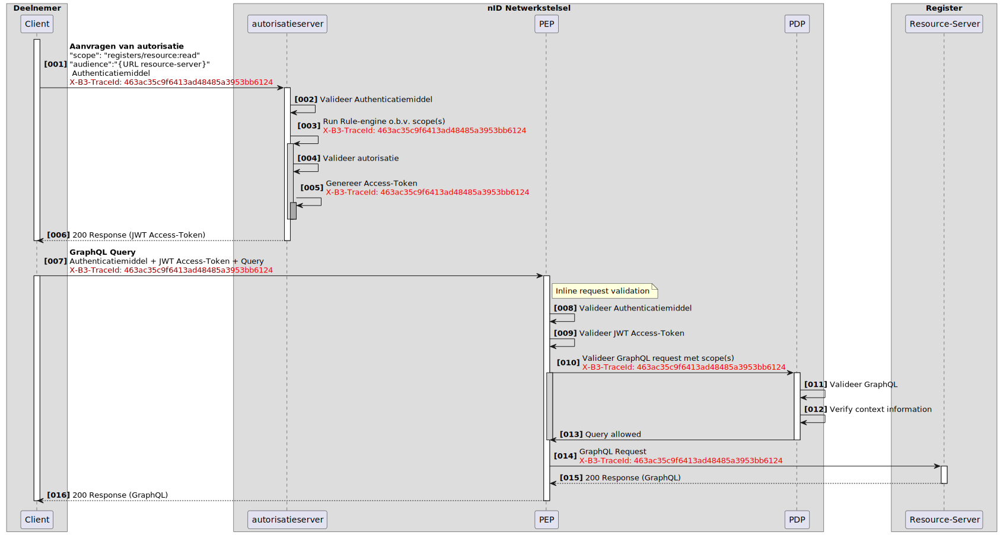
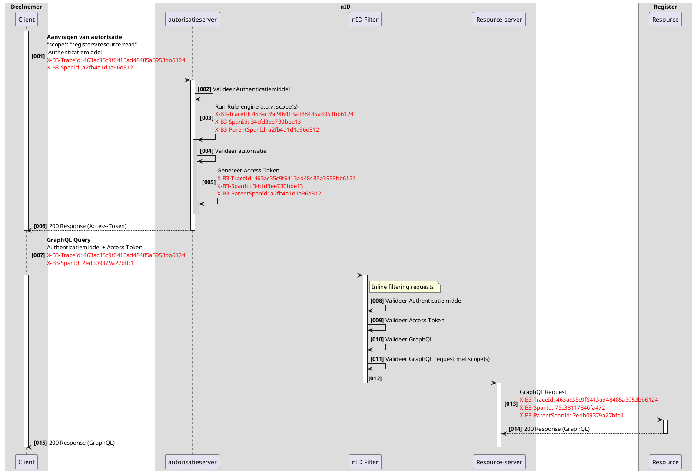
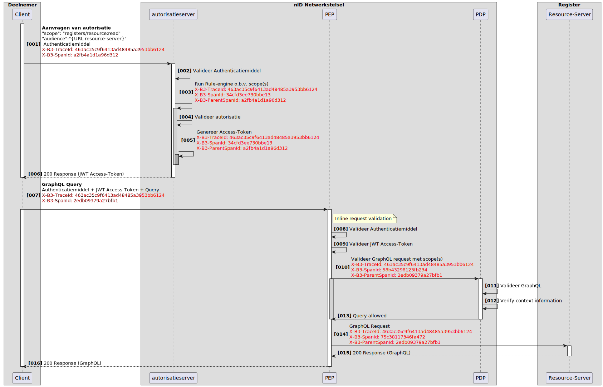

# RFC0022 - Event Logging en Traceerbaarheid
<font size="4">**SAMENVATTING**</font>

**Huidige situatie:**

Nieuwe functionaliteit

**Beoogde situatie**

- **Traceerbare loggegevens over verschillende registers heen:** Door het implementeren van gestandaardiseerde event logging wordt het mogelijk om gebeurtenissen consistent te volgen en te analyseren binnen het iWlz-netwerkmodel.
- **Gefaseerde uitbreiding van functionaliteit:** De implementatie van event logging is gepland in drie fasen, waarbij in de eerste fase de focus ligt op het introduceren van TraceID voor basis traceerbaarheid. In latere fasen worden SpanID, ParentSpanID en exportmogelijkheden toegevoegd om de traceerbaarheid en analyse verder te verbeteren.

<font size="4">**Status RFC**</font>

Volg deze [link](https://github.com/iStandaarden/iWlz-RFC/issues/17) om de actuele status van deze RFC te bekijken.

---
**Inhoudsopgave**
- [RFC0022 - Logging - Traceerbaarheid en Export](#rfc0022---logging---traceerbaarheid-en-export)
- [1. Inleiding](#1-inleiding)
  - [1.1. Uitgangspunten](#11-uitgangspunten)
    - [1.1.1. Traceerbaarheid](#111-traceerbaarheid)
    - [1.1.2. Uniformiteit van Logging:](#112-uniformiteit-van-logging)
    - [1.1.3. Aanwezigheid van Exportfaciliteit:](#113-aanwezigheid-van-exportfaciliteit)
    - [1.1.4. Standaardisatie van Syntax en Semantiek:](#114-standaardisatie-van-syntax-en-semantiek)
    - [1.1.5. Behoud van Integriteit en Beveiliging:](#115-behoud-van-integriteit-en-beveiliging)
  - [1.2 Relatie andere RFC](#12-relatie-andere-rfc)
- [2. Terminologie](#2-terminologie)
- [3. Traceerbaarheid](#3-traceerbaarheid)
  - [3.1. TraceContext](#31-tracecontext)
  - [3.2. X-B3-TraceId](#32-x-b3-traceid)
  - [3.3. X-B3-SpanId](#33-x-b3-spanid)
  - [3.4. X-B3-ParentSpanId](#34-x-b3-parentspanid)
  - [3.5. Voorbeeld van een flow](#35-voorbeeld-van-een-flow)
- [4. Export](#4-export)

---
# 1. Inleiding

In een gedistribueerd netwerkmodel, zoals dat van iWlz, is het essentieel om gebeurtenissen (events) effectief te kunnen volgen en analyseren. Dit is cruciaal voor het waarborgen van de betrouwbaarheid, prestaties en transparantie van het systeem. Het ontbreken van gestandaardiseerde event logging belemmert momenteel het vermogen om transacties effectief te traceren, wat leidt tot inefficiënties en uitdagingen bij het oplossen van incidenten.​

Deze RFC introduceert een gestandaardiseerde aanpak voor event logging binnen het iWlz-netwerkmodel. Het doel is om een uniforme structuur en semantiek te definiëren voor het vastleggen van events, waardoor traceerbaarheid over verschillende systemen en domeinen heen mogelijk wordt. Dit zal bijdragen aan een verbeterde monitoring, foutopsporing en algemene systeemtransparantie.​

De focus van deze RFC ligt uitsluitend op event logging en de bijbehorende traceerbaarheid. Aspecten zoals audit logging en exportmechanismen worden als aparte onderwerpen beschouwd en vallen buiten de scope van dit document.​

## 1.1 Uitgangspunten

De implementatie van event logging en traceerbaarheid binnen het iWlz-netwerkmodel is gepland in drie fasen. Deze uitgangspunten zijn gekoppeld aan de respectieve fasen om een duidelijke structuur en focus te bieden tijdens de implementatie:

### 📘 Fase 1: Invoering van TraceID

- **Traceerbaarheid over domeinen heen:** Het is essentieel dat logging traceerbaar is over de registers heen, waarbij loggebeurtenissen nauwkeurig kunnen worden gevolgd en gekoppeld, ook wanneer deze gebeurtenissen zich over verschillende delen van het netwerk verspreiden.

- **Uniformiteit van logging:** Logging vanuit verschillende bronnen binnen het netwerkmodel moet uniform en vergelijkbaar zijn. Dit zorgt voor consistentie en vereenvoudigt het proces van gegevensanalyse en -interpretatie.

### 📘 Fase 2: Uitbreiding met SpanID en ParentSpanID

- **Hiërarchische traceerbaarheid:** Door het introduceren van SpanID en ParentSpanID kan een hiërarchische structuur van de trace worden opgebouwd. Dit maakt het mogelijk om de relatie tussen verschillende events binnen een trace te begrijpen en te visualiseren.

### 📘 Fase 3: Exporteren van tracing-data

- **Aanwezigheid van exportfaciliteit:** Om traceerbare loggegevens te waarborgen en de mogelijkheid te bieden voor gegevensanalyse buiten het directe netwerkmodel, moet een exportfaciliteit aanwezig zijn. Deze faciliteit stelt gebruikers in staat om loggegevens veilig en efficiënt te exporteren naar externe systemen of opslaglocaties.

- **Standaardisatie van syntax en semantiek:** Bij het ontwikkelen van de exportfaciliteit is het van cruciaal belang om de syntax en semantiek van de export vast te leggen. Dit zorgt ervoor dat loggegevens op een consistente en begrijpelijke manier worden gepresenteerd, ongeacht het doel of de bestemming van de export.

- **Behoud van integriteit en beveiliging:** De exportfaciliteit moet worden ontworpen met het oog op het behoud van de integriteit en beveiliging van loggegevens. Dit omvat maatregelen om de vertrouwelijkheid, beschikbaarheid en authenticiteit van de geëxporteerde gegevens te waarborgen, evenals mechanismen voor het detecteren en voorkomen van manipulatie tijdens het exportproces.

*Opmerking:* Deze gefaseerde aanpak is in lijn met best practices voor het implementeren van distributed tracing, zoals aanbevolen door o.a. OpenTelemetry. De initiële implementatie met alleen een TraceId biedt al waardevolle traceerbaarheid en legt de basis voor verdere uitbreidingen. In latere fasen kunnen SpanId, ParentSpanId en exportfunctionaliteiten worden toegevoegd om de traceerbaarheid en analyse verder te verbeteren.

## 1.2 Relatie andere RFC
Deze RFC heeft een relatie met de volgende RFC(s)
|RFC | onderwerp | relatie<sup>*</sup> | toelichting |issue |
|:--|:--|:--| :--|:--|
| - |  -  |  -  |  -  |

<sup>*</sup>voorwaardelijk, *voor andere RFC* / afhankelijk, *van andere RFC*


# 2. Terminologie
Opsomming van de in dit document gebruikte termen.

| Terminologie | Omschrijving |
| :------------ | :------------ |
| Actie | *Verwerking* in een *informatiesysteem*, in het kader van een *gebeurtenis* |
| Autorisatie | Het toekennen van bevoegdheden |
| Autorisatieprotocol | Autorisatietabel, die bepaalt welke categorieën *cliënt*gegevens voor welke categorieën *zorginstellingen* toegankelijk zijn onder welke voorwaarden. |
| Cliënt | Persoon die zorg vraagt of aan wie zorg wordt verleend of de identificeerbare persoon van wie *persoonlijke gezondheidsinformatie* wordt verwerkt |
| Directie | Persoon of groep van personen die een organisatie op het hoogste niveau bestuurt en beheert |
| Elektronisch patiëntdossier | Verzameling van alle elektronisch vastgelegde persoonlijke gezondheidsinformatie van een *cliënt* bij een *zorginstelling* of een andere organisatie die *persoonlijke gezondheidsinformatie* verwerkt |
| Gebeurtenis | Voorval, activiteit of optreden van een wijziging in een *informatiesysteem* |
| Gebruiker | Natuurlijke persoon, organisatie of proces in een informatiesysteem, betrokken bij een *actie* |
| Identificatie | Kenmerk dat een persoon of andere entiteit identificeert |
| Identificator | Kenmerk dat een persoon of andere entiteit identificeert |
| Informatiedomein | Gespecificeerd gebied waarbinnen de verantwoordelijkheden voor de informatievoorziening zijn bepaald, dezelfde regels gelden voor informatiebeveiliging en dezelfde systematiek wordt gevolgd voor *identificatie* van personen, systemen en andere *objecten* |
| Informatiesysteem | Toepassingen, diensten, informatietechnologische bedrijfsmiddelen of andere gegevensverwerkende componenten |
| Logbeheerder | Functionaris die binnen een *zorginstelling* of andere organisatie die *persoonlijke gezondheidsinformatie* verwerkt, verantwoordelijk is voor het beheren van de logging en het uitvoeren van het door de *logverantwoordelijke* vastgestelde beleid |
| Loggegevens | elektronisch vastgelegde gegevens die bij een bepaalde *gebeurtenis* worden gelogd |
| Loggen | *Gebeurtenissen* chronologisch vastleggen |
| Logging | Resultaat van het *loggen* |
| Logverantwoordelijke | *Directie* van de organisatie die *persoonlijke gezondheidsinformatie* verwerkt |
| Object | Zaak of persoon waarop een *actie* betrekking heeft |
| Persoonlijke gezondheidsinformatie | Informatie over een identificeerbare persoon die verband houdt met de lichamelijke of geestelijke gesteldheid van, of de verlening van zorgdiensten aan, de persoon in kwestie |
| Toegangspunt | Aansluiting van waaruit de *gebruiker* de *gebeurten*is in het *informatiesysteem* heeft doen plaatsvinden |
| Toestemmingsprofiel | Vastlegging, landelijk, regionaal of lokaal, door de *cliënt* zelf bepaald, van wie in welke omstandigheden al of niet toegang mag krijgen tot bepaalde gegevens van de desbetreffende *cliënt* |
| Toezichthouder | Functie van een persoon die binnen een zorginstelling of een andere organisatie die *persoonlijke gezondheidsinformatie* verwerkt, dan wel landelijk of regionaal toezicht houdt op de naleving van weten regelgeving rond de toegang tot *elektronische patiëntdossiers* |
| Verantwoordelijke gebruiker | Natuurlijke persoon die verantwoordelijk is voor een *actie* |
| Verwerking | Een bewerking of een geheel van bewerkingen met betrekking tot persoonsgegevens of een geheel van persoonsgegevens, al dan niet uitgevoerd via geautomatiseerde procedés, zoals het verzamelen, vastleggen, ordenen, structureren, opslaan, bijwerken of wijzigen, opvragen, raadplegen, gebruiken, verstrekken door middel van doorzending, verspreiden of op andere wijze ter beschikking stellen, aligneren of combineren, afschermen, wissen of vernietigen van gegevens |
| XML‐exportfaciliteit | Dienst die de complete *logging* volgens een gevraagde selectie oplevert in de vorm van een XMLbestand waarbij alle velden herleidbaar zijn naar de in hoofdstuk 5 van deze norm benoemde gegevensvelden |
| Zorgaanbieder | *Zorgverlener* of *zorginstelling* |
| Zorginstelling | Rechtspersoon die bedrijfsmatig zorg verleent, alsmede een organisatorisch verband van natuurlijke personen die bedrijfsmatig zorg verlenen of doen verlenen, alsmede een natuurlijke persoon die bedrijfsmatig zorg doet verlenen, alsmede een solistisch werkende *zorgverlener* |
| Zorgverlener | Een natuurlijke persoon die beroepsmatig zorg verleent |

# 3. Traceerbaarheid
Traceerbaarheid binnen het iWlz-netwerkmodel wordt geïmplementeerd in drie opeenvolgende fasen. Elke fase bouwt voort op de vorige en introduceert aanvullende functionaliteiten om de traceerbaarheid te verbeteren.

## 3.1 Fase 1: Invoering van TraceID

In de eerste fase wordt een unieke `TraceId` geïntroduceerd voor elke inkomende request. Deze `TraceId` wordt doorgegeven aan alle downstream-services, waardoor gerelateerde logregels kunnen worden gecorreleerd en een globaal overzicht van de requestflow kan worden verkregen.

### 3.1.1 Standaardisatie van TraceId-generatie via OpenTelemetry:

Om de kans op botsingen in een gedistribueerde omgeving te minimaliseren, moet de generatie plaatsvinden met een mechanisme dat voldoet aan de eisen van randomness en voldoende entropie.

Alle partijen dienen gebruik te maken van dezelfde library voor het genereren van `TraceId`-waarden. Daarom wordt voorgeschreven dat alle partijen de [OpenTelemetry SDK](https://opentelemetry.io/docs/) gebruiken voor het genereren van `TraceId`-waarden. Voor vrijwel alle gangbare programmeertalen zijn OpenTelemetry-implementaties beschikbaar.

In de praktijk kan bijvoorbeeld gebruik worden gemaakt van de volgende compliant libraries:

- `@opentelemetry/api` (JavaScript/Node.js)
- `io.opentelemetry:opentelemetry-api` (Java)
- `opentelemetry-api` (Python)

Hiermee wordt gegarandeerd dat alle gegenereerde `TraceId`-waarden voldoen aan de juiste lengte, entropie en formatvereisten.

### 3.1.2 Toevoegen aan uitgaande requests:

De `TraceId` wordt toegevoegd aan de headers van alle uitgaande requests.
Gebruik de header `X-B3-TraceId` voor consistentie met bestaande standaarden.

> Let op: HTTP-headers zijn niet hoofdlettergevoelig. Conform de B3 Propagation-standaard wordt aanbevolen de header te noteren als `X-B3-TraceId`.

### 3.1.3 Randvoorwaarden voor TraceId:

Een `TraceId` moet:

- Exact 16 bytes groot zijn, wat overeenkomt met 32 hexadecimale tekens (lowercase).
- Niet uitsluitend uit nullen bestaan (bijv. 00000000000000000000000000000000 is ongeldig).
- Globaal uniek zijn om botsende traces in verschillende ketens te voorkomen.

**Voorbeeld:**

```http
X-B3-TraceId: 463ac35c9f6413ad48485a3953bb6124
```

> Voorbeeld van een correct gegenereerde `TraceId`-header zoals gebruikt in een HTTP-request.

### 3.1.4 Validatie en foutafhandeling van TraceId:

Bij binnenkomst wordt gecontroleerd of een `TraceId` aanwezig is:

- Indien aanwezig, wordt deze gebruikt voor verdere verwerking.
- Indien afwezig, wordt het verzoek afgewezen met de volgende foutmelding:

```http
HTTP/1.1 400 Bad Request
{"ErrorCode": "invalid_request", "Error": "The request is missing header X-B3-TraceId"}
```

> Opmerking: Deze validatie is een aanvulling op de OpenTelemetry-specificatie. Die stelt alleen eisen aan de structuur van een `TraceId`, maar schrijft geen validatiegedrag voor aan ontvangende systemen.

### 3.1.5 Flow Fase 1:




## 3.2 Fase 2
> [!IMPORTANT]
> Under construction

<details>
<summary>plantUML-source</summary>


</details>

**Nieuwe versie:**


## 3.3 Fase 3
> [!IMPORTANT]
> Under construction

# 4. Export
> [!IMPORTANT]
> Under construction

Een export in de vorm van een *XML-exportfaciliteit* is essentieel, waarbij de syntax en semantiek van de export moeten voldoen aan de richtlijnen uiteengezet in RFC0021.

De *XML-exportfaciliteit* genereert een uitgebreide logging op basis van een opgegeven selectie. Alle velden in dit XML-bestand zijn herleidbaar naar de naar de gegevensvelden zoals beschreven in RFC0021.


>```Voorbeeld export logrecord nID:```

