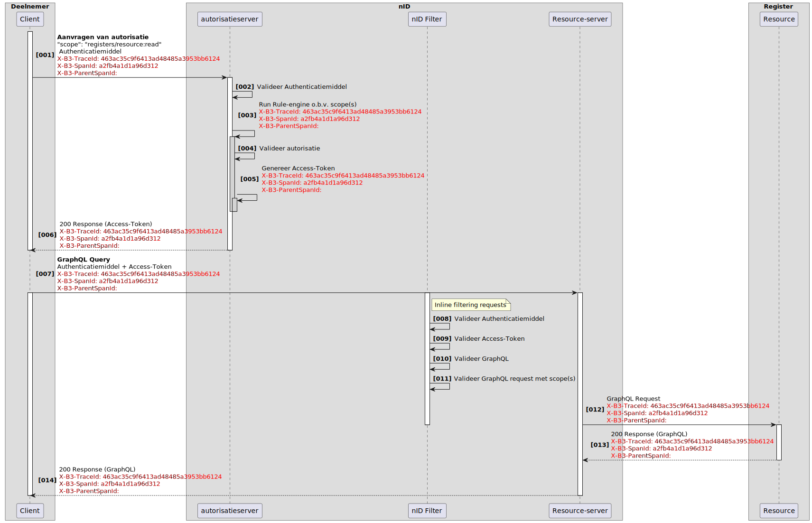
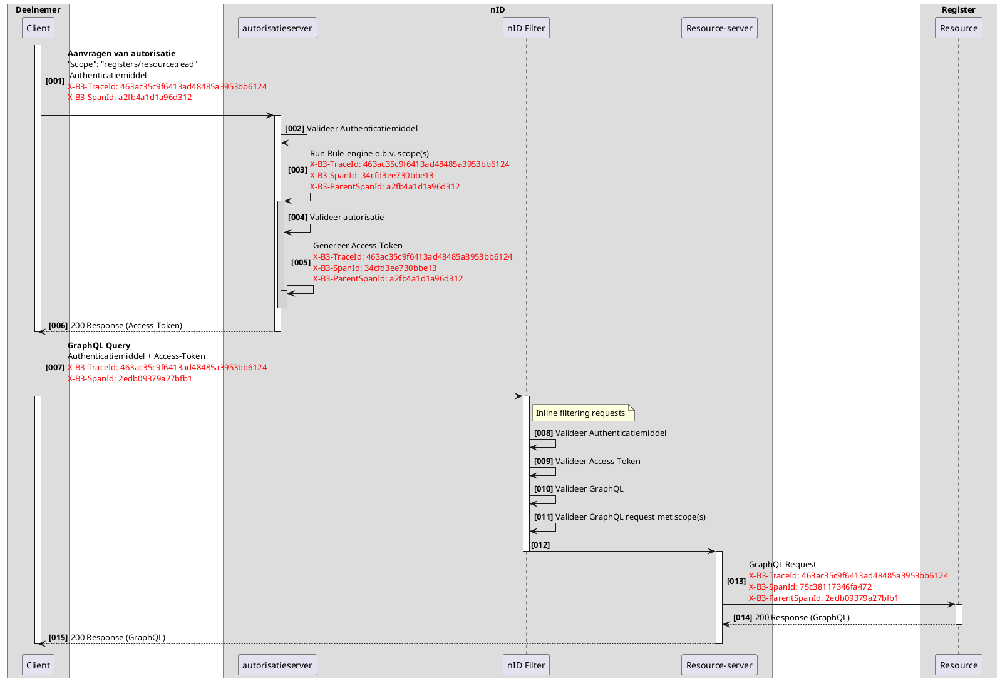

# RFC0022 - Logging - Traceerbaarheid en Export

@todo
- [ ] ..

<font size="4">**SAMENVATTING**</font>

**Huidige situatie:**

Nieuwe functionaliteit

**Beoogde situatie**

- Traceerbare loggegevens over verschillende registers heen
- Mogelijkheid tot het exporteren ervan binnen het netwerkmodel

<font size="4">**Status RFC**</font>

Volg deze [link](https://github.com/iStandaarden/iWlz-RFC/issues/17) om de actuele status van deze RFC te bekijken.

---
**Inhoudsopgave**
- [RFC0022 - Logging - Traceerbaarheid en Export](#rfc0022---logging---traceerbaarheid-en-export)
- [1. Inleiding](#1-inleiding)
  - [1.1. Uitgangspunten](#11-uitgangspunten)
    - [1.1.1. Traceerbaarheid](#111-traceerbaarheid)
    - [1.1.2. Uniformiteit van Logging:](#112-uniformiteit-van-logging)
    - [1.1.3. Aanwezigheid van Exportfaciliteit:](#113-aanwezigheid-van-exportfaciliteit)
    - [1.1.4. Standaardisatie van Syntax en Semantiek:](#114-standaardisatie-van-syntax-en-semantiek)
    - [1.1.5. Behoud van Integriteit en Beveiliging:](#115-behoud-van-integriteit-en-beveiliging)
  - [1.2 Relatie andere RFC](#12-relatie-andere-rfc)
- [2. Terminologie](#2-terminologie)
- [3. Traceerbaarheid](#3-traceerbaarheid)
  - [3.1. TraceContext](#31-tracecontext)
  - [3.2. X-B3-TraceId](#32-x-b3-traceid)
  - [3.3. X-B3-SpanId](#33-x-b3-spanid)
  - [3.4. X-B3-ParentSpanId](#34-x-b3-parentspanid)
  - [3.5. Voorbeeld van een flow](#35-voorbeeld-van-een-flow)
- [4. Export](#4-export)

---
# 1. Inleiding

Om de privacy van burgers te waarborgen is het meer dan ooit noodzakelijk om heldere afspraken te maken over de bescherming van (medische) gegevens tegen onbevoegde inzage en onbevoegd gebruik. De in deze RFC voorgeschreven wijze van logging heeft als doel een transparant beeld te geven van de gebeurtenissen in het netwerkmodel m.b.t. alle elektronische gegevensuitwisselingen en de toegang tot (zorg)informatiesystemen.

In deze RFC wordt de nadruk gelegd op het definiëren van een gestructureerde aanpak voor het traceren en exporteren van loggegevens binnen het iWlz netwerkmodel. Dit omvat het vastleggen van de vereisten, procedures en richtlijnen die nodig zijn om traceerbare loggegevens te waarborgen en een robuuste exportfunctionaliteit te implementeren.


## 1.1. Uitgangspunten
De volgende uitgangspunten vormen de basis voor het ontwerp en de ontwikkeling van RFC0022, waarbij wordt gestreefd naar een robuuste en effectieve traceerbaarheid en exportfunctionaliteit binnen het netwerkmodel

### 1.1.1. Traceerbaarheid
"Het is essentieel dat logging traceerbaar is over de registers heen, waarbij loggebeurtenissen nauwkeurig kunnen worden gevolgd en gekoppeld, ook wanneer deze gebeurtenissen zich over verschillende delen van het netwerk verspreiden.

### 1.1.2. Uniformiteit van Logging:
Het is essentieel dat logging vanuit verschillende bronnen binnen het netwerkmodel uniform en vergelijkbaar is. Dit zorgt voor consistentie en vereenvoudigt het proces van gegevensanalyse en -interpretatie.

### 1.1.3. Aanwezigheid van Exportfaciliteit:
Om traceerbare loggegevens te waarborgen en de mogelijkheid te bieden voor gegevensanalyse buiten het directe netwerkmodel, moet een exportfaciliteit aanwezig zijn. Deze faciliteit stelt gebruikers in staat om loggegevens veilig en efficiënt te exporteren naar externe systemen of opslaglocaties.

### 1.1.4. Standaardisatie van Syntax en Semantiek:
Bij het ontwikkelen van de exportfaciliteit is het van cruciaal belang om de syntax en semantiek van de export vast te leggen. Dit zorgt ervoor dat loggegevens op een consistente en begrijpelijke manier worden gepresenteerd, ongeacht het doel of de bestemming van de export.

### 1.1.5. Behoud van Integriteit en Beveiliging:
De exportfaciliteit moet worden ontworpen met het oog op het behoud van de integriteit en beveiliging van loggegevens. Dit omvat maatregelen om de vertrouwelijkheid, beschikbaarheid en authenticiteit van de geëxporteerde gegevens te waarborgen, evenals mechanismen voor het detecteren en voorkomen van manipulatie tijdens het exportproces.


## 1.2 Relatie andere RFC
Deze RFC heeft een relatie met de volgende RFC(s)
|RFC | onderwerp | relatie<sup>*</sup> | toelichting |issue |
|:--|:--|:--| :--|:--|
| - |  -  |  -  |  -  |

<sup>*</sup>voorwaardelijk, *voor andere RFC* / afhankelijk, *van andere RFC*


# 2. Terminologie
Opsomming van de in dit document gebruikte termen.

| Terminologie | Omschrijving |
| :------------ | :------------ |
| Actie | *Verwerking* in een *informatiesysteem*, in het kader van een *gebeurtenis* |
| Autorisatie | Het toekennen van bevoegdheden |
| Autorisatieprotocol | Autorisatietabel, die bepaalt welke categorieën *cliënt*gegevens voor welke categorieën *zorginstellingen* toegankelijk zijn onder welke voorwaarden. |
| Cliënt | Persoon die zorg vraagt of aan wie zorg wordt verleend of de identificeerbare persoon van wie *persoonlijke gezondheidsinformatie* wordt verwerkt |
| Directie | Persoon of groep van personen die een organisatie op het hoogste niveau bestuurt en beheert |
| Elektronisch patiëntdossier | Verzameling van alle elektronisch vastgelegde persoonlijke gezondheidsinformatie van een *cliënt* bij een *zorginstelling* of een andere organisatie die *persoonlijke gezondheidsinformatie* verwerkt |
| Gebeurtenis | Voorval, activiteit of optreden van een wijziging in een *informatiesysteem* |
| Gebruiker | Natuurlijke persoon, organisatie of proces in een informatiesysteem, betrokken bij een *actie* |
| Identificatie | Kenmerk dat een persoon of andere entiteit identificeert |
| Identificator | Kenmerk dat een persoon of andere entiteit identificeert |
| Informatiedomein | Gespecificeerd gebied waarbinnen de verantwoordelijkheden voor de informatievoorziening zijn bepaald, dezelfde regels gelden voor informatiebeveiliging en dezelfde systematiek wordt gevolgd voor *identificatie* van personen, systemen en andere *objecten* |
| Informatiesysteem | Toepassingen, diensten, informatietechnologische bedrijfsmiddelen of andere gegevensverwerkende componenten |
| Logbeheerder | Functionaris die binnen een *zorginstelling* of andere organisatie die *persoonlijke gezondheidsinformatie* verwerkt, verantwoordelijk is voor het beheren van de logging en het uitvoeren van het door de *logverantwoordelijke* vastgestelde beleid |
| Loggegevens | elektronisch vastgelegde gegevens die bij een bepaalde *gebeurtenis* worden gelogd |
| Loggen | *Gebeurtenissen* chronologisch vastleggen |
| Logging | Resultaat van het *loggen* |
| Logverantwoordelijke | *Directie* van de organisatie die *persoonlijke gezondheidsinformatie* verwerkt |
| Object | Zaak of persoon waarop een *actie* betrekking heeft |
| Persoonlijke gezondheidsinformatie | Informatie over een identificeerbare persoon die verband houdt met de lichamelijke of geestelijke gesteldheid van, of de verlening van zorgdiensten aan, de persoon in kwestie |
| Toegangspunt | Aansluiting van waaruit de *gebruiker* de *gebeurten*is in het *informatiesysteem* heeft doen plaatsvinden |
| Toestemmingsprofiel | Vastlegging, landelijk, regionaal of lokaal, door de *cliënt* zelf bepaald, van wie in welke omstandigheden al of niet toegang mag krijgen tot bepaalde gegevens van de desbetreffende *cliënt* |
| Toezichthouder | Functie van een persoon die binnen een zorginstelling of een andere organisatie die *persoonlijke gezondheidsinformatie* verwerkt, dan wel landelijk of regionaal toezicht houdt op de naleving van weten regelgeving rond de toegang tot *elektronische patiëntdossiers* |
| Verantwoordelijke gebruiker | Natuurlijke persoon die verantwoordelijk is voor een *actie* |
| Verwerking | Een bewerking of een geheel van bewerkingen met betrekking tot persoonsgegevens of een geheel van persoonsgegevens, al dan niet uitgevoerd via geautomatiseerde procedés, zoals het verzamelen, vastleggen, ordenen, structureren, opslaan, bijwerken of wijzigen, opvragen, raadplegen, gebruiken, verstrekken door middel van doorzending, verspreiden of op andere wijze ter beschikking stellen, aligneren of combineren, afschermen, wissen of vernietigen van gegevens |
| XML‐exportfaciliteit | Dienst die de complete *logging* volgens een gevraagde selectie oplevert in de vorm van een XMLbestand waarbij alle velden herleidbaar zijn naar de in hoofdstuk 5 van deze norm benoemde gegevensvelden |
| Zorgaanbieder | *Zorgverlener* of *zorginstelling* |
| Zorginstelling | Rechtspersoon die bedrijfsmatig zorg verleent, alsmede een organisatorisch verband van natuurlijke personen die bedrijfsmatig zorg verlenen of doen verlenen, alsmede een natuurlijke persoon die bedrijfsmatig zorg doet verlenen, alsmede een solistisch werkende *zorgverlener* |
| Zorgverlener | Een natuurlijke persoon die beroepsmatig zorg verleent |

# 3. Traceerbaarheid
Traceerbaarheid is de mogelijkheid om gebeurtenissen in de hele of gedeeltelijke keten te traceren. Het traceren geeft:
- Inzicht in de herkomst en bestemmingen van events.
- Inzicht in de stadia van verwerking.
- Inzicht in de opeenvolging van gebeurtenissen.
- Inzicht in de performance en efficiëntie van de keten.
- Inzicht in afwijkingen in de keten.
- Transparantie over informatiedomeinen heen.

## 3.1. TraceContext

Om over informatiedomeinen heen events en gebeurtenissen te kunnen traceren is het nodig om met elkaar afspraken te maken waarop informatie met elkaar kan worden gerelateerd. Deze afspraken worden distributed tracing genoemd. In het netwerkmodel gebruiken we de standaard "B3 Propagation", deze is breed toepasbaar en wordt ondersteund vanuit vele programmeertalen en frameworks.

In het netwerkmodel moet voor alle communicatie deze zogenaamde “B Propagation headers” worden gebruikt. In de gehele keten is het verplicht om de volgende ID headers mee te geven: 
- X-B3-TraceId 
- X-B3-SpanId
- X-B3-ParentSpanId

Notitie: Deze Headers zijn niet case-sensitive

## 3.2. X-B3-TraceId

De X-B3-TraceId is het ID wat door de gehele trace/keten wordt gebruikt om gerelateerde acties/gebeurtenissen en events met elkaar te relateren.

De X-B3-TraceId header wordt gecodeerd als 32 of 16 hexadecimale tekens in kleine letters 

Bijvoorbeeld, een TraceId-header van 128 bits kan er zo uitzien: X-B3-TraceId: 463ac35c9f6413ad48485a3953bb6124

Indien de X-B3-TraceId Header bij een binnenkomende verbinding niet aanwezeg of leeg is, moet het verzoek worden geweigerd en resulteren in:
```json
HTTP/1.1 400 Bad Request
{"ErrorCode" : "invalid_request", "Error" :"The request is missing header X-B3-TraceId"}
```

## 3.3. X-B3-SpanId

De X-B3-SpanId geeft samen met de X-B3-ParentSpanID de positie van de operatie in de trace/keten weer.

De X-B3-SpanId header wordt gecodeerd als 16 hexadecimale tekens in kleine letters.

Bijvoorbeeld: X-B3-SpanId: a2fb4a1d1a96d312.

## 3.4. X-B3-ParentSpanId

De ParentSpanId is het ID van de operatie die de oorzaak is van het verzoek, Dit is de X-B3-SpanId van een voorgaand verzoek of een scheduled job. ParentSpanId geeft de mogelijkheid om decentrale gebeurtenissen juist op de tijdlijn te plaatsen.

De X-B3-ParentSpanId header is aanwezig bij een child span en moet leeg zijn indien het om de root span gaat. De X-B3-ParentSpanId header wordt gecodeerd als 16 hexadecimale tekens in kleine letters.

Bijvoorbeeld: X-B3-ParentSpanId: 0020000000000001

## 3.5. Voorbeeld van een flow
De X-B3-TraceId header wordt hergebruikt in elke request binnen één trace. Zodra er een nieuwe flow ontstaat, moet er een nieuwe X-B3-TraceId worden gebruikt.

Een flow kan bijvoorbeeld een raadpleging zijn naar aanleiding van een notificatie. De ontvangen notificatie heeft een X-B3-TraceId, X-B3-SpanId en eventueel een X-B3-ParentSpanId in de header. In elke opvolgende gerelateerde actie wordt het ontvangen X-B3-TraceId header doorgegeven. Ook bijvoorbeeld bij het opvragen van autorisatie als het onderdeel uitmaakt van deze flow. 


<font color=red>LET OP: Onderstaande schema moet nog correct  worden aangepast.</font>



<details>
<summary>plantUML-source</summary>


</details>


# 4. Export
Een export in de vorm van een *XML-exportfaciliteit* is essentieel, waarbij de syntax en semantiek van de export moeten voldoen aan de richtlijnen uiteengezet in hoofdstuk 5.

De *XML-exportfaciliteit* genereert een uitgebreide logging op basis van een opgegeven selectie. Alle velden in dit XML-bestand zijn herleidbaar naar de naar de gegevensvelden zoals beschreven in hoofdstuk 5.


>```Voorbeeld export logrecord nID:```

