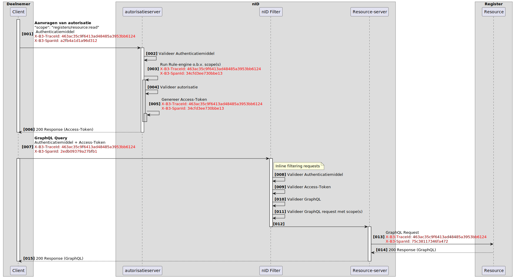
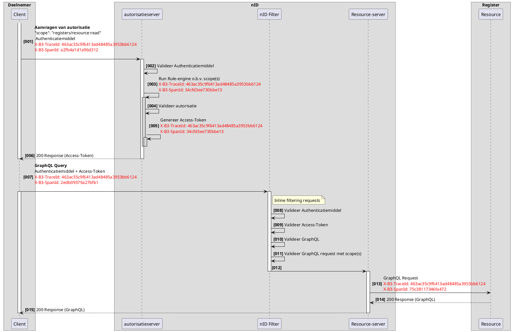

# RFC0022a - Tracelogging - TraceID en SpanID
<font size="4">**SAMENVATTING**</font>

**Huidige situatie:**  
Binnen het iWlz-netwerkmodel ontbreekt het aan gestandaardiseerde tracelogging, waardoor het lastig is om transacties en gebeurtenissen end-to-end te volgen en analyseren.

**Beoogde situatie:**  

- **Traceerbare loggegevens over verschillende registers heen:** Door het implementeren van gestandaardiseerde tracelogging wordt het mogelijk om de volledige keten van gebeurtenissen consistent en eenduidig te volgen binnen het iWlz-netwerkmodel.  
- **Gefaseerde uitbreiding van functionaliteit:** De implementatie van tracelogging is gepland in drie fasen. In de eerste fase ligt de focus op het introduceren van `TraceId` en  `SpanId` voor basis traceerbaarheid. In latere fasen wordt `ParentSpanId` en mechanismen voor het beschikbaar stellen van loggingdata toegevoegd om de traceerbaarheid en analyse verder te verdiepen.

<font size="4">**Status RFC**</font>

Volg deze [link](https://github.com/iStandaarden/iWlz-RFC/issues/37) om de actuele status van deze RFC te bekijken.

<font size="4">**Changelog**</font>

**16-12-2025**

- 1.3 Scope verduidelijkt: De inhoud en structuur van logging events, zoals eventtype, status en foutcodes, vallen buiten scope
- 3.1.4 SpanId verduidelijkt: generatie aangescherpt van “UUID-generator of OpenTelemetry SDK” naar “gegenereerd via OpenTelemetry SDK”
- 3.1.6 toegevoegd: “Start en einde van een trace”
- 3.1.7 verplaatst: voorbeeldflow uit 3.1.6 opgenomen onder 3.1.7

---

**Inhoudsopgave**

- [RFC0022a - Tracelogging - TraceID en SpanID](#rfc0022a---tracelogging---traceid-en-spanid)
- [1. Inleiding](#1-inleiding)
  - [1.1 Aanleiding](#11-aanleiding)
  - [1.2 Doelstelling](#12-doelstelling)
  - [1.3 Scope](#13-scope)
  - [1.4 Use Cases](#14-use-cases)
  - [1.5 Gefaseerde aanpak](#15-gefaseerde-aanpak)
    - [📘 Fase 1: Invoering van TraceID en SpanID](#-fase-1-invoering-van-traceid-en-spanid)
    - [📘 Fase 2: Uitbreiding met ParentSpanID](#-fase-2-uitbreiding-met-parentspanid)
    - [📘 Fase 3: Beschikbaar stellen van tracing-data](#-fase-3-beschikbaar-stellen-van-tracing-data)
  - [1.6 Relatie andere RFC](#16-relatie-andere-rfc)
- [2. Terminologie](#2-terminologie)
- [3. Traceerbaarheid](#3-traceerbaarheid)
  - [3.1 Fase 1: Invoering van TraceID en SpanID](#31-fase-1-invoering-van-traceid-en-spanid)
    - [3.1.1 Standaardisatie van TraceId- en SpanId-generatie via OpenTelemetry](#311-standaardisatie-van-traceid--en-spanid-generatie-via-opentelemetry)
    - [3.1.2 Toevoegen aan requests](#312-toevoegen-aan-requests)
    - [3.1.3 Randvoorwaarden voor TraceId](#313-randvoorwaarden-voor-traceid)
    - [3.1.4 Randvoorwaarden voor SpanId](#314-randvoorwaarden-voor-spanid)
    - [3.1.5 Omgang met ontbrekende of ongeldige TraceId](#315-omgang-met-ontbrekende-of-ongeldige-traceid)
    - [3.1.6 Start en einde van een trace](#316-start-en-einde-van-een-trace)
    - [3.1.7 Voorbeeldflow (niet-normatief)](#317-voorbeeldflow-niet-normatief)
- [4. Privacyoverwegingen en AVG-toetsing (TraceId en SpanId)](#4-privacyoverwegingen-en-avg-toetsing-traceid-en-spanid)

---

# 1. Inleiding

## 1.1 Aanleiding

In een gedistribueerd netwerkmodel, zoals dat van iWlz, is het volgen en analyseren van gebeurtenissen (events) over domeingrenzen heen een randvoorwaarde om transacties inzichtelijk, controleerbaar en herstelbaar te maken. Dit draagt bij aan:

- Ondersteuning bij het analyseren, opsporen en oplossen van productie-incidenten in de keten
- Inzicht in de ketenroute van transacties

Het ontbreken van gestandaardiseerde tracelogging belemmert momenteel het vermogen om transacties effectief te traceren, wat leidt tot inefficiënties en uitdagingen bij incidentanalyse. Het is nu niet mogelijk om eenduidig vast te stellen hoe een specifieke aanvraag zich heeft verplaatst door het netwerk, wie erbij betrokken was, of waar een fout ontstond.

## 1.2 Doelstelling

Deze RFC introduceert een gestandaardiseerde aanpak voor tracelogging binnen het iWlz-netwerkmodel. Het doel is om:

- Een uniforme structuur en semantiek te definiëren voor het vastleggen van traceergegevens (TraceId en SpanId)
- Traceerbaarheid over verschillende systemen en domeinen heen mogelijk te maken
- De basis te leggen voor monitoring, foutopsporing en systeemtransparantie

## 1.3 Scope

Deze RFC bevat een technische uitwerking van `TraceId` en `SpanId` binnen het netwerkmodel. De scope van deze RFC omvat:

- De definitie en toepassing van `TraceId` en `SpanId` binnen het iWlz-netwerkmodel
- De uniforme opname en doorgifte van deze traceerdata over keteninterfaces heen
- Technische logging van systeeminteracties, zonder interpretatie van persoonsgegevens of gebruik voor auditdoeleinden
- De inrichting van traceerbaarheid over domeinen heen en uniforme logging, zoals beschreven in Fase 1 (§1.5)

Buiten scope van deze RFC vallen:

- Juridische toetsing en formele AVG-beoordeling (deze wordt parallel opgepakt en apart verantwoord)
- Auditlogging (gericht op controleerbaarheid en verantwoording, zoals toegangsregistratie of procesafwijkingen)
- Uitwerking en verwerking van `ParentSpanId` (onderdeel van Fase 2, beschreven in RFC0022b)
- Exportfaciliteiten en ontsluiting van traceerdata (onderdeel van Fase 3, beschreven in RFC0022c)
- De inhoud en structuur van logging events, zoals eventtype, status en foutcodes.

## 1.4 Use Cases

- **Use Case 1:** Een verzoek om bemiddeling verloopt foutloos via het ene register, maar wordt niet goed verwerkt in het andere. Zonder een gedeeld TraceId zijn de loggingregels niet aan elkaar te koppelen.
- **Use Case 2:** Bij productie-incidenten ontbreekt zicht op waar in de keten de fout is ontstaan, waardoor oplossen vertraging oploopt.

## 1.5 Gefaseerde aanpak

De implementatie van tracelogging is gestructureerd in drie fasen, die samen zorgen voor volledige traceerbaarheid binnen het iWlz-netwerkmodel. De uitgangspunten vormen de drie fasen en geven richting aan de verdere uitwerking en implementatie daarvan.

### 📘 Fase 1: Invoering van TraceID en SpanID

- **Traceerbaarheid over domeinen heen:** Logging moet traceerbaar zijn over registers heen, waarbij loggebeurtenissen nauwkeurig kunnen worden gevolgd en gekoppeld, ook wanneer deze gebeurtenissen zich over verschillende delen van het netwerk verspreiden.  

- **Uniformiteit van logging:** Logging vanuit verschillende bronnen binnen het netwerkmodel moet uniform en vergelijkbaar zijn. Dit zorgt voor consistentie en vereenvoudigt het proces van gegevensanalyse en -interpretatie.

### 📘 Fase 2: Uitbreiding met ParentSpanID

- **Hiërarchische traceerbaarheid:** Door het introduceren van ParentSpanID kan een hiërarchische structuur van de trace worden opgebouwd. Dit maakt het mogelijk om de relatie tussen verschillende events binnen een trace te begrijpen en te visualiseren.

### 📘 Fase 3: Beschikbaar stellen van tracing-data

- **Aanwezigheid van exportfaciliteit:** Om traceerbare loggegevens te waarborgen en de mogelijkheid te bieden voor gegevensanalyse buiten het directe netwerkmodel, moet een exportfaciliteit aanwezig zijn. Deze faciliteit stelt gebruikers in staat om loggegevens veilig en efficiënt te exporteren naar externe systemen of opslaglocaties.

- **Standaardisatie van syntax en semantiek:** Bij het ontwikkelen van de exportfaciliteit is het van belang om de syntax en semantiek van de export vast te leggen. Dit zorgt ervoor dat loggegevens op een consistente en begrijpelijke manier worden gepresenteerd, ongeacht het doel of de bestemming van de export.  

- **Behoud van integriteit en beveiliging:** De exportfaciliteit moet worden ontworpen met het oog op het behoud van de integriteit en beveiliging van loggegevens. Dit omvat maatregelen om de vertrouwelijkheid, beschikbaarheid en authenticiteit van de geëxporteerde gegevens te waarborgen, evenals mechanismen voor het detecteren en voorkomen van manipulatie tijdens het exportproces.

*Opmerking:* Deze gefaseerde aanpak is in lijn met best practices voor het implementeren van distributed tracing, zoals aanbevolen door o.a. OpenTelemetry. De initiële implementatie met alleen een TraceId en SpanId biedt al waardevolle traceerbaarheid en legt de basis voor verdere uitbreidingen. In latere fasen kunnen ParentSpanId en exportfunctionaliteiten worden toegevoegd om de traceerbaarheid en analyse verder te verbeteren.
De keuze om deze fasen op te splitsen in afzonderlijke RFC’s is bewust gemaakt op basis van eerdere feedback: het combineren van meerdere verantwoordelijkheden in één document bleek nadelig voor de planbaarheid en afstemming. Door de opdeling is iedere stap afzonderlijk te beoordelen en implementeren.

## 1.6 Relatie andere RFC

Deze RFC heeft een relatie met de volgende RFC(s)

| RFC       | onderwerp                                      | relatie        | toelichting            | issue                                                                 |
|:----------|:-----------------------------------------------|:---------------|:------------------------|:----------------------------------------------------------------------|
| RFC0022b  | Tracelogging - ParentSpanID                    | voorwaardelijk | Tracelogging - Fase 2  | [#48](https://github.com/iStandaarden/iWlz-RequestForComment/issues/48) |
| RFC0022c  | Tracelogging - Beschikbaar stellen van tracing-data | voorwaardelijk | Tracelogging - Fase 3  | [#49](https://github.com/iStandaarden/iWlz-RequestForComment/issues/49) |


<sup>*</sup>voorwaardelijk, *voor andere RFC* / afhankelijk, *van andere RFC*


# 2. Terminologie

Opsomming van de in dit document gebruikte termen.

| Terminologie | Omschrijving |
| :------------ | :------------ |
| Actie | *Verwerking* in een *informatiesysteem*, in het kader van een *gebeurtenis* |
| Autorisatie | Het toekennen van bevoegdheden |
| Autorisatieprotocol | Autorisatietabel, die bepaalt welke categorieën *cliënt*gegevens voor welke categorieën *zorginstellingen* toegankelijk zijn onder welke voorwaarden. |
| Cliënt | Persoon die zorg vraagt of aan wie zorg wordt verleend of de identificeerbare persoon van wie *persoonlijke gezondheidsinformatie* wordt verwerkt |
| Directie | Persoon of groep van personen die een organisatie op het hoogste niveau bestuurt en beheert |
| Elektronisch patiëntdossier | Verzameling van alle elektronisch vastgelegde persoonlijke gezondheidsinformatie van een *cliënt* bij een *zorginstelling* of een andere organisatie die *persoonlijke gezondheidsinformatie* verwerkt |
| Gebeurtenis | Voorval, activiteit of optreden van een wijziging in een *informatiesysteem* |
| Gebruiker | Natuurlijke persoon, organisatie of proces in een informatiesysteem, betrokken bij een *actie* |
| Identificatie | Kenmerk dat een persoon of andere entiteit identificeert |
| Identificator | Kenmerk dat een persoon of andere entiteit identificeert |
| Informatiedomein | Gespecificeerd gebied waarbinnen de verantwoordelijkheden voor de informatievoorziening zijn bepaald, dezelfde regels gelden voor informatiebeveiliging en dezelfde systematiek wordt gevolgd voor *identificatie* van personen, systemen en andere *objecten* |
| Informatiesysteem | Toepassingen, diensten, informatietechnologische bedrijfsmiddelen of andere gegevensverwerkende componenten |
| Logbeheerder | Functionaris die binnen een *zorginstelling* of andere organisatie die *persoonlijke gezondheidsinformatie* verwerkt, verantwoordelijk is voor het beheren van de logging en het uitvoeren van het door de *logverantwoordelijke* vastgestelde beleid |
| Loggegevens | elektronisch vastgelegde gegevens die bij een bepaalde *gebeurtenis* worden gelogd |
| Loggen | *Gebeurtenissen* chronologisch vastleggen |
| Logging | Resultaat van het *loggen* |
| Logverantwoordelijke | *Directie* van de organisatie die *persoonlijke gezondheidsinformatie* verwerkt |
| Object | Zaak of persoon waarop een *actie* betrekking heeft |
| Persoonlijke gezondheidsinformatie | Informatie over een identificeerbare persoon die verband houdt met de lichamelijke of geestelijke gesteldheid van, of de verlening van zorgdiensten aan, de persoon in kwestie |
| Toegangspunt | Aansluiting van waaruit de *gebruiker* de *gebeurten*is in het *informatiesysteem* heeft doen plaatsvinden |
| Toestemmingsprofiel | Vastlegging, landelijk, regionaal of lokaal, door de *cliënt* zelf bepaald, van wie in welke omstandigheden al of niet toegang mag krijgen tot bepaalde gegevens van de desbetreffende *cliënt* |
| Toezichthouder | Functie van een persoon die binnen een zorginstelling of een andere organisatie die *persoonlijke gezondheidsinformatie* verwerkt, dan wel landelijk of regionaal toezicht houdt op de naleving van weten regelgeving rond de toegang tot *elektronische patiëntdossiers* |
| Verantwoordelijke gebruiker | Natuurlijke persoon die verantwoordelijk is voor een *actie* |
| Verwerking | Een bewerking of een geheel van bewerkingen met betrekking tot persoonsgegevens of een geheel van persoonsgegevens, al dan niet uitgevoerd via geautomatiseerde procedés, zoals het verzamelen, vastleggen, ordenen, structureren, opslaan, bijwerken of wijzigen, opvragen, raadplegen, gebruiken, verstrekken door middel van doorzending, verspreiden of op andere wijze ter beschikking stellen, aligneren of combineren, afschermen, wissen of vernietigen van gegevens |
| XML‐exportfaciliteit | Dienst die de complete *logging* volgens een gevraagde selectie oplevert in de vorm van een XMLbestand waarbij alle velden herleidbaar zijn naar de in hoofdstuk 5 van deze norm benoemde gegevensvelden |
| Zorgaanbieder | *Zorgverlener* of *zorginstelling* |
| Zorginstelling | Rechtspersoon die bedrijfsmatig zorg verleent, alsmede een organisatorisch verband van natuurlijke personen die bedrijfsmatig zorg verlenen of doen verlenen, alsmede een natuurlijke persoon die bedrijfsmatig zorg doet verlenen, alsmede een solistisch werkende *zorgverlener* |
| Zorgverlener | Een natuurlijke persoon die beroepsmatig zorg verleent |

# 3. Traceerbaarheid

Traceerbaarheid binnen het iWlz-netwerkmodel wordt geïmplementeerd in opeenvolgende fasen. Elke fase bouwt voort op de vorige en introduceert aanvullende functionaliteiten om de traceerbaarheid te verbeteren.

## 3.1 Fase 1: Invoering van TraceID en SpanID

In de eerste fase wordt een unieke `TraceId` geïntroduceerd bij het starten van een nieuwe ketenverwerking. Deze `TraceId` wordt vervolgens doorgegeven aan alle opvolgende services, waardoor gerelateerde logregels kunnen worden gecorreleerd en een globaal overzicht van de requestflow kan worden verkregen.

Daarnaast wordt per verwerkingsstap of service-aanroep een unieke `SpanId` gegenereerd. Deze identifier maakt het mogelijk om individuele bewerkingen binnen een trace afzonderlijk te volgen en in context te plaatsen. Hiermee ontstaat meer inzicht in de interne opbouw en timing van een ketenverzoek.

### 3.1.1 Standaardisatie van TraceId- en SpanId-generatie via OpenTelemetry

Om de kans op botsingen in een gedistribueerde omgeving te minimaliseren, moeten zowel `TraceId`- als `SpanId`-waarden worden gegenereerd met een mechanisme dat voldoet aan de eisen van randomness en voldoende entropie.

Alle partijen dienen gebruik te maken van dezelfde library voor het genereren van deze identifiers. Daarom wordt voorgeschreven dat alle partijen de [OpenTelemetry SDK](https://opentelemetry.io/docs/) gebruiken voor het genereren van zowel `TraceId`- als `SpanId`-waarden. Voor vrijwel alle gangbare programmeertalen zijn OpenTelemetry-implementaties beschikbaar.

In de praktijk kan bijvoorbeeld gebruik worden gemaakt van de volgende compliant libraries:

- `@opentelemetry/api` (JavaScript/Node.js)
- `io.opentelemetry:opentelemetry-api` (Java)
- `opentelemetry-api` (Python)

Hiermee wordt gegarandeerd dat alle gegenereerde `TraceId`- en `SpanId`-waarden voldoen aan de juiste lengte, entropie en formatvereisten.

In Fase 1 wordt voor elke ontvangen request een nieuwe `SpanId` gegenereerd. Indien een service bestaat uit meerdere verwerkingsstappen (zoals authenticatie, validatie of routering), mag hiervoor per stap ook een aparte `SpanId` worden aangemaakt.

### 3.1.2 Toevoegen aan requests

Zowel de `TraceId` als de `SpanId` worden toegevoegd aan de headers van elk verzoek dat binnen het netwerkmodel naar een andere dienst wordt verstuurd.

Gebruik hiervoor de volgende headers, conform de [B3 Propagation-standaard](https://github.com/openzipkin/b3-propagation):

- `X-B3-TraceId` – een unieke ID voor het volledige ketenverzoek.
- `X-B3-SpanId` – een unieke ID voor de huidige verwerkingsstap.

> Let op: HTTP-headers zijn niet hoofdlettergevoelig. Conform de B3-standaard wordt aanbevolen de headers te noteren als `X-B3-TraceId` en `X-B3-SpanId` (in kebab-case met hoofdletters).

### 3.1.3 Randvoorwaarden voor TraceId

Een `TraceId` moet:

- Exact 16 bytes groot zijn, wat overeenkomt met 32 hexadecimale tekens (lowercase).
- Niet uitsluitend uit nullen bestaan (bijv. `0000000000000000` is ongeldig).
- Uniek zijn. TraceIds dienen gegenereerd te worden met behulp van een UUID-generator of via de OpenTelemetry SDK om duplicaten binnen een trace te voorkomen.

**Voorbeeld van een geldig TraceID:**

```http
X-B3-TraceId: 463ac35c9f6413ad48485a3953bb6124
```


### 3.1.4 Randvoorwaarden voor SpanId

Een `SpanId` moet:

- Exact 8 bytes groot zijn, wat overeenkomt met 16 hexadecimale tekens (lowercase).
- Niet uitsluitend uit nullen bestaan (bijv. `0000000000000000` is ongeldig).
- Uniek zijn. SpanIds worden gegenereerd met behulp van de OpenTelemetry SDK, zodat duplicaten binnen een trace worden voorkomen.

**Voorbeeld van een geldig SpanId:**

```http
X-B3-SpanId: 0020000000000001
```

### 3.1.5 Omgang met ontbrekende of ongeldige TraceId

Bij binnenkomst wordt gecontroleerd of een `TraceId` aanwezig is en aan de randvoorwaarden voldoet:

- Indien aanwezig en geldig, wordt de TraceId gebruikt voor verdere verwerking.
- Indien de TraceId ontbreekt, wordt een nieuwe, geldige TraceId gegenereerd en wordt de verwerking als nieuwe trace voortgezet.
- Indien een TraceId aanwezig is maar niet aan de randvoorwaarden voldoet, mag deze worden genegeerd en wordt eveneens een nieuwe, geldige TraceId gegenereerd.

### 3.1.6 Start en einde van een trace

**Start van de trace**
De keten begint daar waar het eerste verzoek in de keten ontstaat. Degene die het eerste request doet, genereert de TraceId. Waar mogelijk is het wenselijk dat een TraceId door de ontvanger wordt overgenomen in de verwerking, maar het is niet de bedoeling om een TraceId te behandelen als persistente data. Bevragingen die niet direct volgen op een notificatie en daarmee buiten dezelfde ketenverwerking vallen, starten een nieuwe trace en krijgen een eigen TraceId.

**Einde van de trace**
Deze RFC specificeert geen expliciet eindpunt van een trace. In de praktijk stopt een trace zodra een ketenpartij de TraceId niet (meer) verwerkt of opneemt in de logging.

### 3.1.7 Voorbeeldflow (niet-normatief)

> **Voorbeeldimplementatie (niet-normatief)**   
> Onderstaande flow toont een mogelijke implementatie van traceerbaarheid binnen een ketenverzoek. De flow omvat zowel het aanvragen van autorisatie als het uitvoeren van een gegevensopvraag (GraphQL) en laat zien hoe `TraceId` en `SpanId` zich door de verschillende onderdelen van het netwerkmodel verspreiden.  
> Dit voorbeeld is afkomstig uit een specifieke context en dient ter illustratie van de werking; de exacte inrichting kan verschillen per ketenpartner of toepassing.


<details>
<summary>plantUML-source</summary>



</details>
<p>


# 4. Privacyoverwegingen en AVG-toetsing (TraceId en SpanId)

Het gebruik van een `TraceId` binnen deze RFC is uitsluitend bedoeld voor **technische traceerbaarheid van verzoeken over systeemgrenzen heen**. De `TraceId` is een **willekeurig gegenereerde identificatiecode** die wordt opgenomen in de header van een verzoek en niet wordt opgeslagen in combinatie met identificerende gegevens.

De berichten waarop de `TraceId` betrekking heeft, bevatten reeds persoonsgegevens, waaronder velden als:

- `bsn` (Burgerservicenummer),
- `wlzindicatieID`,
- `besluitnummer`.

Daarmee is duidelijk dat de verwerking van deze berichten onder de AVG valt. Het toevoegen van een `TraceId` **wijzigt het juridische kader van deze verwerking niet**.

Hoewel het theoretisch denkbaar is dat een `TraceId` of `SpanId` – in combinatie met andere gegevens – **indirect herleidbaar zou kunnen zijn tot een persoon**, worden deze identifiers **op zichzelf niet als persoonsgegevens aangemerkt** in de zin van de AVG[^1].

Deze kwalificatie is gebaseerd op de volgende overwegingen:

- beide identifiers worden willekeurig gegenereerd en bevatten geen identificeerbare informatie;
- er is geen directe koppeling met natuurlijke personen;
- de toepassing is strikt technisch en beperkt tot tijdelijke traceerbaarheid van ketenverzoeken (`TraceId`) of afzonderlijke verwerkingsstappen (`SpanId`);
- zij worden uitsluitend gebruikt binnen de context van technische logverwerking en worden niet gekoppeld aan gebruikersinformatie.

Het gebruik van `TraceId` draagt bovendien bij aan **dataminimalisatie**: het maakt het mogelijk om fouten te analyseren zonder dat identificerende gegevens, zoals BSN of IP-adressen, hoeven te worden gelogd. De `TraceId` wordt niet centraal opgeslagen, noch gebruikt voor profilering of gedragsanalyse (AVG, art. 4(4)).

Voor fase 1 van deze RFC geldt dat:

- de `TraceId` en `SpanId` uitsluitend technisch aanwezig zijn in headers;
- zij uitsluitend bedoeld zijn voor tijdelijke technische verwerking, en niet voor centrale of langdurige opslag;
- zij niet worden gekoppeld aan logging van gebruikersinformatie.

De vraag of een `TraceId` in deze context als persoonsgegeven moet worden beschouwd, is voorgelegd aan juridische experts. Mocht uit nader advies blijken dat aanvullende maatregelen vereist zijn, dan worden deze meegenomen in een volgende release of opgenomen in een afzonderlijke verwerkingsbijlage.

[^1]: Zie AVG, artikel 4, lid 1: “Persoonsgegeven: alle informatie over een geïdentificeerde of identificeerbare natuurlijke persoon.” Zie ook EDPB, *Guidelines 4/2019 on the interpretation of personal data in the context of online identifiers*.
