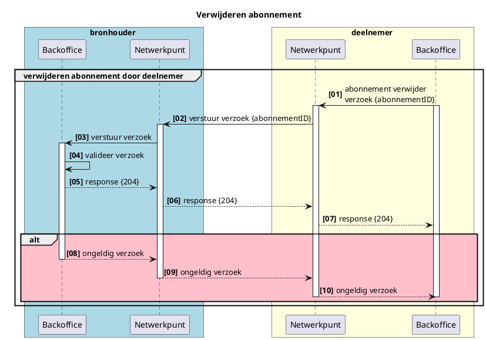

# RFC0025 - Abonnementenvoorziening voor (iWlz) vrijwillige notificaties

<font size="4">**SAMENVATTING**</font>

**Huidige situatie:**

In de huidige infrastructuur is er geen voorziening voor het vastleggen en beheren van abonnementen op (iWlz) vrijwillige notificaties. De [RFC0008 - Notificaties](RFC/RFC0008%20-%20Notificaties%20en%20Abonnementen.md) beschrijft de rol van notificaties in het Netwerkmodel. In die RFC wordt er een onderscheid gemaakt tussen *Verplichte notificaties* en *Vrijwillige* notificaties. Bij vrijwillige notificaties heeft een netwerkdeelnemer zelf de keuze om die notificatie te ontvangen. Dit moet die deelnemer kenbaarmaken door middel van het aangaan van een abonnement op die specifieke notificatie. Meer hierover in de RFC-0008.

**Beoogde situatie**

Dit document beschrijft functioneel de generieke werking van het vastleggen en beheren van abonnementen op (iWlz) vrijwillige notificaties. 

<font size="4">**Status RFC**</font>

Volg deze [link](https://github.com/iStandaarden/iWlz-RFC/issues/2) om de actuele status van deze RFC te bekijken.

---
**Inhoudsopgave**
- [RFC0025 - Abonnementenvoorziening voor (iWlz) vrijwillige notificaties](#rfc0025---abonnementenvoorziening-voor-iwlz-vrijwillige-notificaties)
- [1. Inleiding](#1-inleiding)
  - [1.1. Uitgangspunten](#11-uitgangspunten)
  - [1.2 Relatie andere RFC](#12-relatie-andere-rfc)
- [2. Terminologie](#2-terminologie)
- [6. Ontvangen (iWlz-) vrijwillige notificatie dmv abonneren](#6-ontvangen-iwlz--vrijwillige-notificatie-dmv-abonneren)
  - [6.1 Abonnementen binnen de iWlz](#61-abonnementen-binnen-de-iwlz)
  - [6.2 Abonneren op iWlz-Vrijwillige notificatie](#62-abonneren-op-iwlz-vrijwillige-notificatie)
  - [6.3 Plaatsen abonnement](#63-plaatsen-abonnement)
    - [6.3.1 Request CreateAbonnement en inhoud plaatsen abonnement](#631-request-createabonnement-en-inhoud-plaatsen-abonnement)
    - [6.3.2 Validatie](#632-validatie)
    - [6.3.3 Voorbeeld abonneren](#633-voorbeeld-abonneren)
  - [6.4 Verwijderen iWlz-vrijwillig abonnement](#64-verwijderen-iwlz-vrijwillig-abonnement)
    - [6.4.1 request deleteAbonnement en inhoud verwijderen abonnement](#641-request-deleteabonnement-en-inhoud-verwijderen-abonnement)
    - [6.4.2 Validatie](#642-validatie)
    - [6.4.3 Voorbeeld verwijderen abonnement](#643-voorbeeld-verwijderen-abonnement)

---
# 1. Inleiding
In de huidige infrastructuur is er geen voorziening voor het vastleggen en beheren van abonnementen op (iWlz) vrijwillige notificaties. De [RFC0008 - Notificaties](RFC/RFC0008%20-%20Notificaties%20en%20Abonnementen.md) beschrijft de rol van notificaties in het Netwerkmodel. In die RFC wordt er een onderscheid gemaakt tussen *Verplichte notificaties* en *Vrijwillige* notificaties. Bij vrijwillige notificaties heeft een netwerkdeelnemer zelf de keuze om die notificatie te ontvangen. Dit moet die deelnemer kenbaarmaken door middel van het aangaan van een abonnement op die specifieke notificatie. Meer hierover in de RFC-0008.


## 1.1. Uitgangspunten
>```uitgangspunten```

## 1.2 Relatie andere RFC
Deze RFC heeft een relatie met de volgende RFC(s)
|RFC | onderwerp | relatie<sup>*</sup> | toelichting |issue |
|:--|:--|:--| :--|:--|
|[0008](RFC/RFC0008%20-%20Notificaties%20en%20Abonnementen.md) | Notificaties en abonnement | voorwaardelijk | <ul><li>Er is een **Service Directory** waarin notificatietypen gepubliceerd kunnen worden.</li> <li>Netwerkdeelnemers raadplegen de **Service Directory** om op te halen welke abonnementen geplaatst kunnen worden en welke voorwaarden hier aan zitten. </li></ul>|[#2](https://github.com/iStandaarden/iWlz-RFC/issues/2) |

<sup>*</sup>voorwaardelijk, *voor andere RFC* / afhankelijk, *van andere RFC*


# 2. Terminologie
Opsomming van de in dit document gebruikte termen.

| Terminologie | Omschrijving |
| :-------- | :-------- | 
| *term* | *beschrijving/uitleg* | 

# 6. Ontvangen (iWlz-) vrijwillige notificatie dmv abonneren

Alleen voor het kunnen ontvangen van een iWlz-vrijwillige notificatie is het noodzakelijk dat een deelnemer zich abonneert. Elke iWlz-verplicht notificatie ontvangt een deelnemer altijd en dus onafhankelijk van een abonnement. 

In dit hoofdstuk het proces hoe een deelnemer zich kan abonneren op een vrijwillige notificatie. 

## 6.1 Abonnementen binnen de iWlz

Voor het kunnen versturen van een vrijwillige notificatie aan een deelnemer is het nodig om abonnementen te faciliteren. Het abonnement koppelt een specifieke deelnemer aan een specifieke iWlz-vrijwillige notificatie zodat de bronhouder weet aan wie de notificatie verstuurd moet worden. Het abonneren van een deelnemer op een vrijwillige notificatie is naar de behoefte van de deelnemer zelf. 

## 6.2 Abonneren op iWlz-Vrijwillige notificatie

Het abonneren van een deelnemer voor een <span style="text-decoration:underline;">iWlz-vrijwillige</span> notificatie is een actie van de deelnemer zelf. De deelnemer mag zelf bepalen of een notificatie wenselijk is en om dan een abonnement te plaatsen. De deelnemer mag zich abonneren op een iWlz-Vrijwillig abonnement mits is voldaan aan de eisen van het abonnement en bijvoorbeeld het bezit van een geldige AgbCode, het identificatie kenmerk past binnen de toegestane van de deelnemer voldoet aan de set aan idTypeAbonnee’s voor dat abonnement. 


<details>
  <summary> plant_uml_source</summary>

  ```plantuml
    @startuml rfc0025-01-abonneren_iwlz-vrijwillig
    title Abonneren notificatie

    skinparam handwritten false
    skinparam participantpadding 20
    skinparam boxpadding 40
    autonumber "<b>[00]"
    box bronhouder #lightblue
    participant "Backoffice" as bs
    participant "Netwerkpunt" as bnp 
    end box

    box deelnemer #lightyellow
    participant "Netwerkpunt" as dnp
    participant "Backoffice" as dbs
    end box

    group abonneren op iWlz-vrijwiliig
        dbs -> dnp: abonnement verzoek
        activate dbs
        activate dnp
        dnp -> bnp: verstuur verzoek
        activate bnp
        bnp <- bnp: valideer verzoek
        bnp -> bs: verstuur verzoek
        activate bs
        bs -> bs: registeer abonnement
        bs --> bnp: response {abonnementID}
        deactivate bs
        bnp --> dnp: response {abonnementID}
        dnp --> dbs: response {abonnementID}
        dbs -> dbs: registreer \n{abonnementID}
            alt #Pink
            bnp --> dnp: response: ongeldig verzoek
            deactivate bnp
            dnp --> dbs: response: ongeldig verzoek
            deactivate dnp
            end alt
        deactivate dbs
    end
    @enduml
  ```
</details>

| #   | Beschrijving              | Toelichting                                                             |
|-----|---------------------------|-------------------------------------------------------------------------|
| 01  | abonnement verzoek        | Stel een abonnementsverzoek op                                          |
| 02  | verstuur verzoek          | Dien een abonnementsverzoek in                                          |
| 03  | valideer verzoek          | Bepaal of de deelnemer abonnee mag worden op het betreffende abonnement |
| 04  | verstuur verzoek          | verstuur het verzoek verder                                             |
| 05  | registreer abonnement     | registreer het abonnement en genereer {abonnementID} voor abonnee       |
| 06  | response {abonnementID}   | retourneer het {abonnementID}                                           |
| 07  | response {abonnementID}   | retourneer het {abonnementID}                                           |
| 08  | response {abonnementID}   | retourneer het {abonnementID}                                           |
| 09  | register {abonnementID}   | registreer het {abonnementID}                                           |
| ALT | ongeldig verzoek          | Deelnemer is niet gerechtigd voor een abonnement                        |
| 10  | response ongeldig verzoek | retourneer ongeldig verzoek                                             |
| 11  | response ongeldig verzoek | ontvang ongeldig verzoek terug                                          |


## 6.3 Plaatsen abonnement
Het plaatsen van een abonnement op een iWlz-vrijwillige notificatie of elke andere niet iWlz-verplichte notificatie verloopt via GraphQl met een mutation.  De specificatie hiervan staan in [https://github.com/iStandaarden/iWlz-generiek/tree/RFC0008-RFC0018](https://github.com/iStandaarden/iWlz-generiek/tree/RFC0008-RFC0018)]

### 6.3.1 Request CreateAbonnement en inhoud plaatsen abonnement

  - gql-specificatie/backoffice.graphql → Mutation: CreateAbonnement
  - gql-specificatie/netwerkpunt.graphql → Mutation: CreateAbonnement

Bij het abonneren van een deelnemer moeten de volgende gegevens worden aangeboden: 


| Gegeven           | Beschrijving                                                                                                 | Type   |
|:------------------|:-------------------------------------------------------------------------------------------------------------|--------|
| organisatieId     | NetwerkIdentificatie van de abonnerende partij, identificerend voor het kunnen afleveren van de notificatie. | String |
| notificatieTypeID | IdentificatieAanduiding van het abonnement waarop deelnemer wil abonneren of geabonneerd moet worden.type    | String |
| abonneeIDType     | Aanduiding van het type Id dat moet worden meegegeven bij het afsluiten van het abonnement                   | String |
| abonneeID         | Daadwerkelijk identificatie conform bij idType geselecteerd id type                                          | String |


### 6.3.2 Validatie
In het netwerpunt van de bronhouder wordt gevalideerd of de abonnee gerechtigd is voor het afsluiten van het abonnement. Controle vindt onderandere plaatst op:
  - komt het organisatieID in de request body overeen met het organisatieID in de JWT
  - hoort het organisatieID bij de meegegeven idAbonnee
  - is het meegegeven idAbonnee van het type idTypeAbonnee zoals gespecificeerd bij het notificatie-type.

Als het abonnementsverzoek wordt afgekeurd ontvangt de abonnee een http code 400 (invalid_request + “Validation failed“) en wordt het abonnement niet gepersisteerd. Zo kan de bronhouder er op vertrouwen dat er uitsluitend legitieme abonnementen worden afgesloten.

### 6.3.3 Voorbeeld abonneren
Voor het abonneren van een zorgaanbieder op de iWlz-vrijwillige notificatie ‘Gewijzigde Dossierhouder of CZT’ moet het volgende worden aangeboden:

```graphql
query createAbonnement{
 "organisatieId": "c40b3669-1b06-4c99-8c84-f4fac1264b39",
 "notificatieTypeID": "GEWIJZIGDE_DOSSIERHOUDER_OF_CZT",
 "idTypeAbonnee": "AgbCode",
 "idAbonnee": "12341234"
}
```

succesvol response: 
```json
{
  "abonnementId": "3fa85f64-5717-4562-b3fc-2c963f66afa6"
}
```
validatie fout response:
```http
HTTP/1.1 400 Bad Request
{"ErrorCode" : "invalid_request", "Error" :"Validation failed"}
```

## 6.4 Verwijderen iWlz-vrijwillig abonnement

Wanneer een deelnemer bij een iWlz-vrijwillig abonnement ervoor kiest geen notificaties meer te ontvangen naar aanleiding van dat abonnement, kan de deelnemer zelf het abonnement opzeggen door het te verwijderen bij de bronhouder. 


<details>
  <summary> plant_uml_source</summary>


</details>

|#|Beschrijving|Toelichting|
|--- |--- |--- |
|01|abonnement verwijder verzoek {abonnementID}| Deelnemer stuurt verzoek om te verwijderen naar bronhouder voor het stoppen van de betreffende iWlz-vrijwillige notificatie |
|02|verstuur verzoek {abonnementID}||
|03|verstuur verzoek||
|04|valideer verzoek| controleer of het abonnementID bekend is en hoort bij de afzender van het verwijder verzoek|
|05|response {204}| verificatie klopt, abonnement is verwijderd, opdracht uitgevoerd |
|06|response {204}||
|07|response {204}||
|ALT|Ongeldig abonnements verzoek| als de verificatie faalt |
|08|ongeldig verzoek||
|09|ongeldig verzoek||
|10|ongeldig verzoek||

### 6.4.1 request deleteAbonnement en inhoud verwijderen abonnement
zie:

  - gql-specificatie/backoffice.graphql → Mutation: deleteAbonnement
  - gql-specificatie/netwerkpunt.graphql → Mutation: deleteAbonnement


Bij het abonneren van een deelnemer moeten de volgende gegevens worden aangeboden: 

| Gegeven      | Beschrijving                                          |
|:-------------|:------------------------------------------------------|
| abonnementID | Het specifieke abonnementID dat beeindigd moet worden |

### 6.4.2 Validatie
In het netwerpunt van de bronhouder wordt gevalideerd of de abonnee gerechtigd voor beeindiging van het abonnement. Controle vindt onderandere plaatst op:
  - komt het organisatieID in de request body overeen met het organisatieID in de JWT
  - hoort het abonementID bij de abonnee

Als het abonnementsverzoek wordt afgekeurd ontvangt de abonnee een http code 400 (invalid_request + “Validation failed“) en wordt het abonnement niet gepersisteerd. Zo kan de bronhouder er op vertrouwen dat er uitsluitend legitieme abonnementen worden afgesloten.

### 6.4.3 Voorbeeld verwijderen abonnement
Voor het beeindigen van het abonnement met id: *"3fa85f64-5717-4562-b3fc-2c963f66afa6"*

```graphql
query deleteAbonnement{
  "abonnementId": "3fa85f64-5717-4562-b3fc-2c963f66afa6"
}
```

succesvol response: 
```http
HTTP/1.1 204 (No content)
```
validatie fout response:
```http
HTTP/1.1 400 Bad Request
{"ErrorCode" : "invalid_request", "Error" :"Validation failed"}
```


