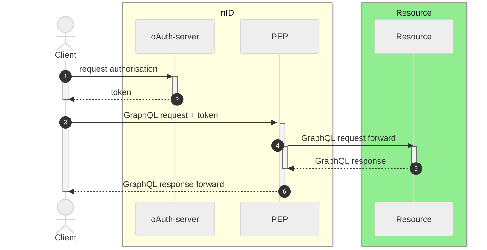

<font size="7">**RFC0040 - GraphQL HTTP-statuscodes**</font>

---

> [!CAUTION]
> **Deze Reqeust for comment is nog onderhanden en inhoud is sterk onderheving aan wijzigingen**

## Samenvatting

**Huidige situatie:**

>```nog invullen```

**Beoogde situatie**

>```nog invullen```

<font size="4">**Status RFC**</font>

Volg deze [link](https://github.com/iStandaarden/iWlz-RFC/issues/12) om de actuele status van deze RFC te bekijken.

---
## Inhoudsopgave
- [1. Inleiding](#1-inleiding)
  - [1.1 iWlz netwerk opzet](#11-iwlz-netwerk-opzet)
  - [1.1 Uitgangspunten](#11-uitgangspunten)
- [2. Statuscodes](#2-statuscodes)
- [X. Referenties](#x-referenties)


---
# 1. Inleiding
Deze RFC beschrijft de afspraken rondom het gebruik van HTTP-statuscodes in de response in het iWlz-netwerkmodel en in het bijzonder de afhandeling van ***'bad-results'*** op een **GrapQL Request**. 

## 1.1 iWlz netwerk opzet




## 1.1 Uitgangspunten
>```nog invullen```

# 2. Statuscodes
In de tabel hieronder worden per HTTP-statuscode de beschrijving, de betekenis en een voorbeeld van toepassing in het iWlz-netwerkmodel beschreven.

| Waarde | Beschrijving | Betekenis | Voorbeeld in iWlz-netwerkmodel |
|--------|--------------|-----------|----------------------------------|
| _**2xx**_    | _**Correcte status HTTP-server**_  | | |
| 200    | OK | Geeft aan dat het verzoek is geslaagd. | Bron beschikbaar, Raadpleeg indicatie verzoek ontvangen |
| _**4xx**_     | _**Probleemstatus bij HTTP-client**_  | | |
| 400    | BAD REQUEST | Het verzoek kon niet worden begrepen door de server vanwege een onjuiste syntaxis. | Ongeldig Wlz-indicatie-ID |
gehackte zorgaanbieder |
| _**5xx**_    | _**Probleemstatus bij HTTP-server**_ | | |

| 503    | SERVICE UNAVAILABLE | De server is niet gereed om het verzoek te verwerken. | Geretourneerd wanneer een service is uitgeschakeld vanwege bijvoorbeeld onderhoud of overbelasting. |


# X. Referenties

Hieronder de verwijzingen naar relevante artikelen.

| Onderwerp                                  |                                                                          |
| ------------------------------------------ | ------------------------------------------------------------------------ |
| Overzicht http status codes | https://www.rfc-editor.org/rfc/rfc9110.html#name-status-codes |
| GraphQL status codes | https://graphql.github.io/graphql-over-http/draft/#sec-Status-Codes |
| Foutmeldingen RFC0014 - OAuth 2.0 | https://github.com/iStandaarden/iWlz-RequestForComment/blob/main/RFC/RFC0014%20-%20Functionele%20uitwerking%20aanvragen%20van%20autorisatie.md#6-foutmeldingen |
| Http reponses uit OPA op notificatie | https://github.com/iStandaarden/iWlz-RequestForComment/blob/main/RFC/RFC0008%20-%20Notificaties.md#36-notificatie-responses-vanuit-opa |
| Http responses uit OPA op melding | https://github.com/iStandaarden/iWlz-RequestForComment/blob/main/RFC/RFC0018%20-%20Melden%20van%20fouten%20in%20gegevens%20volgens%20iStandaard%20iWlz.md#36-response-op-inzenden-foutmelding-vanuit-opa |


