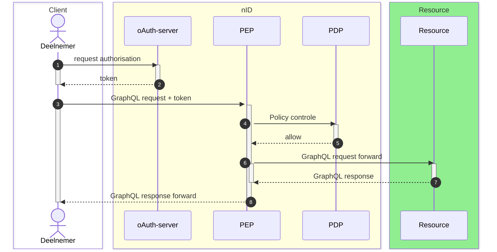
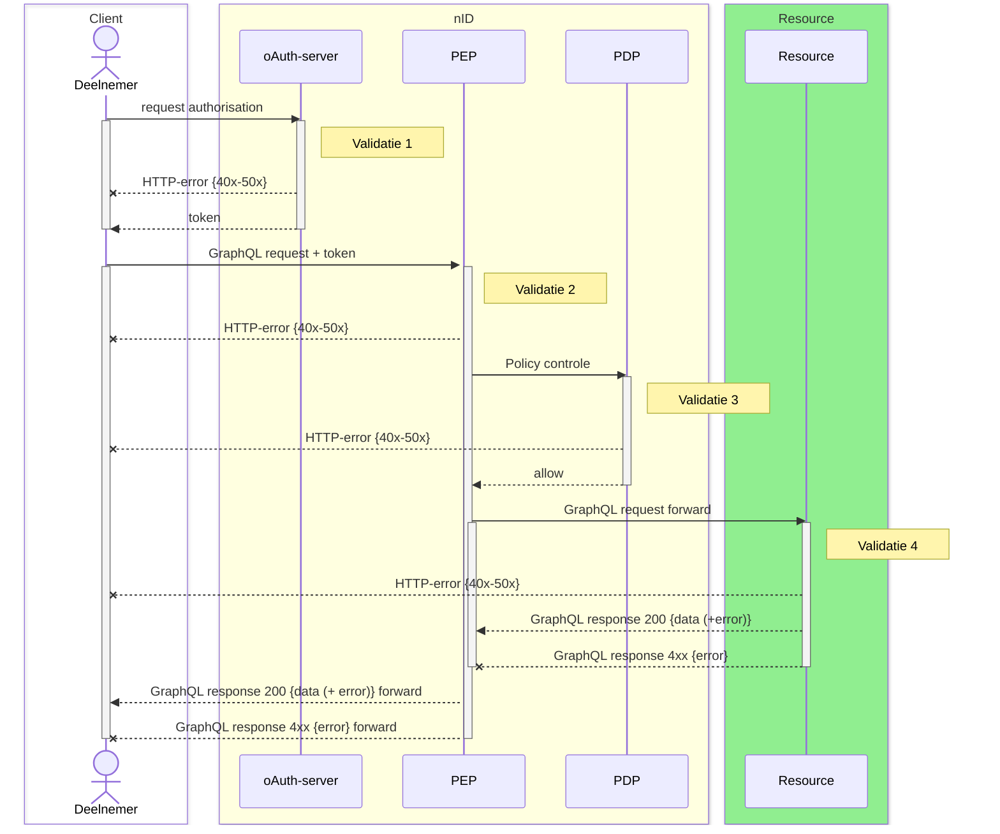

# RFC0040 - GraphQL gebruik HTTP-statuscodes


TODO:
- [ ] Keuze mediatype
- [ ] Bepalen welke extensions.code er worden gebruikt
- [ ] Bepalen welke validatiemomenten onderdeel zijn van de GraphQL error structuur

## Samenvatting

**Huidige situatie:**

Er is in het technische afstemmingsoverleg afgesproken dat het gebruik van HTTP-statuscodes binnen het (iWlz-) netwerk worden gereguleerd en situationeel worden bepaald. Hierom is de eerdere Request for Comment [RFC0009](https://github.com/iStandaarden/iWlz-RequestForComment/issues/12) over dit onderwerp is daarom ook komen te vervallen. Die was te globaal van opzet.

GraphQL is de standaard voor gegevensuitwisseling binnen het iWlz-netwerk. Afhankelijk van het gehanteerde mediatype in de HTTP header is enkel een HTTP 200 OK statuscode toegestaan of mogen er bij fouten ook HTTP 4xx of 5xx statuscodes worden gebruikt.

De HTTP 200 OK-status betekent daarom niet altijd dat een verzoek volledig succesvol is. Een GraphQL-response kan syntactisch correct zijn, maar nog steeds inhoudelijke fouten bevatten.

Een GraphQL-response bevat standaard:
- data: De opgevraagde gegevens.
- errors: Een lijst met foutmeldingen, inclusief details zoals locaties en foutcodes.

Er is geen standaard voor de foutcodes, maar hier kunnen wel afspraken over gemaakt worden. 

Tenslotte zijn er in het iWlz netwerk twee momenten waarop een evaluatie van het GraphQL-request plaatsvindt (PEP en Resourceserver). 
 

**Beoogde situatie**

- Duidelijkheid geven van welke situatie(s) er sprake kan zijn bij een GraphQL-response.
- Welke mediatype er word gebruikt
- Welke extension.codes worden gebruikt

---

## Inhoudsopgave

- [RFC0040 - GraphQL gebruik HTTP-statuscodes](#rfc0040---graphql-gebruik-http-statuscodes)
  - [Samenvatting](#samenvatting)
  - [Inhoudsopgave](#inhoudsopgave)
- [1. Inleiding](#1-inleiding)
  - [1.1 Uitgangspunten](#11-uitgangspunten)
  - [1.2 Status RFC](#12-status-rfc)
- [2. GraphQL over HTTP](#2-graphql-over-http)
  - [2.1 Standaard GraphQL response](#21-standaard-graphql-response)
  - [2.3 Mediatype `application/json`](#23-mediatype-applicationjson)
    - [2.3.1 Voorbeeld response: gedeeltelijk resultaat](#231-voorbeeld-response-gedeeltelijk-resultaat)
    - [2.3.2 Voorbeeld Volledige fout](#232-voorbeeld-volledige-fout)
  - [2.4 Mediatype `application/graphql-response+json`](#24-mediatype-applicationgraphql-responsejson)
    - [2.4.1 Voorbeeld Response met gedeeltelijk data-resultaat](#241-voorbeeld-response-met-gedeeltelijk-data-resultaat)
    - [2.4.2 Voorbeeld  bij een volledige fout](#242-voorbeeld--bij-een-volledige-fout)
  - [2.5 Conclusie](#25-conclusie)
- [3. GraphQL extensions.code](#3-graphql-extensionscode)
- [4. iWlz netwerk validatiemomenten](#4-iwlz-netwerk-validatiemomenten)
  - [4.1 Validaties en responses](#41-validaties-en-responses)
- [X. Referenties](#x-referenties)


---

# 1. Inleiding

De standaard voor gegvevensuitwisseling binnen het iWlz netwerk is GraphQL. De standaard van GraphQL beschrijft de wijze van gebruik van HTTP-statuscodes voor en met name het gebruik van _http 200 OK-status_ behoeft meer uitleg omdat er bij een GraphQL Response met _HTTP 200 OK statuscode_ niet automatische vanuit kan gaan dat het beoogde resultaat is bereikt.

Deze RFC beschrijft de richtijnen rondom het gebruik van HTTP-statuscodes op een GraphQL request in de response en gaat in op het onderscheidt tussen **_errors_** en **_'bad-results'_**. Dit is nodig omdat er bij gebruik van GraphQL volgens de standaard sprake kan zijn van beide typen bij een **GrapQL Request**, maar nooit op hetzelfde moment. In het geval dat een GraphQL Request wel een geldige GraphQL response kan opleveren (syntactisch) kan er inhoudelijk nog steeds sprake zijn van een ongewenst resultaat. In dat geval is er sprake van een **_'bad-results'_**

## 1.1 Uitgangspunten

> `nog verder invullen`

1. In het geval dat er op een GraphQL Request een geldige, ***'well-formed'***, GraphQL response gegenereerd kan worden inclusief een ***'not-null'*** `data`-object is er **altijd** sprake van een response HTTP 200 OK-status.
2. Alleen als er sprake is van een GraphQL endpoint (of Resource-server) waar daadwerkelijk sprake is van afhandeling van het GraphQL Request moet er **altijd** gereageerd worden met een HTTP 200 OK-status wanneer de GraphQL correct geinterpreteerd kan worden (zie uitgangspunt 1).
3. Een HTTP 200 OK-status response vanuit een GraphQL-server (of Resource-server) op een GraphQL Request kan inhoudelijk verwijzingen naar fouten bevatten.
4. Wanneer er geen sprake is van directe afhandeling van het GraphQL-request, maar bijvoorbeeld sprake is van autorisatie controle van het GraphQL request mag er afgeweken worden van uitgangspunt 1 en 2.
5. De indeling van HTTP-statuscodes volgt de internet standaard met betrekking tot HTTP-semantiek beschreven in [RFC9110](https://www.rfc-editor.org/rfc/rfc9110).
6. De situationele HTTP-statuscodes zijn en worden beschreven in afzonderlijke Request For Comment (zie onder referenties).

## 1.2 Status RFC

Volg deze [link](https://github.com/iStandaarden/iWlz-RFC/issues/40) om de actuele status van deze RFC te bekijken.


# 2. GraphQL over HTTP

## 2.1 Standaard GraphQL response

Een GraphQL-response heeft standaard twee hoofdvelden:
- **data**: Bevat de gevraagde gegevens als de query (gedeeltelijk) succesvol is.
- **errors**: Bevat een array van foutmeldingen die extra details kunnen bevatten, zoals foutlocaties en foutcodes.

Ook bij een HTTP 200 OK-status, kan de errors-array worden gebruikt om fouten te communiceren. Hieronder staat een gestandaardiseerde aanpak:
Responsindeling
- data:
    - Bevat de data die succesvol is opgehaald.
    - Als er fouten zijn, kunnen sommige velden null bevatten.
- errors:
    - Een array van foutobjecten, die elk de volgende velden kunnen bevatten:
      - message (vereist): Beschrijft de fout in begrijpelijke taal.
      - locations (optioneel): Geeft de locaties in de GraphQL-query aan waar de fout is opgetreden.
      - path (optioneel): Specificeert het pad naar het veld in de respons waar de fout betrekking op heeft.
      - extensions (optioneel): Bevat extra metadata over de fout, zoals een foutcode en details voor debugging.

Voorbeeld
```json
  {
    "data": {
      "userID": "123"
    },
    "errors": [
      {
        "message": "some message",
        "locations": [
          { "line": 2, "column": 3 }
        ],
        "path": ["path/to/"],
        "extensions": {
          "code": "STANDAARD_CODE",
          "timestamp": "2024-11-18T10:15:00Z"
        }
      }
    ]
  }
```

Momenteel zijn er twee mediatypes voor in de HTTP-header bij een GraphQL-responses. Het huidige mediatype `application/json` en het mediatype `application/graphql-response+json` , het nieuwe voorgestelde mediatype voor een fijnmaziger terugkoppeling.

Hieronder de toelichting op de twee typen.


## 2.3 Mediatype `application/json`
- **Algemene JSON-structuur:**  
  - Dit mediatype wordt algemeen gebruikt voor alle soorten JSON-reacties, niet specifiek voor GraphQL.
  - Het kan door verschillende tussenliggende lagen (zoals proxies, API-gateways) worden gewijzigd of gegenereerd.
  
- **GraphQL-specificatie en gebruik:**  
  - GraphQL-specificatie staat het gebruik van `application/json` toe, maar er zijn beperkingen:
    - De server MOET altijd de HTTP-statuscode **200 OK** gebruiken, zelfs bij fouten, om ervoor te zorgen dat de client kan vertrouwen dat de JSON-reactie van de server komt en niet is aangepast door een tussenliggende laag.
    - Eventuele fouten worden beschreven in de `errors`-sleutel van de JSON-reactie, niet in de HTTP-statuscode.

- **Voordelen:**  
  - Compatibel met oudere clients en middleware.
  - Brede ondersteuning in JSON-gerelateerde tooling.

- **Nadelen:**  
  - Geen onderscheid tussen succesvolle en mislukte aanvragen op basis van de HTTP-statuscode.
  - Foutafhandeling vereist dat de client altijd naar de `errors`-sleutel kijkt.


### 2.3.1 Voorbeeld response: gedeeltelijk resultaat
**HTTP Header**
```http
Content-Type: application/json
Status: 200 OK
```

**Body**
```json
{
  "data": {
    "user": {
      "id": "123",
      "name": "Alice"
    },
    "posts": null
  },
  "errors": [
    {
      "message": "You do not have permission to access the 'posts' field.",
      "locations": [
        {
          "line": 3,
          "column": 5
        }
      ],
      "path": ["posts"]
    }
  ]
}
```

 **Uitleg van het voorbeeld**

1. **HTTP-statuscode 200 OK:**  
   - Bij `application/json` MOET de server altijd een HTTP-statuscode van **200 OK** retourneren, zelfs als er fouten optreden in de query.
   - Fouten worden niet gesignaleerd via de HTTP-statuscode, maar via de inhoud van de `errors`-sleutel.

2. **`data`:**  
   - Bevat de velden die succesvol zijn opgehaald (`user`-object).  
   - Velden die niet konden worden opgehaald (`posts`) zijn opgenomen met een waarde van `null`.

3. **`errors`:**  
   - Bevat details over de fout(en):
     - **`message`:** De foutbeschrijving ("geen toestemming voor 'posts'").
     - **`locations`:** De locatie in de query waar de fout is opgetreden (regel 3, kolom 5).
     - **`path`:** Het pad naar het veld dat de fout veroorzaakte (`posts`).


### 2.3.2 Voorbeeld Volledige fout
Als de query volledig faalt (bijvoorbeeld vanwege een syntaxfout), blijft de HTTP-statuscode nog steeds **200 OK** en wordt de fout uitsluitend in de `errors`-sleutel gerapporteerd.

**HTTP Header**
```http
Content-Type: application/json
Status: 200 OK
```

**Body**
```json
{
  "data": null,
  "errors": [
    {
      "message": "Syntax Error: Unexpected <EOF>.",
      "locations": [
        {
          "line": 1,
          "column": 7
        }
      ]
    }
  ]
}
```


## 2.4 Mediatype `application/graphql-response+json`
- **GraphQL-specifieke JSON-structuur:**  
  - Dit mediatype is specifiek ontworpen voor GraphQL-responses.
  - Het ondersteunt betere foutafhandeling door zowel de HTTP-statuscode als de inhoud van de GraphQL-respons (`data` en `errors`) te gebruiken.

- **GraphQL-specificatie en gebruik:**  
  - De HTTP-statuscode geeft de status van de aanvraag aan:
    - **2xx (bijvoorbeeld 200):** Wanneer de query geheel of gedeeltelijk succesvol is.
    - **4xx of 5xx:** Wanneer de aanvraag ongeldig is of volledig is mislukt (bijvoorbeeld syntaxfouten, validatiefouten).
  - De server en client kunnen vertrouwen op de HTTP-statuscode, en fouten worden specifieker afgehandeld.

- **Voordelen:**  
  - Helder onderscheid tussen succesvolle en mislukte aanvragen via de HTTP-statuscode.
  - Meer in lijn met REST-achtige foutafhandeling.
  - Betere interoperabiliteit en duidelijkere semantiek voor foutverwerking.

- **Nadelen:**  
  - Vereist ondersteuning door zowel server als client.
  - Minder breed ondersteund in oudere tooling en middleware.

Hier is een voorbeeld van een GraphQL-respons met het mediatype `application/graphql-response+json`. Dit voorbeeld laat een gedeeltelijk succesvolle uitvoering zien, inclusief zowel data als fouten.

Hier is een voorbeeld van een GraphQL-respons met het mediatype `application/json`. Dit voorbeeld illustreert een gedeeltelijk succesvolle uitvoering van een query, waarbij de HTTP-statuscode **altijd 200 OK** is, ongeacht de aanwezigheid van fouten.


### 2.4.1 Voorbeeld Response met gedeeltelijk data-resultaat

> **HTTP Header:**
```http
Content-Type: application/graphql-response+json
Status: 200 OK
```

> **Body:**
```json
{
  "data": {
    "user": {
      "id": "123",
      "name": "Alice"
    },
    "posts": null
  },
  "errors": [
    {
      "message": "You do not have permission to access the 'posts' field.",
      "locations": [
        {
          "line": 3,
          "column": 5
        }
      ],
      "path": ["posts"]
    }
  ]
}
```

**Uitleg van het voorbeeld**  
1. **HTTP-statuscode 200 OK:**  
   - De server geeft aan dat de query is uitgevoerd, maar mogelijk met fouten.  
   - Dit is een geldige 2xx-respons, omdat er een niet-nulle `data`-sleutel aanwezig is.

2. **`data`:**  
   - Bevat gegevens die succesvol zijn opgehaald (`user`-object).  
   - Het `posts`-veld is echter `null`, wat aangeeft dat er een fout is opgetreden bij het ophalen van dat veld.

3. **`errors`:**  
   - De foutdetails worden vermeld in de `errors`-sleutel:
     - **`message`:** Beschrijft het probleem ("geen toestemming voor 'posts'").  
     - **`locations`:** Specificeert waar in de query het probleem zich bevindt (regel 3, kolom 5).  
     - **`path`:** Geeft het exacte veld (`posts`) aan waar de fout is opgetreden.


### 2.4.2 Voorbeeld  bij een volledige fout
Als de gehele query faalt en er geen `data` kan worden geretourneerd, wordt een andere HTTP-statuscode gebruikt, zoals **400 Bad Request**:

> **HTTP Header**
```http
Content-Type: application/graphql-response+json
Status: 400 Bad Request
```

> **Body**
```json
{
  "errors": [
    {
      "message": "Syntax Error: Unexpected <EOF>.",
      "locations": [
        {
          "line": 1,
          "column": 7
        }
      ]
    }
  ]
}
```

---

## 2.5 Conclusie

- Bij `application/json` wordt altijd een 200 OK-statuscode gebruikt, ongeacht de aanwezigheid van fouten. Dit kan verwarrend zijn voor clients, omdat ze de `errors`-sleutel moeten inspecteren om fouten te herkennen.
- Bij `application/graphql-response+json` worden 4xx- of 5xx-statuscodes gebruikt om fouten direct te signaleren via de HTTP-respons. Het biedt flexibele foutafhandeling door het gebruik van zowel de HTTP-statuscode als de `data`- en `errors`-sleutels in de respons. Hierdoor kunnen clients beter omgaan met gedeeltelijke en volledige fouten.

**Samenvatting van de verschillen**

| Kenmerk                        | `application/json`                 | `application/graphql-response+json` |
|---------------------------------|-------------------------------------|-------------------------------------|
| **Toepassing**                 | Algemeen JSON-mediatype         | Specifiek voor GraphQL-responses    |
| **Statuscode bij fouten**      | Altijd **200 OK**                  | 2xx, 4xx, of 5xx afhankelijk van fout |
| **Foutinformatie**             | Alleen in `errors`-sleutel         | In `errors` én HTTP-statuscode     |
| **Transparantie**   | Onduidelijk, altijd inspectie op aanwezigheid errors-key om fouten te herkennen | Vooraf meer duidelijkheid over error duiding mogelijk |
| **Specifieke GraphQL-support** | Nee                                | Ja                                 |

 **Keuze:**
- Gebruik `application/json` als je backward compatibility nodig hebt of met oudere systemen werkt.
- Gebruik `application/graphql-response+json` als je een modernere, robuustere aanpak voor foutafhandeling wilt, met duidelijke HTTP-statuscodes.


# 3. GraphQL extensions.code

Het standaard GraphQL-response schema biedt ruimte voor gestandaardiseerde fout categorisering. Hiervoor is het element `extensions.code`. 

Voorbeeld uit paragraaf 2.1
```json
  {
    "data": {
      "userID": "123"
    },
    "errors": [
      {
        "message": "some message",
        "locations": [
          { "line": 2, "column": 3 }
        ],
        "path": ["path/to/"],
        "extensions": {
          "code": "STANDAARD_FOUTCODE",
          "timestamp": "2024-11-18T10:15:00Z"
        }
      }
    ]
  }
```

Veelvoorkomende extensions.code waarden:

1. **BAD\_USER\_INPUT**  
   1. **Betekenis:** De invoer van de gebruiker is ongeldig, zoals onjuiste waarden of ontbrekende verplichte velden.  
   2. **Gebruik:** Bijvoorbeeld bij een validatiefout in een invoerveld.  
2. **UNAUTHENTICATED**  
   1. **Betekenis:** De gebruiker is niet geauthenticeerd en de actie vereist authenticatie.  
   2. **Gebruik:** Wanneer een token ontbreekt of ongeldig is.  
3. **FORBIDDEN**  
   1. **Betekenis:** De gebruiker is geauthenticeerd, maar heeft geen toestemming om de actie uit te voeren.  
   2. **Gebruik:** Bijvoorbeeld bij een poging tot toegang tot een beveiligd veld of actie waarvoor de gebruiker niet de juiste rechten heeft.  
4. **NOT\_FOUND**  
   1. **Betekenis:** Het opgevraagde object of resource bestaat niet.  
   2. **Gebruik:** Bijvoorbeeld bij een query voor een niet-bestaande ID.  
5. **INTERNAL\_SERVER\_ERROR**  
   1. **Betekenis:** Een onverwachte fout aan de serverzijde.  
   2. **Gebruik:** Wanneer een onvoorziene fout optreedt, zoals een bug of een fout in een databaseverbinding.  
6. **GRAPHQL\_VALIDATION\_FAILED**  
   1. **Betekenis:** De query voldoet niet aan de GraphQL-validatieregels.  
   2. **Gebruik:** Bijvoorbeeld bij een onjuist veldtype of syntaxisfout in de query.  
7. **PERSISTED\_QUERY\_NOT\_FOUND**  
   1. **Betekenis:** Een bewaarde query (persisted query) kon niet worden gevonden op de server.  
   2. **Gebruik:** Vaak in caching-omgevingen waarbij een ID van een opgeslagen query niet overeenkomt.  
8. **PERSISTED\_QUERY\_NOT\_SUPPORTED**  
   1. **Betekenis:** De server ondersteunt geen bewaarde queries.  
   2. **Gebruik:** Als een client per ongeluk een persisted query verzendt naar een server die dit niet ondersteunt.  
9. **RATE\_LIMITED**  
   1. **Betekenis:** De client heeft de toegestane limiet voor verzoeken overschreden.  
   2. **Gebruik:** Bij throttling of API-rate-limiting mechanismen.  
10. **CONFLICT**  
    1. **Betekenis:** Er is een versieconflict of een andere bewerkingsconflict opgetreden.  
    2. **Gebruik:** Bij bijvoorbeeld simultane updates van dezelfde resource.


# 4. iWlz netwerk validatiemomenten

Op dit moment zijn er drie soorten verkeer binnen het iWlz netwerk:

1. GraphQL request met een **_raadpleging_** van informatie bij een register.
2. GraphQL request voor het **_notificeren_** van een deelnemer door een bronhouder.
3. GraphQL request voor het **_foutmelden_** door een deelnemer aan een bronhouder.

Voor al het verkeer in het iWlz netwerk vormt nID de centrale voorziening voor het regelen van de toegang tot iWlz registers. Voor elk van de drie soorten verkeer verloopt het proces als volgt:



| #   | Beschrijving               | Toelichting                                                                                                                    |
| --- | -------------------------- | ------------------------------------------------------------------------------------------------------------------------------ |
| 1   | request authorisation      | De flow begint met het aanvragen van toestemming door de deelnemer.                                                            |
| 2   | token                      | Indien succesvol doorlopen wordt een access-token uitgedeeld aan de deelnemer.                                                 |
| 3   | GraphQL Request + token    | De deelnemer kan met het access-token een verzoek uitzetten bij de PEP om een GraphQL-request te doen bij een resource-server. |
| 4   | Policy controle            | Het request wordt aangeboden aan de PDP om te beoordelen of deelnemer het request mag indienen                                 |
| 5   | Request allow              | Request voldoet aan autorisatie en beleid                                                                                      |
| 6   | GraphQL Request forward    | De PEP routeert het graphQL request aan de juiste resource-server.                                                             |
| 7   | Response (GraphQL)         | De resource-server stuurt het GraphQL resultaat terug.                                                                         |
| 8   | Response (GraphQL) forward | De PEP routeert het resultaat terug aan de client.                                                                             |

## 4.1 Validaties en responses



| Validatiemoment | Doel | GraphQL controle | GraphQL Verwerking |
|---|---|---|---|
| Validatiemoment 1: Autorisatieserver | **Doel:** Uitgeven van autorisatie token voor het mogen uitvoeren van een GraphQL request.  <br/><br/>Client kan toestemming vragen voor het uitsturen van een GraphQL-request. Bij het ontvangen van het verzoek en valideren ervan vinden de volgende acties plaats:      <br/>•  De autorisatieserver valideert de client o.b.v. het aangeboden authenticatiemiddel      <br/>•  De autorisatieserver doorloopt voor elke aanvraag (scope) de rule-engine.      <br/>•  In de rule-engine wordt de scope gevalideerd m.b.v. de ingestelde regels voor de aangevraagde scope(s).      <br/><br/>Indien succesvol doorlopen wordt er een access-token wordt gegenereerd, hierin zijn de scopes en de resources verwerkt en auitgedeeld aan de client.     <br/><br/>Bij een fout-situatie worden er reguliere HTTP-statuscodes teruggegeven in de range 40x en 50x. De specificatie daarvan voor dit moment is te vinden in: [RFC0014 - Functionele uitwerking aanvragen van autorisatie - 6.1 Foutmeldingen Aanvraag van Autorisatie](https://github.com/iStandaarden/iWlz-RequestForComment/blob/main/RFC/RFC0014%20-%20Functionele%20uitwerking%20aanvragen%20van%20autorisatie.md#6-foutmeldingen) | Nee | Nee |
| Validatiemoment 2: PEP | **Doel:** controleren toegang tot (GraphQL-) Resource-server    <br/><br/>Een “Policy Enforcement Point” (kortweg PEP) regelt toegang tot resource-servers van deelnemers en beschermt deze resource-servers tegen ongeautoriseerde toegang/verzoeken.      <br/>•  PEP: Valideren van de client o.b.v. het aangeboden authenticatiemiddel.    <br/>•  PEP: Valideren van de access-token o.a. op eigenaar en geldigheid.      <br/><br/>Bij een fout-situatie worden er reguliere HTTP-statuscodes teruggegeven in de range 40x en 50x. De specificatie daarvan voor dit moment is te vinden in: [RFC0014 - Functionele uitwerking aanvragen van autorisatie - 6.2 Foutmeldingen PEP endpoint op GraphQL request](https://github.com/iStandaarden/iWlz-RequestForComment/blob/main/RFC/RFC0014%20-%20Functionele%20uitwerking%20aanvragen%20van%20autorisatie.md#6-foutmeldingen) | Nee | Nee |
| Validatiemoment 3: PDP | **Doel:** controleren of GraphQL-request is toegestaan voor deelnemer    <br/><br/>Een “Policy Decision Point” (kortweg PDP) is verantwoordelijk voor het nemen van beslissingen over toegangsverzoeken. Het GraphQL-request wordt vanuit de PEP aangeboden aan de PDP om te beoordelen of deelnemer de ingediende query mag uitvoeren en of de verplichte onderdelen aanwezig zijn.    <br/>•  PDP: Bepalen of de query aan de gestelde policy of beleidsregel voldoet.      <br/><br/>Bij een fout-situatie worden er reguliere HTTP-statuscodes teruggegeven in de range 40x en 50x. De specificatie daarvan voor dit moment is te vinden in: [RFC0014 - Functionele uitwerking aanvragen van autorisatie - 6.2 Foutmeldingen PEP endpoint op GraphQL request](https://github.com/iStandaarden/iWlz-RequestForComment/blob/main/RFC/RFC0014%20-%20Functionele%20uitwerking%20aanvragen%20van%20autorisatie.md#6-foutmeldingen) | Ja (maar nooit {data})| Nee |
| Validatiemoment 4: (GraphQL) Resource-server | **Doel:** Afhandelen van het GraphQL-request     <br/><br/>De (GraphQL) Resource-server zorgt voor de afhandeling en vewerking van het GraphQL request. Dit kan betekenen dat er bij een query data wordt teruggegeven, dat de er een bevestiging volgt op juiste ontvangst van een notificatie (GraphQL 200 {data}) of foutmelding of dat de verwerking van het request een ongewenst resultaat geeft (bad-result: GraphQL 200 {error}).  <br/><br/>De afspraken hierover volgen in @@@@  <br/><br/>Is de (GraphQL) Resource-server niet bereikbaar of kan de GraphQL niet verwerkt worden, dan worden er reguliere HTTP-statuscodes teruggegeven in de range 40x en 50x. De specificatie daarvan voor dit moment is te vinden in:   <br/>• [RFC0014 - Functionele uitwerking aanvragen van autorisatie - #6.2](https://github.com/iStandaarden/iWlz-RequestForComment/blob/main/RFC/RFC0014%20-%20Functionele%20uitwerking%20aanvragen%20van%20autorisatie.md#6-foutmeldingen)  <br/>• [RFC0008 - Notificaties - #3.6](https://github.com/iStandaarden/iWlz-RequestForComment/blob/main/RFC/RFC0008%20-%20Notificaties.md#36-notificatie-responses-vanuit-opa) <br/>• [RFC0018 - Foutmeldingen - #3.6](https://github.com/iStandaarden/iWlz-RequestForComment/blob/main/RFC/RFC0018%20-%20Melden%20van%20fouten%20in%20gegevens%20volgens%20iStandaard%20iWlz.md#36-response-op-inzenden-foutmelding-vanuit-opa) | Nee | **Ja** (en data) |


# X. Referenties

Hieronder de verwijzingen naar relevante artikelen.

| Onderwerp                            |                                                                                                                                                                                                          |
| ------------------------------------ | -------------------------------------------------------------------------------------------------------------------------------------------------------------------------------------------------------- |
| Overzicht HTTP-statuscodes          | https://www.rfc-editor.org/rfc/rfc9110.html#name-status-codes                                                                                                                                            |
| GrapQL over HTTP                     | https://graphql.org/learn/serving-over-http/                                                                                                                                                             |
| GraphQL status codes                 | https://graphql.github.io/graphql-over-http/draft/#sec-Status-Codes                                                                                                                                      |
| Foutmeldingen RFC0014 - OAuth 2.0    | https://github.com/iStandaarden/iWlz-RequestForComment/blob/main/RFC/RFC0014%20-%20Functionele%20uitwerking%20aanvragen%20van%20autorisatie.md#6-foutmeldingen                                           |
| Http reponses uit OPA op notificatie | https://github.com/iStandaarden/iWlz-RequestForComment/blob/main/RFC/RFC0008%20-%20Notificaties.md#36-notificatie-responses-vanuit-opa                                                                   |
| Http responses uit OPA op melding    | https://github.com/iStandaarden/iWlz-RequestForComment/blob/main/RFC/RFC0018%20-%20Melden%20van%20fouten%20in%20gegevens%20volgens%20iStandaard%20iWlz.md#36-response-op-inzenden-foutmelding-vanuit-opa |


