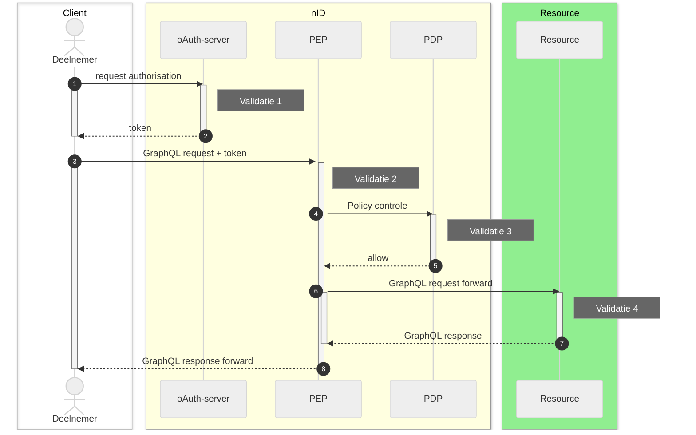

# RFC0040 - GraphQL HTTP-statuscodes

> [!CAUTION]  
> **Deze Reqeust for comment is nog onderhanden en inhoud is sterk aan wijzigingen onderhevig**

## Samenvatting

**Huidige situatie:**

Er is in het technische afstemmingsoverleg afgesproken dat het gebruik van http-statuscodes binnen het (iWlz-) netwerk worden gereguleerd en situationeel worden bepaald. Hierom is de eerdere Request for Comment [RFC0009](https://github.com/iStandaarden/iWlz-RequestForComment/issues/12) over dit onderwerp is daarom ook komen te vervallen. Die was te globaal van opzet.

De uitwissel standaard binnen het netwerk is GraphQL. De standaard van GraphQL schrijft ook een wijze van gebruik van http statuscodes voor en met name het gebruik van _http 200 OK_ behoeft in deze contect meer uitleg omdat er bij een GraphQL Response met _http 200 OK_ niet automatische vanuit kan gaan dat het beoogde resultaat is bereikt.

**Beoogde situatie**

Duidelijkheid van welke situatie er sprake is bij een GraphQL 200 OK met een **bad-result** inhoud.

---

## Inhoudsopgave

- [1. Inleiding](#1-inleiding)
  - [1.1 Uitgangspunten](#11-uitgangspunten)
  - [1.2 Status RFC](#12-status-rfc)
- [2. iWlz netwerk](#2-iwlz-netwerk)
  - [2.2 Validatiemoment 1: Autorisatieserver](#22-validatiemoment-1-autorisatieserver)
  - [2.3 Validatiemoment 2: PEP](#23-validatiemoment-2-pep)
  - [2.4 Validatiemoment 3: PDP](#24-validatiemoment-3-pdp)
  - [2.5 Validatiemoment 4: Resource (GraphQL-)server](#25-validatiemoment-4-resource-graphql-server)
    - [2.5.1 Error vs bad-result](#251-error-vs-bad-result)
- [3. GraphQL statuscodes](#3-graphql-statuscodes)
  - [3.x GraphQL response format](#3x-graphql-response-format)
  - [3.x GraphQL extension.codes lijst](#3x-graphql-extensioncodes-lijst)
- [X. Referenties](#x-referenties)

---

# 1. Inleiding

De uitwissel standaard binnen het iWlz netwerk is GraphQL. De standaard van GraphQL beschrijft de wijze van gebruik van http statuscodes voor en met name het gebruik van _http 200 OK_ behoeft meer uitleg omdat er bij een GraphQL Response met _http 200 OK_ niet automatische vanuit kan gaan dat het beoogde resultaat is bereikt.

Deze RFC beschrijft de afspraken rondom het gebruik van HTTP-statuscodes op een GraphQL request in de response en gaat in op het onderscheidt tussen **_errors_** en **_'bad-results'_**. Dit is nodig omdat er bij gebruik van GraphQL volgens de standaard sprake kan zijn van beide typen bij een **GrapQL Request**, maar nooit op hetzelfde moment. In het geval dat een GraphQL Request wel een geldige GraphQL response kan opleveren (syntactisch) kan er inhoudelijk nog steeds sprake zijn van een ongewenst resultaat. In dat geval is er sprake van een **_'bad-results'_**

## 1.1 Uitgangspunten

> `nog verder invullen`

1. In het geval dat er op een GraphQL Request een geldige, _'well-formed'_, GraphQL response gegenereerd kan worden is er **altijd** sprake van een http 200 OK response.
2. Alleen als er sprake is van een GraphQL endpoint (of Resource-server) waar daadwerkelijk sprake is van afhandeling van het GraphQL Request moet er **altijd** gereageerd worden met een http 200 OK wanneer de GraphQL correct geinterpreteerd kan worden (zie uitgangspunt 1).
3. Een http 200 OK response vanuit een GraphQL-server (of Resource-server) op een GraphQL Request kan inhoudelijk verwijzingen naar fouten bevatten.
4. Wanneer er geen sprake is van directe afhandeling van het GraphQL-request, maar bijvoorbeeld sprake is van autorisatie controle van het GraphQL request mag er afgeweken worden van uitgangspunt 1 en 2.
5. De indeling van http status-codes volgt de internet standaard met betrekking tot http-semantiek beschreven in [RFC9110](https://www.rfc-editor.org/rfc/rfc9110).
6. De situationele http statuscodes zijn en worden beschreven in afzonderlijke Request For Comment (zie onder referenties).

## 1.2 Status RFC

Volg deze [link](https://github.com/iStandaarden/iWlz-RFC/issues/40) om de actuele status van deze RFC te bekijken.

# 2. iWlz netwerk

Op dit moment zijn er drie soorten verkeer binnen het iWlz netwerk:

1. GraphQL request met een **_raadpleging_** van informatie bij een register.
2. GraphQL request voor het **_notificeren_** van een deelnemer door een bronhouder.
3. GraphQL request voor het **_foutmelden_** door een deelnemer aan een bronhouder.

Voor al het verkeer in het iWlz netwerk vormt nID de centrale voorziening voor het regelen van de toegang tot iWlz registers. Voor elk van de drie soorten verkeer verloopt het proces als volgt:

| #   | Beschrijving               | Toelichting                                                                                                                    |
| --- | -------------------------- | ------------------------------------------------------------------------------------------------------------------------------ |
| 1   | request authorisation      | De flow begint met het aanvragen van toestemming door de deelnemer.                                                            |
|     | **Validatie 1**            | Validatie autorisatie aanvraag.                                                                                                |
| 2   | token                      | Indien succesvol doorlopen wordt een access-token uitgedeeld aan de deelnemer.                                                 |
| 3   | GraphQL Request + token    | De deelnemer kan met het access-token een verzoek uitzetten bij de PEP om een GraphQL-request te doen bij een resource-server. |
|     | **Validatie 2**            | Validatie autorisatie                                                                                                          |
| 4   | Policy controle            | Het request wordt aangeboden aan de PDP om te beoordelen of deelnemer het request mag indienen                                 |
|     | **Validatie 3**            | Validatie request                                                                                                              |
| 5   | Request allow              | Request voldoet aan autorisatie en beleid                                                                                      |
| 6   | GraphQL Request forward    | De PEP routeert het graphQL request aan de juiste resource-server.                                                             |
|     | **Validatie 4**            | GraphQL (server) validatie                                                                                                     |
| 7   | Response (GraphQL)         | De resource-server stuurt het GraphQL resultaat terug.                                                                         |
| 8   | Response (GraphQL) forward | De PEP routeert het resultaat terug aan de client.                                                                             |

## 2.2 Validatiemoment 1: Autorisatieserver

Beschreven in RFC0014, geen GraphQL parsing en validatie. 

- De autorisatieserver valideert de client o.b.v. het aangeboden authenticatiemiddel  - De autorisatieserver doorloopt voor elke aanvraag (scope) de rule-engine.  - In de rule-engine wordt de scope gevalideerd m.b.v. de ingestelde regels voor de aangevraagde scope(s).

## 2.3 Validatiemoment 2: PEP

Beschreven in RFC0014, geen GraphQL parsing en validatie

## 2.4 Validatiemoment 3: PDP

Beschreven in RFC0014, geen GraphQL parsing door GraphQL server, wel controle en validatie

## 2.5 Validatiemoment 4: Resource (GraphQL-)server

Deze RFC voor GraphQL bad-results en RFC0014, FRC0008 en RFC0018 voor Errors

### 2.5.1 Error vs bad-result

# 3. GraphQL statuscodes

## 3.x GraphQL response format

## 3.x GraphQL extension.codes lijst

# X. Referenties

Hieronder de verwijzingen naar relevante artikelen.

| Onderwerp                            |                                                                                                                                                                                                          |
| ------------------------------------ | -------------------------------------------------------------------------------------------------------------------------------------------------------------------------------------------------------- |
| Overzicht http status codes          | https://www.rfc-editor.org/rfc/rfc9110.html#name-status-codes                                                                                                                                            |
| GraphQL status codes                 | https://graphql.github.io/graphql-over-http/draft/#sec-Status-Codes                                                                                                                                      |
| Foutmeldingen RFC0014 - OAuth 2.0    | https://github.com/iStandaarden/iWlz-RequestForComment/blob/main/RFC/RFC0014%20-%20Functionele%20uitwerking%20aanvragen%20van%20autorisatie.md#6-foutmeldingen                                           |
| Http reponses uit OPA op notificatie | https://github.com/iStandaarden/iWlz-RequestForComment/blob/main/RFC/RFC0008%20-%20Notificaties.md#36-notificatie-responses-vanuit-opa                                                                   |
| Http responses uit OPA op melding    | https://github.com/iStandaarden/iWlz-RequestForComment/blob/main/RFC/RFC0018%20-%20Melden%20van%20fouten%20in%20gegevens%20volgens%20iStandaard%20iWlz.md#36-response-op-inzenden-foutmelding-vanuit-opa |
