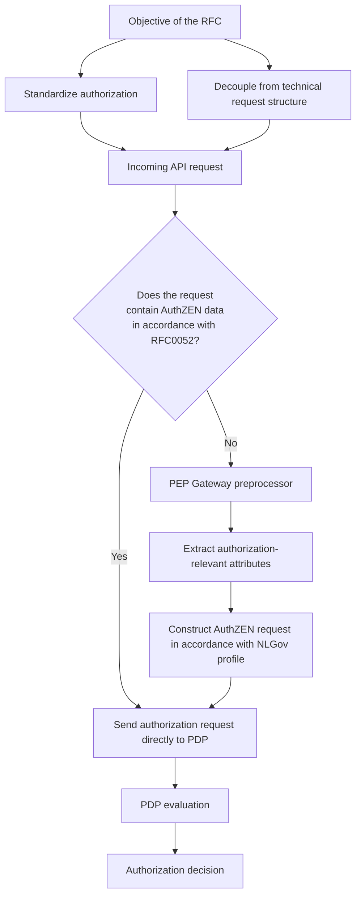
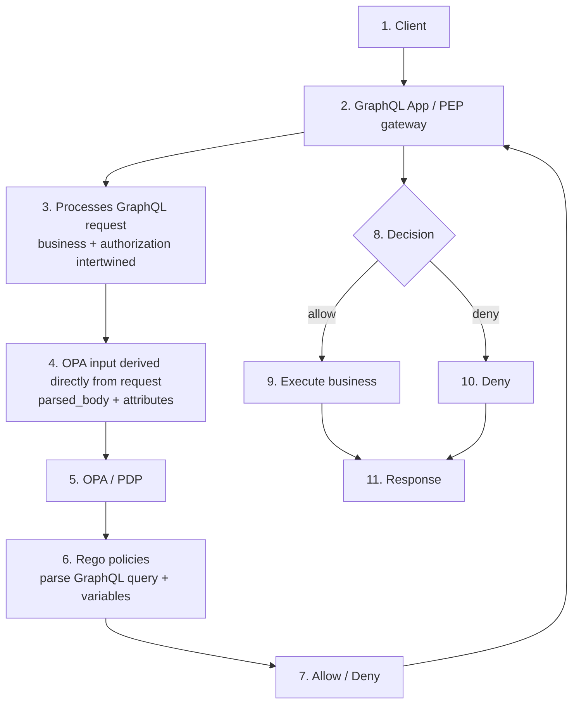
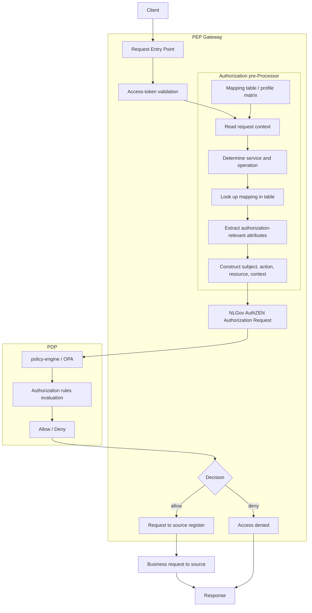

# Summary

Within the iWlz system, authorization currently depends on the technical structure of API requests, which leads to inconsistency and limited interoperability.  

This RFC proposes to explicitly extract authorization attributes in the PEP Gateway and translate them into a standardized authorization request in accordance with NLGov AuthZEN.  

This decouples authorization from implementation details and bases it on a uniform, explicit model.  

This makes authorization standardizable, interoperable, and more testable across the entire system.




Problem

The authorization decision is currently based on the full incoming API request, including GraphQL query structure, variables, and token. This creates a strong dependency between the technical representation of the request and the authorization logic.

This RFC proposes configuring the PEP Gateway in accordance with the above schema.

For an incoming request, it is first determined whether the request already contains authorization data in accordance with RFC0052 (this document).

- If the request already contains an authorization request in accordance with RFC0052, that authorization information can be submitted unchanged to the PDP for evaluation.
- If the request does not comply with RFC0052, then:
  - the authorization-relevant information is extracted from the incoming request by means of a preprocessor in the PEP Gateway;
  - the preprocessor constructs, on that basis, a standardized authorization request in accordance with the NLGov AuthZEN standard, as specified in this document;
  - this standardized authorization request is then submitted to the PDP for evaluation.

This results in:

- breaking the dependency on technical request structures;
- basing authorization on an explicit and standardized model;
- increasing interoperability between source holders and implementations;
- making authorization policy more testable and reusable.

For implementing parties, this means:

- setting up a control mechanism to determine whether a request already complies with RFC0052;
- implementing a preprocessor in the PEP Gateway for requests that do not comply with RFC0052;
- using the standardized AuthZEN authorization request;
- setting up a mapping mechanism (service + operation → policy);
- adapting existing authorization implementations to the new model.

The NLGov AuthZEN standard only standardizes the interface between PEP and PDP and does not replace IAM functionality or any policy engine.

For illustration, a [demo](https://cloudblox.github.io/graphql-opa-demo/RFC0052-example.html) is available that shows what an AuthZEN request can look like according to the standard and profiling in this document. In addition, a [JSON Schema](./RFC0052-schema.json) is available to make this authorization request machine-validatable.

# 1. Introduction

Within the national healthcare system, authorization is positioned as a generic function. This function must operate system-wide, be independent of individual sources (Registers), be standardizable, and be applicable in an interoperable way. These principles are embedded in policy frameworks around generic functions and are, among other things, confirmed in the Twiin Trust Framework.

Within the iWlz system, multiple source holders operate under a shared policy framework. In this context, it is necessary that authorization is applied in a consistent and uniform way. When authorization depends on implicit interpretations or implementation-specific definitions, there is a risk of divergent interpretations of authorization attributes. This can lead to inconsistent behavior, reduced interoperability, and limited verifiability of authorization decisions within the system.

In the current situation, the incoming API request (GraphQL request and Token) is submitted as a whole in a single JSON document to the policy engine for evaluation. This combined request is then used as input for policy evaluation. As a result, the authorization decision depends on the technical representation of the request, such as query structure, variables, and filters, which leads to an undesirable coupling between technology and authorization.

This situation conflicts with the principle that authorization as a generic function must be decoupled from individual sources and implementations. To make authorization system-wide consistent, reusable, and testable, an explicit separation is needed between the business request (API request) and the authorization request.

This document describes a proposal to achieve this separation by standardizing the authorization request. The Policy Enforcement Point (PEP) is responsible for deriving a standardized authorization request from the incoming request, while the Policy Decision Point (PDP) evaluates that request on the basis of centrally managed authorization policy.

# 2. Problem Statement

Within the iWlz system, authorization is applied in a context in which multiple source holders operate under a shared policy framework. Although authorization as a generic function must operate system-wide consistently and independently of applications, in the current situation the implementation of authorization turns out to be strongly intertwined with the technical design of individual APIs.

Concretely, an incoming API request (for example a GraphQL request) is currently processed as one combined whole, in which both business logic (the functional request to the source holder) and authorization logic (the assessment whether that request is allowed) are included. This combined request is submitted as input to the policy engine for evaluation.

This creates the following bottlenecks:

- Intertwining of business logic and authorization logic; Authorization decisions directly depend on the structure and contents of the API request, such as query construction, variables, and filters. This creates an undesirable coupling between business logic and authorization logic.
- Lack of standardization of the authorization request; There is no uniform model for the authorization request between Policy Enforcement Points (PEP) and Policy Decision Points (PDP). Each implementation decides for itself how authorization attributes are derived and submitted, which leads to inconsistent interpretations.
- Limited interoperability between source holders; Due to the absence of a standardized authorization contract, different source holders can implement authorization in different ways, which hinders system-wide interoperability.
- Limited reusability and testability of policy; Authorization policy is linked to specific API structures and is therefore difficult to reuse. In addition, it becomes more difficult to test and justify authorization decisions consistently.
- Dependency on technical implementation details; Policy evaluation depends on implementation-specific request representations (such as GraphQL structures), instead of on an explicit and technology-independent authorization model.

This situation conflicts with the principle that authorization as a generic function must be decoupled, standardizable, and interoperable. Without an explicit separation between business logic and authorization logic and without standardization of the authorization request, the risk remains of fragmentation of authorization implementations within the system.

# 3. Architecture Principles

Authorization within the iWlz system must comply with the following architecture principles:

- **Separation of responsibilities**; Responsibility for policy enforcement, policy decision, and policy governance must be explicitly separated. The Policy Enforcement Point (PEP) is responsible for enforcing authorization decisions at the application or gateway. The Policy Decision Point (PDP) is responsible for making authorization decisions. Governance of the authorization policy is centrally assigned to ZINL.
- **Standardization of authorization requests**; Authorization requests between PEP and PDP must pass through a uniform and standardized interface so that authorization decisions can be requested and processed consistently.
- **Decoupling of policy engine and interface**; The interface between PEP and PDP must be independent of the underlying policy engine. The implementation of the PDP must be replaceable without impacting the applications or gateways that request authorization decisions.
- **System-wide interoperability**; Source holders and other system parties must use the same authorization interface and semantics so that authorization can be applied consistently, explainably, and interoperably across the system.

# 4. Current Situation

The current situation is based on one GraphQL request, where the input for policy evaluation is derived directly from the full request and submitted as a JSON document to Open Policy Agent (OPA).

OPA evaluates this input based on the Rego policies defined in the policy bundle and the associated policy structure. In doing so, both request attributes and elements from the GraphQL query, such as variables and filters, are involved in the authorization decision.

In this setup, no explicit separation exists between business logic and authorization logic. Both are implicitly intertwined in the input for policy evaluation, causing authorization decisions to depend on the technical representation of the API request.

OPA functions as the Policy Decision Point (PDP) in this architecture.



- (1-2) The request comes in through the GraphQL application / PEP gateway  
- (3-4) The request is used as a whole as input for authorization  
- (5-7) The PDP evaluates this through Rego policies  
- (8-11) Based on the decision, the business logic is executed or denied

# 5. Target Architecture

It is desirable to introduce an explicit separation between business logic and authorization logic.
To this end, it is proposed that the implementing party provides a pre-processing function within the Policy Enforcement Point (PEP) gateway.

This pre-processing function is responsible for distinguishing the business request (the functional request to the source holder) from the authorization request to be derived from it.

The implementing party is free to choose the technology for this functionality, provided the following principles are met:
- A clear separation is created between business logic and authorization logic.
- The authorization request is constructed in accordance with the [NLGov AuthZEN Authorization API 1.0 specification](https://www.logius.nl/actueel/publieke-consultatie-nlgov-authzen-autorisatie-api-v10) as described in Chapter 6.

In the context of system-wide interoperability, the solution should not be limited to one specific API technology. In addition to GraphQL requests, other API protocols must also be supported.

The following applies:
- For GraphQL, explicit authorization indicators such as directives can be used to signal that an authorization decision is required for a particular operation in accordance with the NLGov AuthZEN specification as described in Chapter 6.
- For other API protocols (such as REST or gRPC), this information is derived from, for example, endpoints, methods, metadata, or configuration, using a mapping mechanism that aligns with the authorization model of the NLGov AuthZEN Authorization API 1.0 as described in Chapter 6.

The way in which the pre-processing function recognizes and interprets this information is an implementation detail. Standardization is focused solely on the authorization request submitted by the PEP to the Policy Decision Point (PDP).

## 5.1 Target Architecture



This implies:

- Implementation of an Authorization Pre Processor
- Within the Pre Processor, the authorization logic is extracted
- The Pre Processor ensures that the authorization data submitted to the PDP complies with the structure and standards described in Chapter 6.2.

# 6. Authorization Contract iWlz AuthZEN Profile

This chapter describes what an authorization request must look like within the iWlz system.

The model is based on:

- OpenID AuthZEN Authorization API 1.0  
- NLGov AuthZEN profile  

This document defines an iWlz profile on these standards.

That means:

- the structure follows AuthZEN;
- the meaning of fields and values is defined here;
- code lists are part of the standard.

The technical implementation of authorization (such as policy engines or architectural choices) is out of scope.

In addition to the description in this chapter, a JSON Schema is available that makes the authorization request machine-validatable.

This schema can be used for:
- validation of authorization requests
- contractual agreements between parties
- implementation in gateways and services

You can download the schema [here](./RFC0052-schema.json).

## 6.1 Structure of the Authorization Request

An authorization request always consists of:

- subject
- action
- resource
- context

## 6.2 Subject

The `subject` describes the actor performing the action.

The structure of the subject follows the AuthZEN model and consists of:

- `type` → the type of actor
- `id` → the unique identification of the actor
- `properties` → additional characteristics of the actor

| Attribute | Required | Explanation |
|---|---|---|
| type | Yes | Type of actor (e.g. `organization`, `user`, `system`) |
| id | Yes | Unique identifier of the actor |
| properties | No | Additional domain-specific data |

### Explanation

- The field `type` indicates what kind of actor it is (for example an organization or a user).
- The field `id` uniquely identifies the actor within the system. In practice, this often originates from the access token.
- The field `properties` contains additional characteristics that are relevant for authorization, such as:
  - roles (`roles`)
  - organizational characteristics (`organization_type`)
  - identifiers (e.g. UZOVI or AGB code)
  - region (`region`)

These attributes align with the code lists in paragraph 6.6.

### Guidelines

- Domain-specific attributes are placed under `properties`.
- The meaning of attributes in `properties` is consistent with the code lists.
- The combination of `subject.properties`, `resource`, and `context` forms the basis for the authorization decision.
- It must be possible to trace the values of the subject back to a reliable source (e.g. an access token or an external source).

## 6.3 Action

The `action` describes which operation is performed on the resource.

The structure of `action` follows the AuthZEN model and consists of an object with a `name` field.

```json
{
  "action": {
    "name": "read"
  }
}
```

| Attribute | Required | Explanation |
|---|---|---|
| name | Yes | The operation to be performed (e.g. read/write) |

### Explanation

- The field `name` indicates what the actor wants to do with the resource (for example consult or modify).
- The value of `action.name`, together with `resource` and `context`, determines which authorization rules apply.
- The permitted values are defined in the code lists (see paragraph 6.6).

### Guidelines

- The action is always represented as an object in accordance with AuthZEN (for example `{ "name": "read" }`).
- The use of a loose string such as `"action": "read"` is not allowed.
- The value of `action.name` must come from the established code list.
- The meaning of the chosen action must be consistent across the system.

## 6.4 Resource

The `resource` describes the object on which the action is performed.

Within the iWlz system, GraphQL is used for data exchange.

In this context, the dataset to be retrieved is largely determined by filter criteria, as recorded in the GraphQL `where` clause.

A large part of the authorization logic is based on these filter criteria. Authorization therefore takes place not only at the level of the resource, but also on the selection of data within that resource.

For this reason, within the iWlz profile the filter context is explicitly included in the authorization request.

This filter context is modeled as part of the `resource`, under `resource.properties.query_filter`.

The `query_filter` contains a normalized representation of the filter criteria from the incoming request. For GraphQL requests, this corresponds to the `where` clause.

The structure of the resource follows the AuthZEN model and consists of:

- `type` → the type of resource
- `id` → the unique identification of the resource
- `properties` → additional characteristics, including filter context

| Attribute | Required | Explanation |
|---|---|---|
| type | Yes | Type of the resource (e.g. WLZ_INDICATIE, BEMIDDELING) |
| id | Yes | Unique identifier of the resource within the service |
| properties.query_filter | Yes | Normalized representation of the filter criteria (e.g. GraphQL `where` clause) |
| properties | No | Other attributes relevant for authorization |

### Explanation

- The field `type` determines which kind of object the authorization relates to and must align with the functional context (e.g. service and operation).
- The field `id` identifies the specific resource on which the action is performed. Its origin is usually the incoming API request.
- The field `properties` contains additional characteristics that may be needed for authorization decisions, such as:
  - owner (`owner`)
  - region (`region`)
  - sensitivity (`sensitivity`)

### Guidelines

- The filter context is included under `resource.properties.query_filter`.
- The content of `query_filter` is traceable to the incoming request.
- Only authorization-relevant filter criteria are included.
- The combination of `resource`, `query_filter`, and `context` forms the basis for the authorization decision.

These additional attributes align with the code lists in paragraph 6.6.

## 6.5 Context

The `context` contains additional information needed to make an authorization decision.

The context describes the circumstances under which the action takes place, such as the purpose of use, the functional service, and the relationship between the parties involved.

| Attribute | Required | Explanation |
|---|---|---|
| purpose_of_use | Yes | Purpose of the data processing |
| service | Yes | Functional service to which the action relates |
| operation | Yes | Specific operation within the service |
| relation | Yes | Relationship between subject and resource owner (e.g. WLZ_EXECUTION) |
| contract_active | Yes | Whether a valid relationship exists |
| time | Yes | Time of the request (ISO 8601) |

### Explanation

- `purpose_of_use` indicates why the data is being consulted and must be traceable to a valid legal basis (see paragraph 6.6.5).
- `service` and `operation` together describe the functional context of the request and determine which authorization rules apply.
- `relation` indicates the nature of the relationship between the actor and the resource (e.g. within the iWlz domain).
- `contract_active` indicates whether a valid relationship exists that justifies access.
- `time` records the moment of the request and is used for time-dependent authorization.

### Guidelines

- The combination of `service` and `operation` must correspond to the code lists in paragraph 6.6.
- The values in `context` must be consistent with the meaning of the corresponding code lists.
- It must always be possible to trace the values in the context back to a source (e.g. API request, token, or external source).
- The context, together with `subject` and `resource`, forms the basis for the authorization decision.

## 6.6 Code Lists (Normative)

These code lists are part of the standard.

- Use is mandatory  
- Deviations are not allowed  

### 6.6.1 service

| Value |
|---|
| INDICATIEREGISTER |
| BEMIDDELINGSREGISTER |
| CLIENTREGISTER |
| ZORGTOEWIJZINGSSERVICE |
| NOTIFICATIESERVICE |

### 6.6.2 operation

#### INDICATIEREGISTER
- raadpleegIndicatie

#### BEMIDDELINGSREGISTER
- raadpleegBemiddeling  
- raadpleegRegiehouder  
- raadpleegOverdracht  

#### CLIENTREGISTER
- raadpleegClient  
- wijzigClient  

#### ZORGTOEWIJZINGSSERVICE
- raadpleegToewijzing  
- wijzigToewijzing  

#### NOTIFICATIESERVICE
- zendNotificatie  
- zendMelding  

**Validation rule:**  
The combination of `service` and `operation` must make logical sense.  
An invalid combination must be rejected.

### 6.6.3 region

Source: NZa  
https://www.nza.nl/zorgsectoren/langdurige-zorg/zorgkantoren

GRONINGEN  
FRIESLAND  
DRENTHE  
TWENTE  
ACHTERHOEK  
MIDDEN_IJSSEL  
ARNHEM  
NIJMEGEN  
UTRECHT  
NOORD_HOLLAND  
ZUID_HOLLAND  
ZEELAND  
BRABANT  
LIMBURG  

### 6.6.4 organization_type

ZORGKANTOOR  
ZORGAANBIEDER  
CIZ  
VECOZO  
BURGER  
TOEZICHTHOUDER  
KETENPARTNER  
SYSTEEM  

Sources:

- https://www.agbcode.nl/  
- https://www.vecozo.nl/  
- https://istandaarden.nl/iwlz  

### 6.6.5 purpose_of_use

The `purpose_of_use` attribute describes the purpose of the data processing.

The specified value must be traceable to a valid legal basis in accordance with Article 6 GDPR.

The table below provides an **indicative mapping**. The actual legal basis depends on the specific processing and context.

| Value | Typical legal basis | Explanation |
|---|---|---|
| WLZ_UITVOERING | Art. 6(1)(e) GDPR | Performance of a statutory task |
| TOEZICHT | Art. 6(1)(e) GDPR | Supervisory task |
| ONDERZOEK | Art. 6(1)(e) / (a) GDPR | Depending on context (public research or consent) |
| ADMINISTRATIE | Art. 6(1)(c) / (e) GDPR | Legal obligation or public task |

Source:

- https://eur-lex.europa.eu/eli/reg/2016/679/oj

**Rule:**  
Each value must be traceable to a legal basis.

### 6.6.6 sensitivity

LOW  
NORMAL  
HIGH  

Must align with existing classifications (e.g. BIO or NEN7510).

## 6.7 Origin of Attributes

Attributes can originate from different sources:

- token  
- API request  
- external source  
- configuration  

The origin must always be traceable to a reliable source (e.g. access token, API request, or external source).

## 6.8 contract_active

Indicates whether a valid relationship exists between subject and resource owner.

- true → relationship exists  
- false → no relationship or unknown  

If unknown → treat as false (default deny)

# 7. Terminology

| ***Term*** | ***Description*** |
|---|---|
| PEP | Policy Enforcement Point; Enforcement of authorization (entry point) |
| PAP | Policy Administration Point; Manages authorization policy, publishes policies |
| PRP | Policy Retrieval Point; Makes policies available to PDPs |
| PIP | Policy Information Point; Provides attributes and context information for authorization decisions |
| PDP | Policy Decision Point; Evaluates policies and makes the authorization decision |
| AuthZEN | Authorization API standard |
| OPA | Open Policy Agent |
| TWIIN | Transport, Interaction, Information, In Networks |

# 8. References

- [GEN_FUNC_AUTORISEREN] Ist en soll - study for the generic function Authorize, Open Government: https://open.overheid.nl/documenten/423d14f1-5228-4dd1-b79f-97a78b58eff5/file
- [TWIIN_VERTRAUWENSMODEL] Twiin Trust Framework: https://www.twiin.nl/twiin-vertrouwensmodel
- [TWIIN_BEGRIP_VERTRAUWENSMODEL] Concept: Twiin Trust Framework, Twiin Agreements Framework: https://afsprakenstelsel.twiin.nl/normatief/ta140/begrip-twiin-vertrouwensmodel
- [AUTHZEN_FINAL] OpenID Authorization API 1.0 Final Specification: https://openid.net/specs/authorization-api-1_0.html
- [AUTHZEN_FINAL_APPROVAL] OpenID Authorization API 1.0 Final Specification Approved: https://openid.net/authorization-api-1-0-final-specification-approved/
- [NLGOV_AUTHZEN] NLGov Profile for OpenID AuthZEN Authorization API: https://logius-standaarden.github.io/authzen-nlgov/
- [OPA] Open Policy Agent: https://www.openpolicyagent.org/
- [RFC_STATUS] RFC Status: https://github.com/iStandaarden/iWlz-RequestForComment/issues/52
