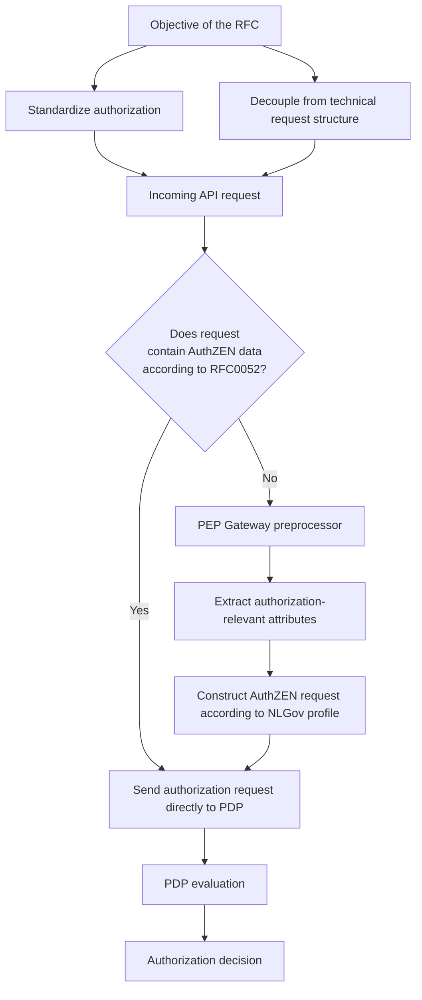

# Summary

Within the iWlz system, authorization currently depends on the technical structure of API requests, which leads to inconsistency and limited interoperability.  

This RFC proposes to explicitly extract authorization attributes in the PEP Gateway and translate them into a standardized authorization request in accordance with NLGov AuthZEN.  

This decouples authorization from implementation details and bases it on a uniform, explicit model.  

This makes authorization system-wide standardizable, interoperable, and better testable.

## Problem

The authorization decision is currently based on the full incoming API request, including GraphQL query structure, variables, and token. This creates a strong dependency between the technical representation of the request and the authorization logic.

In this RFC, it is proposed to configure the PEP Gateway according to the above schema.

For an incoming request, it is first determined whether the request already contains authorization data in accordance with RFC0052 (this document).

- If the request already contains an authorization request in accordance with RFC0052, this authorization information can be forwarded unchanged to the PDP for evaluation.
- If the request does not comply with RFC0052, then:
  - authorization-relevant information is extracted from the incoming request by means of a preprocessor in the PEP Gateway;
  - the preprocessor constructs a standardized authorization request based on this, in accordance with the NLGov AuthZEN standard as specified in this document;
  - this standardized authorization request is then submitted to the PDP for evaluation.

This achieves:

- decoupling from technical request structures;
- authorization based on an explicit and standardized model;
- increased interoperability between source holders and implementations;
- improved testability and reusability of authorization policy.

For implementing parties, this means:

- setting up a control mechanism to determine whether a request already complies with RFC0052;
- implementing a preprocessor in the PEP Gateway for requests that do not comply with RFC0052;
- using the standardized AuthZEN authorization request;
- setting up a mapping mechanism (service + operation → policy);
- adapting existing authorization implementations to the new model.

The NLGov AuthZEN standard only standardizes the interface between PEP and PDP and does not replace IAM functionality or a policy engine.

For illustration, a demo is available that shows what an AuthZEN request can look like according to the standard and profiling in this document. Additionally, a JSON Schema is available to make this authorization request machine-validatable.
