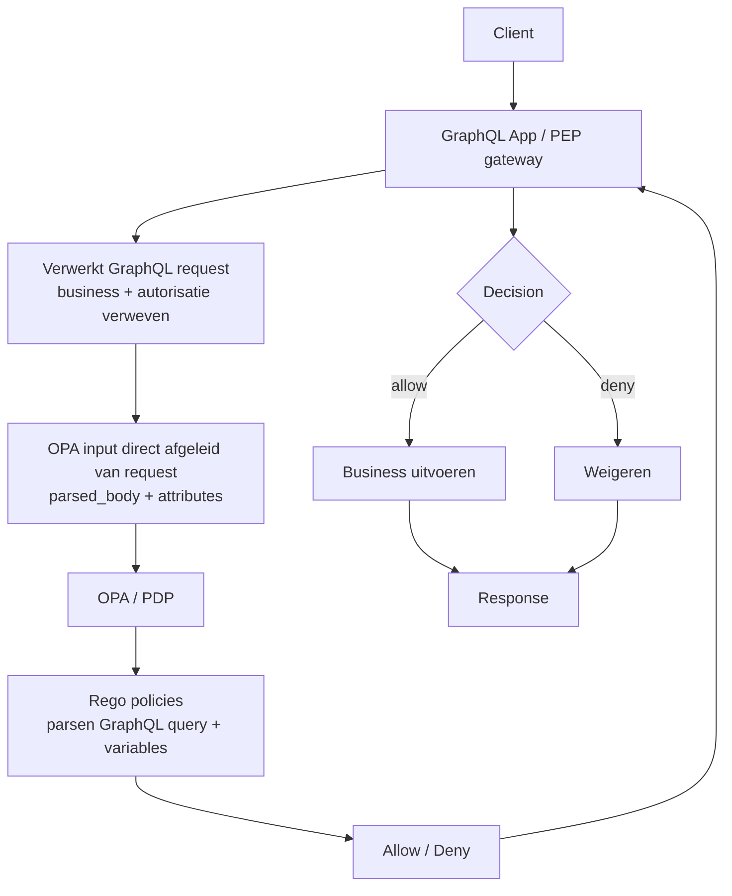
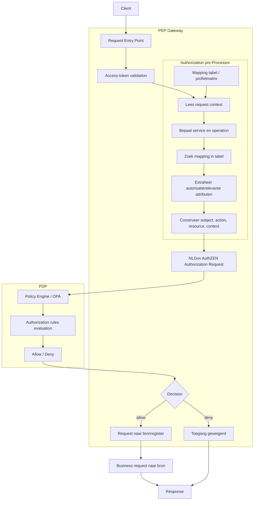

# Samenvatting


Autorisatie is binnen het landelijke zorgstelsel gepositioneerd als een generieke functie. Deze functie dient stelselbreed te functioneren, onafhankelijk te zijn van individuele applicaties, normeerbaar te zijn en interoperabel toegepast te kunnen worden. Deze uitgangspunten zijn vastgelegd in beleidskaders rondom generieke functies en komen tevens terug in het Twiin Vertrouwensmodel.

Binnen het iWlz-stelsel opereren meerdere bronhouders onder een gezamenlijk beleidskader. In deze context is impliciete of implementatie-specifieke interpretatie van autorisatie-attributen niet langer toereikend. Zonder standaardisatie ontstaat het risico op uiteenlopende implementaties van autorisatie, wat de interoperabiliteit en toetsbaarheid negatief beïnvloedt.

De policy-evaluatie vindt plaats bij de bronhouder (Policy Decision Point), terwijl de governance en herkomst van het autorisatiebeleid centraal worden beheerd door ZINL, conform de [deze](https://github.com/orgs/iStandaarden/projects/5/views/1?pane=issue&itemId=158015608&issue=iStandaarden%7CiWlz-RequestForComment%7C51)  RFC.

In de huidige situatie wordt het inkomende API-request (bijvoorbeeld een GraphQL-request) als één geheel verwerkt, waarbij businesslogica (de functionele aanvraag aan de bronhouder) en autorisatielogica (de beoordeling of deze aanvraag is toegestaan) met elkaar verweven zijn. Dit gecombineerde request wordt vervolgens als één JSON-document aangeboden aan de policy engine voor evaluatie.

Hierdoor wordt de autorisatiebeslissing gebaseerd op een input die sterk afhankelijk is van de technische representatie van het API-request, inclusief querystructuur, variabelen en filters. Dit leidt tot een ongewenste koppeling tussen businesslogica en autorisatielogica.

In dit voorstel wordt een expliciete scheiding aangebracht tussen:
- het businessrequest (de functionele vraag aan de bronhouder), en
- de autorisatievraag (de vraag of deze actie toegestaan is).

De Policy Enforcement Point (PEP) is verantwoordelijk voor het afleiden van een gestandaardiseerde autorisatievraag uit het inkomende request en het aanbieden daarvan aan de Policy Decision Point (PDP).

Het voorstel is om deze autorisatievraag te standaardiseren volgens de [NLGov AuthZEN Authorization API 1.0](https://www.logius.nl/actueel/publieke-consultatie-nlgov-authzen-authorization-api-v10) specificatie. Hiermee ontstaat een uniform autorisatiecontract tussen applicaties (Policy Enforcement Points) en de autorisatievoorziening (Policy Decision Points).

Dit leidt tot de volgende voordelen:
- Autorisatiebeslissingen worden gebaseerd op een gestandaardiseerd en expliciet model (subject, action, resource, context), in plaats van op implementatie-specifieke requeststructuren.
-	De koppeling tussen businesslogica en autorisatielogica wordt verminderd, waardoor bronhouders vrijer zijn in hun keuze voor API-technologieën (zoals GraphQL).
-	Autorisatiebeleid wordt beter herbruikbaar, toetsbaar en uitlegbaar binnen het stelsel.
-	Interoperabiliteit tussen verschillende partijen en implementaties wordt vergroot.

Belangrijk is dat:
-	NLGov AuthZEN geen vervanging is voor Identity & Access Management (IAM).
-	NLGov AuthZEN geen policy engines vervangt.
-	NLGov AuthZEN uitsluitend de interface standaardiseert tussen Policy Enforcement Points en Policy Decision Points, en daarmee governance biedt op de uitwisseling van autorisatievragen en -beslissingen.

Een mogelijke implementatiekeuze binnen API-technologieën zoals GraphQL is het gebruik van directives om expliciet aan te geven dat autorisatie moet worden toegepast. Dit is echter een implementatiedetail en valt buiten de scope van deze standaardisatie.


---

# 1. Inleiding

Autorisatie is binnen het landelijke zorgstelsel gepositioneerd als een generieke functie. Deze functie dient stelselbreed te functioneren, onafhankelijk te zijn van individuele applicaties, normeerbaar te zijn en interoperabel toegepast te kunnen worden. Deze uitgangspunten zijn verankerd in beleidskaders rondom generieke functies en worden onder meer bevestigd in het Twiin Vertrouwensmodel.

Binnen het iWlz-stelsel opereren meerdere bronhouders onder een gezamenlijk beleidskader. In deze context is het noodzakelijk dat autorisatie op een consistente en eenduidige wijze wordt toegepast. Wanneer autorisatie afhankelijk is van impliciete interpretaties of implementatie-specifieke invullingen, ontstaat het risico op uiteenlopende interpretaties van autorisatie-attributen. Dit kan leiden tot inconsistent gedrag, verminderde interoperabiliteit en beperkte toetsbaarheid van autorisatiebeslissingen binnen het stelsel.

In de huidige situatie wordt een inkomend API-request (bijvoorbeeld een GraphQL-request) als één geheel verwerkt, waarbij businesslogica (de functionele aanvraag aan een bronhouder) en autorisatielogica (de beoordeling of deze aanvraag is toegestaan) met elkaar verweven zijn. Dit gecombineerde request wordt vervolgens als input gebruikt voor policy-evaluatie. Hierdoor is de autorisatiebeslissing afhankelijk van de technische representatie van het request, zoals querystructuur, variabelen en filters, wat leidt tot een ongewenste koppeling tussen businesslogica en autorisatie.

Deze situatie staat haaks op het uitgangspunt dat autorisatie als generieke functie losgekoppeld moet zijn van individuele applicaties en implementaties. Om autorisatie stelselbreed consistent, herbruikbaar en toetsbaar te maken, is een expliciete scheiding nodig tussen de businessvraag en de autorisatievraag.

Dit document beschrijft een voorstel om deze scheiding te realiseren door de autorisatievraag te standaardiseren. De Policy Enforcement Point (PEP) is hierbij verantwoordelijk voor het afleiden van een gestandaardiseerde autorisatievraag uit het inkomende request, terwijl de Policy Decision Point (PDP) deze vraag evalueert op basis van centraal beheerd autorisatiebeleid.

Voor de standaardisatie van deze autorisatievraag wordt aansluiting gezocht bij de NLGov AuthZEN Authorization API 1.0 specificatie. Deze standaard definieert een uniform autorisatiecontract tussen PEP en PDP, gebaseerd op een expliciet model van subject, action, resource en context. Door deze standaard toe te passen wordt de koppeling tussen businesslogica en autorisatielogica verminderd en ontstaat een consistente en interoperabele manier om autorisatiebeslissingen binnen het stelsel te realiseren.

# 2. Probleemstelling


Binnen het iWlz-stelsel wordt autorisatie toegepast in een context waarin meerdere bronhouders opereren onder een gezamenlijk beleidskader. Hoewel autorisatie als generieke functie stelselbreed consistent en onafhankelijk van applicaties moet functioneren, blijkt in de huidige situatie dat de implementatie van autorisatie sterk verweven is met de technische invulling van individuele API’s.

Concreet wordt een inkomend API-request (bijvoorbeeld een GraphQL-request) momenteel als één gecombineerd geheel verwerkt, waarin zowel businesslogica (de functionele vraag aan de bronhouder) als autorisatielogica (de beoordeling of deze vraag is toegestaan) zijn opgenomen. Dit gecombineerde request wordt als input aangeboden aan de policy engine voor evaluatie.

Hierdoor ontstaan de volgende knelpunten:

- Verwevenheid van business- en autorisatielogica; Autorisatiebeslissingen zijn direct afhankelijk van de structuur en inhoud van het API-request, zoals query-opbouw, variabelen en filters. Hierdoor ontstaat een ongewenste koppeling tussen businesslogica en autorisatielogica.
- Gebrek aan standaardisatie van de autorisatievraag; Er is geen uniform model voor de autorisatievraag tussen Policy Enforcement Points (PEP) en Policy Decision Points (PDP). Iedere implementatie bepaalt zelf hoe autorisatie-attributen worden afgeleid en aangeboden, wat leidt tot inconsistente interpretaties.
- Beperkte interoperabiliteit tussen bronhouders; Door het ontbreken van een gestandaardiseerd autorisatiecontract kunnen verschillende bronhouders autorisatie op uiteenlopende wijze implementeren, wat de stelselbrede interoperabiliteit belemmert.
- Beperkte herbruikbaarheid en toetsbaarheid van beleid; Autorisatiebeleid is gekoppeld aan specifieke API-structuren en daardoor moeilijk herbruikbaar. Daarnaast wordt het lastiger om autorisatiebeslissingen consistent te toetsen en te verantwoorden.
- Afhankelijkheid van technische implementatiedetails; De policy-evaluatie is afhankelijk van implementatiespecifieke requestrepresentaties (zoals GraphQL-structuren), in plaats van een expliciet en technologie-onafhankelijk autorisatiemodel.

Deze situatie staat haaks op het uitgangspunt dat autorisatie als generieke functie losgekoppeld, normeerbaar en interoperabel moet zijn. Zonder een expliciete scheiding tussen businesslogica en autorisatielogica en zonder standaardisatie van de autorisatievraag blijft het risico bestaan op fragmentatie van autorisatie-implementaties binnen het stelsel.


# 3. Architectuurprincipes

Autorisatie binnen het iWlz-stelsel moet voldoen aan de volgende architectuurprincipes:

- **Scheiding van verantwoordelijkheden**; De verantwoordelijkheid voor policy enforcement, policy decision en policy governance moet expliciet zijn gescheiden. Het Policy Enforcement Point (PEP) is verantwoordelijk voor het afdwingen van autorisatiebesluiten bij de applicatie of gateway. Het Policy Decision Point (PDP) is verantwoordelijk voor het nemen van autorisatiebesluiten. De governance op het autorisatiebeleid is centraal belegd bij ZINL.
- **Standaardisatie van autorisatieverzoeken**; Autorisatieverzoeken tussen PEP en PDP moeten via een uniforme en gestandaardiseerde interface verlopen, zodat autorisatiebesluiten op consistente wijze kunnen worden aangevraagd en verwerkt.
- **Loskoppeling van policy-engine en interface**; De interface tussen PEP en PDP moet onafhankelijk zijn van de onderliggende policy-engine. De implementatie van het PDP moet verwisselbaar zijn, zonder dat dit impact heeft op de applicaties of gateways die autorisatiebesluiten opvragen.
- **Stelselbrede interoperabiliteit**; Bronhouders en andere stelselpartijen moeten dezelfde autorisatie-interface en semantiek hanteren, zodat autorisatie stelselbreed consistent, uitlegbaar en interoperabel kan worden toegepast.


# 4. Huidige situatie

De huidige situatie is gebaseerd op één GraphQL-request, waarbij de input voor de policy-evaluatie direct wordt afgeleid van het volledige request en als JSON-document wordt aangeboden aan de Open Policy Agent (OPA).

OPA evalueert deze input op basis van de in de policy bundle gedefinieerde Rego-policies en de bijbehorende policy-structuur. Hierbij worden zowel requestattributen als elementen uit de GraphQL-query, zoals variabelen en filters, betrokken in de autorisatiebeslissing.

In deze opzet is geen expliciete scheiding aanwezig tussen businesslogica en autorisatielogica. Beide zijn impliciet verweven in de input voor de policy-evaluatie, waardoor autorisatiebeslissingen afhankelijk zijn van de technische representatie van het API-request.

OPA fungeert in deze architectuur als Policy Decision Point (PDP).




# 5. Doelarchitectuur

Het is wenselijk om een expliciete scheiding aan te brengen tussen businesslogica en autorisatielogica.
Daartoe wordt voorgesteld dat de implementerende partij binnen de Policy Enforcement Point (PEP)-gateway voorziet in een pre-processing functie.

Deze pre-processing functie is verantwoordelijk voor het onderscheiden van het businessrequest (de functionele aanvraag aan de bronhouder) en de daaruit af te leiden autorisatievraag.

De implementerende partij is vrij in de keuze van technologie voor deze functionaliteit, mits wordt voldaan aan de volgende uitgangspunten:
- Er wordt een duidelijke scheiding gerealiseerd tussen businesslogica en autorisatielogica.
-	De autorisatievraag wordt opgebouwd conform de [NLGov AuthZEN Authorization API 1.0 specificatie](https://www.logius.nl/actueel/publieke-consultatie-nlgov-authzen-authorization-api-v10) zoals in Hoofdstuk 6 omschreven.

In het kader van stelselbrede interoperabiliteit dient de oplossing niet beperkt te zijn tot één specifieke API-technologie. Naast GraphQL-requests moeten ook andere API-protocollen ondersteund kunnen worden.

Hierbij geldt:
-	Voor GraphQL kan gebruik worden gemaakt van expliciete autorisatie-aanduidingen, zoals directives, om te signaleren dat voor een bepaalde operatie een autorisatiebesluit vereist is conform de NLGov AuthZEN-specificatie zoals in Hoofdstuk 6 omschreven.
-	Voor andere API-protocollen (zoals REST of gRPC) wordt deze informatie afgeleid uit bijvoorbeeld endpoints, methoden, metadata of configuratie, waarbij een mappingmechanisme wordt toegepast dat aansluit bij het autorisatiemodel van de NLGov AuthZEN Authorization API 1.0 zoals in Hoofdstuk 6 omschreven.

De wijze waarop de pre-processing functie deze informatie herkent en interpreteert is een implementatiedetail. De standaardisatie richt zich uitsluitend op de autorisatievraag die door de PEP aan de Policy Decision Point (PDP) wordt aangeboden.

## 5.1 Doelarchitectuur 




# 6. Autorisatiecontract (AuthZEN)

Dit hoofdstuk beschrijft het autorisatiecontract tussen de Policy Enforcement Point (PEP) en de Policy Decision Point (PDP).

Het doel van dit autorisatiecontract is om autorisatieverzoeken op een gestandaardiseerde, expliciete en technologie-onafhankelijke wijze uit te wisselen. Hiermee wordt voorkomen dat autorisatiebeslissingen afhankelijk zijn van implementatiespecifieke requeststructuren, zoals GraphQL-query’s, REST-endpoints of andere technische representaties van een businessrequest.

Het autorisatiecontract is gebaseerd op de OpenID AuthZEN Authorization API 1.0 specificatie en wordt in dit document verder geprofileerd op basis van de NLGov AuthZEN Authorization API 1.0 specificatie en de functionele behoeften van het iWlz-stelsel.

De opbouw is als volgt:

- **6.1 OpenID AuthZEN 1.0**  
  Beschrijft het generieke model voor autorisatieverzoeken.
- **6.2 NLGov AuthZEN 1.0**  
  Beschrijft de Nederlandse profilering van dit model.
- **6.3 Voorbeeld**  
  Toont een concreet voorbeeld van een iWlz-conform autorisatieverzoek.

---

## 6.1 OpenID AuthZEN 1.0

De [OpenID AuthZEN Authorization API 1.0 specificatie](https://openid.net/wg/authzen/specifications/) definieert een generiek model voor het uitwisselen van autorisatieverzoeken tussen een Policy Enforcement Point (PEP) en een Policy Decision Point (PDP).

Binnen deze specificatie bestaat een autorisatieverzoek conceptueel uit vier elementen:

- `subject`
- `action`
- `resource`
- `context`

Conceptueel ziet dit model er als volgt uit:

```json
{
  "subject": {},
  "action": {},
  "resource": {},
  "context": {}
}
```

| Element | Betekenis |
|---|---|
| `subject` | De actor die toegang vraagt |
| `action` | De handeling die de actor wil uitvoeren |
| `resource` | Het object of de gegevens waarop de handeling betrekking heeft |
| `context` | Aanvullende omstandigheden waaronder het verzoek plaatsvindt |

De OpenID AuthZEN specificatie is bewust generiek opgezet. De specificatie definieert de structuur van een autorisatieverzoek, maar schrijft geen domeinspecifieke attributen, sectorale semantiek of verplichte codelijsten voor. Aanvullende profilering is daarom noodzakelijk om binnen een specifiek domein, zoals het iWlz-stelsel, tot interoperabele en toetsbare implementaties te komen.

## 6.2 NLGov AuthZEN 1.0

De [NLGov AuthZEN Authorization API 1.0 specificatie](https://www.logius.nl/actueel/publieke-consultatie-nlgov-authzen-authorization-api-v10) is een profiel op de [OpenID AuthZEN Authorization 1.0 specificatie](https://openid.net/wg/authzen/specifications/), specifiek voor Nederlandse overheidsinstellingen.

De OpenID AuthZEN specificatie definieert een generiek model voor autorisatieverzoeken bestaande uit `subject`, `action`, `resource` en `context`, maar legt geen semantiek of verplichte attributen vast.

De NLGov AuthZEN specificatie profileert dit model door:

- Structuur: autorisatieverzoeken MUST voldoen aan een vastgesteld profiel
- Subject: gestandaardiseerde identity-attributen
- Action: een beperkte, afgesproken set van acties
- Resource: domeinspecifieke structuur
- Context: verplicht en semantisch ingevuld
- Governance: stelselafspraken (Logius)

De onderstaande specificaties vormen een **iWlz-profiel op NLGov AuthZEN**, gebaseerd op de huidige REGO policies binnen de iWlz-sector.

---

## 6.2.1 Subject

Het `subject` object beschrijft de actor die toegang vraagt.

| Attribuut | Verplicht | Bron | Opmerking |
|---|---|---|---|
| id | MUST | token.sub | Unieke identificatie van de actor |
| organization_type | MUST | token | ZORGKANTOOR, ZORGAANBIEDER, CIZ, VECOZO, BURGER, TOEZICHTHOUDER, KETENPARTNER, SYSTEEM |
| roles | MUST | token | BEMIDDELAAR, INDICATIESTELLER, ZORGVERLENER, UITVOERDER, REGIEVOERDER, AANVRAGER, RAADPLEGER, MUTATOR, BESLISSER, GOEDKEURDER, CONTROLEUR, AUDITOR, TOEZICHTHOUDER |
| identifiers.uzovi_code | CONDITIONAL | token | MUST aanwezig zijn indien organization_type = ZORGKANTOOR |
| identifiers.agb_code | CONDITIONAL | token | MUST aanwezig zijn indien organization_type = ZORGAANBIEDER |
| region | MUST | token / PIP | NOORD, GRONINGEN, FRIESLAND, DRENTHE, TWENTE, ACHTERHOEK, MIDDEN_IJSSEL, ARNHEM, NIJMEGEN, UTRECHT, NOORD_HOLLAND, ZUID_HOLLAND, ZEELAND, BRABANT, LIMBURG |

---

## 6.2.2 Action

Het `action` veld beschrijft de gewenste handeling.

| Waarde | Betekenis |
|---|---|
| read | Raadplegen |
| write | Muteren |
| execute | Procesactie |
| approve | Besluitvorming |

Het veld `action` MUST één van bovenstaande waarden bevatten.

---

## 6.2.3 Resource

Het `resource` object beschrijft het object waarop de actie wordt uitgevoerd.

| Attribuut | Verplicht | Waarden / Voorbeeld | Opmerking |
|---|---|---|---|
| type | MUST | WLZ_INDICATIE, BEMIDDELING, CLIENT, etc. | Type resource |
| id | CONDITIONAL | "123" | MUST aanwezig zijn bij specifieke raadpleging |
| owner | SHOULD | CIZ, zorgkantoor1 | Eigenaar van resource (indien relevant) |
| region | MUST | zie codelijst regio | Regionale context |
| sensitivity | MUST | LOW, NORMAL, HIGH | Gevoeligheid |
| path | OPTIONAL | /graphql | Technisch endpoint |
| method | OPTIONAL | POST | HTTP methode |

---

## 6.2.4 Context

Het `context` object beschrijft de omstandigheden en het doel van het verzoek.

| Attribuut | Verplicht | Waarden | Opmerking |
|---|---|---|---|
| purpose_of_use | MUST | WLZ_UITVOERING, INDICATIESTELLING, ZORGTOEWIJZING, BEMIDDELING, DECLARATIE, CONTROLE, TOEZICHT, ADMINISTRATIE, RAPPORTAGE, AUDIT, TEST | Doelbinding (AVG) |
| service | MUST | zie service codelijst | Functionele dienst |
| operation | MUST | zie operation codelijst | Business-operatie |
| relation | MUST | WLZ_EXECUTION | Ketenrelatie |
| contract_active | MUST | true/false | Contractstatus |
| requested_at | MUST | ISO 8601 timestamp | Tijdstip van verzoek |

---

### 6.2.5 Service (codelijst)

Het veld `context.service` identificeert de functionele dienst waarop het verzoek betrekking heeft.

| Waarde | Betekenis |
|---|---|
| INDICATIEREGISTER | Raadplegen en beheren van WLZ indicaties |
| BEMIDDELINGSREGISTER | Bemiddelingsinformatie tussen partijen |
| CLIENTREGISTER | Cliëntgegevens binnen WLZ |
| ZORGTOEWIJZINGSSERVICE | Toewijzen van zorg aan cliënten |
| DECLARATIEREGISTER | Declaraties en financiële afhandeling |
| CONTRACTREGISTER | Contractuele relaties tussen partijen |
| RELATIEREGISTER | Relaties tussen organisaties |
| TOEZICHTSERVICE | Toezicht en controleprocessen |

Het veld `service` MUST één van bovenstaande waarden bevatten.

---

## 6.2.6 Operation (codelijst)

Het veld `context.operation` identificeert de specifieke business-operatie binnen een service.

### INDICATIEREGISTER

| Waarde | Betekenis |
|---|---|
| raadpleegIndicatie | Opvragen van een specifieke indicatie |
| zoekIndicaties | Zoeken naar indicaties |
| controleerIndicatieStatus | Controleren status van indicatie |

---

### BEMIDDELINGSREGISTER

| Waarde | Betekenis |
|---|---|
| raadpleegBemiddeling | Opvragen bemiddelingsgegevens |
| wijzigBemiddeling | Wijzigen bemiddeling |
| startBemiddeling | Starten bemiddeling |

---

### CLIENTREGISTER

| Waarde | Betekenis |
|---|---|
| raadpleegClient | Opvragen cliëntgegevens |
| wijzigClient | Wijzigen cliëntgegevens |

---

### ZORGTOEWIJZINGSSERVICE

| Waarde | Betekenis |
|---|---|
| raadpleegToewijzing | Opvragen zorgtoewijzing |
| wijzigToewijzing | Aanpassen zorgtoewijzing |

---

### DECLARATIEREGISTER

| Waarde | Betekenis |
|---|---|
| indienDeclaratie | Indienen declaratie |
| raadpleegDeclaratie | Opvragen declaratie |
| controleerDeclaratie | Controleren declaratie |

---

### CONTRACTREGISTER

| Waarde | Betekenis |
|---|---|
| raadpleegContract | Opvragen contract |
| wijzigContract | Wijzigen contract |

---

### RELATIEREGISTER

| Waarde | Betekenis |
|---|---|
| raadpleegRelatie | Opvragen relatie |
| wijzigRelatie | Wijzigen relatie |

---

### TOEZICHTSERVICE

| Waarde | Betekenis |
|---|---|
| voerControleUit | Uitvoeren controle |
| raadpleegAudit | Opvragen auditinformatie |

---

## 6.2.7 Normatieve regels voor service en operation

- `context.service` MUST een waarde uit de service-codelijst bevatten  
- `context.operation` MUST behoren tot de set van operations binnen de gekozen service  
- De combinatie `service + operation` MUST geldig zijn volgens deze specificatie  
- Een operation MUST NOT gebruikt worden buiten de bijbehorende service  
- Requests met ongeldige combinaties MUST worden afgewezen (default deny)

---

## 6.3 Voorbeeld

Onderstaand voorbeeld toont een AuthZEN-conform verzoek waarbij een zorgkantoor een CIZ-indicatie raadpleegt.

```json
{
  "subject": {
    "id": "zorgkantoor2",
    "organization_type": "ZORGKANTOOR",
    "roles": ["RAADPLEGER"],
    "identifiers": {
      "uzovi_code": "5500"
    },
    "region": "UTRECHT"
  },
  "action": "read",
  "resource": {
    "type": "WLZ_INDICATIE",
    "id": "indicatie-987654",
    "owner": "CIZ",
    "region": "UTRECHT",
    "sensitivity": "HIGH"
  },
  "context": {
    "purpose_of_use": "WLZ_UITVOERING",
    "service": "INDICATIEREGISTER",
    "operation": "raadpleegIndicatie",
    "relation": "WLZ_EXECUTION",
    "contract_active": true,
    "requested_at": "2026-03-22T10:00:00Z"
  }
}
```


# 7. Terminologie

| ***Term*** | ***Omschrijving*** |
|---|---|
| PEP | Policy Enforcement Point; Handhaving autorisatie (entrypoint) |
| PAP | Policy Administration Point; Beheer autorisatiebeleid, publiceert policies  |
| PRP | Policy Retrieval Point; Stelt policies beschikbaar aan PDP's |
| PIP | Policy Information Point; Levert attributen en contextinformatie voor autorisatiebesluiten |
| PDP | Policy Decision Point; Evalueert policies en neemt het autorisatiebesluit |
| AuthZEN | Authorization API standaard |
| OPA | Open Policy Agent |
| TWIIN | Transport, Wisselwerking, Informatie, In Netwerken |


# 8. Referenties

- [GEN_FUNC_AUTORISEREN] Ist en soll - onderzoek voor de generieke functie Autoriseren, Open Overheid: https://open.overheid.nl/documenten/423d14f1-5228-4dd1-b79f-97a78b58eff5/file
- [TWIIN_VERTRAUWENSMODEL] Twiin Vertrouwensmodel: https://www.twiin.nl/twiin-vertrouwensmodel
- [TWIIN_BEGRIP_VERTRAUWENSMODEL] Begrip: Twiin Vertrouwensmodel, Twiin Afsprakenstelsel: https://afsprakenstelsel.twiin.nl/normatief/ta140/begrip-twiin-vertrouwensmodel
- [AUTHZEN_FINAL] OpenID Authorization API 1.0 Final Specification: https://openid.net/specs/authorization-api-1_0.html
- [AUTHZEN_FINAL_APPROVAL] OpenID Authorization API 1.0 Final Specification Approved: https://openid.net/authorization-api-1-0-final-specification-approved/
- [NLGOV_AUTHZEN] NLGov Profile for OpenID AuthZEN Authorization API: https://logius-standaarden.github.io/authzen-nlgov/
- [OPA] Open Policy Agent: https://www.openpolicyagent.org/
- [RFC_STATUS] Status RFC: https://github.com/iStandaarden/iWlz-RequestForComment/issues/52