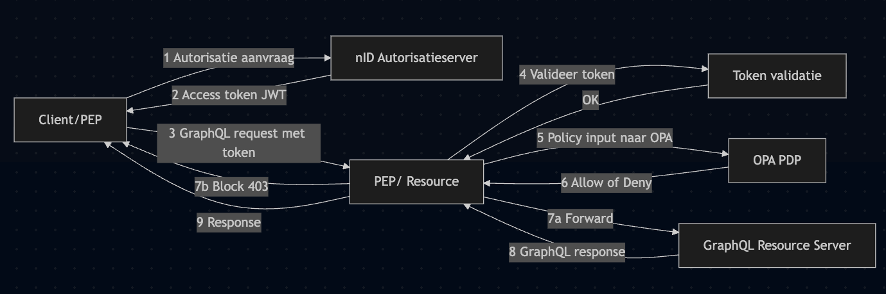
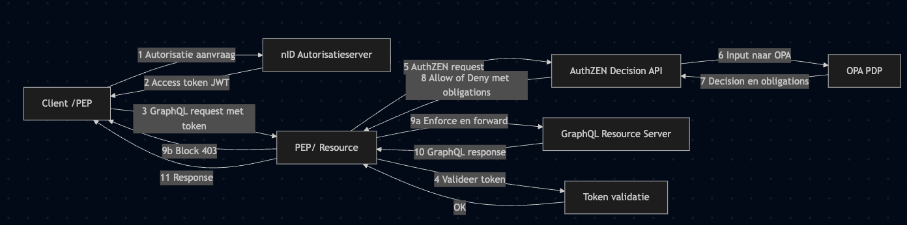
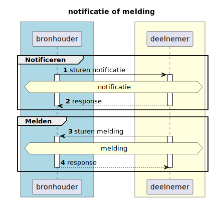

# RFC0052 - Authorisatie standaardisatie

<font size="4">**SAMENVATTING**</font>

Autorisatie is binnen het landelijke zorgstelsel gepositioneerd als generieke functie: zij moet stelselbreed functioneren, onafhankelijk zijn van individuele applicaties, normeerbaar zijn en interoperabel toegepast kunnen worden. Deze uitgangspunten komen terug in beleidskaders rond generieke functies en in het Twiin Vertrouwensmodel, waarin autorisatie afhankelijk is van identiteit, organisatiecontext, rol en doelbinding.

De inzet van Open Policy Agent (OPA) ondersteunt deze architectuurprincipes door autorisatie los te koppelen van applicaties en te positioneren als zelfstandig Policy Decision Point (PDP). OPA faciliteert centrale en controleerbare beleidsbesluitvorming.

In een context met één bronhouder is een technische PDP-implementatie doorgaans voldoende, omdat de semantiek van autorisatie-attributen intern eenduidig is afgestemd. Binnen het iWlz-stelsel opereren echter meerdere bronhouders onder een gezamenlijk beleidskader. In deze multi-bronhoudercontext is impliciete afstemming niet langer voldoende en ontstaat risico op uiteenlopende interpretaties van autorisatiegegevens.

Een loutere PDP-technologie is daarom onvoldoende. Autorisatie vereist een expliciet en gedeeld autorisatiebeleid, vastgelegd in een gestandaardiseerd autorisatiecontract waarin semantiek, structuur en besluitvormingscriteria uniform zijn gedefinieerd. Een modelmatige benadering zoals AuthZEN biedt hiervoor het normatieve kader. OPA fungeert in dit model als uitvoerende component; het autorisatiebeleid vormt de stelselmatige basis voor consistente, interoperabele en toetsbare besluitvorming.


**Huidige situatie:**


```
flowchart LR
  C[Client/PEP]
  AS[nID Autorisatieserver]
  PEP[PEP/ Resource]
  PDP[OPA PDP]
  RS[GraphQL Resource Server]
  V[Token validatie]

  C -->|1 Autorisatie aanvraag| AS
  AS -->|2 Access token JWT| C
  C -->|3 GraphQL request met token| PEP
  PEP -->|4 Valideer token| V
  V -->|OK| PEP
  PEP -->|5 Policy input naar OPA| PDP
  PDP -->|6 Allow of Deny| PEP
  PEP -->|7a Forward| RS
  PEP -->|7b Block 403| C
  RS -->|8 GraphQL response| PEP
  PEP -->|9 Response| C
```

**Beoogde situatie**



```
flowchart LR
  C[Client /PEP]
  AS[nID Autorisatieserver]
  PEP[PEP/ Resource]
  AZ[AuthZEN Decision API]
  PDP[OPA PDP]
  RS[GraphQL Resource Server]
  V[Token validatie]

  C -->|1 Autorisatie aanvraag| AS
  AS -->|2 Access token JWT| C

  C -->|3 GraphQL request met token| PEP

  PEP -->|4 Valideer token| V
  V -->|OK| PEP

  PEP -->|5 AuthZEN request| AZ
  AZ -->|6 Input naar OPA| PDP
  PDP -->|7 Decision en obligations| AZ
  AZ -->|8 Allow of Deny met obligations| PEP

  PEP -->|9a Enforce en forward| RS
  PEP -->|9b Block 403| C

  RS -->|10 GraphQL response| PEP
  PEP -->|11 Response| C

```

Volg deze [link](https://github.com/iStandaarden/..) om de actuele status van deze RFC te bekijken.

---
**Inhoudsopgave**
- [\<TITEL - RFC\>](#titel---rfc)
- [1. Inleiding](#1-inleiding)
  - [1.1. Uitgangspunten](#11-uitgangspunten)
  - [1.2 Relatie andere RFC](#12-relatie-andere-rfc)
- [2. Terminologie](#2-terminologie)
- [plant-uml embedding](#plant-uml-embedding)

---
# 1. Inleiding

In de Kamerbrieven over Generieke Functies wordt autorisatie expliciet benoemd als een generieke functie die:
- Stelselbreed moet functioneren
- Onafhankelijk van individuele applicaties moet zijn
- Normeerbaar moet zijn
- Interoperabel moet zijn

Autorisatie mag niet “hardcoded” in applicaties zitten. Het moet losgekoppeld, herbruikbaar en toetsbaar zijn.

De keuze voor Open Policy Agent (OPA) ondersteunt deze uitgangspunten. OPA faciliteert:
- centrale policy-besluitvorming;
- scheiding van policy en applicatielogica;
- versiebeheer en controleerbaarheid van beleidsregels;
- positionering van autorisatie als zelfstandig Policy Decision Point (PDP).

Hiermee wordt invulling gegeven aan autorisatie als generieke functie op technisch niveau.

In een situatie met één bronhouder vormt de afwezigheid van een gestandaardiseerd autorisatiebeslismodel doorgaans geen probleem. Binnen één organisatie zijn semantiek, governance en interpretatie van autorisatie-attributen impliciet afgestemd. De betekenis van rollen, organisatiecontext en doelbinding is intern eenduidig vastgelegd, en audit- en loggingmechanismen zijn uniform ingericht.

In deze context volstaat een technische implementatie van een Policy Decision Point (PDP), zoals Open Policy Agent (OPA), omdat de semantische interpretatie van het inputdocument binnen dezelfde organisatorische context plaatsvindt. De structuur van het autorisatieverzoek hoeft niet expliciet genormeerd te zijn; de betekenis ervan is immers impliciet gedeeld.

Binnen het iWlz-stelsel is deze impliciete afstemming echter niet aanwezig. Meerdere bronhouders opereren onder een gezamenlijk beleidskader, maar met eigen systemen en implementaties. Een loutere inzet van OPA – waarbij alleen een generiek JSON-inputdocument wordt geëvalueerd – is in dat geval onvoldoende om uniforme en interoperabele autorisatiebesluiten te garanderen.

OPA biedt een uitvoeringsmechanisme voor beleidsregels, maar definieert geen normatief autorisatiemodel. Zonder expliciet vastgelegd autorisatiebeleid dat beschrijft:
- welke attributen verplicht onderdeel zijn van een autorisatiebesluit;
- hoe deze attributen semantisch moeten worden geïnterpreteerd;
- welke contextuele elementen (zoals rol, organisatie, behandelrelatie en doelbinding) minimaal moeten worden meegewogen;
- hoe een autorisatiebesluit eenduidig wordt gestructureerd en teruggekoppeld.

Zonder expliciete standaardisatie van deze elementen ontstaat variatie in interpretatie tussen bronhouders. Dit belemmert interoperabiliteit, beperkt hergebruik van policies en maakt uniforme governance en audit complex.

In een stelselcontext vereist autorisatie daarom méér dan een technische PDP-implementatie. Er is een expliciet en gedeeld autorisatiebeleid nodig — vormgegeven in een gestandaardiseerd autorisatiecontract — waarin de semantiek, structuur en besluitvormingscriteria uniform zijn vastgelegd. Een modelmatige benadering, zoals voorzien in AuthZEN, biedt hiervoor een normatief kader.

De PDP (zoals OPA) fungeert in dit model als uitvoerende component. Het autorisatiebeleid en het autorisatiecontract vormen de stelselmatige basis. Alleen in deze combinatie kan autorisatie consistent, interoperabel en conform de generieke functie binnen het iWlz-stelsel worden gerealiseerd.


## 1.1. Uitgangspunten
>```uitgangspunten```

## 1.2 Relatie andere RFC
Deze RFC heeft een relatie met de volgende RFC(s)
|RFC | onderwerp | relatie<sup>*</sup> | toelichting |issue |
|:--|:--|:--| :--|:--|
|[0008](RFC/RFC0008%20-%20Notificaties%20en%20Abonnementen.md) | Notificaties en abonnement | voorwaardelijk | <ul><li>Er is een **Service Directory** waarin notificatietypen gepubliceerd kunnen worden.</li> <li>Netwerkdeelnemers raadplegen de **Service Directory** om op te halen welke abonnementen geplaatst kunnen worden en welke voorwaarden hier aan zitten. </li></ul>|[#2](https://github.com/iStandaarden/iWlz-RFC/issues/2) |

<sup>*</sup>voorwaardelijk, *voor andere RFC* / afhankelijk, *van andere RFC*


# 2. Terminologie
Opsomming van de in dit document gebruikte termen.

| Terminologie | Omschrijving |
| :-------- | :-------- | 
| *term* | *beschrijving/uitleg* | 

# plant-uml embedding
Neem een verwijzing op naar het gegenereerde diagram
 ```
    
```

verberg de plant-Uml source tussen de tags: 

    <details>
     <summary>plantUML-source</summary>
    
     ```plantuml
     @startuml rfc008-01-notificatie_melding
     <plant-uml-source> 
     
    ```
     </details>
