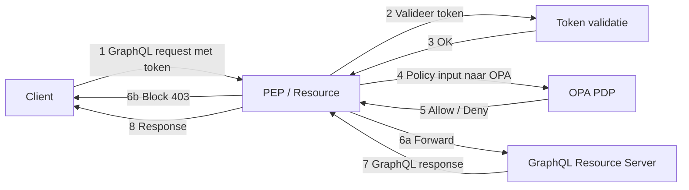
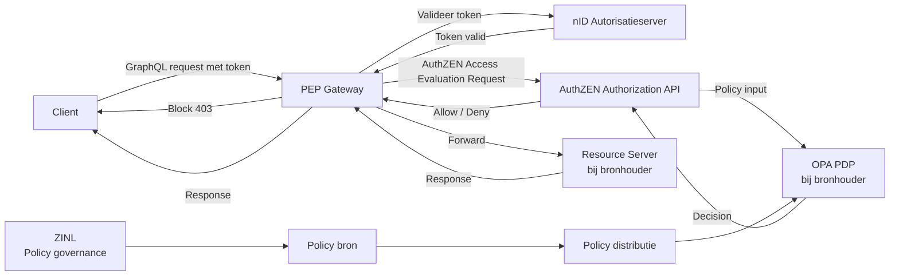
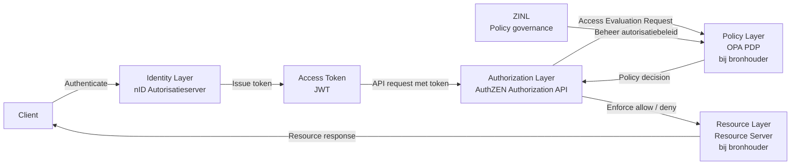

# Samenvatting

Autorisatie is binnen het landelijke zorgstelsel gepositioneerd als een generieke functie. Zij moet stelselbreed functioneren, onafhankelijk zijn van individuele applicaties, normeerbaar zijn en interoperabel toegepast kunnen worden. Deze uitgangspunten komen terug in beleidskaders rond generieke functies en in het Twiin Vertrouwensmodel.

Binnen het iWlz-stelsel opereren meerdere bronhouders onder een gezamenlijk beleidskader. Hierdoor ontstaat een situatie waarin impliciete interpretatie van autorisatie-attributen niet langer voldoende is en uiteenlopende implementaties kunnen ontstaan.

Deze RFC stelt voor om autorisatieverzoeken te standaardiseren via de OpenID AuthZEN Authorization API 1.0. Hierdoor ontstaat een uniform autorisatiecontract tussen applicaties (Policy Enforcement Points) en de autorisatievoorziening (Policy Decision Point).

In de voorgestelde architectuur vindt policy-evaluatie plaats bij de bronhouder, terwijl de bron en governance van het autorisatiebeleid centraal wordt beheerd door ZINL. Hierdoor ontstaat een federatief model waarin bronhouders verantwoordelijk blijven voor autorisatiebesluiten op hun eigen resources, terwijl stelselbrede beleidsconsistentie wordt geborgd.

De Open Policy Agent (OPA) kan in deze architectuur fungeren als uitvoerende policy-engine, terwijl AuthZEN de gestandaardiseerde autorisatie-interface definieert.

Belangrijk:

- AuthZEN vervangt geen IAM.
- AuthZEN vervangt geen policy engines.
- AuthZEN standaardiseert uitsluitend de interface tussen Policy Enforcement Points en Policy Decision Points.

---

# 1. Inleiding

In de Kamerbrieven over Generieke Functies wordt autorisatie expliciet benoemd als een generieke functie die:
- stelselbreed moet functioneren
- onafhankelijk van individuele applicaties moet zijn
- normeerbaar moet zijn
- interoperabel moet zijn

Autorisatie mag daarom niet “hardcoded” in applicaties worden geïmplementeerd. Het moet losgekoppeld, herbruikbaar en toetsbaar zijn.

De inzet van Open Policy Agent (OPA) ondersteunt deze architectuurprincipes door autorisatie los te koppelen van applicaties en te positioneren als zelfstandig Policy Decision Point (PDP).

OPA faciliteert:
- centrale policy-besluitvorming
- scheiding van policy en applicatielogica
-	versiebeheer van beleidsregels
-	audit en controleerbaarheid van autorisatiebesluiten

Hiermee wordt invulling gegeven aan autorisatie als generieke functie op technisch niveau.

# 2. Probleemstelling

## 2.1 Single-bronhoudercontext

In een situatie met één bronhouder vormt de afwezigheid van een gestandaardiseerd autorisatiebeslismodel doorgaans geen probleem.

Binnen één organisatie zijn:
- semantiek van rollen
-	interpretatie van attributen
-	governance
-	logging

impliciet afgestemd. Een technische PDP-implementatie zoals OPA is in deze context vaak voldoende.

## 2.2 Multi-bronhoudercontext

Binnen het iWlz-stelsel opereren echter meerdere bronhouders onder een gezamenlijk beleidskader.

In deze situatie:
-	ontstaan verschillende interpretaties van autorisatie-attributen
-	kunnen implementaties uiteenlopen
-	wordt hergebruik van policies beperkt

Een loutere inzet van OPA — waarbij een generiek JSON-document wordt geëvalueerd — is daarom onvoldoende om uniforme autorisatiebesluiten te garanderen.

## 2.3 Gevolg

Zonder expliciet vastgelegd autorisatiecontract ontstaat variatie in:
-	attributenstructuur
-	semantische interpretatie
-	besluitvorming

Dit belemmert:
-	interoperabiliteit
-	governance
-	audit


# 3. Architectuurprincipes

Autorisatie binnen het iWlz-stelsel moet voldoen aan de volgende principes:

1.	Scheiding van verantwoordelijkheden; PEP → enforcement (bij applicatie of gateway), PDP → policy decision (bij bronhouder), Policy governance → centraal bij ZINL
1.	Standaardisatie van autorisatieverzoeken; Applicaties moeten een autorisatiebesluit opvragen via een uniforme interface.
1.	Loskoppeling van policy-engine; De implementatie van het PDP moet verwisselbaar zijn.
1.	Stelselbrede interoperabiliteit; Bronhouders moeten dezelfde autorisatie-interface gebruiken.

# 4. Huidige situatie

In de huidige situatie wordt autorisatie per applicatie geïmplementeerd.



In deze situatie bestaat geen gestandaardiseerd autorisatiecontract.

# 5. Doelarchitectuur

De doelarchitectuur introduceert een gestandaardiseerde autorisatie-interface tussen applicaties en de autorisatievoorziening.

De policy-evaluatie vindt plaats bij de bronhouder, terwijl de bron van het autorisatiebeleid en de governance daarop centraal wordt beheerd door ZINL.




De PEP-gateway construeert via een request builder een AuthZEN Access Evaluation Request conform de AuthZEN Authorization API specificatie.


# 6. Autorisatiecontract (AuthZEN)

De OpenID AuthZEN Authorization API 1.0 definieert een gestandaardiseerde interface tussen:

- Policy Enforcement Point (PEP)
- Policy Decision Point (PDP)

Een autorisatieverzoek bestaat uit vier elementen:

- subject
- action
- resource
- context

Voorbeeld:
```
{
  "subject": {},
  "action": {},
  "resource": {},
  "context": {}
}
```
Deze structuur vormt het gestandaardiseerde autorisatiecontract binnen het stelsel.

# 7. Motivatie voor AuthZEN

Het gebruik van AuthZEN biedt de volgende voordelen:

1. Standaardisatie van autorisatieverzoeken; Applicaties gebruiken een uniforme structuur voor autorisatievragen.
1. Scheiding tussen applicatie en policy; Autorisatiebeleid wordt centraal geëvalueerd.
1. Interoperabiliteit; Alle diensten binnen het stelsel gebruiken dezelfde autorisatie-interface.
1. Flexibele policy-implementatie; De PDP kan worden gerealiseerd met technologieën zoals OPA.
1. Moderne API-architectuur; AuthZEN is JSON-gebaseerd en past bij moderne API-architecturen.

# 8. Architectuurcontext (Identity – Authorization – Policy)

Onderstaand diagram laat zien waar AuthZEN zich positioneert binnen de architectuur.


Hieruit blijkt dat:
- Identity verzorgt authenticatie
- AuthZEN verzorgt autorisatie-interface
- OPA verzorgt policy-evaluatie
-	ZINL beheert het stelselbrede autorisatiebeleid

# 9. Governance van autorisatiebeleid binnen het iWlz-stelsel

Binnen de voorgestelde architectuur wordt autorisatie gerealiseerd volgens een federatief model. In dit model vindt de uitvoering van autorisatiebesluiten plaats bij de bronhouder, terwijl de bron en governance van het autorisatiebeleid centraal worden beheerd.

Het doel van deze governance is:
-	uniforme interpretatie van autorisatie-attributen binnen het stelsel
-	consistentie van beleidsregels tussen bronhouders
-	hergebruik van autorisatiebeleid
-	auditbaarheid en transparantie van autorisatiebesluiten


## 9.1 Rollen en verantwoordelijkheden

Binnen deze architectuur worden de volgende rollen onderscheiden:

| ***Rol*** | ***Verantwoordelijkheid*** |
|---|---|
|ZINL|beheer van stelselbreed autorisatiebeleid|
|Bronhouder|uitvoering van autorisatiebesluiten op eigen resources|
|Applicatie / Gateway|  afdwingen van autorisatiebesluiten (PEP)|
|PDP|evaluatie van autorisatiebeleid|


ZINL

ZINL fungeert als beheerder van het stelselbrede autorisatiebeleid. Deze rol omvat onder andere:
-	vaststellen van autorisatiebeleid
-	definiëren van autorisatie-attributen
-	beheer van het autorisatiecontract
-	versiebeheer van policies
-	distributie van policies naar bronhouders

Bronhouders

Bronhouders blijven verantwoordelijk voor de autorisatiebesluiten op hun eigen gegevens en services. Zij implementeren een lokale Policy Decision Point (PDP), bijvoorbeeld met Open Policy Agent (OPA), waarin het door ZINL beheerde autorisatiebeleid wordt geëvalueerd.


Applicaties en gateways

Applicaties of API gateways fungeren als Policy Enforcement Point (PEP). Zij vragen autorisatiebesluiten op via de gestandaardiseerde AuthZEN-interface en handhaven het besluit op het moment van toegang tot een resource.

## 9.2 Beheer van autorisatiebeleid

Het autorisatiebeleid bestaat uit beleidsregels die beschrijven onder welke voorwaarden toegang tot gegevens of functionaliteit wordt toegestaan.

Deze beleidsregels bevatten onder andere:
-	toegestane rollen
-	organisatiecontext
-	behandelrelaties
-	doelbinding
-	resource-attributen
-	contextuele voorwaarden

Het beleid wordt vastgelegd in een formele policystructuur die door de PDP kan worden geëvalueerd.

## 9.3 Policy distributie

Het door ZINL beheerde autorisatiebeleid wordt beschikbaar gesteld aan bronhouders via een policy distributiemechanisme.

Dit kan bijvoorbeeld worden gerealiseerd via:
- policy repositories
- policy bundles
- versiebeheer via Git
- policy distributie via CI/CD

Bronhouders synchroniseren periodiek hun lokale PDP met de actuele versie van het stelselbeleid.

Hierdoor ontstaat een model waarin:

- beleid centraal wordt beheerd
- maar lokaal wordt geëvalueerd

## 9.4 Versiebeheer en wijzigingsbeheer

Autorisatiebeleid is onderhevig aan wijzigingen als gevolg van:
-	nieuwe wet- en regelgeving
-	aanpassingen in zorgprocessen
-	wijzigingen in stelselafspraken

Daarom wordt versiebeheer toegepast op autorisatiebeleid.

Elke policyversie bevat minimaal:
-	een versie-identificatie
-	ingangsdatum
-	beschrijving van wijzigingen

Bronhouders implementeren procedures om nieuwe policyversies gecontroleerd in gebruik te nemen.

## 9.5 Audit en controleerbaarheid

Het federatieve model ondersteunt audit en controle doordat:
- autorisatiebesluiten lokaal worden gelogd
- policyversies centraal worden beheerd
- autorisatieverzoeken gestandaardiseerd zijn via AuthZEN

Hierdoor kan achteraf worden vastgesteld:
- welke policyversie is toegepast
- welke attributen zijn gebruikt
- welk autorisatiebesluit is genomen

Dit ondersteunt compliance en governance binnen het stelsel.

# 10. Terminologie

| ***Term*** | ***Omschrijving*** |
|---|---|
| PEP | Policy Enforcement Point |
| PDP | Policy Decision Point |
| AuthZEN | Authorization API standaard |
| OPA | Open Policy Agent |
| TWIIN | Transport, Wisselwerking, Informatie, In Netwerken |


# 10. Referenties

- Generieke Functie Autoriseren: https://open.overheid.nl/documenten/423d14f1-5228-4dd1-b79f-97a78b58eff5/file
- [TWIIN] https://www.twiin.nl/twiin-vertrouwensmodel
- [AUTHZEN] OpenID Foundation Authorization API 1.0:  https://openid.github.io/authzen/
- [OPA] Open Policy Agent: https://www.openpolicyagent.org/
- Status RFC: https://github.com/iStandaarden/iWlz-RequestForComment/issues/52