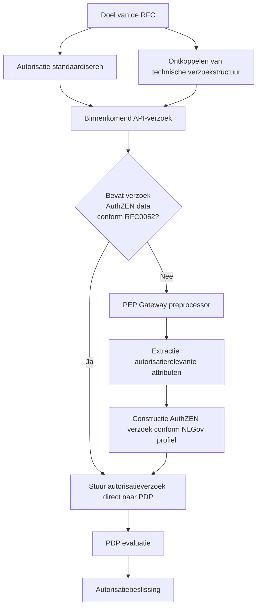
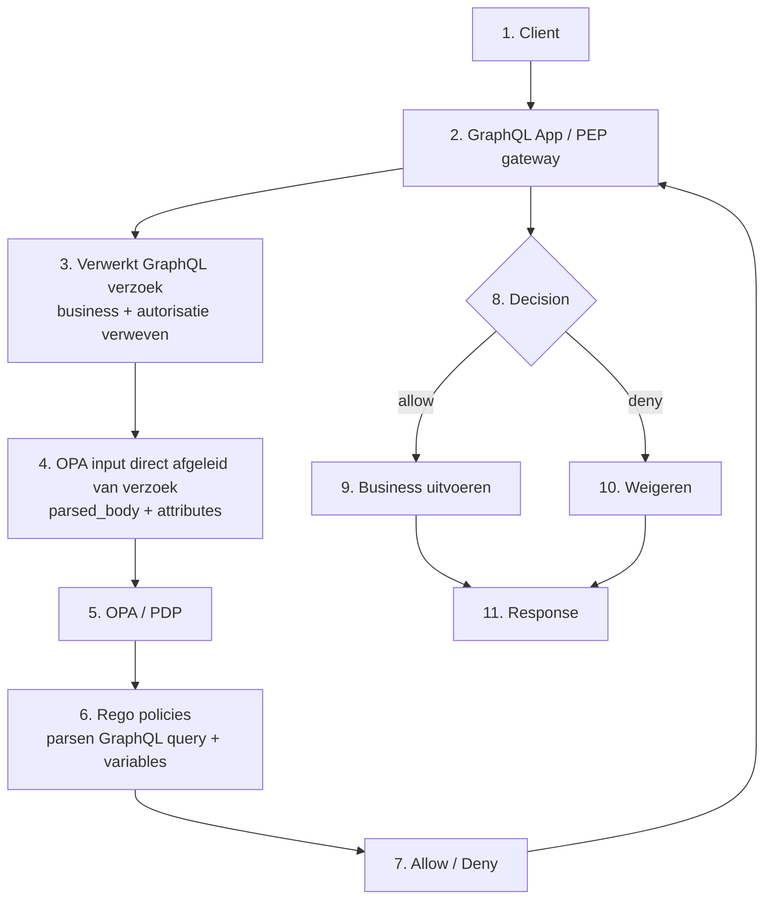
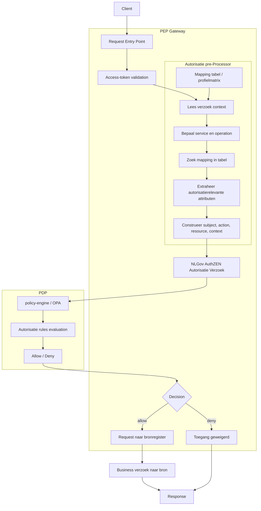

# Samenvatting

Binnen het iWlz-stelsel is autorisatie momenteel afhankelijk van de technische structuur van API-requests, wat leidt tot inconsistentie en beperkte interoperabiliteit.  

Deze RFC stelt voor om autorisatie-attributen expliciet te extraheren in de PEP Gateway en te vertalen naar een gestandaardiseerd autorisatieverzoek conform NLGov AuthZEN.  

Hiermee wordt autorisatie losgekoppeld van implementatiedetails en gebaseerd op een uniform, expliciet model.  

Dit maakt autorisatie stelselbreed normeerbaar, interoperabel en beter toetsbaar.




Probleem

De autorisatiebeslissing wordt momenteel gebaseerd op het volledige inkomende API-verzoek, inclusief GraphQL-querystructuur, variabelen en token. Hierdoor ontstaat een sterke afhankelijkheid tussen de technische representatie van het verzoek en de autorisatielogica.

In deze RFC wordt voorgesteld om de PEP Gateway conform het bovenstaande schema in te richten.

Bij een binnenkomend verzoek wordt eerst vastgesteld of het verzoek reeds autorisatiegegevens bevat conform RFC0052 (dit document).

- Indien het verzoek reeds een autorisatieverzoek bevat conform RFC0052, dan kan deze autorisatie-informatie ongewijzigd aan de PDP ter beoordeling worden aangeboden.
- Indien het verzoek niet voldoet aan RFC0052, dan geldt:
  - de autorisatierelevante informatie wordt uit het binnenkomende verzoek geëxtraheerd door middel van een preprocessor in de PEP Gateway;
  - de preprocessor construeert op basis hiervan een gestandaardiseerd autorisatieverzoek conform de NLGov AuthZEN-standaard, zoals in dit document gespecificeerd;
  - dit gestandaardiseerde autorisatieverzoek wordt vervolgens aan de PDP ter beoordeling aangeboden.

Hiermee wordt:

- de afhankelijkheid van technische verzoekstructuren doorbroken;
- autorisatie gebaseerd op een expliciet en gestandaardiseerd model;
- interoperabiliteit tussen bronhouders en implementaties vergroot;
- autorisatiebeleid beter toetsbaar en herbruikbaar gemaakt.

Voor implementerende partijen betekent dit:

- inrichting van een controlemechanisme om vast te stellen of een verzoek reeds voldoet aan RFC0052;
- implementatie van een preprocessor in de PEP Gateway voor verzoeken die niet aan RFC0052 voldoen;
- gebruik van het gestandaardiseerde AuthZEN-autorisatieverzoek;
- inrichting van een mappingmechanisme (service + operation → policy);
- aanpassing van bestaande autorisatie-implementaties naar het nieuwe model.

De NLGov AuthZEN-standaard standaardiseert uitsluitend de interface tussen PEP en PDP en vervangt geen IAM-functionaliteit en geen policy-engine.

Ter illustratie is een [demo](https://cloudblox.github.io/graphql-opa-demo/RFC0052-example.html) beschikbaar die laat zien hoe een AuthZEN-verzoek eruit kan zien volgens de standaard en profilering uit dit document. Daarnaast is een [JSON Schema](./RFC0052-schema.json) beschikbaar waarmee dit autorisatieverzoek machine-valideerbaar wordt gemaakt.

# 1. Inleiding

Autorisatie is binnen het landelijke zorgstelsel gepositioneerd als een generieke functie. Deze functie dient stelselbreed te functioneren, onafhankelijk te zijn van individuele bronnen (Registers), normeerbaar te zijn en interoperabel toegepast te kunnen worden. Deze uitgangspunten zijn verankerd in beleidskaders rondom generieke functies en worden onder meer bevestigd in het Twiin Vertrouwensmodel.

Binnen het iWlz-stelsel opereren meerdere bronhouders onder een gezamenlijk beleidskader. In deze context is het noodzakelijk dat autorisatie op een consistente en eenduidige wijze wordt toegepast. Wanneer autorisatie afhankelijk is van impliciete interpretaties of implementatie-specifieke invullingen, ontstaat het risico op uiteenlopende interpretaties van autorisatie-attributen. Dit kan leiden tot inconsistent gedrag, verminderde interoperabiliteit en beperkte toetsbaarheid van autorisatiebeslissingen binnen het stelsel.

In de huidige situatie wordt het inkomende API-request (GraphQL-request en Token) als één geheel in één JSON-document aangeboden aan de policy-engine voor evaluatie. Dit gecombineerde verzoek wordt vervolgens als input gebruikt voor policy-evaluatie. Hierdoor is de autorisatiebeslissing afhankelijk van de technische representatie van het verzoek, zoals querystructuur, variabelen en filters, wat leidt tot een ongewenste koppeling tussen techniek en autorisatie.

Deze situatie staat haaks op het uitgangspunt dat autorisatie als generieke functie losgekoppeld moet zijn van individuele bronnen en implementaties. Om autorisatie stelselbreed consistent, herbruikbaar en toetsbaar te maken, is een expliciete scheiding nodig tussen de businessvraag (API-request) en de autorisatievraag.

Dit document beschrijft een voorstel om deze scheiding te realiseren door de autorisatievraag te standaardiseren. De Policy Enforcement Point (PEP) is hierbij verantwoordelijk voor het afleiden van een gestandaardiseerde autorisatievraag uit het inkomende verzoek, terwijl de Policy Decision Point (PDP) deze vraag evalueert op basis van centraal beheerd autorisatiebeleid.

# 2. Probleemstelling


Binnen het iWlz-stelsel wordt autorisatie toegepast in een context waarin meerdere bronhouders opereren onder een gezamenlijk beleidskader. Hoewel autorisatie als generieke functie stelselbreed consistent en onafhankelijk van applicaties moet functioneren, blijkt in de huidige situatie dat de implementatie van autorisatie sterk verweven is met de technische invulling van individuele API’s.

Concreet wordt een inkomend API-request (bijvoorbeeld een GraphQL-request) momenteel als één gecombineerd geheel verwerkt, waarin zowel businesslogica (de functionele vraag aan de bronhouder) als autorisatielogica (de beoordeling of deze vraag is toegestaan) zijn opgenomen. Dit gecombineerde verzoek wordt als input aangeboden aan de policy-engine voor evaluatie.

Hierdoor ontstaan de volgende knelpunten:

- Verwevenheid van business- en autorisatielogica; Autorisatiebeslissingen zijn direct afhankelijk van de structuur en inhoud van het API-request, zoals query-opbouw, variabelen en filters. Hierdoor ontstaat een ongewenste koppeling tussen businesslogica en autorisatielogica.
- Gebrek aan standaardisatie van de autorisatievraag; Er is geen uniform model voor de autorisatievraag tussen Policy Enforcement Points (PEP) en Policy Decision Points (PDP). Iedere implementatie bepaalt zelf hoe autorisatie-attributen worden afgeleid en aangeboden, wat leidt tot inconsistente interpretaties.
- Beperkte interoperabiliteit tussen bronhouders; Door het ontbreken van een gestandaardiseerd autorisatiecontract kunnen verschillende bronhouders autorisatie op uiteenlopende wijze implementeren, wat de stelselbrede interoperabiliteit belemmert.
- Beperkte herbruikbaarheid en toetsbaarheid van beleid; Autorisatiebeleid is gekoppeld aan specifieke API-structuren en daardoor moeilijk herbruikbaar. Daarnaast wordt het lastiger om autorisatiebeslissingen consistent te toetsen en te verantwoorden.
- Afhankelijkheid van technische implementatiedetails; De policy-evaluatie is afhankelijk van implementatiespecifieke verzoekrepresentaties (zoals GraphQL-structuren), in plaats van een expliciet en technologie-onafhankelijk autorisatiemodel.

Deze situatie staat haaks op het uitgangspunt dat autorisatie als generieke functie losgekoppeld, normeerbaar en interoperabel moet zijn. Zonder een expliciete scheiding tussen businesslogica en autorisatielogica en zonder standaardisatie van de autorisatievraag blijft het risico bestaan op fragmentatie van autorisatie-implementaties binnen het stelsel.


# 3. Architectuurprincipes

Autorisatie binnen het iWlz-stelsel moet voldoen aan de volgende architectuurprincipes:

- **Scheiding van verantwoordelijkheden**; De verantwoordelijkheid voor policy enforcement, policy decision en policy governance moet expliciet zijn gescheiden. Het Policy Enforcement Point (PEP) is verantwoordelijk voor het afdwingen van autorisatiebesluiten bij de applicatie of gateway. Het Policy Decision Point (PDP) is verantwoordelijk voor het nemen van autorisatiebesluiten. De governance op het autorisatiebeleid is centraal belegd bij ZINL.
- **Standaardisatie van autorisatieverzoeken**; Autorisatieverzoeken tussen PEP en PDP moeten via een uniforme en gestandaardiseerde interface verlopen, zodat autorisatiebesluiten op consistente wijze kunnen worden aangevraagd en verwerkt.
- **Loskoppeling van policy-engine en interface**; De interface tussen PEP en PDP moet onafhankelijk zijn van de onderliggende policy-engine. De implementatie van het PDP moet verwisselbaar zijn, zonder dat dit impact heeft op de applicaties of gateways die autorisatiebesluiten opvragen.
- **Stelselbrede interoperabiliteit**; Bronhouders en andere stelselpartijen moeten dezelfde autorisatie-interface en semantiek hanteren, zodat autorisatie stelselbreed consistent, uitlegbaar en interoperabel kan worden toegepast.


# 4. Huidige situatie

De huidige situatie is gebaseerd op één GraphQL-request, waarbij de input voor de policy-evaluatie direct wordt afgeleid van het volledige verzoek en als JSON-document wordt aangeboden aan de Open Policy Agent (OPA).

OPA evalueert deze input op basis van de in de policy bundle gedefinieerde Rego-policies en de bijbehorende policy-structuur. Hierbij worden zowel verzoekattributen als elementen uit de GraphQL-query, zoals variabelen en filters, betrokken in de autorisatiebeslissing.

In deze opzet is geen expliciete scheiding aanwezig tussen businesslogica en autorisatielogica. Beide zijn impliciet verweven in de input voor de policy-evaluatie, waardoor autorisatiebeslissingen afhankelijk zijn van de technische representatie van het API-request.

OPA fungeert in deze architectuur als Policy Decision Point (PDP).




- (1-2) Het verzoek komt binnen via de GraphQL applicatie / PEP gateway  
- (3-4) Het verzoek wordt als geheel gebruikt als input voor autorisatie  
- (5-7) De PDP evalueert dit via Rego policies  
- (8-11) Op basis van de beslissing wordt de businesslogica uitgevoerd of geweigerd

# 5. Doelarchitectuur

Het is wenselijk om een expliciete scheiding aan te brengen tussen businesslogica en autorisatielogica.
Daartoe wordt voorgesteld dat de implementerende partij binnen de Policy Enforcement Point (PEP)-gateway voorziet in een pre-processing functie.

Deze pre-processing functie is verantwoordelijk voor het onderscheiden van het businessrequest (de functionele aanvraag aan de bronhouder) en de daaruit af te leiden autorisatievraag.

De implementerende partij is vrij in de keuze van technologie voor deze functionaliteit, mits wordt voldaan aan de volgende uitgangspunten:
- Er wordt een duidelijke scheiding gerealiseerd tussen businesslogica en autorisatielogica.
-	De autorisatievraag wordt opgebouwd conform de [NLGov AuthZEN Autorisatie API 1.0 specificatie](https://www.logius.nl/actueel/publieke-consultatie-nlgov-authzen-autorisatie-api-v10) zoals in Hoofdstuk 6 omschreven.

In het kader van stelselbrede interoperabiliteit dient de oplossing niet beperkt te zijn tot één specifieke API-technologie. Naast GraphQL-requests moeten ook andere API-protocollen ondersteund kunnen worden.

Hierbij geldt:
-	Voor GraphQL kan gebruik worden gemaakt van expliciete autorisatie-aanduidingen, zoals directives, om te signaleren dat voor een bepaalde operatie een autorisatiebesluit vereist is conform de NLGov AuthZEN-specificatie zoals in Hoofdstuk 6 omschreven.
-	Voor andere API-protocollen (zoals REST of gRPC) wordt deze informatie afgeleid uit bijvoorbeeld endpoints, methoden, metadata of configuratie, waarbij een mappingmechanisme wordt toegepast dat aansluit bij het autorisatiemodel van de NLGov AuthZEN Autorisatie API 1.0 zoals in Hoofdstuk 6 omschreven.

De wijze waarop de pre-processing functie deze informatie herkent en interpreteert is een implementatiedetail. De standaardisatie richt zich uitsluitend op de autorisatievraag die door de PEP aan de Policy Decision Point (PDP) wordt aangeboden.

## 5.1 Doelarchitectuur 



Dit houdt in:

- Implementatie van Autorisatie Pre Processor
- Binnen de Pre Processor wordt de Authorisatielogica geextraheerd
- De Pre Processor zorgt ervoor dat deze Authorisatiedata die wordt aangeboden aan de PDP volgens de structuur en standaarden voldoet zoals omschreven in Hoofdstuk 6.2.


# 6. Autorisatiecontract iWlz AuthZEN-profiel

Dit hoofdstuk beschrijft hoe een autorisatieverzoek eruit moet zien binnen het iWlz-stelsel.

Het model is gebaseerd op:

- OpenID AuthZEN Authorization API 1.0  
- NLGov AuthZEN profiel  

Dit document definieert een iWlz-profiel op deze standaarden.

Dat betekent:

- de structuur volgt AuthZEN;
- de betekenis van velden en waarden wordt hier vastgelegd;
- codelijsten onderdeel zijn van de standaard.

De technische implementatie van autorisatie (zoals policy-engines of architectuurkeuzes) valt buiten scope.

Naast de beschrijving in dit hoofdstuk is een JSON Schema beschikbaar dat het autorisatieverzoek machine-valideerbaar maakt.

Dit schema kan worden gebruikt voor:
- validatie van autorisatieverzoeken
- contractafspraken tussen partijen
- implementatie in gateways en services

U kunt het schema [hier](./RFC0052-schema.json) downloaden.

## 6.1 Structuur van het autorisatieverzoek

Een autorisatieverzoek bestaat altijd uit:

- subject
- action
- resource
- context


## 6.2 Subject

Het `subject` beschrijft de actor die de actie uitvoert.

De structuur van het subject volgt het AuthZEN-model en bestaat uit:

- `type` → het type actor
- `id` → de unieke identificatie van de actor
- `properties` → aanvullende kenmerken van de actor

| Attribuut | Verplicht | Toelichting |
|---|---|---|
| type | Ja | Type actor (bijv. `organization`, `user`, `system`) |
| id | Ja | Unieke identifier van de actor |
| properties | Nee | Aanvullende domeinspecifieke gegevens |


### Toelichting

- Het veld `type` geeft aan wat voor soort actor het betreft (bijvoorbeeld een organisatie of een gebruiker).
- Het veld `id` identificeert de actor uniek binnen het stelsel. In de praktijk is dit vaak afkomstig uit het access-token.
- Het veld `properties` bevat aanvullende kenmerken die relevant zijn voor autorisatie, zoals:
  - rollen (`roles`)
  - organisatiekenmerken (`organization_type`)
  - identifiers (bijv. UZOVI- of AGB-code)
  - regio (`region`)

Deze attributen sluiten aan op de codelijsten in paragraaf 6.6.


### Richtlijnen

- Domeinspecifieke attributen worden onder `properties` geplaatst.
- De betekenis van attributen in `properties` is consistent met de codelijsten.
- De combinatie van `subject.properties`, `resource` en `context` vormt de basis voor de autorisatiebeslissing.
- Het moet mogelijk zijn om de waarden van het subject te herleiden naar een betrouwbare bron (bijv. een access-token of een externe bron).

## 6.3 Action

De `action` beschrijft welke handeling wordt uitgevoerd op de resource.

De structuur van `action` volgt het AuthZEN-model en bestaat uit een object met een `name` veld.

```json
{
  "action": {
    "name": "read"
  }
}
```

| Attribuut | Verplicht | Toelichting |
|---|---|---|
|name|Ja|De uit te voeren handeling(bijv. read/write)|


### Toelichting

- Het veld name geeft aan wat de actor wil doen met de resource (bijvoorbeeld raadplegen of wijzigen).
- De waarde van action.name bepaalt samen met resource en context welke autorisatieregels van toepassing zijn.
- De toegestane waarden zijn vastgelegd in de codelijsten (zie paragraaf 6.6).

### Richtlijnen

- De action wordt conform AuthZEN altijd als object vastgelegd (bijvoorbeeld { "name": "read" }).
- Het gebruik van een losse string zoals "action": "read" is niet toegestaan.
- De waarde van `action.name` moet afkomstig zijn uit de vastgestelde codelijst.
- De betekenis van de gekozen actie moet consistent zijn binnen het stelsel.


## 6.4 Resource

De `resource` beschrijft het object waarop de actie wordt uitgevoerd.

Binnen het iWlz-stelsel wordt voor gegevensuitwisseling gebruikgemaakt van GraphQL.

In deze context wordt de op te vragen dataset in belangrijke mate bepaald door filtercriteria, zoals vastgelegd in de GraphQL `where` clause.

Een groot deel van de autorisatielogica is gebaseerd op deze filtercriteria. Autorisatie vindt daarmee niet alleen plaats op het niveau van de resource, maar ook op de selectie van gegevens binnen die resource.

Om deze reden wordt binnen het iWlz-profiel de filtercontext expliciet opgenomen in het autorisatieverzoek.

Deze filtercontext wordt gemodelleerd als onderdeel van de `resource`, onder `resource.properties.query_filter`.

De `query_filter` bevat een genormaliseerde representatie van de filtercriteria uit het inkomende verzoek. Voor GraphQL-verzoeken komt deze overeen met de `where` clause.

De structuur van de resource volgt het AuthZEN-model en bestaat uit:

- `type` → het soort resource
- `id` → de unieke identificatie van de resource
- `properties` → aanvullende kenmerken, inclusief filtercontext

| Attribuut | Verplicht | Toelichting |
|---|---|---|
| type | Ja | Type van de resource (bijv. WLZ_INDICATIE, BEMIDDELING) |
| id | Ja | Unieke identifier van de resource binnen de service |
| properties.query_filter | Ja | Genormaliseerde representatie van de filtercriteria (bijv. GraphQL `where` clause) |
| properties | Nee | Overige attributen die relevant zijn voor autorisatie |


### Toelichting

- Het veld `type` bepaalt op welk soort object de autorisatie betrekking heeft en moet aansluiten bij de functionele context (bijv. service en operation).
- Het veld `id` identificeert de specifieke resource waarop de actie wordt uitgevoerd. De herkomst ligt doorgaans in het inkomende API-verzoek.
- Het veld `properties` bevat aanvullende kenmerken die nodig kunnen zijn voor autorisatiebeslissingen, zoals:
  - eigenaar (`owner`)
  - regio (`region`)
  - gevoeligheid (`sensitivity`)

### Richtlijnen

- De filtercontext wordt opgenomen onder `resource.properties.query_filter`.
- De inhoud van `query_filter` is herleidbaar naar het inkomende verzoek.
- Alleen autorisatierelevante filtercriteria worden opgenomen.
- De combinatie van `resource`, `query_filter` en `context` vormt de basis voor de autorisatiebeslissing.

Deze aanvullende attributen sluiten aan op de codelijsten in paragraaf 6.6.

## 6.5 Context

De `context` bevat aanvullende informatie die nodig is om een autorisatiebeslissing te kunnen nemen.

De context beschrijft de omstandigheden waaronder de actie plaatsvindt, zoals het doel van gebruik, de functionele dienst en de relatie tussen betrokken partijen.

| Attribuut | Verplicht | Toelichting |
|---|---|---|
| purpose_of_use | Ja | Doel van de gegevensverwerking |
| service | Ja | Functionele dienst waarop de actie betrekking heeft |
| operation | Ja | Specifieke handeling binnen de service |
| relation | Ja | Relatie tussen subject en resource-eigenaar (bijv. WLZ_EXECUTION) |
| contract_active | Ja | Of er een geldige relatie bestaat |
| time | Ja | Tijdstip van het verzoek (ISO 8601) |

### Toelichting

- `purpose_of_use` geeft aan waarom de gegevens worden geraadpleegd en moet te herleiden zijn naar een geldige juridische grondslag (zie paragraaf 6.6.5).
- `service` en `operation` beschrijven samen de functionele context van het verzoek en bepalen welke autorisatieregels van toepassing zijn.
- `relation` geeft de aard van de relatie tussen de actor en de resource weer (bijv. binnen het iWlz-domein).
- `contract_active` geeft aan of er een geldige relatie bestaat die toegang rechtvaardigt.
- `time` legt het moment van het verzoek vast en wordt gebruikt voor tijdsafhankelijke autorisatie.

### Richtlijnen

- De combinatie van `service` en `operation` moet overeenkomen met de codelijsten in paragraaf 6.6.
- De waarden in `context` moeten consistent zijn met de betekenis van de bijbehorende codelijsten.
- Het moet altijd mogelijk zijn om de waarden in de context te herleiden naar een bron (bijv. API-verzoek, token of externe bron).
- De context vormt samen met `subject` en `resource` de basis voor de autorisatiebeslissing.

## 6.6 Codelijsten (normatief)

Deze codelijsten zijn onderdeel van de standaard.

- Gebruik is verplicht  
- Afwijkingen zijn niet toegestaan  

### 6.6.1 service

| Waarde |
|---|
| INDICATIEREGISTER |
| BEMIDDELINGSREGISTER |
| CLIENTREGISTER |
| ZORGTOEWIJZINGSSERVICE |
| NOTIFICATIESERVICE |


### 6.6.2 operation

#### INDICATIEREGISTER
- raadpleegIndicatie

#### BEMIDDELINGSREGISTER
- raadpleegBemiddeling  
- raadpleegRegiehouder  
- raadpleegOverdracht  

#### CLIENTREGISTER
- raadpleegClient  
- wijzigClient  

#### ZORGTOEWIJZINGSSERVICE
- raadpleegToewijzing  
- wijzigToewijzing  

#### NOTIFICATIESERVICE
- zendNotificatie  
- zendMelding  

**Validatieregel:**  
De combinatie van `service` en `operation` moet logisch kloppen.  
Een ongeldige combinatie moet worden afgewezen.

### 6.6.3 region

Bron: NZa  
https://www.nza.nl/zorgsectoren/langdurige-zorg/zorgkantoren

GRONINGEN  
FRIESLAND  
DRENTHE  
TWENTE  
ACHTERHOEK  
MIDDEN_IJSSEL  
ARNHEM  
NIJMEGEN  
UTRECHT  
NOORD_HOLLAND  
ZUID_HOLLAND  
ZEELAND  
BRABANT  
LIMBURG  


### 6.6.4 organization_type

ZORGKANTOOR  
ZORGAANBIEDER  
CIZ  
VECOZO  
BURGER  
TOEZICHTHOUDER  
KETENPARTNER  
SYSTEEM  

Bronnen:

- https://www.agbcode.nl/  
- https://www.vecozo.nl/  
- https://istandaarden.nl/iwlz  


### 6.6.5 purpose_of_use

Het attribuut `purpose_of_use` beschrijft het doel van de gegevensverwerking.

De opgegeven waarde moet herleidbaar zijn naar een geldige juridische grondslag conform artikel 6 AVG.

De onderstaande tabel geeft een **indicatieve koppeling**. De daadwerkelijke grondslag is afhankelijk van de specifieke verwerking en context.

| Waarde | Typische juridische basis | Toelichting |
|---|---|---|
| WLZ_UITVOERING | Art. 6 lid 1 sub e AVG | Uitvoering van een wettelijke taak |
| TOEZICHT | Art. 6 lid 1 sub e AVG | Toezichthoudende taak |
| ONDERZOEK | Art. 6 lid 1 sub e / a AVG | Afhankelijk van context (publiek onderzoek of toestemming) |
| ADMINISTRATIE | Art. 6 lid 1 sub c / e AVG | Wettelijke verplichting of publieke taak |

Bron:

- https://eur-lex.europa.eu/eli/reg/2016/679/oj

**Regel:**  
Elke waarde moet te herleiden zijn naar een juridische grondslag.


### 6.6.6 sensitivity

LOW  
NORMAL  
HIGH  

Moet aansluiten op bestaande classificaties (bijv. BIO of NEN7510).


## 6.7 Herkomst van attributen

Attributen kunnen uit verschillende bronnen komen:

- token  
- API-verzoek  
- externe bron  
- configuratie  

De herkomst moet altijd herleidbaar zijn naar een betrouwbare bron (bijv. access-token, API-verzoek of externe bron).

## 6.8 contract_active

Geeft aan of er een geldige relatie bestaat tussen subject en resource-eigenaar.

- true → relatie aanwezig  
- false → geen of onbekend  

Indien onbekend → behandelen als false (default deny)


# 7. Terminologie

| ***Term*** | ***Omschrijving*** |
|---|---|
| PEP | Policy Enforcement Point; Handhaving autorisatie (entrypoint) |
| PAP | Policy Administration Point; Beheer autorisatiebeleid, publiceert policies  |
| PRP | Policy Retrieval Point; Stelt policies beschikbaar aan PDP's |
| PIP | Policy Information Point; Levert attributen en contextinformatie voor autorisatiebesluiten |
| PDP | Policy Decision Point; Evalueert policies en neemt het autorisatiebesluit |
| AuthZEN | Autorisatie API standaard |
| OPA | Open Policy Agent |
| TWIIN | Transport, Wisselwerking, Informatie, In Netwerken |


# 8. Referenties

- [GEN_FUNC_AUTORISEREN] Ist en soll - onderzoek voor de generieke functie Autoriseren, Open Overheid: https://open.overheid.nl/documenten/423d14f1-5228-4dd1-b79f-97a78b58eff5/file
- [TWIIN_VERTRAUWENSMODEL] Twiin Vertrouwensmodel: https://www.twiin.nl/twiin-vertrouwensmodel
- [TWIIN_BEGRIP_VERTRAUWENSMODEL] Begrip: Twiin Vertrouwensmodel, Twiin Afsprakenstelsel: https://afsprakenstelsel.twiin.nl/normatief/ta140/begrip-twiin-vertrouwensmodel
- [AUTHZEN_FINAL] OpenID Autorisatie API 1.0 Final Specification: https://openid.net/specs/authorization-api-1_0.html
- [AUTHZEN_FINAL_APPROVAL] OpenID Autorisatie API 1.0 Final Specification Approved: https://openid.net/autorisatie-api-1-0-final-specification-approved/
- [NLGOV_AUTHZEN] NLGov Profile for OpenID AuthZEN Autorisatie API: https://logius-standaarden.github.io/authzen-nlgov/
- [OPA] Open Policy Agent: https://www.openpolicyagent.org/
- [RFC_STATUS] Status RFC: https://github.com/iStandaarden/iWlz-RequestForComment/issues/52


