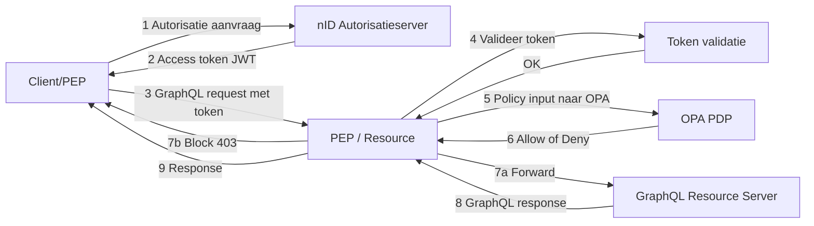
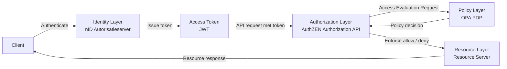

# Samenvatting

Autorisatie is binnen het landelijke zorgstelsel gepositioneerd als een generieke functie. Zij moet stelselbreed functioneren, onafhankelijk zijn van individuele applicaties, normeerbaar zijn en interoperabel toegepast kunnen worden. Deze uitgangspunten komen terug in beleidskaders rond generieke functies en in het Twiin Vertrouwensmodel.

Binnen het iWlz-stelsel opereren meerdere bronhouders onder een gezamenlijk beleidskader. Hierdoor ontstaat een situatie waarin impliciete interpretatie van autorisatie-attributen niet langer voldoende is en uiteenlopende implementaties kunnen ontstaan.

Deze RFC stelt voor om autorisatieverzoeken te standaardiseren via de OpenID AuthZEN Authorization API 1.0. Hierdoor ontstaat een uniform autorisatiecontract tussen applicaties (Policy Enforcement Points) en een centrale autorisatievoorziening (Policy Decision Point).

De Open Policy Agent (OPA) kan in deze architectuur fungeren als uitvoerende policy-engine, terwijl AuthZEN de gestandaardiseerde autorisatie-interface definieert.

Belangrijk:

- AuthZEN vervangt geen IAM.
- AuthZEN vervangt geen policy engines.
- AuthZEN standaardiseert uitsluitend de interface tussen Policy Enforcement Points en Policy Decision Points.

# 1. Inleiding

In de Kamerbrieven over Generieke Functies wordt autorisatie expliciet benoemd als een generieke functie die:
- stelselbreed moet functioneren
- onafhankelijk van individuele applicaties moet zijn
- normeerbaar moet zijn
- interoperabel moet zijn

Autorisatie mag daarom niet “hardcoded” in applicaties worden geïmplementeerd. Het moet losgekoppeld, herbruikbaar en toetsbaar zijn.

De inzet van Open Policy Agent (OPA) ondersteunt deze architectuurprincipes door autorisatie los te koppelen van applicaties en te positioneren als zelfstandig Policy Decision Point (PDP).

OPA faciliteert:
- centrale policy-besluitvorming
- scheiding van policy en applicatielogica
-	versiebeheer van beleidsregels
-	audit en controleerbaarheid van autorisatiebesluiten

Hiermee wordt invulling gegeven aan autorisatie als generieke functie op technisch niveau.

# 2. Probleemstelling

## 2.1 Single-bronhoudercontext

In een situatie met één bronhouder vormt de afwezigheid van een gestandaardiseerd autorisatiebeslismodel doorgaans geen probleem.

Binnen één organisatie zijn:
- semantiek van rollen
-	interpretatie van attributen
-	governance
-	logging

impliciet afgestemd. Een technische PDP-implementatie zoals OPA is in deze context vaak voldoende.

## 2.2 Multi-bronhoudercontext

Binnen het iWlz-stelsel opereren echter meerdere bronhouders onder een gezamenlijk beleidskader.

In deze situatie:
-	ontstaan verschillende interpretaties van autorisatie-attributen
-	kunnen implementaties uiteenlopen
-	wordt hergebruik van policies beperkt

Een loutere inzet van OPA — waarbij een generiek JSON-document wordt geëvalueerd — is daarom onvoldoende om uniforme autorisatiebesluiten te garanderen.

## 2.3 Gevolg

Zonder expliciet vastgelegd autorisatiecontract ontstaat variatie in:
-	attributenstructuur
-	semantische interpretatie
-	besluitvorming

Dit belemmert:
-	interoperabiliteit
-	governance
-	audit


# 3. Architectuurprincipes

Autorisatie binnen het iWlz-stelsel moet voldoen aan de volgende principes:

1.	Scheiding van verantwoordelijkheden; PEP  → enforcement; bij de bronhouder,PDP  → policy decision; ZINL 
1.	Standaardisatie van autorisatieverzoeken; Applicaties moeten een autorisatiebesluit opvragen via een uniforme interface.
1.	Loskoppeling van policy-engine; De implementatie van het PDP moet verwisselbaar zijn.
1.	Stelselbrede interoperabiliteit; Bronhouders moeten dezelfde autorisatie-interface gebruiken.

# 4. Huidige situatie

In de huidige situatie wordt autorisatie per applicatie geïmplementeerd.



In deze situatie bestaat geen gestandaardiseerd autorisatiecontract.

# 5. Doelarchitectuur

De doelarchitectuur introduceert een gestandaardiseerde autorisatie-interface tussen applicaties en de autorisatievoorziening.

```mermaid
flowchart LR
  C[Client]
  G[PEP Gateway]
  AS[nID Autorisatieserver]
  AZ[AuthZEN Authorization API]
  PDP[OPA PDP]
  RS[Resource Server]

  C -->|GraphQL request met token| G

  G -->|Valideer token| AS
  AS -->|Token valid| G

  G -->|AuthZEN Access Evaluation Request| AZ
  AZ -->|Policy input| PDP
  PDP -->|Decision| AZ
  AZ -->|Allow / Deny| G

  G -->|Forward| RS
  G -->|Block 403| C

  RS -->|Response| G
  G -->|Response| C
  ```

  De PEP-gateway construeert via een request builder een AuthZEN Access Evaluation Request conform de AuthZEN Authorization API specificatie.

# 6. Autorisatiecontract (AuthZEN)

De OpenID AuthZEN Authorization API 1.0 definieert een gestandaardiseerde interface tussen:

- Policy Enforcement Point (PEP)
- Policy Decision Point (PDP)

Een autorisatieverzoek bestaat uit vier elementen:

- subject
- action
- resource
- context

Voorbeeld:
```
{
  "subject": {},
  "action": {},
  "resource": {},
  "context": {}
}
```
Deze structuur vormt het gestandaardiseerde autorisatiecontract binnen het stelsel.

# 7. Motivatie voor AuthZEN

Het gebruik van AuthZEN biedt de volgende voordelen:

1. Standaardisatie van autorisatieverzoeken; Applicaties gebruiken een uniforme structuur voor autorisatievragen.
1. Scheiding tussen applicatie en policy; Autorisatiebeleid wordt centraal geëvalueerd.
1. Interoperabiliteit; Alle diensten binnen het stelsel gebruiken dezelfde autorisatie-interface.
1. Flexibele policy-implementatie; De PDP kan worden gerealiseerd met technologieën zoals OPA.
1. Moderne API-architectuur; AuthZEN is JSON-gebaseerd en past bij moderne API-architecturen.

# 8. Architectuurcontext (Identity – Authorization – Policy)

Onderstaand diagram laat zien waar AuthZEN zich positioneert binnen de architectuur.


Hieruit blijkt dat:
- Identity verzorgt authenticatie
- AuthZEN verzorgt autorisatie-interface
- OPA verzorgt policy-evaluatie

# 9. Terminologie

| ***Term*** | ***Omschrijving*** |
|---|---|
| PEP | Policy Enforcement Point |
| PDP | Policy Decision Point |
| AuthZEN | Authorization API standaard |
| OPA | Open Policy Agent |


# 10. Referenties

- [AUTHZEN] OpenID Foundation Authorization API 1.0:  https://openid.github.io/authzen/
- [OPA] Open Policy Agent: https://www.openpolicyagent.org/
- Status RFC: https://github.com/iStandaarden/iWlz-RequestForComment/issues/52