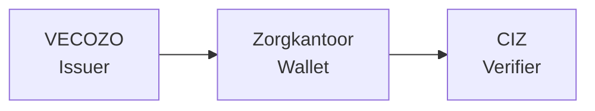

# RFC00XX -- Verifiable Credentials binnen het iWlz-stelsel

## Architectuurvisie & Overdrachtsdocument

> **Doel**
>
> Dit document is bedoeld als overdracht aan een opvolgend architect.
> Het combineert:
>
> -   de reeds behaalde resultaten uit de ZIN/VECOZO hackathon (februari
>     2025);
> -   de huidige inzichten uit de Proof of Concept;
> -   de nog openstaande architectuurkeuzes;

------------------------------------------------------------------------

# 1. Achtergrond

Het iWlz-stelsel gebruikt momenteel:

- mTLS met PKI(Overheid)/VECOZO-certificaten;
- centraal beheerd vertrouwensmodel;
- PKI-certificaten voor transportauthenticatie;
- OAuth2/JWT voor applicatie-authenticatie;
- bilaterale beheer- en vertrouwensafspraken.

Europese ontwikkelingen (eIDAS 2.0, EHDS, EUDI Wallet) en de adoptie van
Nuts maken een nieuwe vertrouwenslaag wenselijk.

------------------------------------------------------------------------

# 2. Resultaten hackathon (BEHAALD)

## Doel

Valideren of Verifiable Credentials technisch toepasbaar zijn binnen het
iWlz-domein.

## Gerealiseerd

Belangrijkste technische keuzes:

✅ Keycloak 26.x met OID4VCI

✅ Complete OID4VCI Pre-Authorized Code Flow

✅ Issuer Service

✅ Holder Wallet

✅ Verifier

✅ did:web gebaseerde identiteit

✅ JWT Verifiable Credentials

✅ VP-JWT Presentations

✅ Holder Binding (cnf.kid)

✅ JWKS validatie

✅ ES256 ondertekening

## Architectuur

Credential

ZorgkantoorCredential

## Werkende end-to-end flow

1.  OAuth2 client_credentials authenticatie.
2.  Credential Offer generatie.
3.  Wallet ontvangt credential offer.
4.  Wallet wisselt pre-authorized code in.
5.  Wallet ontvangt Access Token.
6.  Wallet vraagt nonce op.
7.  Wallet maakt proof JWT.
8.  Issuer valideert proof.
9.  Issuer geeft JWT-VC uit.
10. Wallet bewaart VC.
11. Wallet presenteert VP-JWT.
12. Verifier valideert VC en VP via JWKS.

## Belangrijkste bevindingen

-   did:web is goed bruikbaar voor organisaties.
-   OID4VCI Pre-Authorized Flow werkt uitstekend voor machine-to-machine
    scenario's.
-   Holder Binding voorkomt misbruik van credentials.
-   JWT-VC is eenvoudig te integreren.
-   VC kan onafhankelijk van de issuer worden gevalideerd.
-   De combinatie OAuth2 + VC is complementair; VC vervangt OAuth niet.

------------------------------------------------------------------------

# 3. Architectuurinzichten (BEVESTIGD)

## Architectuurstack 

Transport - TLS / mTLS

Applicatie - OAuth2 / JWT

Trust - Verifiable Credentials

Presentatie - OpenID4VP

Autorisatie - AuthZEN

Besluitvorming - PDP

### Belangrijk inzicht

Verifiable Credentials vormen **geen authenticatiemechanisme**, maar een
aanvullende vertrouwenslaag voor identiteiten, rollen en bevoegdheden.

------------------------------------------------------------------------

# 4. Openstaande architectuurvragen

## Governance

-   Trust Registry
-   Issuer governance
-   DID governance
-   Credential lifecycle

## Techniek

-   did:web versus did:nuts
-   Revocation
-   Status Lists
-   Wallet-keuze
-   Selective Disclosure

## Integratie

-   AuthZEN-profiel
-   FSC
-   Nuts
-   Generieke Functies

------------------------------------------------------------------------

# 5. Voorstel hoofdstukken definitieve RFC

1.  Managementsamenvatting
2.  Probleemstelling
3.  Architectuurvisie
4.  Huidige situatie
5.  Hackathon & POC-resultaten
6.  Doelarchitectuur
7.  VC-profiel
8.  Governance
9.  Security
10. Referenties

------------------------------------------------------------------------

# 6. Aanbevolen vervolgstappen

Prioriteit 1 - Architectuurprincipes vaststellen. - VC-profiel
normeren. - Trustmodel uitwerken.

Prioriteit 2 - Governance. - Credentialtypen. - Trust Registry.

------------------------------------------------------------------------

# 7. Eindconclusie

De hackathon heeft aangetoond dat de volledige technische keten voor
Verifiable Credentials binnen het iWlz-domein realiseerbaar is. De
grootste resterende werkzaamheden liggen niet op technisch vlak, maar op
governance, standaardisatie en architectuurkeuzes.

Dit document dient daarom als overdrachtsdocument voor de verdere
uitwerking van een definitieve RFC.

# 8. Voorgesteld vervolgtraject

De hackathon heeft aangetoond dat Verifiable Credentials technisch toepasbaar zijn binnen het iWlz-domein. De vervolgstappen liggen daarom voornamelijk op het gebied van architectuur, governance en standaardisatie.

## 8.1 Vaststellen architectuur

De eerste stap is het vaststellen van de rol van Verifiable Credentials binnen de iWlz-architectuur.

Hierbij dient onder andere te worden bepaald:

- de relatie tussen mTLS, OAuth 2.0/JWT en Verifiable Credentials;
- de positionering ten opzichte van AuthZEN;
- de plaats van VC binnen de Generieke Functies.

---

## 8.2 Van Proof of Concept naar standaard

De hackathon heeft aangetoond dat de gekozen architectuur technisch realiseerbaar is. De nadruk van het vervolgtraject ligt daarom niet langer op technische haalbaarheid, maar op het standaardiseren van de oplossing binnen het iWlz-afsprakenstelsel.

De resterende werkzaamheden bestaan voornamelijk uit:

- het vaststellen van het iWlz VC-profiel;
- het uitwerken van governance;
- het bepalen van de benodigde vertrouwensinfrastructuur;
- het integreren van Verifiable Credentials binnen de bestaande Generieke Functies.

---

## 8.3 Vaststellen governance

Na vaststelling van de architectuur dient een governance-model te worden uitgewerkt.

Hierin worden minimaal de volgende rollen beschreven:

- Issuer
- Holder
- Verifier
- Trust Registry

Daarnaast dienen verantwoordelijkheden voor credential-uitgifte, sleutelbeheer en revocatie te worden vastgesteld.

---

## 8.4 Uitwerken van het VC-profiel

Op basis van de hackathon kan een eerste iWlz VC-profiel worden opgesteld.

Hierin worden onder andere vastgelegd:

- credentialtypen;
- verplichte claims;
- lifecycle;
- geldigheidsduur;
- revocatiemodel.

---

## 8.5 Pilot

Na vaststelling van de architectuur en governance kan een pilot binnen het iWlz-stelsel worden uitgevoerd.

Hierbij kan worden voortgebouwd op de tijdens de hackathon gerealiseerde Proof of Concept.

---

## 8.6 Openstaande besluiten

Tijdens de hackathon zijn diverse technische keuzes gevalideerd. De onderstaande onderwerpen dienen nog bestuurlijk en architectonisch te worden vastgesteld.

| Onderwerp | Status |
|-----------|--------|
| VC-profiel | Open |
| Governance | Open |
| Trust Registry | Open |
| did:web versus did:nuts | Open |
| Credential lifecycle | Open |
| Revocatiemodel | Open |
| Integratie met AuthZEN | Open |

# 9. Aanbevelingen

- Gebruik de hackathonimplementatie als referentiearchitectuur.

- Richt het vervolgtraject primair op governance en standaardisatie; de technische haalbaarheid is reeds aangetoond.

- Houd bestaande authenticatiemechanismen (OAuth2/JWT en mTLS) in stand en positioneer Verifiable Credentials als aanvullende vertrouwenslaag.

- Werk de architectuur uit in afzonderlijke RFC's voor governance, VC-profielen en trustinfrastructuur.

- Zorg dat de uiteindelijke architectuur aansluit bij de bestaande Generieke Functies van iWlz.
