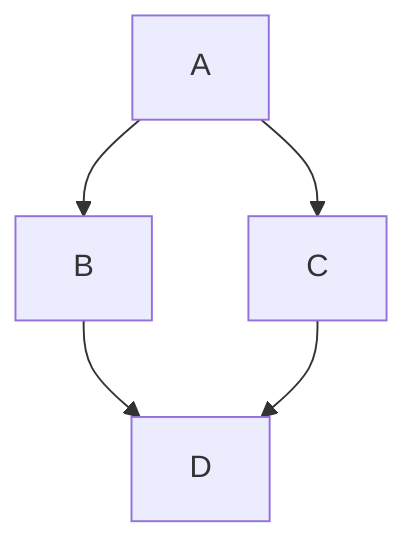
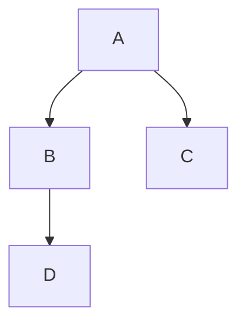

# <TITEL - RFC>

<font size="4">**SAMENVATTING**</font>

**Huidige situatie:**

Lorem ipsum dolor sit amet, consectetur adipiscing elit, sed do eiusmod tempor incididunt ut labore et dolore magna aliqua. Ut enim ad minim veniam, quis nostrud exercitation ullamco laboris nisi ut aliquip ex ea commodo consequat. Duis aute irure dolor in reprehenderit in voluptate velit esse cillum dolore eu fugiat nulla pariatur. Excepteur sint occaecat cupidatat non proident, sunt in culpa qui officia deserunt mollit anim id est laborum.

**Beoogde situatie**

Lorem ipsum dolor sit amet, consectetur adipiscing elit, sed do eiusmod tempor incididunt ut labore et dolore magna aliqua. Ut enim ad minim veniam, quis nostrud exercitation ullamco laboris nisi ut aliquip ex ea commodo consequat. Duis aute irure dolor in reprehenderit in voluptate velit esse cillum dolore eu fugiat nulla pariatur. Excepteur sint occaecat cupidatat non proident, sunt in culpa qui officia deserunt mollit anim id est laborum.

<font size="4">**Status RFC**</font>

Volg deze [link](https://github.com/iStandaarden/..) om de actuele status van deze RFC te bekijken.

---
**Inhoudsopgave**
- [\<TITEL - RFC\>](#titel---rfc)
- [1. Inleiding](#1-inleiding)
  - [1.1. Uitgangspunten](#11-uitgangspunten)
  - [1.2 Relatie andere RFC](#12-relatie-andere-rfc)
- [2. Terminologie](#2-terminologie)
- [plant-uml embedding](#plant-uml-embedding)

---
# 1. Inleiding
>```Inleiding```


## 1.1. Uitgangspunten
>```uitgangspunten```

## 1.2 Relatie andere RFC
Deze RFC heeft een relatie met de volgende RFC(s)
|RFC | onderwerp | relatie<sup>*</sup> | toelichting |issue |
|:--|:--|:--| :--|:--|
|[0008](RFC/RFC0008%20-%20Notificaties%20en%20Abonnementen.md) | Notificaties en abonnement | voorwaardelijk | <ul><li>Er is een **Service Directory** waarin notificatietypen gepubliceerd kunnen worden.</li> <li>Netwerkdeelnemers raadplegen de **Service Directory** om op te halen welke abonnementen geplaatst kunnen worden en welke voorwaarden hier aan zitten. </li></ul>|[#2](https://github.com/iStandaarden/iWlz-RFC/issues/2) |

<sup>*</sup>voorwaardelijk, *voor andere RFC* / afhankelijk, *van andere RFC*


# 2. Terminologie
Opsomming van de in dit document gebruikte termen.

| Terminologie | Omschrijving |
| :-------- | :-------- | 
| *term* | *beschrijving/uitleg* | 


---
## Diagram of schema opnemen in RFC
Maak gebruik van de mogelijkheden van [Mermaid](https://mermaid.js.org/).  GitHub heeft standaard ondersteuning voor de schema's en diagrammen van Mermaid. Hoe dat moet staat beschreven in de documentatie van GitHub: [Writing on Github > creating diagrams](https://docs.github.com/en/get-started/writing-on-github/working-with-advanced-formatting/creating-diagrams)

Voor meer informatie over de mogelijkheden van Mermaid ga naar: https://mermaid.js.org/

In het kort werkt het op de volgende manier: 

### Creating Mermaid diagrams

Mermaid is a Markdown-inspired tool that renders text into diagrams. For example, Mermaid can render flow charts, sequence diagrams, pie charts and more. For more information, see the [Mermaid documentation](https://mermaid-js.github.io/mermaid/#/).

To create a Mermaid diagram, add Mermaid syntax inside a fenced code block with the `mermaid` language identifier. For more information about creating code blocks, see [Creating and highlighting code blocks](/en/get-started/writing-on-github/working-with-advanced-formatting/creating-and-highlighting-code-blocks).

For example, you can create a flow chart by specifying values and arrows.

````text
Here is a simple flow chart:


````

Gegenereerde flow: 

